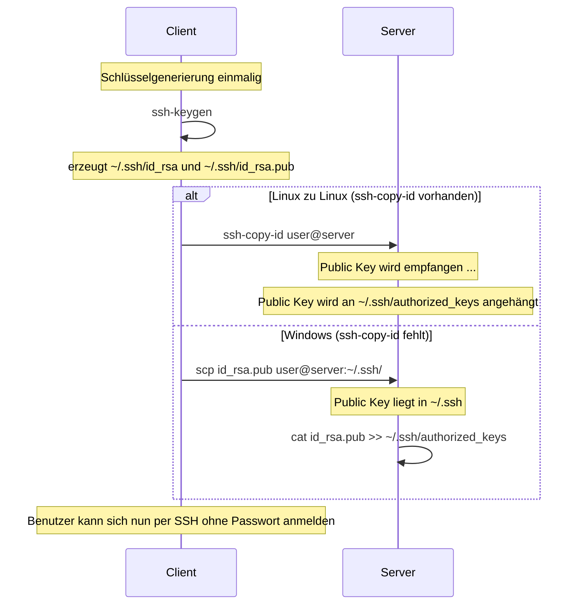

## Mittwoch, 14-01-2026_BS_WED
# Private-/Public-Key-Authentifizierung (SSH)

## Grundprinzip

Bei der SSH-Anmeldung mit Schlüsseln wird kein Passwort übertragen.  
Stattdessen besitzt der Client einen **privaten Schlüssel**, während der Server den dazugehörigen **öffentlichen Schlüssel** kennt.  
Die Authentifizierung funktioniert über asymmetrische Kryptografie: Der Server prüft, ob der Client den passenden privaten Schlüssel besitzt, ohne ihn je zu sehen.

---

## Voraussetzungen auf dem Server

Damit ein System SSH-Verbindungen akzeptieren kann, muss der OpenSSH-Server installiert sein.  
Zusätzlich muss der zugehörige Dienst laufen und für den automatischen Start aktiviert sein. Erst dann nimmt der Server eingehende SSH-Verbindungen an.

---

## Erzeugen eines Schlüsselpaares auf dem Client

Die Schlüssel werden immer auf dem Client erzeugt. Dabei entstehen zwei Dateien:

- **Privater Schlüssel**: bleibt ausschließlich auf dem Client und muss geheim gehalten werden  
- **Öffentlicher Schlüssel**: darf weitergegeben werden und wird auf dem Server hinterlegt

Wird kein eigener Dateiname angegeben, verwendet SSH Standardnamen im `.ssh`-Verzeichnis.  
Alternativ können bewusst individuelle Namen vergeben werden, um mehrere Schlüssel parallel zu nutzen (z. B. für unterschiedliche Server oder Rollen).

Der private Schlüssel wird niemals kopiert oder auf den Server übertragen.

---

## Übertragung des öffentlichen Schlüssels auf den Server

Der Server akzeptiert eine Anmeldung nur dann, wenn der öffentliche Schlüssel des Clients in seiner Konfiguration hinterlegt ist.

### Variante: Linux zu Linux

Ist das entsprechende Hilfsprogramm vorhanden, kann der Schlüssel automatisch übertragen werden.  
Dabei wird der öffentliche Schlüssel direkt in die Datei `authorized_keys` des Zielbenutzers eingetragen.

### Variante: Windows zu Linux

Fehlt dieses Werkzeug, wird der öffentliche Schlüssel zunächst als Datei in das `.ssh`-Verzeichnis des Zielbenutzers kopiert.  
Anschließend muss er manuell der Datei `authorized_keys` hinzugefügt werden.

Diese Datei entscheidet, welche Schlüssel für den Login zugelassen sind.

---

## Anmeldung nach dem Schlüsseltransfer

- Bei Verwendung des Standardschlüssels reicht ein normaler SSH-Aufruf mit Benutzer und Server.
- Bei individuell benannten Schlüsseln muss der zugehörige private Schlüssel explizit angegeben werden.

Nach erfolgreicher Einrichtung erfolgt die Anmeldung ohne Passwortabfrage.

---

## Login über einen Alias

Zur Vereinfachung kann auf dem Client eine SSH-Konfigurationsdatei verwendet werden.  
Darin lassen sich Kurznamen definieren, die Serveradresse, Benutzername und Schlüsseldatei bündeln.  
Ein kurzer Alias ersetzt dann einen langen Verbindungsbefehl.

---

## Passwort-Login deaktivieren

Auch sichere Passwörter stellen ein Angriffsziel dar.  
Aus Sicherheitsgründen kann die Anmeldung per Passwort vollständig deaktiviert werden, sodass nur noch Schlüssel akzeptiert werden.

Diese Einstellung wird in der SSH-Serverkonfiguration vorgenommen.  
Nach einer Änderung muss der SSH-Dienst neu gestartet werden.

Wichtig: Erst deaktivieren, wenn der Schlüssel-Login erfolgreich getestet wurde.

---

## Exkurs: ssh, sshd und systemctl

- **ssh**: Client-Programm zum Aufbau einer Verbindung  
- **sshd**: Server-Dienst, der Verbindungen entgegennimmt  
- **systemctl**: Verwaltungswerkzeug für systemd zum Starten, Stoppen und Überprüfen von Diensten  

Der Client-Befehl heißt immer gleich, der Name des Server-Dienstes kann je nach Distribution variieren.

---

## Protokolle und Fehlersuche

Fehlgeschlagene SSH-Anmeldeversuche werden im System protokolliert.  
Auf Debian-basierten Systemen finden sich diese Informationen in den Authentifizierungslogs oder im systemd-Journal.  
Diese Logs sind hilfreich, um Angriffsversuche oder Konfigurationsprobleme zu erkennen.

---

## SSH-Banner beim Login

Ein SSH-Banner dient als rechtlicher Hinweis und wird vor der Authentifizierung angezeigt.  
Es warnt davor, dass der Zugriff nur autorisierten Personen erlaubt ist und protokolliert werden kann.

Das Banner wird über die SSH-Serverkonfiguration aktiviert und verweist auf eine Textdatei, deren Inhalt beim Login angezeigt wird.  
Es erhöht nicht die technische Sicherheit, erfüllt aber organisatorische und rechtliche Zwecke.

---

**Kurzfassung:**  
SSH mit Schlüsseln ist sicherer, skalierbarer und robuster als Passwort-Logins.  
Richtig eingerichtet reduziert es Angriffsflächen deutlich und gehört zum Standardwerkzeug moderner Systemadministration.

---

## Arbeiten mit der sshd_config (Serverkonfiguration)

Im Unterricht wurde die Konfigurationsdatei des SSH-Servers gezielt untersucht und verändert.  
Diese Datei steuert **wie** und **unter welchen Bedingungen** sich Clients am Server anmelden dürfen.

Die zentrale Datei ist:

- `/etc/ssh/sshd_config`

Änderungen an dieser Datei betreffen immer den **Server-Daemon** und werden erst nach einem Neustart des Dienstes wirksam.

---

### Authentifizierungsmechanismen ein- und ausschalten

In der Konfiguration lassen sich verschiedene Anmeldearten gezielt erlauben oder verbieten.  
Besonders relevant sind:

- Passwortbasierte Anmeldung
- Schlüsselbasierte Anmeldung

Durch das Deaktivieren der Passwortauthentifizierung wird der Server gezwungen, ausschließlich Public-Key-Logins zu akzeptieren.  
Das reduziert Brute-Force-Angriffe erheblich.

Wichtiges Sicherheitsprinzip aus dem Unterricht:  
**Konfiguration erst verschärfen, nachdem der Schlüssel-Login erfolgreich getestet wurde.**

---

### Was in der sshd_config grundsätzlich konfigurierbar ist

Anhand der Datei wurde gezeigt, dass sich unter anderem folgende Aspekte steuern lassen:

- erlaubte Authentifizierungsarten
- verwendeter SSH-Port
- erlaubte Benutzer oder Benutzergruppen
- Root-Login erlauben oder verbieten
- Login-Banner
- Logging-Verhalten
- Zeitlimits und Verbindungsparameter

Nicht jede Option ist standardmäßig aktiv — viele sind auskommentiert und dienen als Dokumentation möglicher Einstellungen.

---

### Kommentarzeilen als Dokumentation

Zeilen, die mit `#` beginnen, sind **keine aktiven Einstellungen**, sondern Kommentare.  
Im Unterricht wurde deutlich gemacht, dass diese Kommentare:

- als integrierte Dokumentation dienen
- zeigen, welche Optionen existieren
- oft Default-Werte beschreiben

Eine Konfigurationsoption wird erst wirksam, wenn sie **nicht auskommentiert** ist.

---

### Dienst-Neustart nach Änderungen

Nach jeder Änderung an der `sshd_config` muss der SSH-Dienst neu geladen oder neu gestartet werden.  
Erst dann übernimmt der Server die neuen Regeln.

Dieser Schritt ist zwingend notwendig und ein häufiger Fehlerpunkt in der Praxis.

---

**Merksatz aus dem Unterricht:**  
Die `sshd_config` entscheidet nicht *ob* SSH existiert, sondern *wie streng* es sich verhält.

---

Metadaten anzeigen

Teil der FIAE-Umschulung (2025-2027) am BFW Muehlenbeck. 
Diese Mitschrift entstand im Unterricht am 14.01.2026 mit WED. 
Sie basiert auf gemeinsam erarbeiteten Inhalten und ergaenzenden Uebungsbeispielen vom 14.01.2026.  
Die Version wurde inhaltlich ueberarbeitet, strukturell optimiert und technisch ergaenzt, 
um Lernerfolg, Pruefungsrelevanz und Nachvollziehbarkeit zu foerdern.  
Oeffentlich dokumentiert zur Wiederholung, Pruefungsvorbereitung und als Orientierungshilfe fuer Dritte.  
Quelle: Eigene Mitschrift & Unterrichtsinhalte 
Autor: Sean Conroy 
Lizenz: <a href="https://creativecommons.org/licenses/by-nc-sa/4.0/" target="_blank">CC BY-NC-SA 4.0</a>

