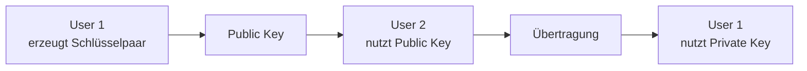
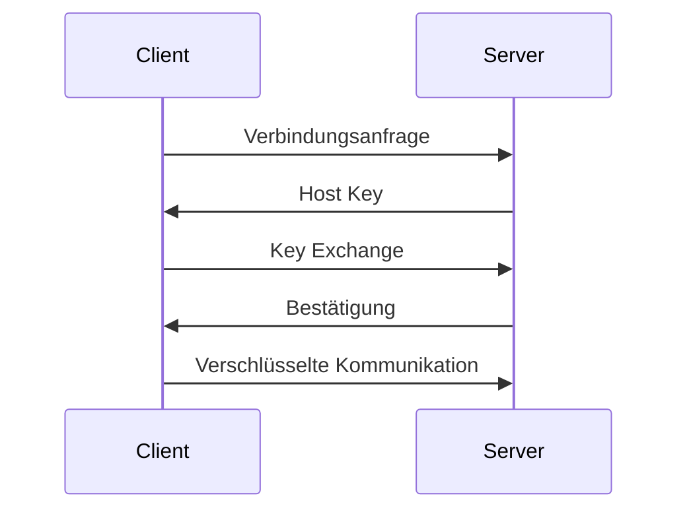

## Mittwoch, 17-12-2025_BS_WED  
### SSH, Kryptographie und schlüsselbasierte Authentifizierung

**Thema:** SSH, Verschlüsselung, Schlüsselpaare  
**Kontext:** Sicherheit, Authentifizierung, Praxis (Windows ↔ Linux)

---

## 1. SSH – Secure Shell

SSH (Secure Shell) ist ein Netzwerkprotokoll zur **verschlüsselten** und **authentifizierten** Kommunikation zwischen einem Client und einem Server (z. B. Remote-Login auf Linux-Systeme).

SSH stellt sicher:
- **Vertraulichkeit** – Daten sind verschlüsselt
- **Integrität** – Daten können nicht unbemerkt verändert werden
- **Authentizität** – Identität von Server und ggf. Client ist überprüfbar

Typische Einsatzgebiete:
- Remote-Administration
- Sichere Dateiübertragung
- Automatisierung
- Wartung von Servern

---

## 2. Kryptographische Grundprinzipien in SSH

SSH kombiniert mehrere kryptographische Verfahren, die jeweils unterschiedliche Aufgaben erfüllen.

---

### 2.1 Symmetrische Verschlüsselung
- Arbeitet mit **einem gemeinsamen Schlüssel**
- Derselbe Schlüssel wird zum Ver- und Entschlüsseln verwendet

**Eigenschaften**
- Sehr schnell
- Geeignet für große Datenmengen

**Problem**
- Der Schlüssel muss **sicher ausgetauscht** werden

---

### 2.2 Asymmetrische Verschlüsselung
- Arbeitet mit **zwei Schlüsseln**
  - **Public Key** (öffentlich)
  - **Private Key** (geheim)
- Die Schlüssel sind mathematisch miteinander verknüpft
- Der **Private Key verlässt niemals den Client**

Verwendung in SSH:
- Authentifizierung (Login per SSH-Key)
- Schlüsselaustausch (abhängig vom Verfahren)

---

## 3. Signaturen vs. Schlüsselaustausch (zentrale Abgrenzung)

In SSH ist es wichtig, zwei Dinge klar zu unterscheiden:

### Ed25519
- **Elliptisches-Kurven-Signaturverfahren**
- Wird in SSH für **Authentifizierung** verwendet
  - Client-Key
  - Host-Key
- Dient zur **Identitätsprüfung**, nicht zur Schlüsselableitung

### (EC)Diffie-Hellman
- Verfahren zur **Aushandlung eines gemeinsamen Geheimnisses**
- Wird für den **Session-Key (Key Exchange / KEX)** genutzt
- Beispiel:
  - `curve25519-sha256`

**Kurzfassung**
- Ed25519 → Signaturen / Identität  
- (EC)DH → Session-Key-Aushandlung  

---

## 4. Kryptographischer Hintergrund (Überblick)

- **RSA:** Sicherheit basiert auf der Schwierigkeit der Primfaktorzerlegung
- **(EC)Diffie-Hellman:** Sicherheit basiert auf dem diskreten Logarithmus
- **Ed25519:** Elliptische-Kurven-Signaturen für Authentifizierung

> Für das Verständnis ist das **Prinzip** entscheidend, nicht die konkrete Mathematik.

---

## 5. Didaktische Mini-Beispiele (stark vereinfacht)

> **Nicht kryptographisch sicher – nur zur Illustration**

Beispiele aus dem Unterricht:
- `5 * 7 mod 34 = 1`
- `8 * 5 mod 34 = 6`



---

## 6. Vereinfachtes RSA-ähnliches Beispiel

> **Achtung:** Nicht sicher – nur didaktisch

1. Wähle zwei kleine Primzahlen:  
   p = 5, q = 11  
   n = 55

2. Öffentlicher Exponent:  
   e = 3

3. Privater Exponent:  
   d = 27  
   (so dass e · d ≡ 1 mod φ(n))

4. **Verschlüsselung** einer Nachricht m = 7:  
   c = 7³ mod 55 = 13

5. **Entschlüsselung**:  
   m = 13²⁷ mod 55 = 7

**Prinzip**
- Public Key verschlüsselt
- Private Key entschlüsselt

---

## 7. Aufbau einer SSH-Verbindung

Typischer Ablauf:
1. Client verbindet sich mit Server
2. Server weist sich über seinen **Host Key** aus
3. Aushandlung eines **Session-Keys**
4. Weitere Kommunikation erfolgt **symmetrisch**



---

## 8. Praxis: Windows → Ubuntu (VirtualBox)

### A) Ubuntu vorbereiten
```bash
sudo apt update
sudo apt install -y openssh-server
sudo systemctl enable --now ssh
ip a
```

---

### B) Windows PowerShell – SSH-Key erzeugen
```powershell
ssh -V
ssh-keygen -t ed25519 -a 64 -f $env:USERPROFILE\.ssh\id_ed25519 -C "Sean@BS-WED"
```

---

### C) Public Key auf Ubuntu übertragen

**Automatisch (falls verfügbar)**
```powershell
ssh-copy-id -i $env:USERPROFILE\.ssh\id_ed25519.pub sean@192.168.56.101
```

**Manuell**
```powershell
type $env:USERPROFILE\.ssh\id_ed25519.pub
```

```bash
mkdir -p ~/.ssh
chmod 700 ~/.ssh
nano ~/.ssh/authorized_keys
chmod 600 ~/.ssh/authorized_keys
```

---

### D) Verbindung testen
```powershell
ssh sean@192.168.56.101
```

---

### E) SSH-Config (optional, empfohlen)
```sshconfig
Host ubuntu-vm
  HostName 192.168.56.101
  User sean
  IdentityFile ~/.ssh/id_ed25519
```

---

### F) Passwort-Login deaktivieren (optional)
```bash
sudo nano /etc/ssh/sshd_config
```

```text
PasswordAuthentication no
PubkeyAuthentication yes
```

```bash
sudo systemctl restart ssh
```

---

## 9. Umgebungen – Vergleich

### Linux → Linux
- Automatische Key-Installation (`ssh-copy-id`)
- Geringer manueller Aufwand

### Windows → Linux
- Manuelle Übertragung des Public Keys
- Sicherheitsmodell identisch

**Unverändert in allen Umgebungen**
- Private Key bleibt immer lokal
- Server prüft Besitz des Private Keys
- Kryptographisches Prinzip ist identisch

---

## Kernaussage

Der Weg des Public Keys kann sich unterscheiden,  
aber **was überprüft wird und warum es sicher ist, bleibt gleich**.

---

<details style="margin-top: 2em;">
<summary style="font-size: 0.9em; color: #888;">Metadaten anzeigen</summary>
<p style="font-size: 0.85em; color: grey;">
Teil der FIAE-Umschulung (2025-2027) am BFW Muehlenbeck.<br>
Diese Mitschrift entstand im Unterricht am 17.12.2025 mit WED.<br>
Sie basiert auf gemeinsam erarbeiteten Inhalten und ergänzenden Uebungsbeispielen vom 17.12.2025.<br><br>
Die Version wurde inhaltlich überarbeitet, strukturell optimiert und technisch ergänzt,<br>
um Lernerfolg, Pruefungsrelevanz und Nachvollziehbarkeit zu foerdern.<br><br>
Oeffentlich dokumentiert zur Wiederholung, Pruefungsvorbereitung und als Orientierungshilfe fuer Dritte.<br><br>
Quelle: Eigene Mitschrift & Unterrichtsinhalte<br>
Autor: Sean Conroy<br>
Lizenz: <a href="https://creativecommons.org/licenses/by-nc-sa/4.0/" target="_blank">CC BY-NC-SA 4.0</a>
</p>
</details>
