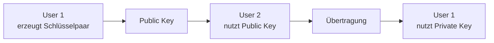
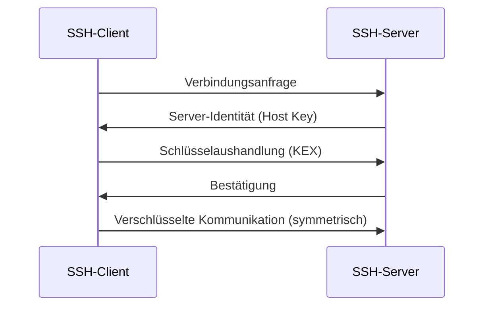
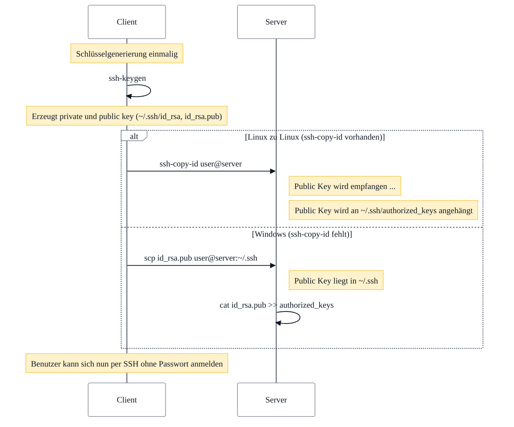


## Mittwoch, 17-12-2025_BS_WED

### Präzisierungen (kleine fachliche Feinjustierung)

**Ed25519 (SSH-Kontext)**
- Ed25519 ist ein **elliptisches Kurven-Signaturverfahren**.
- In SSH wird es primär für **Authentifizierung** verwendet (Client- oder Host-Key).
- Der eigentliche **Schlüsselaustausch (Key Exchange / KEX)** erfolgt typischerweise über  
  **(EC)Diffie-Hellman**-Varianten (z. B. `curve25519-sha256`).

**Kurzfassung**
- Ed25519 → Signaturen / Identität  
- (EC)DH → Session-Key-Aushandlung  

---

### SSH

SSH (Secure Shell) ist ein Netzwerkprotokoll zur **verschlüsselten** und **authentifizierten** Kommunikation zwischen einem Client und einem Server (z. B. Remote-Login auf Linux-Systeme).

SSH erreicht:
- **Vertraulichkeit** (Daten sind verschlüsselt)
- **Integrität** (Daten können nicht unbemerkt verändert werden)
- **Authentizität** (Identität von Server und ggf. Client ist überprüfbar)

---

### Verschlüsselung

SSH kombiniert mehrere kryptographische Verfahren. Grundlegend unterscheidet man:

#### 1. Symmetrische Verschlüsselung
- Arbeitet mit **einem einzigen Schlüssel**
- Derselbe Schlüssel wird zum **Verschlüsseln und Entschlüsseln** verwendet

**Vorteile**
- Sehr schnell
- Hohe Sicherheit bei ausreichend langen Schlüsseln

**Problem**
- **Schlüsselübergabe**: Der Schlüssel muss sicher ausgetauscht werden

---

#### 2. Asymmetrische Verschlüsselung
- Arbeitet mit **zwei Schlüsseln**
  - **Public Key** (öffentlich)
  - **Private Key** (geheim)
- Schlüssel bilden ein **Schlüsselpaar**
- Mathematisch miteinander verknüpft
- Der **Private Key darf niemals weitergegeben werden**

In SSH wird asymmetrische Kryptographie genutzt für:
- **Authentifizierung** (z. B. Login per SSH-Key)
- **Schlüsselaushandlung** (Key Exchange / KEX, je nach Verfahren)

---

### Kryptographischer Hintergrund

- **RSA**: Sicherheit basiert u. a. auf der Schwierigkeit der **Primfaktorzerlegung** großer Zahlen.
- **(EC)Diffie-Hellman**: Sicherheit basiert auf dem **diskreten Logarithmus**.
- **Ed25519**: Elliptische-Kurven-Signaturen für Authentifizierung (nicht für Key Exchange).
- SSH unterstützt mehrere Algorithmen; entscheidend ist das Prinzip, nicht die konkrete Mathematik.

---

### Vereinfachtes Rechenbeispiel (didaktisch)

Ablaufidee:
1. User 1 erzeugt ein Schlüsselpaar  
2. Public Key wird weitergegeben  
3. User 2 nutzt den Public Key (Verschlüsselung oder Authentifizierung)  
4. User 1 nutzt den Private Key  

Didaktische Mini-Beispiele aus dem Unterricht:
- `5 * 7 mod 34 = 1`
- `8 * 5 mod 34 = 6`



> Diese Zahlen sind **nicht kryptographisch sicher** und dienen ausschließlich dem Verständnis.

---

### Didaktisches Mini-Beispiel (RSA-ähnlich, weiterhin vereinfacht)

> **Achtung:** Nicht sicher, nur zur Illustration des Prinzips!

1. Wähle zwei kleine Primzahlen:  
   p = 5, q = 11  
   n = p · q = 55

2. Wähle einen öffentlichen Exponenten:  
   e = 3

3. (Vereinfacht) wähle einen privaten Exponenten:  
   d = 27  
   so dass: e · d ≡ 1 (mod φ(n))

4. **Verschlüsselung** einer Nachricht m = 7:  
   c = m^e mod n  
   c = 7^3 mod 55 = 343 mod 55 = 13

5. **Entschlüsselung**:  
   m = c^d mod n  
   m = 13^27 mod 55 = 7

➡️ Idee:  
Public Key (e, n) verschlüsselt,  
Private Key (d, n) entschlüsselt.

Dieses Beispiel spiegelt das **Prinzip** wider, nicht die reale Sicherheit.

---

### Aufbau einer SSH-Verbindung

Typischer Ablauf:
1. Client verbindet sich mit Server
2. Server weist sich über seinen **Host Key** aus
3. Aushandlung eines **Session-Keys**
4. Weitere Kommunikation erfolgt **symmetrisch** und mit Integritätsschutz



---


### Praxis (Unterricht) – Schritt für Schritt (Windows PowerShell → Ubuntu in VirtualBox)

#### 0) Voraussetzungen
- Ubuntu-VM läuft und ist im Netzwerk erreichbar (IP bekannt).
- Auf Ubuntu ist der SSH-Server installiert und aktiv.
- Du hast einen Benutzer auf Ubuntu (z. B. `sean`).

---

## A) Ubuntu vorbereiten (in der VM)

### 1) SSH-Server installieren
```bash
sudo apt update
sudo apt install -y openssh-server
```

### 2) SSH-Dienst starten & aktivieren
```bash
sudo systemctl enable --now ssh
sudo systemctl status ssh
```

### 3) IP der VM herausfinden
```bash
ip a
```
Merke dir die IPv4-Adresse (z. B. `192.168.56.101`).

> VirtualBox-Hinweis:
> - **NAT**: Zugriff meist über Port-Forwarding nötig.
> - **Bridged / Host-Only**: Zugriff direkt per IP möglich.

---

## B) Windows PowerShell: Key erzeugen

### 4) Prüfen, ob OpenSSH verfügbar ist
```powershell
ssh -V
ssh-keygen -V
```

### 5) SSH-Key erstellen (Ed25519 empfohlen)
```powershell
ssh-keygen -t ed25519 -a 64 -f $env:USERPROFILE\.ssh\id_ed25519 -C "Sean@BS-WED"
```

Ergebnis:
- Private Key: `~\.ssh\id_ed25519`  (GEHEIM!)
- Public Key:  `~\.ssh\id_ed25519.pub` (darf verteilt werden)

---

## C) Public Key auf Ubuntu kopieren

### Variante 1 (einfach): ssh-copy-id (falls verfügbar)
In PowerShell (oder Git Bash):
```powershell
ssh-copy-id -i $env:USERPROFILE\.ssh\id_ed25519.pub sean@192.168.56.101
```

### Variante 2 (manuell, funktioniert immer)

#### 6) Public Key anzeigen
```powershell
type $env:USERPROFILE\.ssh\id_ed25519.pub
```

#### 7) Auf Ubuntu: `.ssh`-Ordner anlegen + Rechte setzen
```bash
mkdir -p ~/.ssh
chmod 700 ~/.ssh
```

#### 8) Public Key in `authorized_keys` einfügen
Auf Ubuntu (in der VM):
```bash
nano ~/.ssh/authorized_keys
```
→ Public Key einfügen, speichern.

Dann Rechte setzen:
```bash
chmod 600 ~/.ssh/authorized_keys
```

---

## D) Login testen

### 9) Verbindung aufbauen
```powershell
ssh sean@192.168.56.101
```

Wenn alles passt, fragt er **nicht** mehr nach dem Ubuntu-Passwort (nur ggf. nach der Key-Passphrase, falls gesetzt).

---

## E) Komfort: SSH-Config anlegen (optional, sehr empfehlenswert)

### 10) Config-Datei erstellen
```powershell
notepad $env:USERPROFILE\.ssh\config
```

Beispielinhalt:
```sshconfig
Host ubuntu-vm
  HostName 192.168.56.101
  User sean
  IdentityFile ~/.ssh/id_ed25519
```

Dann:
```powershell
ssh ubuntu-vm
```

---

## F) Passwort-Login deaktivieren (optional, nur wenn Key-Login sicher läuft)

### 11) SSH-Config auf Ubuntu anpassen
```bash
sudo nano /etc/ssh/sshd_config
```

Diese Werte setzen/aktivieren:
```text
PasswordAuthentication no
PubkeyAuthentication yes
```

Dienst neu starten:
```bash
sudo systemctl restart ssh
```

> Erst deaktivieren, wenn Key-Login erfolgreich getestet ist.

---

## Troubleshooting (die 3 Klassiker)

1) **Permission denied (publickey)**  
   → Rechte prüfen:
```bash
chmod 700 ~/.ssh
chmod 600 ~/.ssh/authorized_keys
```

2) **Falsche IP / falsches Netzwerk**  
   → `ip a` in Ubuntu prüfen, VirtualBox Netzwerkmodus checken.

3) **SSH-Port blockiert**  
   → Ubuntu-Firewall (falls aktiv) erlauben:
```bash
sudo ufw allow OpenSSH
sudo ufw status
```
## Environment 1: Linux → Linux (automatic key installation available)

### Client side
- A key pair is generated once on the client.
- The private key stays local.
- The public key is prepared for transfer.

### Transfer
- A dedicated helper mechanism connects to the server.
- The public key is transmitted securely during this connection.

### Server side
- The server receives the public key.
- The key is appended to the user’s authorization list.
- Required directories and permissions are ensured automatically.

### Outcome
- The server now trusts any client that can prove possession of the matching private key.
- Future connections authenticate without a password.

---

## Environment 2: Windows → Linux (manual key installation)

### Client side
- A key pair is generated once on the client.
- The private key remains local.
- The public key is handled as a regular file.

### Transfer
- The public key file is copied to the server manually.
- No automatic installation or validation occurs at this stage.

### Server side
- The public key file is placed in the SSH configuration directory.
- Its contents are explicitly appended to the authorization list.
- Correct file location and permissions must be ensured by the user.

### Outcome
- Once registered, the server trusts the public key in the same way as in the Linux-to-Linux case.
- Authentication behavior is identical after setup is complete.

---

## What does not change between environments
- The cryptographic model is identical.
- The private key never leaves the client.
- The server authenticates by verifying proof of private key ownership.
- Only the installation method differs, not the security mechanism.

---

## Key takeaway
Different environments change how the public key reaches the server,  
but not why it works or what the server ultimately verifies.

Once the public key is correctly registered, the authentication flow is the same everywhere.


---

<details style="margin-top: 2em;">
<summary style="font-size: 0.9em; color: #888;">Metadaten anzeigen</summary>
<p style="font-size: 0.85em; color: grey;">
Teil der FIAE-Umschulung (2025-2027) am BFW Muehlenbeck.<br>
Diese Mitschrift entstand im Unterricht am 17.12.2025 mit WED.<br>
Sie basiert auf gemeinsam erarbeiteten Inhalten und ergänzenden Uebungsbeispielen vom 17.12.2025.<br><br>
Die Version wurde inhaltlich überarbeitet, strukturell optimiert und technisch ergänzt,<br>
um Lernerfolg, Pruefungsrelevanz und Nachvollziehbarkeit zu foerdern.<br><br>
Oeffentlich dokumentiert zur Wiederholung, Pruefungsvorbereitung und als Orientierungshilfe fuer Dritte.<br><br>
Quelle: Eigene Mitschrift & Unterrichtsinhalte<br>
Autor: Sean Conroy<br>
Lizenz: <a href="https://creativecommons.org/licenses/by-nc-sa/4.0/" target="_blank">CC BY-NC-SA 4.0</a>
</p>
</details>

