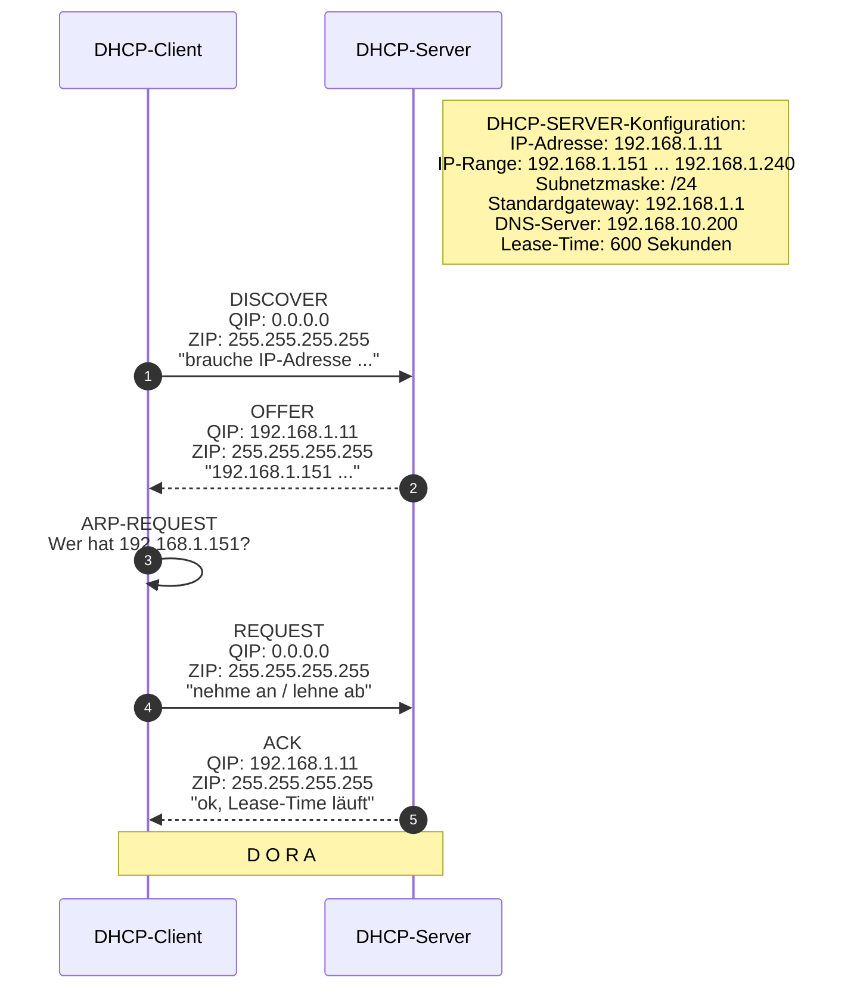
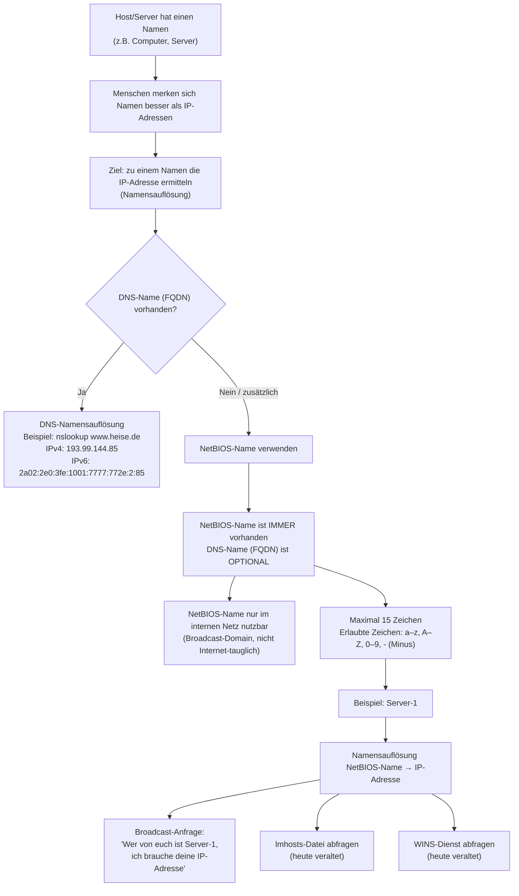
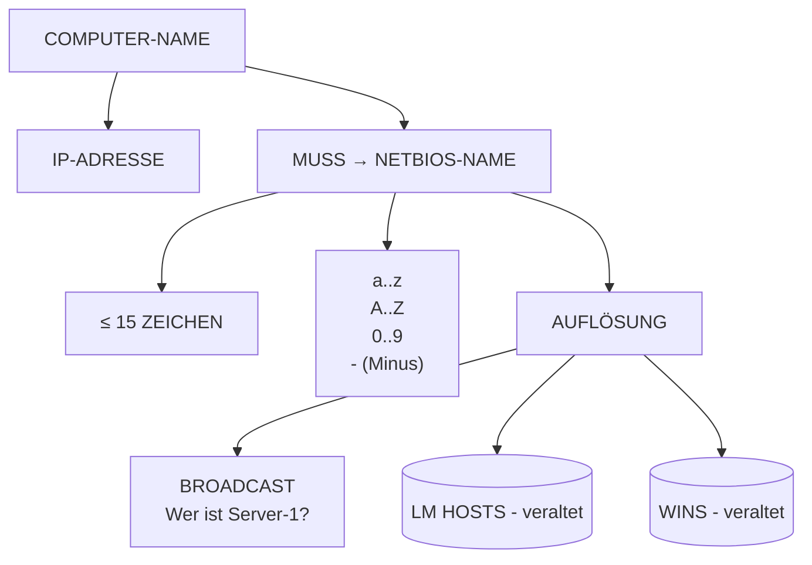
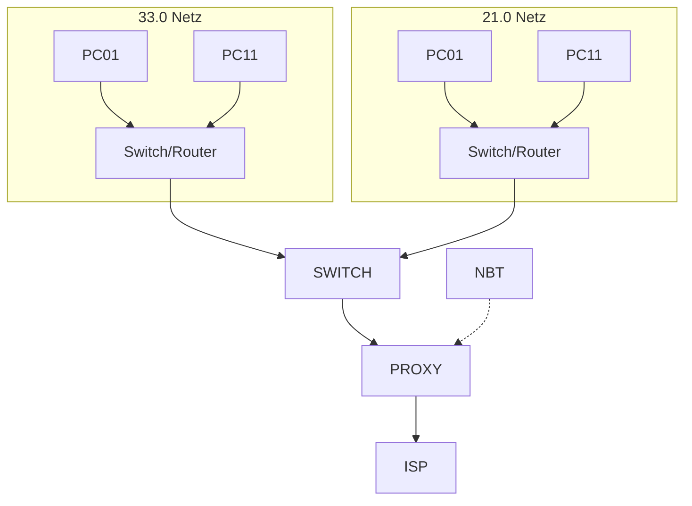

## Mittwoch, 03-12-2025_NT_TRE

---
---

---
---

---
---

<!-- Hier beginnt der Mitschriftsinhalt -->
---

Metadaten anzeigen

Teil der FIAE-Umschulung (2025-2027) am BFW Muehlenbeck. 
Diese Mitschrift entstand im Unterricht am 03.12.2025 mit TRE. 
Sie basiert auf gemeinsam erarbeiteten Inhalten und ergänzenden Uebungsbeispielen vom 03.12.2025.  
Die Version wurde inhaltlich überarbeitet, strukturell optimiert und technisch ergänzt, 
um Lernerfolg, Pruefungsrelevanz und Nachvollziehbarkeit zu foerdern.  
Oeffentlich dokumentiert zur Wiederholung, Pruefungsvorbereitung und als Orientierungshilfe fuer Dritte.  
Quelle: Eigene Mitschrift & Unterrichtsinhalte 
Autor: Sean Conroy 
Lizenz: <a href="https://creativecommons.org/licenses/by-nc-sa/4.0/" target="_blank">CC BY-NC-SA 4.0</a>

