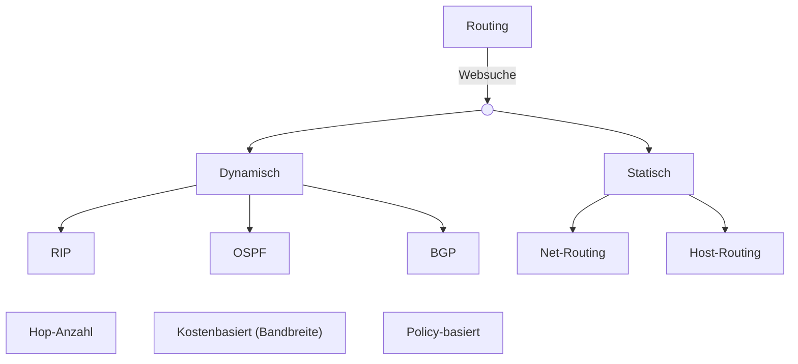
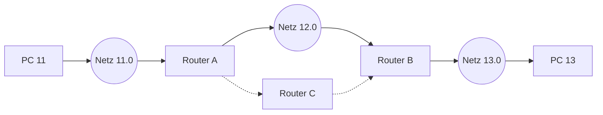

## Mittwoch, 07-01-2026_NT_TRE

## Erläuterung des Diagramms: Routing-Übersicht

Dieses Diagramm zeigt die grundlegende Einteilung von Routing-Verfahren in **dynamisches** und **statisches Routing** sowie die jeweiligen Entscheidungsprinzipien.

---

## Oberste Ebene: Routing

- **Routing** beschreibt die Pfadwahl für Datenpakete in IP-Netzwerken.
- Die Kante **„Websuche“** steht didaktisch für die **Routing-/Pfadentscheidung**.

---

## Aufteilung: Dynamisch vs. Statisch

### Dynamisch
- Routen werden automatisch berechnet.
- Router tauschen Routing-Informationen aus.
- Geeignet für größere, veränderliche Netzwerke.

### Statisch
- Routen werden manuell konfiguriert.
- Kein automatischer Informationsaustausch.
- Geeignet für kleine oder stark kontrollierte Netze.

---

## Dynamische Routing-Protokolle

### RIP (Routing Information Protocol)
- Distanzvektor-Protokoll
- **Metrik: Hop-Anzahl**
- Bandbreite wird nicht berücksichtigt
- Maximal **15 Hops** (16 = unerreichbar)

### OSPF (Open Shortest Path First)
- Link-State-Protokoll
- **Metrik: Kosten**, häufig bandbreitenabhängig
- Shortest-Path-Algorithmus (Dijkstra)

### BGP (Border Gateway Protocol)
- **Policy-basiert**
- Keine klassische Metrik wie Hop-Anzahl
- Einsatz zwischen autonomen Systemen (Internet)

---

## Statisches Routing

Statisches Routing bezeichnet ein Routing-Verfahren, bei dem Routen manuell von einem Administrator in die Routing-Tabelle eines Systems eingetragen werden.  
Es findet **keine automatische Anpassung** an Netzwerkänderungen statt. Jede Route bleibt aktiv, bis sie manuell geändert oder entfernt wird.

Eine statische Route besteht aus:
- Ziel (Netz oder einzelner Host)
- Netzmaske (Präfix)
- Next-Hop-Adresse oder ausgehendem Interface

---

### Net-Routing

Beim Net-Routing wird eine statische Route zu einem **gesamten IP-Netzwerk** definiert.

- Ziel ist ein Netzwerkpräfix (z. B. `192.168.10.0/24`)
- Die Route gilt für **alle Hosts** innerhalb dieses Netzes
- Typischer Einsatz in kleinen, übersichtlichen Netzwerken oder bei Standortverbindungen

**Funktionsweise:**
- Der Router prüft, ob die Ziel-IP zu dem definierten Netz gehört
- Trifft dies zu, wird das Paket über den angegebenen Next Hop weitergeleitet

**Eigenschaften:**
- Wenige Routen decken viele Hosts ab
- Geringer Verwaltungsaufwand
- Keine automatische Reaktion auf Netzwerkausfälle

---

### Host-Routing

Beim Host-Routing wird eine statische Route zu **einer einzelnen IP-Adresse** definiert.

- Ziel ist genau ein Host (z. B. `192.168.10.42`)
- Netzmaske ist immer `/32` (IPv4: `255.255.255.255`)
- Hostrouten sind spezifischer als Netzrouten und werden bevorzugt

**Funktionsweise:**
- Die Route greift nur bei exakt dieser Ziel-IP
- Andere Hosts im selben Netzwerk sind nicht betroffen

**Eigenschaften:**
- Sehr genaue Steuerung des Datenverkehrs
- Geeignet für Sonderfälle wie Tests, Umleitungen oder spezielle Server
- Hoher Pflegeaufwand bei vielen Hostrouten

---

### Merksatz

Host-Routen haben Vorrang vor Netz-Routen, da beim Routing das **Longest-Prefix-Match-Prinzip** gilt.

---

# RIP – Routing Information Protocol

## Grundprinzip
- Distanzvektor-Routingprotokoll
- Entscheidungsgrundlage: **Hop-Anzahl**
- Geschwindigkeit/Bandbreite bleibt unberücksichtigt
- Bevorzugt den Pfad mit weniger Weiterleitungsschritten

---

## Beispieltopologie

---

## Entscheidungslogik (RIP – Unterrichtsmodell)

- Pfad **A → B → Zielnetz** = **2 Hops**
- Pfad **A → C → B → Zielnetz** = **3 Hops**
- Auch bei höherer Bandbreite über **C**
- **RIP wählt den Pfad mit weniger Hops**

---

## Routingtabellen (Z / Ü / H – gemäß Tafelbild)

### Router A
| Ziel (Z) | Über (Ü) | Hops (H) |
|---------|----------|----------|
| 11.0 | direkt | 0 |
| 12.0 | direkt | 0 |
| 13.0 | B | 2 |
| 13.0 | C | 3 |

### Router B
| Ziel (Z) | Über (Ü) | Hops (H) |
|---------|----------|----------|
| 13.0 | direkt | 0 |
| 12.0 | direkt | 0 |
| 11.0 | A | 2 |
| 11.0 | C | 3 |

### Router C
| Ziel (Z) | Über (Ü) | Hops (H) |
|---------|----------|----------|
| 11.0 | A | 1 |
| 13.0 | B | 1 |
| 12.0 | A / B | 2 |

---

## Merksätze
- RIP bewertet ausschließlich die **Hop-Anzahl**
- Bandbreite spielt **keine Rolle**
- Mehr Router ⇒ höherer Hop-Wert
- Maximal **15 Hops**

---

Metadaten anzeigen

Teil der FIAE-Umschulung (2025–2027) am BFW Mühlenbeck. 
Mitschrift aus dem Unterricht am 07.01.2026 (NT / TRE). 
Quelle: Eigene Mitschrift & Unterrichtsinhalte. 
Autor: Sean Conroy 
Lizenz: <a href="https://creativecommons.org/licenses/by-nc-sa/4.0/" target="_blank">CC BY-NC-SA 4.0</a>

