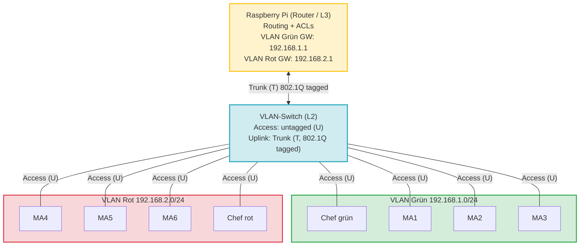
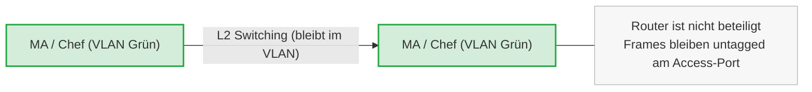
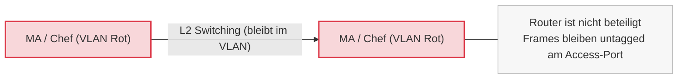
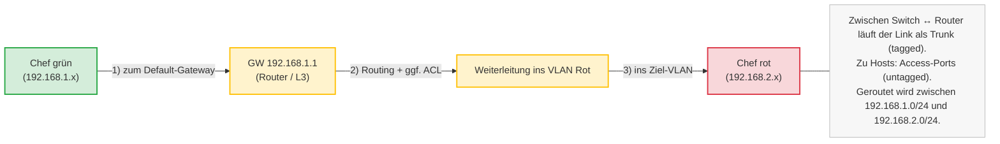

## Mittwoch, 14-01-2026_NT_TRE

---
# Netzwerktechnik (TRE) – VLANs und Layer-3-Switching

## 8.6 VLAN-Kommunikation ohne Routing

## 8.7 VLAN-Kommunikation mit Routing

## 8.7 Layer-3-Switch (VLAN-Routing)

Ein **Layer-3-Switch** kombiniert Funktionen aus:
- **Layer 2** (Switching, VLANs, MAC-Adressen)
- **Layer 3** (Routing, IP-Weiterleitung)

Er kann VLANs trennen **und gleichzeitig den Datenverkehr zwischen ihnen routen**.  
Damit ersetzt er in vielen Szenarien einen klassischen Router im LAN.

---

## VLAN-Struktur im Beispiel

Im dargestellten Netzwerk existieren zwei logisch getrennte VLANs:

### VLAN Grün
- IP-Netz: 192.168.1.0 /24
- Endgeräte: MA1, MA2, MA3
- Zugeordnetes Team: *Team grün*

### VLAN Rot
- IP-Netz: 192.168.2.0 /24
- Endgeräte: MA4, MA5, MA6
- Zugeordnetes Team: *Team rot*

Die Trennung erfolgt logisch über **VLAN-Tags**, nicht physisch über separate Switches.

---

## Rolle des Layer-3-Geräts (Router / L3-Switch)

Das zentrale Layer-3-Gerät:
- besitzt je VLAN eine IP-Adresse (Gateway)
- führt Routing-Entscheidungen durch
- kann ACLs (Access Control Lists) anwenden
- verändert bei Bedarf VLAN-Tags (Inter-VLAN-Routing)

---

## Kommunikationsfälle

### Fall A – Kommunikation innerhalb VLAN Grün
- Quelle und Ziel befinden sich im selben VLAN
- Switching erfolgt ausschließlich auf Layer 2
- Kein Routing, keine VLAN-Grenzüberschreitung
- Entspricht dem Verhalten eines klassischen VLAN-Switches

### Fall B – Kommunikation innerhalb VLAN Rot
- Analog zu Fall A
- Daten bleiben vollständig innerhalb des roten VLANs
- Keine Beteiligung der Routing-Funktion

### Fall C – Kommunikation zwischen VLANs
- Quelle im grünen VLAN, Ziel im roten VLAN
- Paket erreicht das Layer-3-Gerät
- VLAN-Tag wird entfernt, IP-Paket geroutet
- Neues VLAN-Tag wird gesetzt
- Paket wird ins Ziel-VLAN weitergeleitet

Erst hier wird **Layer-3-Funktionalität aktiv genutzt**.

---

## Kernaussage

- VLANs sorgen für logische Segmentierung eines LANs
- Ohne Routing sind VLANs strikt voneinander getrennt
- Ein Layer-3-Switch ermöglicht kontrollierte Kommunikation zwischen VLANs
- Diese Architektur gilt als **moderne und skalierbare LAN-Segmentierung**

---

## Prüfungsrelevanter Merksatz

Ein Layer-3-Switch trennt VLANs auf Layer 2 und verbindet sie gezielt über Routing auf Layer 3.

<!-- Hier beginnt der Mitschriftsinhalt -->
---

Metadaten anzeigen

Teil der FIAE-Umschulung (2025-2027) am BFW Muehlenbeck. 
Diese Mitschrift entstand im Unterricht am 14.01.2026 mit TRE. 
Sie basiert auf gemeinsam erarbeiteten Inhalten und ergaenzenden Uebungsbeispielen vom 14.01.2026.  
Die Version wurde inhaltlich ueberarbeitet, strukturell optimiert und technisch ergaenzt, 
um Lernerfolg, Pruefungsrelevanz und Nachvollziehbarkeit zu foerdern.  
Oeffentlich dokumentiert zur Wiederholung, Pruefungsvorbereitung und als Orientierungshilfe fuer Dritte.  
Quelle: Eigene Mitschrift & Unterrichtsinhalte 
Autor: Sean Conroy 
Lizenz: <a href="https://creativecommons.org/licenses/by-nc-sa/4.0/" target="_blank">CC BY-NC-SA 4.0</a>

