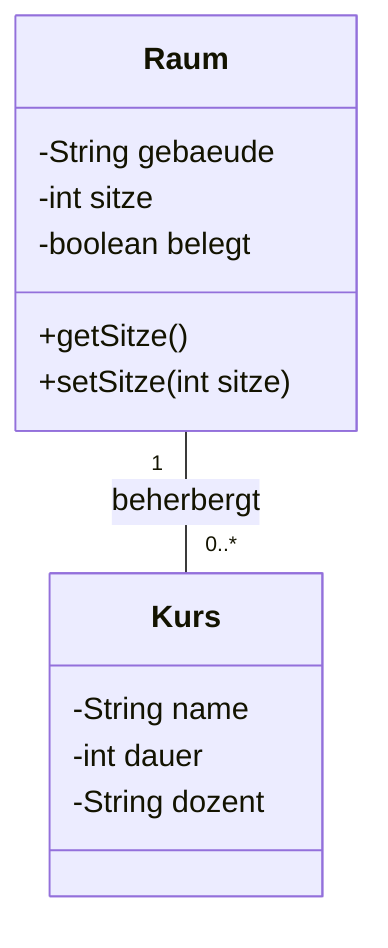
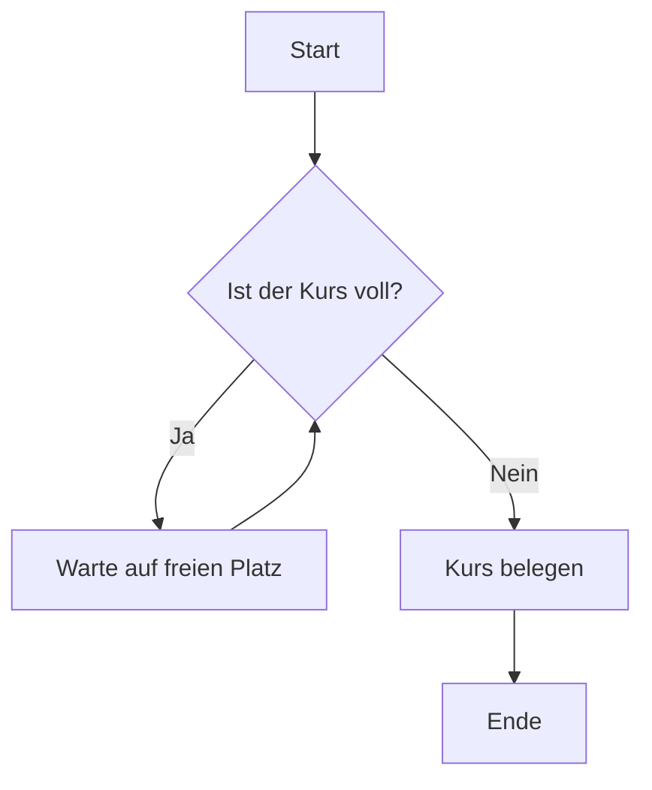
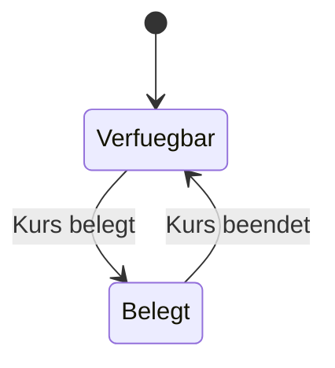
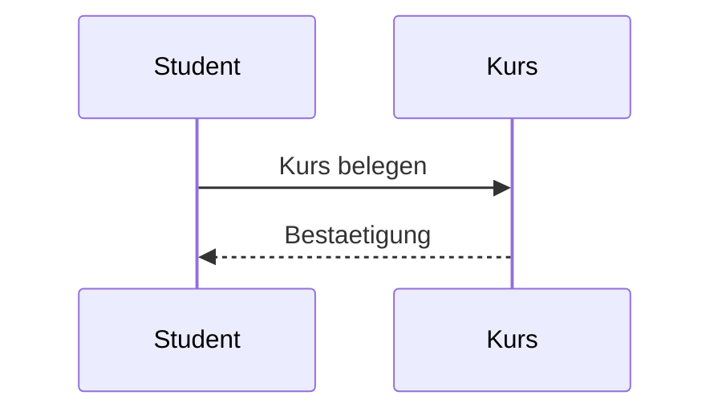


## Mittwoch, 11-02-2026_PT_POG

## Encapsulation (Kapselung)

**Definition:**
Kapselung bedeutet, dass Attribute (Daten) und Methoden innerhalb einer Klasse gebuendelt und vor direktem Zugriff von außen geschuetzt werden.  
Der Zugriff erfolgt kontrolliert ueber definierte Schnittstellen (z.B. Getter und Setter).

**Ziele der Kapselung:**
- Schutz der Datenintegritaet
- Verhinderung unerlaubter Manipulation
- Klare Trennung zwischen interner Logik und externer Nutzung
- Wartbarkeit und Erweiterbarkeit des Codes

**Technische Umsetzung in Java:**
- Attribute werden in der Regel `private` deklariert
- Zugriff erfolgt ueber `public` Methoden (Getter/Setter)
- Validierungslogik kann in Setter-Methoden eingebaut werden

Beispielhafte Logik:
Ein Raum darf keine negative Anzahl an Sitzplaetzen haben → Validierung im Setter.

---

## Klassische Objektorientierung

### Klassen
Eine Klasse ist eine Blaupause fuer Objekte.  
Sie definiert:

- Attribute (Eigenschaften / Zustand)
- Methoden (Verhalten)

Beispiel:
Ein Objekt vom Typ `Raum` hat:
- Gebaeude
- Sitzanzahl
- Belegungsstatus

Ein Objekt vom Typ `Kurs` hat:
- Name
- Dauer
- Dozent

Objekte sind konkrete Instanzen dieser Klassen.

---

# UML (Unified Modeling Language)

UML ist eine standardisierte grafische Sprache zur Modellierung von Software-Systemen.

Sie dient dazu:
- Strukturen darzustellen
- Abläufe zu visualisieren
- Beziehungen zwischen Objekten zu zeigen
- Systeme vor der Implementierung zu planen

Wichtig fuer AP1: Grundlegende Diagrammtypen verstehen und lesen koennen.

---

## 1. Klassendiagramm

Zeigt:
- Klassen
- Attribute
- Methoden
- Beziehungen zwischen Klassen
- Multiplizitaeten (1, 0..*, etc.)

### Erklaerung:

- `-` bedeutet private
- `+` bedeutet public
- `"1"` zu `"0..*"` bedeutet:
  Ein Raum kann null bis beliebig viele Kurse beherbergen.
  Ein Kurs findet genau in einem Raum statt.

Das ist eine 1:n Beziehung.

---

## 2. Aktivitaetsdiagramm

Zeigt:
- Ablauf von Prozessen
- Bedingungen
- Schleifen
- Entscheidungen

Typisch fuer Geschaeftsprozesse.

Erklaerung:
- Raute = Entscheidung
- Pfeile = Kontrollfluss
- Ruecksprung zeigt Schleife

---

## 3. Zustandsdiagramm

Zeigt:
- Zustaende eines Objekts
- Uebergaenge zwischen Zustaenden
- Ereignisse, die Zustandswechsel ausloesen

Erklaerung:
Ein Raum kann entweder verfuegbar oder belegt sein.  
Ein Ereignis (z.B. Kurs belegt) loest den Zustandswechsel aus.

---

## 4. Sequenzdiagramm

Zeigt:
- Interaktionen zwischen Objekten
- Nachrichten
- Zeitliche Reihenfolge

Erklaerung:
- Objekte werden oben dargestellt
- Zeit verlaeuft von oben nach unten
- Pfeile zeigen Methodenaufrufe oder Rueckgaben

---

## Zusammenfassung fuer AP1

Du solltest koennen:

- Encapsulation fachlich korrekt erklaeren
- Access Modifier zuordnen (private, public)
- UML-Diagramme lesen
- Multiplizitaeten verstehen (1, 0..*, 1..*)
- Unterschied zwischen Strukturdiagramm (Klassendiagramm) und Ablaufdiagrammen kennen

Merksatz:
Klassendiagramm = Struktur  
Aktivitaetsdiagramm = Ablauf  
Zustandsdiagramm = Lebenszyklus  
Sequenzdiagramm = Kommunikation  

---

Metadaten anzeigen

Teil der FIAE-Umschulung (2025-2027) am BFW Muehlenbeck. 
Diese Mitschrift entstand im Unterricht am 11.02.2026 mit POG. 
Sie basiert auf gemeinsam erarbeiteten Inhalten und ergaenzenden Uebungsbeispielen vom 11.02.2026.  
Die Version wurde inhaltlich ueberarbeitet, strukturell optimiert und technisch ergaenzt, 
um Lernerfolg, Pruefungsrelevanz und Nachvollziehbarkeit zu foerdern.  
Oeffentlich dokumentiert zur Wiederholung, Pruefungsvorbereitung und als Orientierungshilfe fuer Dritte.  
Quelle: Eigene Mitschrift & Unterrichtsinhalte 
Autor: Sean Conroy 
Lizenz: <a href="https://creativecommons.org/licenses/by-nc-sa/4.0/" target="_blank">CC BY-NC-SA 4.0</a>

