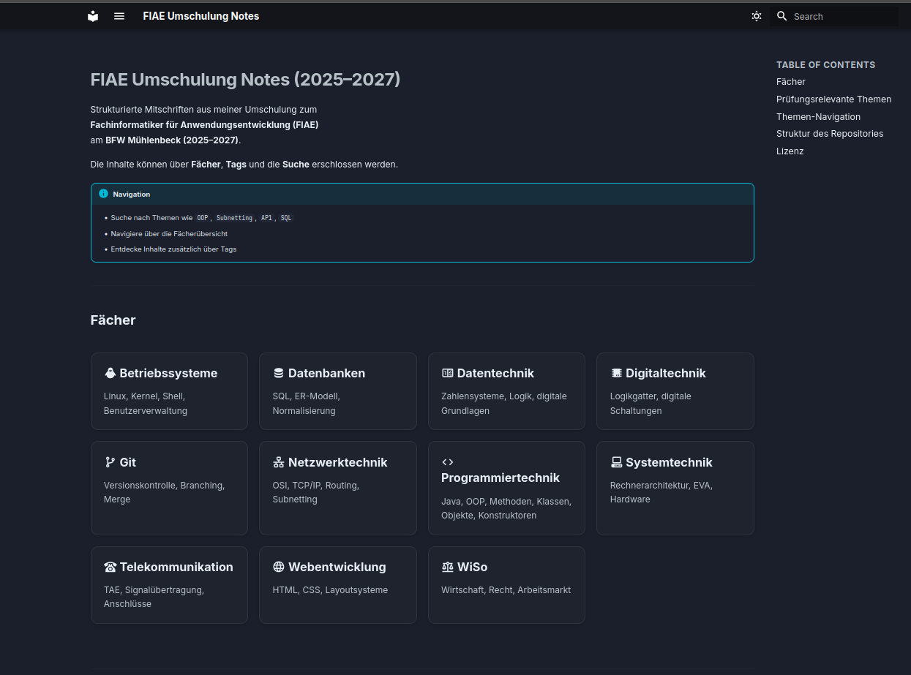

[](https://seanconroy-dev.github.io/FIAE_Umschulung_Notes/)
[](LICENSE)
[](https://github.com/seanconroy-dev/FIAE_Umschulung_Notes/commits/main)
[](https://github.com/seanconroy-dev/FIAE_Umschulung_Notes)

# FIAE Umschulung Notes

A structured, markdown-based knowledge system developed during my training as a  
**Fachinformatiker für Anwendungsentwicklung (FIAE)**.

👉 **Live Documentation (recommended):**  
https://seanconroy-dev.github.io/FIAE_Umschulung_Notes/

All notes are transformed into a searchable documentation system with structured navigation, indexing, and tag-based exploration.



> Example: Generated documentation with categorized subjects, searchable content, and structured navigation

## Documentation Output

The notes are automatically transformed into a structured documentation site using MkDocs, providing:

- Fast navigation across subjects  
- Tag-based exploration  
- Full-text search across all notes  

---

## Repository Structure

```
.
├─ notes/        # Markdown-based knowledge base (MkDocs content root)
│   └─ Tools/    # PowerShell helper scripts (note creation, migration, etc.)
├─ scripts/      # Automation and helper scripts
├─ reports/      # Generated reports / migration outputs
├─ docs/         # Project documentation
└─ LICENSE
```

---

## Creating Notes

New notes are created using the interactive PowerShell script:

```powershell
pwsh notes/Tools/new-fiae-note.ps1
```

The script works on Windows, Linux, and macOS (PowerShell 7+ required).  
It will prompt you for:

| Prompt | Example input | Notes |
|---|---|---|
| **Fach** (subject) | `PT`, `ST`, `DB`, `Programmiertechnik` | Short aliases and full names are accepted |
| **Kürzel** (instructor code) | `POG`, `ASS` | Converted to uppercase automatically |
| **Titel** (title) | `Windows – Bootprozess` | Used for the filename slug and the H1 heading |
| **Modul** | `OOP` | Optional |
| **Topic** | `Bootprozess` | Optional |
| **Level** | `Grundlagen` | Optional |
| **Tags** | `Java, OOP, AP1` | Comma-separated, optional |

Once confirmed, the script:

1. Creates the folder `notes/<year>/<subject>/<instructor>/` if it does not exist yet (with your confirmation)
2. Writes a new `.md` file named `<date>_<subject>_<instructor>_<slug>.md` with pre-filled YAML frontmatter and a heading
3. Opens the file in VS Code automatically (if the `code` CLI is available)

**Supported subject aliases**

| Alias | Subject |
|---|---|
| `pt` | Programmiertechnik |
| `st` | Systemtechnik |
| `bs` | Betriebssysteme |
| `db`, `sql` | Datenbanken |
| `dt` | Digitaltechnik |
| `nt` | Netzwerktechnik |
| `tk` | Telekommunikation |
| `web` | Webentwicklung |
| `wiso` | WiSo |
| `git` | Git |

---

## Note System

Notes follow a consistent hierarchical structure:

```
notes/<year>/<subject>/<instructor>/<file>.md
```

Example:

```
notes/2026/Programmiertechnik/UDEMY/
2026-02-17_Programmiertechnik_UDEMY_class-object.md
```

---

## Metadata

Each note includes standardized YAML frontmatter:

```yaml
title: "java.lang.Object – Root Class"
date: 2026-02-17
subject: "Programmiertechnik"
instructor: "UDEMY"
module: "OOP"
tags:
  - Java
  - OOP
  - AP1
```

These metadata fields enable:
- Automatic index generation
- Tag-based navigation
- Filtering by subject, instructor, or module

---

## Project Goals

- Build a structured and maintainable knowledge base  
- Support efficient exam preparation (**AP1 / AP2**)  
- Apply software engineering principles to learning workflows  
- Serve as a public learning portfolio  

---

## License

© Sean Matthew Conroy  
MIT License
