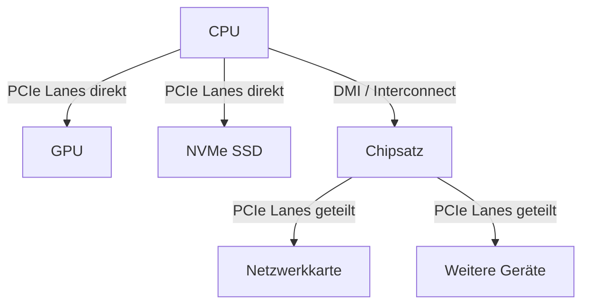

## Montag, 12-01-2026_ST_WED

# PCIe – Peripheral Component Interconnect Express

PCIe ist der heutige Standard zur Anbindung von Hochgeschwindigkeits-Erweiterungskarten wie Grafikkarten und NVMe-SSDs.

---

# Grundprinzip

PCIe verwendet:

- Serielle Punkt-zu-Punkt-Verbindungen
- Paketbasierte Datenübertragung
- Vollduplex-Kommunikation

Im Gegensatz zu PCI/PCI-X (paralleler Shared Bus) erhält jedes Gerät eine eigene dedizierte Verbindung zum Root Complex (CPU oder Chipsatz).

---

# 1. Warum Grafikkarten im obersten PCIe-Slot?

Der oberste PCIe-x16-Slot ist in der Regel:

- Direkt mit der CPU verbunden
- Mit der höchsten Lane-Anzahl ausgestattet (meist x16)

Das bedeutet:

- Maximale Bandbreite
- Minimale Latenz
- Keine geteilte Chipsatz-Verbindung

Für GPUs ist das leistungsentscheidend.

---

# 2. Rolle des Chipsatzes

Der Chipsatz:

- Stellt zusätzliche PCIe-Lanes bereit
- Bindet Peripheriegeräte an
- Ist über eine gemeinsame Verbindung (z. B. DMI bei Intel) mit der CPU verbunden

Wichtig:

Chipsatz-Lanes teilen sich die Bandbreite dieser Verbindung.  
Unter hoher Last kann es zu Engpässen kommen.

CPU-Lanes sind exklusiv.

---

# 3. PCIe-Lanes – Bedeutung

Eine Lane besteht aus:

- 1 Leitungspaar zum Senden
- 1 Leitungspaar zum Empfangen

Eigenschaften:

- Seriell
- Vollduplex
- Skalierbar durch Bündelung

Bezeichnungen:

- x1 = 1 Lane
- x4 = 4 Lanes
- x8 = 8 Lanes
- x16 = 16 Lanes

Mehr Lanes = höhere maximale Bandbreite.

---

# 4. Bandbreite pro PCIe-Version (theoretisch, pro Lane, pro Richtung)

- PCIe 3.0 ≈ 1 GB/s
- PCIe 4.0 ≈ 2 GB/s
- PCIe 5.0 ≈ 4 GB/s

Beispiel:

PCIe 4.0 x16  
= 16 × 2 GB/s  
≈ 32 GB/s pro Richtung

Jede neue Generation verdoppelt in der Regel die Datenrate pro Lane.

---

# 5. NVMe und PCIe

PCIe stellt die physikalische Verbindung bereit.  
NVMe ist das darauf aufsetzende Protokoll für Massenspeicher.

Vorteile gegenüber SATA:

- Höhere Übertragungsraten
- Niedrigere Latenzen
- Mehr parallele Warteschlangen

Schnellere Boot- und Ladezeiten sind die Folge.

---

# 6. Kompatibilität

Abwärtskompatibel:

- Neue Karten laufen in älteren Slots (mit reduzierter Geschwindigkeit)

Aufwärtskompatibel:

- Alte Karten laufen in neuen Slots (mit ihrer maximalen Geschwindigkeit)

Ein PCIe-x1-Gerät funktioniert mechanisch und elektrisch in einem x16-Slot.

---

# 7. Lane-Sharing / Bifurcation

Ein physischer x16-Slot kann logisch aufgeteilt werden:

- x8/x8
- x4/x4/x4/x4

Voraussetzung:

- Unterstützung durch CPU
- Unterstützung durch Mainboard
- Aktivierung im BIOS/UEFI

Typischer Einsatz:

- Multi-NVMe-Adapter
- Serverkonfigurationen

---

# 8. Hot-Plug

PCIe unterstützt technisch Hot-Plug.

Praxis:

- Häufig in Server- und Enterprise-Systemen
- Selten in klassischen Desktop-PCs aktiviert

---

# 9. RAID mit PCIe-SSDs

RAID = Redundant Array of Independent Disks

Ziel:

- Leistungssteigerung (z. B. RAID 0)
- Redundanz (z. B. RAID 1)
- Kombination aus beidem

Voraussetzung:

- Geeigneter Controller oder Softwarelösung
- NVMe-Unterstützung

---

# 10. Typische PCIe-Erweiterungskarten

- Grafikkarten (GPU)
- NVMe-SSDs
- Netzwerkkarten (NIC)
- RAID-Controller
- Capture-Karten

---

# Architekturübersicht

---

# Prüfungsfokus (AP1)

- Unterschied seriell vs. parallel
- Bedeutung der Lane-Anzahl
- Zusammenhang Version × Lane = Bandbreite
- CPU-Lanes vs. Chipsatz-Lanes
- NVMe vs. SATA
- Rolle des Adress- und Datenpfads im Gesamtsystem

PCIe ist heute das zentrale Hochgeschwindigkeits-Backbone moderner PCs.

---

Metadaten anzeigen

Teil der FIAE-Umschulung (2025-2027) am BFW Mühlenbeck. 
Diese Mitschrift entstand im Unterricht am 12.01.2026 mit WED. 
Sie basiert auf gemeinsam erarbeiteten Inhalten und ergänzenden Übungsbeispielen vom 12.01.2026.  
Die Version wurde inhaltlich fachlich geprüft, strukturell optimiert und um prüfungsrelevante Architekturzusammenhänge ergänzt, 
um Lernerfolg, Prüfungsrelevanz und Nachvollziehbarkeit zu fördern.  
Öffentlich dokumentiert zur Wiederholung, Prüfungsvorbereitung und als Orientierungshilfe für Dritte.  
Fach: Systemtechnik (ST) 
Quelle: Eigene Mitschrift & Unterrichtsinhalte 
Autor: Sean Conroy 
Lizenz: <a href="https://creativecommons.org/licenses/by-nc-sa/4.0/" target="_blank">CC BY-NC-SA 4.0</a>

