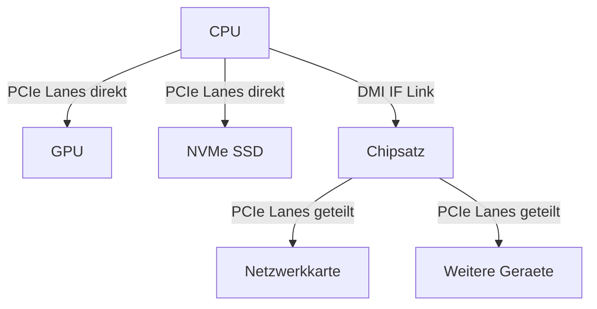

## Montag, 12-01-2026_ST_WED

PCIe – Peripheral Component Interconnect Express

Fragen:
### 1. Warum sollte eine Grafikkarte möglichst im obersten PCIe-Steckplatz des Mainboards eingebaut werden?
- Weil dieser Steckplatz in der Regel direkt mit der CPU verbunden ist und die höchste Anzahl an PCIe-Lanes bietet, was für die maximale Leistung der Grafikkarte wichtig ist.

### 2. Welche Rolle spielt der Chipsatz bei der Anbindung von PCIe-Steckplätzen?
- Der Chipsatz stellt zusätzliche PCIe-Lanes für Peripheriegeräte bereit und fungiert als Verteiler. Diese Lanes sind jedoch nicht direkt an die CPU angebunden, sondern teilen sich eine begrenzte Verbindung (z. B. DMI bei Intel), was zu Bandbreitenengpässen führen kann.

### 3. Wie können PCIe-SSDs (NVMe) die Systemleistung im Vergleich zu SATA-Laufwerken verbessern?
- PCIe-SSDs bieten deutlich höhere Datenübertragungsraten und geringere Latenzzeiten als SATA-Laufwerke, da sie mehrere PCIe-Lanes nutzen und nicht durch den SATA-Controller limitiert sind. Das führt zu schnelleren Boot- und Ladezeiten.

### 4. Welche Bedeutung hat die Anzahl der PCIe-Lanes für die Leistungsfähigkeit von Erweiterungskarten?
- Die Anzahl der PCIe-Lanes bestimmt die maximal verfügbare Bandbreite. Mehr Lanes ermöglichen höhere gleichzeitige Datenübertragungen, was insbesondere bei Grafikkarten und NVMe-SSDs leistungsentscheidend ist.

### 5. Was bedeutet bei PCIe der Begriff „Lane“ und welche Aufgabe hat sie?
- Eine PCIe-Lane ist ein serieller, vollduplexfähiger Datenkanal, bestehend aus zwei Leitungspaaren (Senden und Empfangen). Mehrere Lanes können gebündelt werden, um die Gesamtbandbreite zu erhöhen.

### 6. Worin unterscheidet sich PCIe technisch von PCI und PCI-X?
- PCIe nutzt serielle Punkt-zu-Punkt-Verbindungen, während PCI und PCI-X parallele Busse verwenden. Dadurch ist PCIe schneller, besser skalierbar und verursacht geringere Latenzen.

### 7. Welche Bedeutung haben Bezeichnungen wie PCIe x1, x4, x8 oder x16?
- Sie geben an, wie viele PCIe-Lanes ein Steckplatz oder eine Karte nutzt. PCIe x16 bedeutet beispielsweise 16 parallele Lanes und damit eine deutlich höhere Bandbreite als PCIe x1.

### 8. Nenne drei typische Erweiterungskarten, die heute über PCIe angebunden werden.
- Grafikkarten (GPU), NVMe-SSDs, Netzwerkkarten (NIC)

### 9. Warum ist PCIe besonders gut für Grafikkarten geeignet?
- Grafikkarten benötigen sehr hohe Bandbreiten und niedrige Latenzen für den schnellen Austausch großer Datenmengen (Texturen, Framebuffer). PCIe erfüllt diese Anforderungen durch viele Lanes und hohe Taktraten.

### 10. Was versteht man unter Abwärts- und Aufwärtskompatibilität bei PCIe?
- Abwärtskompatibilität: Neue PCIe-Karten funktionieren in älteren Slots, jedoch mit der Geschwindigkeit des älteren Standards.
- Aufwärtskompatibilität: Ältere Karten funktionieren in neueren Slots, ebenfalls mit ihrer ursprünglichen Geschwindigkeit.

### 11. Welche Rolle spielt PCIe bei der Anbindung von NVMe-SSDs?
- PCIe stellt die physikalische Verbindung bereit. NVMe ist dabei das Protokoll, das speziell für schnelle Massenspeicher entwickelt wurde und PCIe optimal nutzt.

### 12. Wie wirkt sich die PCIe-Version (z. B. 3.0, 4.0, 5.0) auf die Datenübertragungsrate aus?
- Jede neue PCIe-Version verdoppelt in der Regel die Datenübertragungsrate pro Lane. Dadurch steigt die Gesamtbandbreite eines Slots ohne zusätzliche Lanes.

### 13. In welchen Situationen kann ein PCIe-x16-Steckplatz auch mit einer kleineren Karte (z. B. x1) genutzt werden – und warum?
- Da PCIe mechanisch und elektrisch abwärtskompatibel ist. Die kleinere Karte nutzt nur die benötigte Anzahl an Lanes, der Slot stellt jedoch mehr bereit als erforderlich.

---
### Kommunikation und Architektur von PCIe
- PCIe verwendet eine Punkt-zu-Punkt-Architektur, bei der jedes Gerät direkt mit dem Root Complex (CPU oder Chipsatz) verbunden ist.
- Daten werden in Paketen übertragen, ähnlich wie bei Netzwerken, was eine effiziente und flexible Kommunikation ermöglicht.

### Ergänzende technische Hinweise (Prüfungs- und Praxisrelevant)

**PCI verwendet ein Protokol ist aber selbst kein eigenes Protokoll**
-über pci laufen verschiedene Protokolle wie z.B. AHCI, NVMe, USB, Thunderbolt etc.
diese bilden kommunkationprotokolle ab die dann über PCIe laufen.

**Lane-Sharing / Bifurcation**  
PCIe-Lanes können logisch aufgeteilt werden, z. B. wenn ein physischer PCIe-x16-Slot in zwei x8-Verbindungen oder mehrere x4-Verbindungen aufgeteilt wird. Dieses Verfahren wird als Bifurcation bezeichnet und ist notwendig für den Betrieb mehrerer Erweiterungskarten über Adapter (z. B. Multi-NVMe-Karten oder Dual-GPU-Konfigurationen). Die Konfiguration erfolgt im BIOS/UEFI und setzt Unterstützung durch CPU und Mainboard voraus.

**CPU-PCIe-Lanes vs. Chipsatz-PCIe-Lanes**  
PCIe-Lanes, die direkt von der CPU bereitgestellt werden, sind exklusiv angebunden und bieten maximale Bandbreite sowie minimale Latenz. PCIe-Lanes des Chipsatzes sind hingegen über eine gemeinsame Verbindung (z. B. DMI bei Intel oder vergleichbare Links bei AMD) an die CPU angebunden und teilen sich diese Bandbreite mit allen angeschlossenen Geräten, was bei hoher Last zu Engpässen führen kann.

**Bandbreite pro PCIe-Lane (theoretische Richtwerte)**  
PCIe 3.0: ca. 1 GB/s pro Lane und Richtung  
PCIe 4.0: ca. 2 GB/s pro Lane und Richtung  
PCIe 5.0: ca. 4 GB/s pro Lane und Richtung  
Die Gesamtbandbreite eines Slots ergibt sich aus der Anzahl der genutzten Lanes multipliziert mit der Bandbreite pro Lane.

**Vollduplex-Betrieb**  
PCIe arbeitet vollduplex, das heißt Daten können gleichzeitig gesendet und empfangen werden, jeweils mit voller Bandbreite. Sende- und Empfangsrichtung beeinflussen sich dabei nicht gegenseitig.

**Hot-Plug-Unterstützung**  
PCIe unterstützt Hot-Plug technisch. Diese Funktion wird hauptsächlich in Server- und Enterprise-Systemen genutzt (z. B. bei Backplanes). In klassischen Desktop-Systemen ist Hot-Plug meist deaktiviert oder hardwareseitig nicht vorgesehen.

**RAID-Konfigurationen mit PCIe-SSDs**  
NVMe-SSDs, die über PCIe angebunden sind, können in RAID-Konfigurationen betrieben werden, um Leistung und/oder Redundanz zu erhöhen. Dabei ist zu beachten, dass RAID-Controller oder Softwarelösungen die PCIe-SSDs entsprechend unterstützen müssen.

**was ist raid?** 
Redundant Array of Independent Disks (RAID) ist eine Methode zur Kombination mehrerer physischer Festplattenlaufwerke zu einer logischen Einheit, um entweder die Leistung zu steigern, die Datensicherheit zu erhöhen oder beides.

**explanation**

**PCIe-Verbindungen visualisiert:**

---

Metadaten anzeigen

Teil der FIAE-Umschulung (2025-2027) am BFW Muehlenbeck. 
Diese Mitschrift entstand im Unterricht am 12.01.2026 mit WED. 
Sie basiert auf gemeinsam erarbeiteten Inhalten und ergae¤nzenden Uebungsbeispielen vom 12.01.2026.  
Die Version wurde inhaltlich ueberarbeitet, strukturell optimiert und technisch ergae¤nzt, 
um Lernerfolg, Pruefungsrelevanz und Nachvollziehbarkeit zu foerdern.  
Oeffentlich dokumentiert zur Wiederholung, Pruefungsvorbereitung und als Orientierungshilfe fuer Dritte.  
Quelle: Eigene Mitschrift & Unterrichtsinhalte 
Autor: Sean Conroy 
Lizenz: <a href="https://creativecommons.org/licenses/by-nc-sa/4.0/" target="_blank">CC BY-NC-SA 4.0</a>

