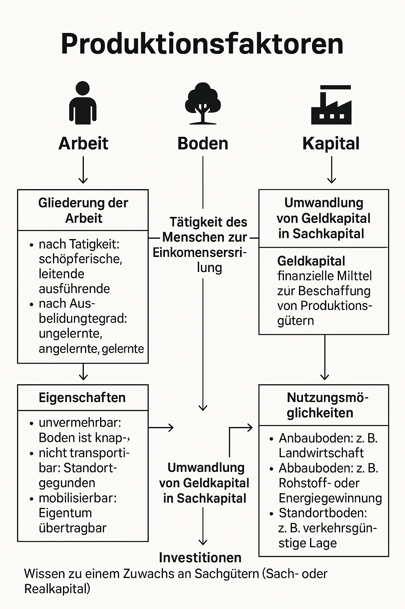

## Mittwoch, 16.07.2025 · WiSo · WIL

> Die Bedeurfnisse der Menschen sind unbegrenzt, nicht aber die zu ihrer Befriedigung >benötigten Güter. Nur wenige Güter sind ausreichend vorhanden, sodass der MEnch seine >Bedürfnisse nach ihnen ohne Mühe und Aufwand befriedigen kann. Man nennt sie Freie Güter ( >Luft. Sonne, regenwasser)

***Einführung:*** Bedürfnisse & Güter
Die Bedürfnisse des Menschen sind prinzipiell unbegrenzt, doch die zur Befriedigung notwendigen Güter sind begrenzt.

***Freie Güter:***
Sind im Überfluss vorhanden und nicht knapp – z. B. Luft, Sonnenlicht, Regenwasser.
→ Keine Kosten, kein Aufwand zur Verfügungstellung.

***Knappe Güter:***
Müssen durch wirtschaftliches Handeln bereitgestellt werden. Sie sind begrenzt und verursachen Kosten (Herstellung, Verteilung, Nutzung).

<u>_In der IT zählen z. B. digitale Produkte, Software, Rechte und Daten zu den immateriellen (nicht-physischen) knappen Gütern._</u>

#### Produktionsprozess in der Volkswirtschaft Zur Herstellung knapper Güter sind sogenannte Produktionsfaktoren notwendig:

**Arbeit**

**Boden**

**Kapital**
(+ zunehmend: Humankapital / Wissen)

# Produktionsfaktoren – Lernzusammenfassung

Diese Grafik zeigt die drei klassischen Produktionsfaktoren der Volkswirtschaftslehre: Arbeit, Boden und Kapital. Sie ist für die Prüfungsvorbereitung essenziell.

---

Hinweis: Diese Grafik wurde selbst erstellt und enthält keine urheberrechtlich geschützten Inhalte.

Produktionsfaktoren (kurz)
1. Arbeit
Gliederung:
‣ Tätigkeit: schöpferisch, leitend, ausführend
‣ Ausbildung: ungelernt, angelernt, gelernt
Beschäftigung:
‣ Vollbeschäftigung: A = 1–3 %
‣ Unterbeschäftigung: A > 3 %
‣ Überbeschäftigung: A < 1 %

2. Boden
Eigenschaften:
‣ Unvermehrbar (knapp)
‣ Nicht transportierbar (standortgebunden)
‣ Mobilisierbar (Eigentum übertragbar)
Nutzung:
‣ Anbau (z. B. Landwirtschaft)
‣ Abbau (z. B. Rohstoffe)
‣ Standort (z. B. Verkehrslage)

3. Kapital
‣ Geldkapital: finanzielle Mittel
‣ Sachkapital: Produktionsmittel
‣ Investition: Zuwachs an Sachgütern
➤ Humankapital gewinnt an Bedeutung (4. Faktor)

<i>Hinweis: Lernzusammenfassung, urheberrechtsfrei formuliert</i>

### Bescäftigungs- und Arbeitsmarktpolitik

#### Beschäftigungs- und Arbeitsmarktpolitik – Zusammenfassung
Private Haushalte stellen den Unternehmen ihre Arbeitskraft zur Verfügung und erhalten dafür Einkommen.

Unternehmen sehen dieses Einkommen als Faktorlohnkosten.
→ Steigen die volkswirtschaftlichen Einkommen, steigt auch:

- die Kaufkraft

- die Beschäftigung

- das Wachstum der Wirtschaft
→ laut Kaufkrafttheorie

#### Kritische Ergänzung zur Theorie:
Damit steigende Kaufkraft wirklich zu mehr Beschäftigung führt, muss der Kosteneffekt beachtet werden:

Wenn z. B. höhere Löhne (z. B. durch Tarifverträge) gleichzeitig die Produktionskosten stark erhöhen,
kann dies die positiven Effekte aufheben → Gefahr der Unterbeschäftigung.

**Beispiel:**
Eine Volkswirtschaft wächst.

Löhne steigen → mehr Kaufkraft → mehr Nachfrage → höhere Preise.

Unternehmen geben höhere Lohnkosten weiter → Inflation.

Es entsteht eine Lohn-Preis-Spirale → Risiko: Rezession + Arbeitslosigkeit

#### Ursachen und Folgen der Unterbeschäftigung
Unterbeschäftigung liegt vor, wenn die Produktionsfaktoren (vor allem Arbeit) nicht voll ausgelastet sind.

Die volkswirtschaftliche Kapazität gibt an, wie viel produziert werden könnte, wenn alle Ressourcen ausgelastet wären.

Das Maß der Auslastung ist die volkswirtschaftliche Beschäftigung.

**Beispiel:**

In einer Volkswirtschaft stehen 10.000 Arbeitskräfte bereit.
→ Wenn nur 9.000 eingesetzt werden = Unterbeschäftigung (10 % unausgelastet).

Beschäftigung
Es ist schwer messbar, wie effizient alle Produktionsfaktoren eingesetzt sind.

Entscheidend ist, ob Produktionskapazitäten ausgeschöpft sind.

Vollbeschäftigung liegt vor, wenn die Arbeitslosigkeit zwischen 1 % und 3 % liegt.
→ >3 % = Unterbeschäftigung, <1 % = Überbeschäftigung

Arbeitslosigkeit
Definition:
Menschen, die arbeitsfähig, arbeitswillig, aber nicht beschäftigt sind.
Nicht alle werden statistisch erfasst → z. B. „stille Reserve“ (verdeckte Arbeitslosigkeit).

 Ursachen der Arbeitslosigkeit & Bekämpfung ### Ursachen der Arbeitslosigkeit und ihre Bekämpfung

| **Art der Arbeitslosigkeit**        | **Ursachen**                                                                 | **Bekämpfung**                                                             |
|------------------------------------|------------------------------------------------------------------------------|----------------------------------------------------------------------------|
| **Friktionelle (Sucharbeitslosigkeit)** | Kurzfristige Übergangsarbeitslosigkeit, z. B. bei Jobwechsel oder Umzug       | Bessere Vermittlung, Jobbörsen, transparente Infos                         |
| **Saisonale**                      | Jahreszeitlich bedingte Nachfragerückgänge (z. B. Bau, Tourismus)             | Saisonunabhängige Beschäftigung, staatliche Programme                      |
| **Konjunkturelle**                 | Rückgang der gesamtwirtschaftlichen Nachfrage (Rezession)                    | Konjunkturpakete, Investitionen, Nachfrage stärken                         |
| **Strukturelle**                   | Branchenwandel, technologische Umstellungen, regionale Unterschiede           | Umschulung, Weiterbildung, Förderung neuer Branchen                        |

