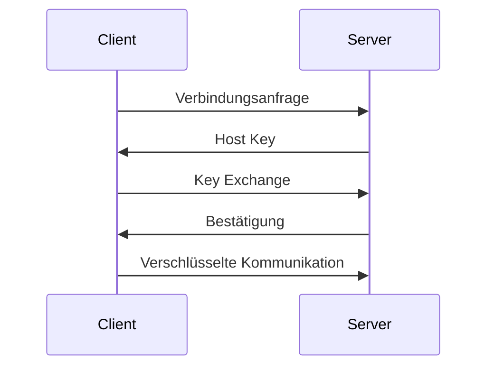

# Mittwoch, 2025-12-17_BS_WED

## SSH, Kryptographie und schlüsselbasierte Authentifizierung

**Thema:** SSH, Verschlüsselung, Schlüsselpaare  
**Kontext:** Sicherheit, Authentifizierung, Praxis (Windows ↔ Linux)

---

## 1. SSH – Secure Shell

SSH ist ein Netzwerkprotokoll zur **verschlüsselten** und **authentifizierten** Kommunikation zwischen Client und Server.

SSH gewährleistet:

- **Vertraulichkeit** – Verschlüsselung der Daten  
- **Integrität** – Schutz vor unbemerkter Manipulation  
- **Authentizität** – Identitätsprüfung von Server und ggf. Client  

Typische Einsatzgebiete:

- Remote-Administration  
- Sichere Dateiübertragung  
- Automatisierung  
- Serverwartung  

---

## 2. Kryptographische Grundprinzipien in SSH

SSH kombiniert mehrere Verfahren mit unterschiedlichen Aufgaben.

---

### 2.1 Symmetrische Verschlüsselung

- Ein gemeinsamer Schlüssel
- Schnell
- Geeignet für große Datenmengen

Problem:  
Der Schlüssel muss zuvor sicher ausgetauscht werden.

---

### 2.2 Asymmetrische Verschlüsselung

- Zwei Schlüssel:
  - Public Key
  - Private Key
- Mathematisch verknüpft
- Private Key verlässt niemals den Client

Verwendung:

- Authentifizierung
- Schlüsselaustausch

---

## 3. Signatur vs. Schlüsselaustausch

### Ed25519

- Elliptische-Kurven-Signatur
- Wird für **Authentifizierung** verwendet
- Dient der Identitätsprüfung

---

### (EC)Diffie-Hellman

- Dient zur **Session-Key-Aushandlung**
- Beispiel: `curve25519-sha256`

---

**Merksatz**

- Ed25519 → Identität  
- (EC)DH → Session-Key  

---

## 4. Kryptographischer Hintergrund

- **RSA** → Primfaktorzerlegung  
- **Diffie-Hellman** → diskreter Logarithmus  
- **Ed25519** → elliptische Kurven  

Für Prüfungen zählt das Prinzip, nicht die Mathematik.

---

## 5. Vereinfachtes RSA-Beispiel (didaktisch)

Nicht sicher – nur zur Veranschaulichung.

- p = 5  
- q = 11  
- n = 55  
- e = 3  
- d = 27  

Verschlüsselung:

```
c = 7³ mod 55 = 13
```

Entschlüsselung:

```
m = 13²⁷ mod 55 = 7
```

Prinzip:

- Public Key verschlüsselt  
- Private Key entschlüsselt  

---

## 6. Aufbau einer SSH-Verbindung

Ablauf:

1. Client verbindet sich
2. Server präsentiert Host Key
3. Session-Key wird ausgehandelt
4. Kommunikation erfolgt symmetrisch



---

## 7. Praxis – Windows ↔ Ubuntu (VirtualBox)

### Ubuntu vorbereiten

```bash
sudo apt update
sudo apt install -y openssh-server
sudo systemctl enable --now ssh
ip a
```

---

### Windows – Schlüssel erzeugen

```powershell
ssh-keygen -t ed25519 -a 64 -f $env:USERPROFILE\.ssh\id_ed25519 -C "Sean@BS-WED"
```

---

### Public Key übertragen

Automatisch:

```powershell
ssh-copy-id -i $env:USERPROFILE\.ssh\id_ed25519.pub sean@192.168.56.101
```

Manuell:

```powershell
type $env:USERPROFILE\.ssh\id_ed25519.pub
```

```bash
mkdir -p ~/.ssh
chmod 700 ~/.ssh
nano ~/.ssh/authorized_keys
chmod 600 ~/.ssh/authorized_keys
```

---

### Verbindung testen

```powershell
ssh sean@192.168.56.101
```

---

### SSH-Config (optional)

```sshconfig
Host ubuntu-vm
  HostName 192.168.56.101
  User sean
  IdentityFile ~/.ssh/id_ed25519
```

---

### Passwort-Login deaktivieren

```bash
sudo nano /etc/ssh/sshd_config
```

```
PasswordAuthentication no
PubkeyAuthentication yes
```

```bash
sudo systemctl restart ssh
```

---

## Kernaussage

Der Transportweg des Public Keys kann variieren,  
aber das kryptographische Prinzip bleibt identisch:

Der Server prüft den Besitz des Private Keys –  
ohne dass dieser jemals übertragen wird.

