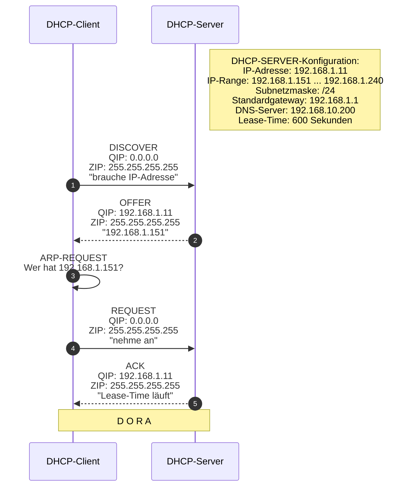
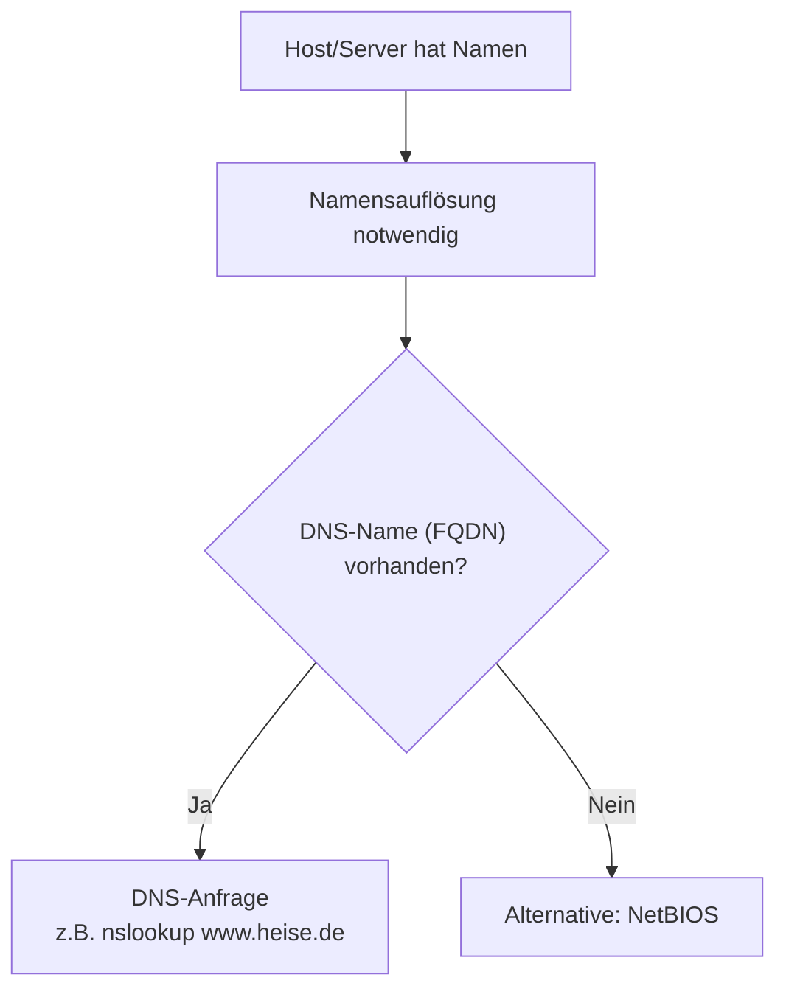
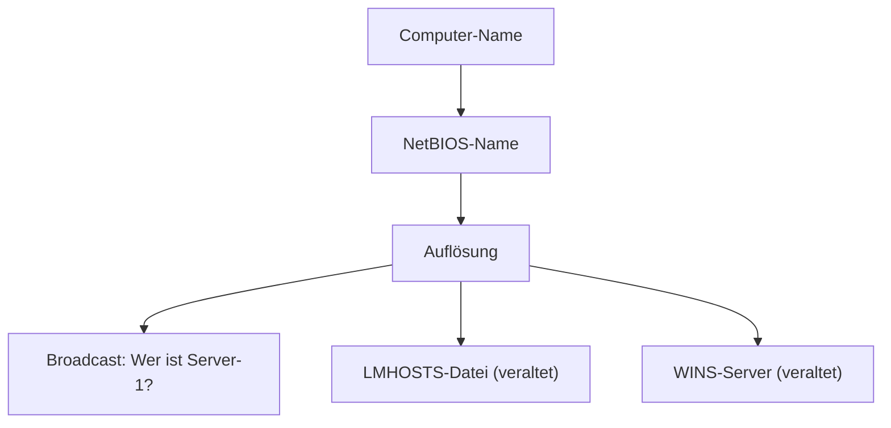
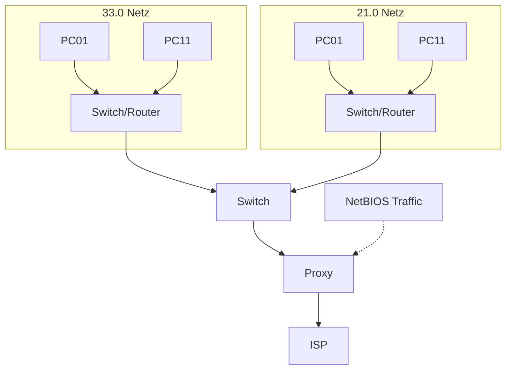

# Mittwoch, 2025-12-03_NT_TRE

---

## DHCP – Dynamic Host Configuration Protocol

DHCP dient der automatischen Vergabe von:

- IP-Adresse
- Subnetzmaske
- Standardgateway
- DNS-Server
- Lease-Time

---

## Ablauf der IP-Vergabe – DORA

### DORA steht für:
- **Discover**
- **Offer**
- **Request**
- **Acknowledge**

Wichtig:
- Kommunikation erfolgt initial per Broadcast
- Lease-Time bestimmt Gültigkeitsdauer der IP-Adresse

---

# Namensauflösung – DNS & NetBIOS

Menschen merken sich Namen besser als IP-Adressen.  
Ziel: **Name → IP-Adresse auflösen**

---

## DNS (Domain Name System)

### Eigenschaften
- Weltweit skalierbar
- Hierarchisch aufgebaut
- Funktioniert internetweit
- Unterstützt IPv4 & IPv6

---

## NetBIOS-Name

NetBIOS ist ein älteres Namenssystem im lokalen Netzwerk.

### Eigenschaften
- Maximal 15 Zeichen
- Erlaubte Zeichen:
  - a–z
  - A–Z
  - 0–9
  - -
- Nur innerhalb einer Broadcast-Domain nutzbar
- Nicht internetfähig

---

### NetBIOS-Namensauflösung

Wichtig:
- Broadcast erzeugt Netzwerklast
- WINS war zentrale Lösung für größere Netze
- Heute fast vollständig durch DNS ersetzt

---

# Netzwerkstruktur-Beispiel

---

## Prüfungsrelevante Kernaussagen

- DHCP arbeitet nach DORA
- Erste DHCP-Kommunikation erfolgt per Broadcast
- 1:N-Beziehung DHCP-Server → Clients
- DNS ist hierarchisch und internetfähig
- NetBIOS ist broadcastbasiert und lokal
- Broadcast funktioniert nicht über Router hinweg
- Lease-Time bestimmt Gültigkeit einer IP
- ARP prüft IP-Konflikte

