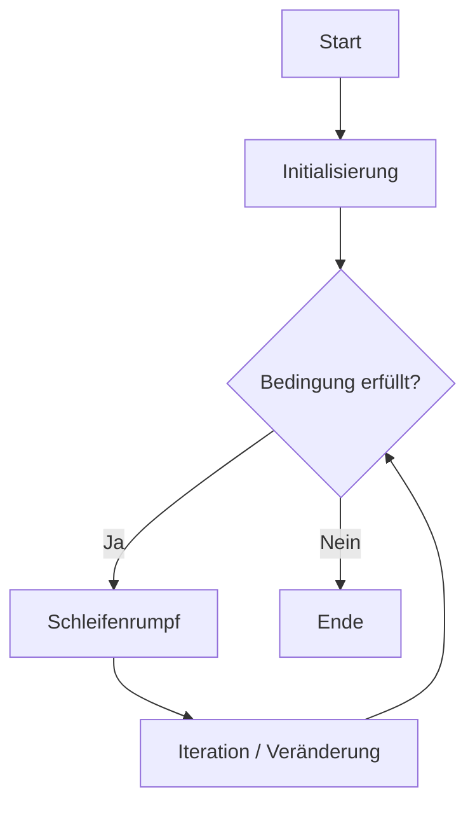
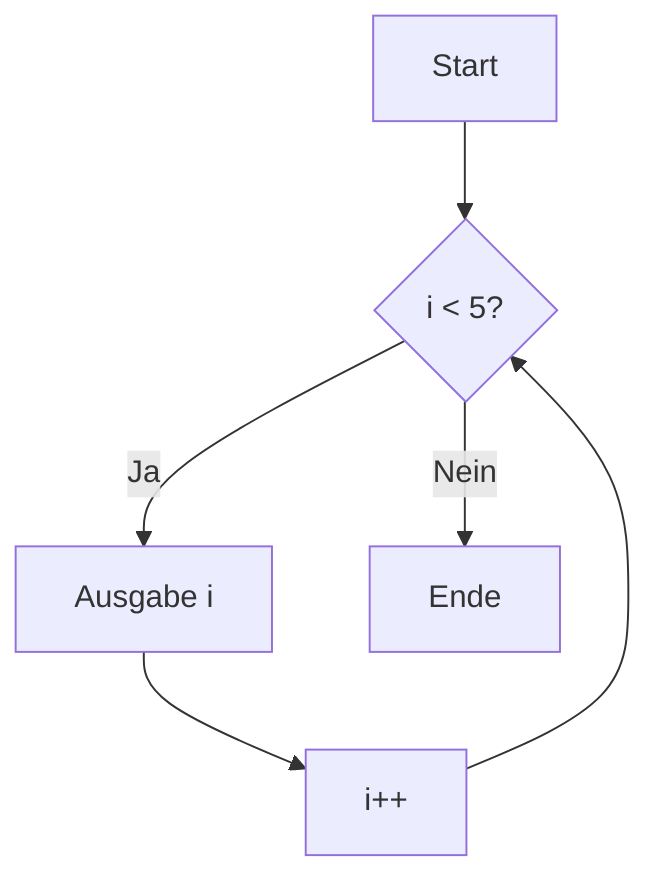
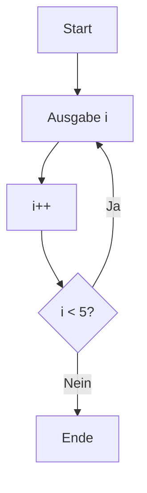

# Kopf- und Fußgesteuerte Schleifen – 2025-09-22 (PAS)

## Kurzüberblick

Schleifen sind zentrale Kontrollstrukturen in Java, mit denen Anweisungen wiederholt ausgeführt werden. Man unterscheidet zwischen:

- **kopfgesteuerten Schleifen** → Bedingung wird vor dem Durchlauf geprüft  
- **fußgesteuerten Schleifen** → Bedingung wird nach dem Durchlauf geprüft  

Diese Unterscheidung beeinflusst direkt, **ob eine Schleife überhaupt ausgeführt wird** und **wie oft sie mindestens läuft**.

---

## 1. Grundprinzip von Schleifen

Eine Schleife besteht logisch aus drei Bestandteilen:

1. **Initialisierung** (Startwert)
2. **Bedingung** (wann wird wiederholt?)
3. **Iteration** (Veränderung pro Durchlauf)

### Ablaufmodell



---

## 2. Kopfgesteuerte Schleifen

### Definition

Die Bedingung wird **vor jedem Durchlauf geprüft**.

👉 Konsequenz:  
Wenn die Bedingung direkt zu Beginn falsch ist, wird der Codeblock **kein einziges Mal** ausgeführt.

### Vertreter

- `while`
- `for`

---

## 2.1 while-Schleife

### Syntax

```java
while (Bedingung) {
    // Anweisungen
}
```

### Beispiel

```java
int i = 0;

while (i < 5) {
    System.out.println(i);
    i++;
}
```

### Ablauf



### Eigenschaften

- Bedingung wird **vor jedem Durchlauf** geprüft
- Kann **0 bis n-mal** ausgeführt werden
- Flexibel bei **unbekannter Wiederholungsanzahl**

### Typischer Einsatz

- Eingaben prüfen
- Schleifen mit dynamischen Bedingungen
- Warten auf Ereignisse

---

## 2.2 for-Schleife

### Syntax

```java
for (Initialisierung; Bedingung; Iteration) {
    // Anweisungen
}
```

### Beispiel

```java
for (int i = 0; i < 5; i++) {
    System.out.println(i);
}
```

### Zerlegung (wichtig fürs Verständnis!)

```java
int i = 0;        // Initialisierung

while (i < 5) {  // Bedingung
    System.out.println(i);
    i++;         // Iteration
}
```

### Eigenschaften

- Kompakt: alles in einer Zeile
- Sehr gut für **Zählvariablen**
- Typisch für **bekannte Durchlaufanzahl**

### Varianten

#### Rückwärts zählen

```java
for (int i = 5; i >= 0; i--) {
    System.out.println(i);
}
```

#### Schrittweite ändern

```java
for (int i = 0; i < 10; i += 2) {
    System.out.println(i);
}
```

---

## 3. Fußgesteuerte Schleifen

### Definition

Die Bedingung wird **erst nach dem Schleifenrumpf geprüft**.

👉 Konsequenz:  
Der Codeblock wird **mindestens einmal ausgeführt**, egal ob die Bedingung wahr ist oder nicht.

---

## 3.1 do-while-Schleife

### Syntax

```java
do {
    // Anweisungen
} while (Bedingung);
```

### Beispiel

```java
int i = 0;

do {
    System.out.println(i);
    i++;
} while (i < 5);
```

### Ablauf



### Eigenschaften

- Wird **immer mindestens einmal ausgeführt**
- Bedingung kommt **am Ende**
- Besonders geeignet für:
  - Menüs
  - Benutzereingaben
  - Validierungsschleifen

### Beispiel (Eingabevalidierung)

```java
int zahl;

do {
    System.out.println("Bitte Zahl > 0 eingeben:");
    zahl = scanner.nextInt();
} while (zahl <= 0);
```

---

## 4. Vergleich der Schleifentypen

| Merkmal | while | for | do-while |
|--------|------|-----|----------|
| Steuerung | kopfgesteuert | kopfgesteuert | fußgesteuert |
| Mindestdurchläufe | 0 | 0 | 1 |
| Lesbarkeit | mittel | hoch bei Zählern | gut bei Eingaben |
| Typischer Einsatz | unbekannte Wiederholungen | bekannte Anzahl | Eingabe/Validierung |

---

## 5. Verschachtelte Schleifen

### Definition

Eine Schleife befindet sich innerhalb einer anderen Schleife.

👉 Wichtig:  
Die **innere Schleife läuft vollständig für jeden Durchlauf der äußeren Schleife**.

### Beispiel

```java
for (int i = 1; i <= 3; i++) {
    for (int j = 1; j <= 3; j++) {
        System.out.println("i = " + i + ", j = " + j);
    }
}
```

### Analyse

- äußere Schleife: 3 Durchläufe
- innere Schleife: 3 Durchläufe pro äußerem Durchlauf  
👉 Gesamt: **3 × 3 = 9 Durchläufe**

### Typische Anwendung

- Matrizen
- Tabellen
- 2D-Arrays
- Koordinatensysteme

---

## 6. Erweiterte Kontrollanweisungen

### break

Beendet die Schleife **sofort komplett**

```java
for (int i = 0; i < 10; i++) {
    if (i == 5) {
        break;
    }
    System.out.println(i);
}
```

👉 Ausgabe: 0–4

---

### continue

Überspringt den aktuellen Durchlauf

```java
for (int i = 0; i < 5; i++) {
    if (i == 2) {
        continue;
    }
    System.out.println(i);
}
```

👉 Ausgabe: 0, 1, 3, 4

---

## 7. Typische Fehlerquellen

### 1. Endlosschleife

```java
while (true) {
    // läuft unendlich
}
```

Oder:

```java
int i = 0;
while (i < 5) {
    System.out.println(i);
    // i++ fehlt!
}
```

---

### 2. Falsche Bedingung

```java
while (i > 5)  // wird nie betreten, wenn i = 0
```

---

### 3. Off-by-One-Fehler

```java
for (int i = 0; i <= 5; i++) // läuft 6 mal!
```

---

### 4. Unübersichtliche Verschachtelung

Zu viele Ebenen → schwer wartbar

👉 Empfehlung: maximal 2–3 Ebenen

---

## 8. Konzeptuelles Verständnis (sehr prüfungsrelevant)

### Unterschied in einem Satz:

- **while / for** → *"Prüfe zuerst, dann führe aus"*  
- **do-while** → *"Führe aus, dann prüfe"*

---

### Entscheidungsregel (Merkschema)

| Situation | Richtige Schleife |
|----------|------------------|
| Anzahl bekannt | for |
| Anzahl unbekannt | while |
| mindestens einmal nötig | do-while |

---

## 9. Praktisches Gesamtbeispiel

```java
int summe = 0;

for (int i = 1; i <= 5; i++) {
    summe += i;
}

System.out.println("Summe: " + summe);
```

👉 Ergebnis: 15

---

## 10. Prüfungsrelevanz

Typische Aufgaben:

- Schleifen analysieren (Wie oft läuft sie?)
- Fehler finden (Endlosschleifen, falsche Bedingungen)
- Schleifen umschreiben (`for` ↔ `while`)
- Verschachtelungen verstehen
- Ablauf vorhersagen (Tracing)

---

## 11. Kernaussagen

- Kopfgesteuerte Schleifen prüfen **vorher** → 0 bis n Durchläufe  
- Fußgesteuerte Schleifen prüfen **nachher** → mindestens 1 Durchlauf  
- `for` = kompakte Zählschleife  
- `while` = flexible Bedingungsschleife  
- `do-while` = garantiert mindestens ein Durchlauf  
- Verschachtelung multipliziert die Anzahl der Durchläufe  
- Fehler entstehen meist durch falsche Bedingungen oder fehlende Iteration  

```
