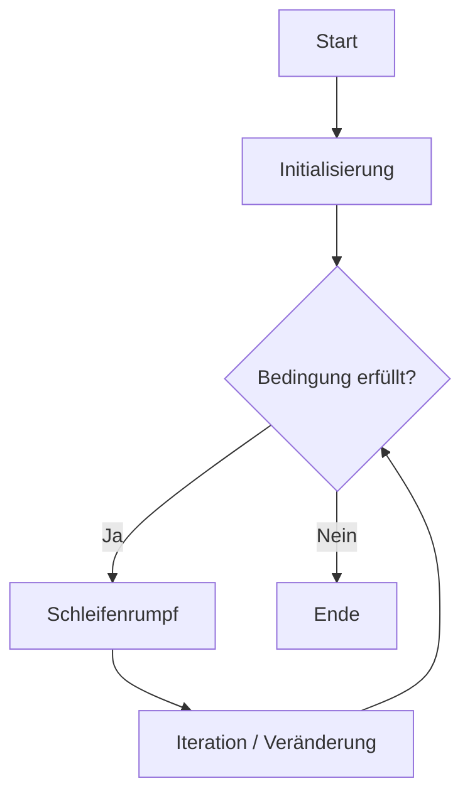
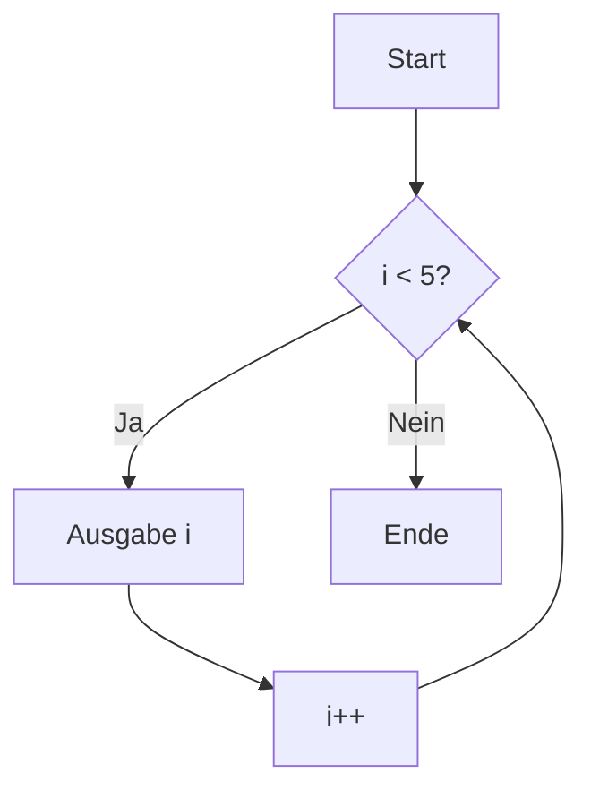
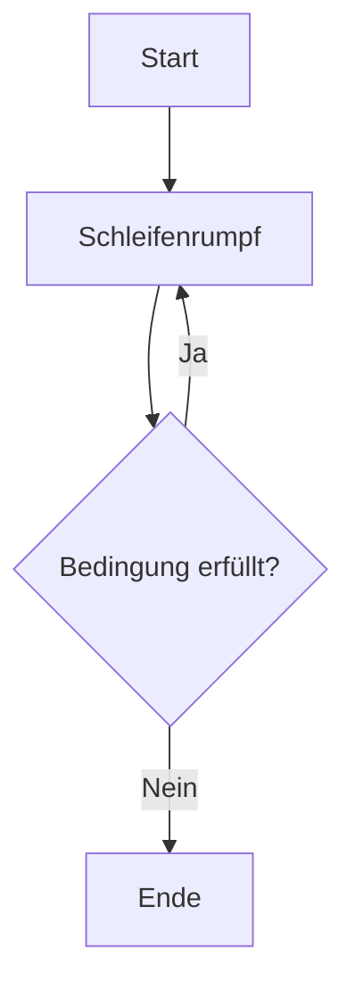

# Schleifen in Java – Kopf-, Fuß- und Zählschleifen

## Kurzüberblick

Schleifen gehören zu den wichtigsten Kontrollstrukturen in Java. Sie ermöglichen es, einen Anweisungsblock mehrfach auszuführen, ohne denselben Code wiederholt hinschreiben zu müssen.

In Java sind vor allem diese Schleifenarten relevant:

- `while` → **kopfgesteuerte Schleife**
- `for` → **kopfgesteuerte Schleife**
- `do-while` → **fußgesteuerte Schleife**
- `enhanced for` / `for-each` → spezielle Form zum Durchlaufen von Arrays und Collections

Zusätzlich sind im Zusammenhang mit Schleifen auch diese Steueranweisungen wichtig:

- `break`
- `continue`

Für das Verständnis in Prüfungen ist entscheidend, **wann die Bedingung geprüft wird**, **wie oft eine Schleife mindestens läuft** und **für welche Problemarten welcher Schleifentyp geeignet ist**.

---

## 1. Was sind Schleifen?

Eine Schleife ist eine Kontrollstruktur, mit der ein Codeblock wiederholt ausgeführt wird, solange eine bestimmte Bedingung gilt oder solange noch Elemente verarbeitet werden müssen.

### Typische Ziele von Schleifen

- Wiederholungen automatisieren
- Code verkürzen
- Zählvorgänge durchführen
- Arrays und Listen verarbeiten
- Eingaben prüfen
- Berechnungen mehrfach anwenden

### Grundidee

Statt denselben Code mehrfach zu schreiben, wird eine Wiederholung beschrieben.

### Beispiel ohne Schleife

```java
System.out.println(1);
System.out.println(2);
System.out.println(3);
System.out.println(4);
System.out.println(5);
```

### Beispiel mit Schleife

```java
for (int i = 1; i <= 5; i++) {
    System.out.println(i);
}
```

Die Schleife ist kürzer, klarer und leichter anpassbar.

---

## 2. Grundbestandteile einer Schleife

Unabhängig vom konkreten Schleifentyp lassen sich Schleifen meist in drei logische Bestandteile zerlegen:

1. **Initialisierung**  
   Startwert oder Ausgangszustand

2. **Bedingung**  
   Legt fest, ob ein weiterer Durchlauf stattfindet

3. **Iteration / Veränderung**  
   Änderung des Zustands nach einem Durchlauf

### Allgemeines Ablaufmodell



### Wichtige Begriffe

| Begriff | Bedeutung |
|--------|-----------|
| Schleifenkopf | Bereich mit Bedingung bzw. Steuerung |
| Schleifenrumpf | Der Codeblock, der wiederholt wird |
| Durchlauf / Iteration | Eine vollständige Ausführung des Schleifenrumpfs |
| Zählvariable | Variable, die die Anzahl der Durchläufe steuert |

---

## 3. Einteilung der Schleifen

### 3.1 Kopfgesteuerte Schleifen

Bei kopfgesteuerten Schleifen wird die Bedingung **vor** dem Schleifenrumpf geprüft.

Folge:

- Ist die Bedingung anfangs falsch, läuft die Schleife **kein einziges Mal**
- Mindestanzahl der Durchläufe: **0**

Dazu gehören:

- `while`
- `for`

---

### 3.2 Fußgesteuerte Schleifen

Bei fußgesteuerten Schleifen wird die Bedingung **nach** dem Schleifenrumpf geprüft.

Folge:

- Der Schleifenrumpf wird **mindestens einmal** ausgeführt
- Mindestanzahl der Durchläufe: **1**

Dazu gehört:

- `do-while`

---

### 3.3 Elementorientierte Schleifen

Die `enhanced for`-Schleife ist eine Sonderform der `for`-Schleife. Sie wird verwendet, um nacheinander Elemente aus Arrays oder Collections zu lesen.

Sie ist keine klassische Zählschleife, sondern eine **Durchlauf-Schleife für Elemente**.

---

## 4. Die while-Schleife

## Definition

Die `while`-Schleife ist kopfgesteuert. Die Bedingung wird vor jedem Durchlauf geprüft.

### Syntax

```java
while (Bedingung) {
    // Anweisungen
}
```

### Einfaches Beispiel

```java
int i = 0;

while (i < 5) {
    System.out.println(i);
    i++;
}
```

### Ablauf

1. `i` hat den Wert `0`
2. Bedingung `i < 5` ist wahr
3. Ausgabe erfolgt
4. `i` wird erhöht
5. Bedingung wird erneut geprüft

### Ablaufdiagramm



### Eigenschaften

- kopfgesteuert
- 0 bis n Durchläufe
- gut bei unbekannter Wiederholungsanzahl
- Bedingung muss sauber formuliert sein
- Änderung der Kontrollvariable darf nicht vergessen werden

### Typische Einsatzfälle

- Wiederholen, solange eine Bedingung gilt
- Verarbeitung bis zu einem Grenzwert
- Programme mit Zustandsprüfungen
- Einlesen, bis ein Abbruchkriterium erreicht ist

### Beispiel: Countdown

```java
int i = 5;

while (i > 0) {
    System.out.println(i);
    i--;
}
System.out.println("Start!");
```

### Beispiel: Schleife läuft gar nicht

```java
int i = 10;

while (i < 5) {
    System.out.println(i);
    i++;
}
```

Hier ist die Bedingung von Anfang an falsch. Deshalb gibt es **keinen einzigen Durchlauf**.

---

## 5. Die for-Schleife

## Definition

Die `for`-Schleife ist ebenfalls kopfgesteuert. Sie eignet sich besonders für **zählgesteuerte Wiederholungen**.

### Syntax

```java
for (Initialisierung; Bedingung; Iteration) {
    // Anweisungen
}
```

### Standardbeispiel

```java
for (int i = 0; i < 5; i++) {
    System.out.println(i);
}
```

### Bestandteile im Detail

```java
for (int i = 0; i < 5; i++) {
    System.out.println(i);
}
```

- `int i = 0` → Initialisierung
- `i < 5` → Bedingung
- `i++` → Iteration / Veränderung

### Äquivalenz zur while-Schleife

Die `for`-Schleife lässt sich logisch als `while` ausdrücken:

```java
int i = 0;

while (i < 5) {
    System.out.println(i);
    i++;
}
```

### Eigenschaften

- kopfgesteuert
- 0 bis n Durchläufe
- besonders übersichtlich bei Zählvorgängen
- Initialisierung, Bedingung und Iteration stehen kompakt zusammen

### Typische Einsatzfälle

- feste Anzahl an Wiederholungen
- Durchlaufen von Indexbereichen
- Berechnungen mit Zählern
- Zugriff auf Array-Elemente über Indizes

### Varianten

#### Aufwärts zählen

```java
for (int i = 1; i <= 10; i++) {
    System.out.println(i);
}
```

#### Abwärts zählen

```java
for (int i = 10; i >= 1; i--) {
    System.out.println(i);
}
```

#### Andere Schrittweite

```java
for (int i = 0; i <= 10; i += 2) {
    System.out.println(i);
}
```

#### Mehrere Variablen im Schleifenkopf

```java
for (int i = 0, j = 10; i < j; i++, j--) {
    System.out.println("i = " + i + ", j = " + j);
}
```

Das ist syntaktisch erlaubt, sollte aber sparsam eingesetzt werden, damit der Code lesbar bleibt.

### for-Schleife ohne Teile

Alle drei Teile sind optional:

```java
for (;;) {
    System.out.println("Endlosschleife");
}
```

Das entspricht einer absichtlichen Endlosschleife.

---

## 6. Die do-while-Schleife

## Definition

Die `do-while`-Schleife ist fußgesteuert. Der Schleifenrumpf wird zuerst ausgeführt, danach wird die Bedingung geprüft.

### Syntax

```java
do {
    // Anweisungen
} while (Bedingung);
```

### Wichtiges Erkennungsmerkmal

Nach `while (Bedingung)` steht bei `do-while` **ein Semikolon**.

### Beispiel

```java
int i = 0;

do {
    System.out.println(i);
    i++;
} while (i < 5);
```

### Eigenschaften

- fußgesteuert
- mindestens 1 Durchlauf
- sinnvoll, wenn eine Aktion auf jeden Fall einmal stattfinden soll

### Typische Einsatzfälle

- Eingabevalidierung
- Menüsteuerung
- Wiederholung bis Benutzer abbrechen möchte

### Beispiel: Eingabe prüfen

```java
int zahl;

do {
    System.out.println("Bitte eine positive Zahl eingeben:");
    zahl = scanner.nextInt();
} while (zahl <= 0);

System.out.println("Gültige Eingabe: " + zahl);
```

### Beispiel: Unterschied zu while

```java
int i = 10;

do {
    System.out.println(i);
} while (i < 5);
```

Obwohl `i < 5` falsch ist, wird `10` **einmal ausgegeben**, weil die Prüfung erst am Ende erfolgt.

### Ablaufdiagramm



---

## 7. Die enhanced for-Schleife (for-each)

## Definition

Die enhanced `for`-Schleife dient zum bequemen Durchlaufen aller Elemente eines Arrays oder einer Collection, ohne dass ein Index manuell verwaltet werden muss.

### Syntax

```java
for (Datentyp variable : datenstruktur) {
    // Anweisungen
}
```

### Beispiel mit Array

```java
int[] zahlen = {10, 20, 30, 40};

for (int zahl : zahlen) {
    System.out.println(zahl);
}
```

### Beispiel mit String-Array

```java
String[] namen = {"Anna", "Ben", "Chris"};

for (String name : namen) {
    System.out.println(name);
}
```

### Eigenschaften

- sehr lesbar
- kein Index notwendig
- geeignet zum vollständigen Durchlaufen aller Elemente
- besonders nützlich für Arrays und Collections

### Vorteile

- weniger Fehler bei der Indexverwaltung
- kompakter Code
- gute Lesbarkeit

### Grenzen

Mit `for-each` ist es schwierig oder ungeeignet, wenn man:

- den Index benötigt
- nur einen Teilbereich durchlaufen möchte
- rückwärts laufen will
- Elemente gezielt über den Index verändern will

### Vergleich: normales for vs. enhanced for

#### Normales for

```java
int[] zahlen = {10, 20, 30, 40};

for (int i = 0; i < zahlen.length; i++) {
    System.out.println(zahlen[i]);
}
```

#### Enhanced for

```java
int[] zahlen = {10, 20, 30, 40};

for (int zahl : zahlen) {
    System.out.println(zahl);
}
```

### Merksatz

Die enhanced `for`-Schleife ist ideal, wenn **alle Elemente vollständig und nur lesend** verarbeitet werden sollen.

---

## 8. Vergleich aller relevanten Schleifenarten

| Schleife | Art | Bedingung geprüft | Mindestdurchläufe | Typischer Einsatz |
|--------|-----|-------------------|-------------------|------------------|
| `while` | kopfgesteuert | vor dem Durchlauf | 0 | unbekannte Anzahl von Wiederholungen |
| `for` | kopfgesteuert | vor dem Durchlauf | 0 | bekannte Anzahl von Wiederholungen |
| `do-while` | fußgesteuert | nach dem Durchlauf | 1 | Eingabe, Menü, Validierung |
| `enhanced for` | elementorientiert | implizit durch Datenstruktur | abhängig von Anzahl der Elemente | Arrays und Collections durchlaufen |

---

## 9. Wann nimmt man welche Schleife?

### `for`

Verwenden, wenn die Anzahl der Wiederholungen bekannt oder leicht über einen Zähler steuerbar ist.

```java
for (int i = 0; i < 10; i++) {
    System.out.println(i);
}
```

### `while`

Verwenden, wenn nicht vorher feststeht, wie oft wiederholt werden muss.

```java
while (!fertig) {
    // weiterarbeiten
}
```

### `do-while`

Verwenden, wenn der Schleifenrumpf mindestens einmal ausgeführt werden soll.

```java
do {
    // Eingabe lesen
} while (ungueltig);
```

### `enhanced for`

Verwenden, wenn eine gesamte Datenstruktur der Reihe nach gelesen werden soll.

```java
for (String name : namen) {
    System.out.println(name);
}
```

---

## 10. Schleifen mit Arrays

Arrays sind in Prüfungen und Übungen sehr häufig mit Schleifen verknüpft.

### Array mit klassischer for-Schleife

```java
int[] zahlen = {5, 7, 9, 11};

for (int i = 0; i < zahlen.length; i++) {
    System.out.println("Index: " + i + ", Wert: " + zahlen[i]);
}
```

### Erklärung

- `zahlen.length` liefert die Anzahl der Elemente
- gültige Indizes gehen von `0` bis `length - 1`

### Array mit enhanced for

```java
int[] zahlen = {5, 7, 9, 11};

for (int zahl : zahlen) {
    System.out.println(zahl);
}
```

### Wichtiger Unterschied

- klassisches `for` → Zugriff auf **Index und Wert**
- enhanced `for` → Zugriff nur auf **Wert**

---

## 11. Verschachtelte Schleifen

## Definition

Eine verschachtelte Schleife ist eine Schleife innerhalb einer anderen Schleife.

Die innere Schleife wird für **jeden Durchlauf der äußeren Schleife vollständig** ausgeführt.

### Beispiel

```java
for (int i = 1; i <= 3; i++) {
    for (int j = 1; j <= 3; j++) {
        System.out.println("i = " + i + ", j = " + j);
    }
}
```

### Analyse

- äußere Schleife: 3 Durchläufe
- innere Schleife: 3 Durchläufe je äußerem Durchlauf
- Gesamtanzahl der inneren Ausführungen: `3 * 3 = 9`

### Typische Anwendungsbereiche

- Tabellen
- Matrizen
- 2-dimensionale Arrays
- Muster-Ausgaben
- Koordinatensysteme

### Beispiel: Rechteck aus Sternen

```java
for (int zeile = 1; zeile <= 3; zeile++) {
    for (int spalte = 1; spalte <= 5; spalte++) {
        System.out.print("*");
    }
    System.out.println();
}
```

### Ausgabe

```text
*****
*****
*****
```

### Beispiel: Einmaleins-Ausschnitt

```java
for (int i = 1; i <= 3; i++) {
    for (int j = 1; j <= 3; j++) {
        System.out.print((i * j) + "\t");
    }
    System.out.println();
}
```

---

## 12. break und continue

Diese Anweisungen gehören nicht selbst zu den Schleifenarten, sind aber für Schleifen sehr wichtig.

### 12.1 break

`break` beendet eine Schleife sofort vollständig.

### Beispiel

```java
for (int i = 0; i < 10; i++) {
    if (i == 5) {
        break;
    }
    System.out.println(i);
}
```

### Ausgabe

```text
0
1
2
3
4
```

Sobald `i == 5` gilt, wird die Schleife verlassen.

### Typischer Einsatz

- Suchvorgang abbrechen, wenn Element gefunden wurde
- vorzeitiger Ausstieg bei Fehlerbedingungen
- Endlosschleifen kontrolliert verlassen

---

### 12.2 continue

`continue` beendet **nicht** die Schleife, sondern überspringt nur den aktuellen Durchlauf.

### Beispiel

```java
for (int i = 0; i < 5; i++) {
    if (i == 2) {
        continue;
    }
    System.out.println(i);
}
```

### Ausgabe

```text
0
1
3
4
```

Die `2` wird übersprungen, die Schleife läuft danach weiter.

---

### 12.3 break und continue im Vergleich

| Anweisung | Wirkung |
|----------|---------|
| `break` | beendet die gesamte Schleife |
| `continue` | überspringt nur den aktuellen Durchlauf |

---

## 13. Markierte Schleifen (labeled break / continue)

In Java können Schleifen mit einem Label versehen werden. Das ist ein fortgeschrittenes Thema, aber prüfungsrelevant, weil es gelegentlich in Aufgaben oder fremdem Code auftaucht.

### Beispiel mit `break`

```java
aussen:
for (int i = 1; i <= 3; i++) {
    for (int j = 1; j <= 3; j++) {
        if (j == 2) {
            break aussen;
        }
        System.out.println("i = " + i + ", j = " + j);
    }
}
```

Hier beendet `break aussen;` nicht nur die innere, sondern auch die äußere Schleife.

### Beispiel mit `continue`

```java
aussen:
for (int i = 1; i <= 3; i++) {
    for (int j = 1; j <= 3; j++) {
        if (j == 2) {
            continue aussen;
        }
        System.out.println("i = " + i + ", j = " + j);
    }
}
```

Hier wird beim Eintreten der Bedingung direkt mit dem nächsten Durchlauf der äußeren Schleife weitergemacht.

### Hinweis

Labels sind erlaubt, sollten aber nur sparsam verwendet werden, da sie den Code oft schwerer lesbar machen.

---

## 14. Endlosschleifen

## Definition

Eine Endlosschleife ist eine Schleife, deren Abbruchbedingung nie erreicht wird oder absichtlich nicht existiert.

### Beispiel mit while

```java
while (true) {
    System.out.println("Läuft unendlich");
}
```

### Beispiel mit for

```java
for (;;) {
    System.out.println("Läuft unendlich");
}
```

### Ursachen unbeabsichtigter Endlosschleifen

- Kontrollvariable wird nicht verändert
- falsche Bedingung
- Abbruchlogik fehlt
- Bedingung bleibt immer wahr

### Beispiel für einen typischen Fehler

```java
int i = 0;

while (i < 5) {
    System.out.println(i);
}
```

Hier fehlt `i++`. Dadurch bleibt `i` dauerhaft `0`, die Bedingung ist immer wahr und die Schleife endet nie.

### Absichtliche Endlosschleifen

Sie können sinnvoll sein, etwa bei Servern, Programmschleifen oder Menüs mit explizitem Abbruch:

```java
while (true) {
    String eingabe = scanner.nextLine();

    if (eingabe.equals("exit")) {
        break;
    }

    System.out.println("Eingabe: " + eingabe);
}
```

---

## 15. Häufige Fehlerquellen

## 15.1 Off-by-One-Fehler

Ein sehr häufiger Fehler bei Schleifen ist, dass eine Schleife **einmal zu oft** oder **einmal zu wenig** läuft.

### Beispiel

```java
for (int i = 0; i <= 5; i++) {
    System.out.println(i);
}
```

Die Ausgabe ist `0` bis `5`, also **6 Durchläufe**.

Wenn nur fünf Durchläufe gemeint waren, müsste die Bedingung lauten:

```java
for (int i = 0; i < 5; i++) {
    System.out.println(i);
}
```

---

## 15.2 Falsche Start- oder Endwerte

```java
for (int i = 1; i < 5; i++) {
    System.out.println(i);
}
```

Das ergibt `1, 2, 3, 4`.

Wer `1 bis 5` ausgeben will, braucht `i <= 5`.

---

## 15.3 Falscher Vergleichsoperator

```java
int i = 0;

while (i > 5) {
    System.out.println(i);
    i++;
}
```

Die Schleife startet nie, weil `0 > 5` falsch ist.

---

## 15.4 Fehlende Änderung der Kontrollvariable

```java
int i = 0;

while (i < 5) {
    System.out.println(i);
}
```

Die Schleife wird unendlich.

---

## 15.5 Falsches Semikolon

### Fehlerhaft

```java
for (int i = 0; i < 5; i++); {
    System.out.println(i);
}
```

Das Semikolon beendet die Schleife sofort. Der Block gehört dann **nicht mehr** zur Schleife.

### Wichtig

Bei `do-while` ist das Semikolon korrekt und notwendig:

```java
do {
    System.out.println("Hallo");
} while (false);
```

---

## 15.6 Zugriff außerhalb des Arrays

```java
int[] zahlen = {1, 2, 3};

for (int i = 0; i <= zahlen.length; i++) {
    System.out.println(zahlen[i]);
}
```

Das führt zu einem Fehler, weil der letzte gültige Index `zahlen.length - 1` ist.

Korrekt ist:

```java
for (int i = 0; i < zahlen.length; i++) {
    System.out.println(zahlen[i]);
}
```

---

## 16. Schleifen verstehen durch Ablaufanalyse

In Prüfungen muss man oft sagen, **wie oft eine Schleife läuft** oder **welche Ausgabe entsteht**.

### Beispiel 1

```java
for (int i = 0; i < 3; i++) {
    System.out.println(i);
}
```

### Ausgabe

```text
0
1
2
```

Die Schleife läuft 3-mal.

---

### Beispiel 2

```java
int i = 3;

while (i > 0) {
    System.out.println(i);
    i--;
}
```

### Ausgabe

```text
3
2
1
```

---

### Beispiel 3

```java
int i = 5;

do {
    System.out.println(i);
    i++;
} while (i < 5);
```

### Ausgabe

```text
5
```

Die Schleife läuft genau 1-mal.

---

## 17. Praktische Beispiele

## 17.1 Summe von 1 bis 5 berechnen

```java
int summe = 0;

for (int i = 1; i <= 5; i++) {
    summe += i;
}

System.out.println("Summe: " + summe);
```

### Ergebnis

```text
Summe: 15
```

---

## 17.2 Gerade Zahlen ausgeben

```java
for (int i = 0; i <= 10; i += 2) {
    System.out.println(i);
}
```

---

## 17.3 Array durchsuchen

```java
int[] zahlen = {3, 7, 11, 15};
int gesucht = 11;
boolean gefunden = false;

for (int zahl : zahlen) {
    if (zahl == gesucht) {
        gefunden = true;
        break;
    }
}

System.out.println("Gefunden: " + gefunden);
```

---

## 17.4 Benutzereingabe wiederholen, bis korrekt

```java
String eingabe;

do {
    System.out.println("Bitte ja eingeben:");
    eingabe = scanner.nextLine();
} while (!eingabe.equals("ja"));
```

---

## 18. Zusammenhang mit Kontrollstrukturen

Schleifen arbeiten häufig zusammen mit:

- `if`
- `else`
- `switch`
- `break`
- `continue`

### Beispiel mit `if` in einer Schleife

```java
for (int i = 1; i <= 10; i++) {
    if (i % 2 == 0) {
        System.out.println(i + " ist gerade");
    } else {
        System.out.println(i + " ist ungerade");
    }
}
```

Hier wird die Schleife genutzt, um für mehrere Werte dieselbe Entscheidungslogik anzuwenden.

---

## 19. Prüfungsrelevanz

Schleifen sind ein Kernthema in Java-Grundlagen und tauchen sehr häufig in Klausuren, Übungen und Programmieraufgaben auf.

### Typische Prüfungsfragen

- Unterschied zwischen `while`, `for` und `do-while`
- Erklärung von kopf- und fußgesteuerter Schleife
- Vorhersage von Ausgaben
- Anzahl der Durchläufe bestimmen
- Fehler in Schleifen finden
- Endlosschleifen erkennen
- Schleifen ineinander verschachteln
- Arrays mit Schleifen verarbeiten
- `break` und `continue` erklären
- `for` in `while` umformen und umgekehrt
- erklären, wann `enhanced for` sinnvoll ist

### Besonders wichtig für Prüfungen

| Thema | Warum wichtig |
|------|---------------|
| Kopf- vs. Fußsteuerung | Grundverständnis der Ausführung |
| `for` vs. `while` | Auswahl der passenden Schleife |
| `do-while` | Mindestdurchlauf verstehen |
| enhanced `for` | häufig bei Arrays und Collections |
| Off-by-One-Fehler | sehr typische Fehlerquelle |
| Endlosschleifen | wichtig für Fehlersuche |
| `break` und `continue` | Steuerung innerhalb von Schleifen |
| verschachtelte Schleifen | oft in Aufgaben mit Tabellen oder Mustern |

---

## 20. Merksätze

- **Kopfgesteuert** bedeutet: erst prüfen, dann ausführen.
- **Fußgesteuert** bedeutet: erst ausführen, dann prüfen.
- `while` eignet sich für Wiederholungen mit **offener Laufzeit**.
- `for` eignet sich für **zählgesteuerte Abläufe**.
- `do-while` eignet sich, wenn der Code **mindestens einmal** laufen muss.
- Die enhanced `for`-Schleife ist ideal zum **bequemen Durchlaufen aller Elemente**.
- `break` beendet die Schleife vollständig.
- `continue` überspringt nur den aktuellen Durchlauf.
- Verschachtelte Schleifen multiplizieren die Zahl der inneren Ausführungen.

---

## 21. Zusammenfassung

Java kennt mehrere Schleifenformen, die jeweils für unterschiedliche Problemtypen geeignet sind.

### Die wichtigsten Schleifenarten

- `while`  
  kopfgesteuert, flexibel, geeignet bei unbekannter Wiederholungszahl

- `for`  
  kopfgesteuert, kompakt, ideal für Zählschleifen

- `do-while`  
  fußgesteuert, mindestens ein Durchlauf

- `enhanced for`  
  einfaches Durchlaufen von Arrays und Collections

### Zentrale Unterschiede

| Frage | while | for | do-while | enhanced for |
|------|------|-----|-----------|--------------|
| Vorab-Bedingung? | ja | ja | nein | implizit |
| Mindestens ein Durchlauf? | nein | nein | ja | nur bei vorhandenen Elementen |
| Gut für Zählung? | bedingt | ja | bedingt | nein |
| Gut für Arrays? | möglich | ja | möglich | sehr gut |

---

## 22. Kernaussagen

- Schleifen wiederholen Anweisungen kontrolliert.
- Java verwendet hauptsächlich `while`, `for`, `do-while` und die enhanced `for`-Schleife.
- `while` und `for` sind **kopfgesteuert**.
- `do-while` ist **fußgesteuert**.
- Die enhanced `for`-Schleife dient zum Durchlaufen von Elementen.
- `for` ist besonders geeignet, wenn die Anzahl der Wiederholungen bekannt ist.
- `while` ist besonders geeignet, wenn die Anzahl der Wiederholungen nicht feststeht.
- `do-while` wird verwendet, wenn mindestens ein Durchlauf garantiert sein soll.
- `break` und `continue` steuern das Verhalten innerhalb von Schleifen.
- Häufige Fehler sind Endlosschleifen, Off-by-One-Fehler und fehlerhafte Bedingungen.
- Verschachtelte Schleifen sind wichtig für Tabellen, Matrizen und Muster.

```
