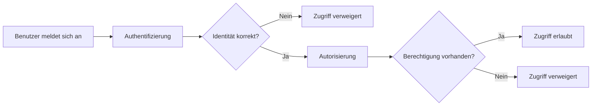
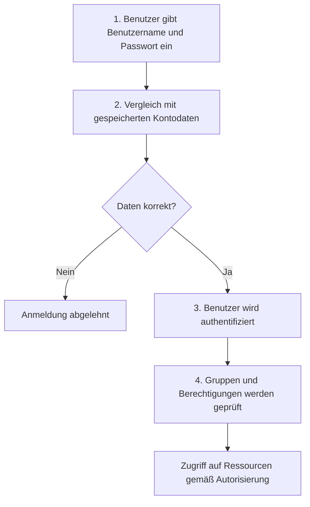

# Rechteverwaltung in Windows

## Kurzüberblick

Die **Rechteverwaltung in Windows** dient dazu, den Zugriff auf **Dateien, Ordner, Systemeinstellungen, Dienste und andere Ressourcen** zu kontrollieren.

Sie basiert auf mehreren zentralen Bausteinen:

| Komponente | Funktion |
|---|---|
| **Benutzerkonten** | Identität eines Nutzers im System |
| **Gruppen** | Zusammenfassung mehrerer Benutzer |
| **Berechtigungen** | Regeln, die festlegen, was erlaubt ist |
| **Authentifizierung** | Prüfung, ob ein Benutzer wirklich der ist, für den er sich ausgibt |
| **Autorisierung** | Prüfung, welche Aktionen dieser Benutzer ausführen darf |

Ziel ist es, **Systeme und Daten vor unbefugtem Zugriff zu schützen**.

---

## Benutzerkonten

In Windows existieren verschiedene Arten von Benutzerkonten mit unterschiedlichen Berechtigungsstufen.

| Kontotyp | Beschreibung |
|---|---|
| **Administratorkonto** | Vollzugriff auf das System, kann Einstellungen ändern und Benutzer verwalten |
| **Standardbenutzer** | Eingeschränkte Rechte, kann Programme nutzen, aber keine weitreichenden Systemänderungen vornehmen |
| **Gastkonto** | Stark eingeschränkter Zugriff für temporäre Nutzung |
| **Systemkonto** | Internes Konto für Windows-Systemprozesse |
| **Dienstkonto** | Konto für Dienste und Hintergrundprozesse |
| **Domänenkonto** | Benutzerkonto aus einer zentralen Domäne, z. B. Active Directory |

Administratoren können **Benutzerkonten erstellen, ändern, löschen und Gruppen zuweisen**.

### Unterschied: Administrator, Standardbenutzer und Gast

Die Kontotypen unterscheiden sich vor allem darin, **welche Systemänderungen erlaubt sind**.

| Aktion | Administrator | Standardbenutzer | Gast |
|---|---|---|---|
| Programme ausführen | Ja | Ja | eingeschränkt |
| Eigene Dateien verwalten | Ja | Ja | eingeschränkt |
| Software installieren | Ja | meist nein bzw. nur mit Admin-Bestätigung | nein |
| Systemeinstellungen ändern | Ja | nur eingeschränkt | nein |
| Benutzerkonten verwalten | Ja | nein | nein |
| Sicherheitsrichtlinien ändern | Ja | nein | nein |
| Zugriff auf geschützte Systembereiche | Ja | nein | nein |
| Netzwerk- und Freigabeeinstellungen ändern | Ja | nein | nein |
| Systemdienste verwalten | Ja | nein | nein |

### Was kann ein Administrator, was ein Standardbenutzer nicht kann?

Ein **Administrator** hat deutlich erweiterte Rechte. Er kann unter anderem:

- Software installieren und deinstallieren
- Systemdateien und Systemeinstellungen ändern
- Benutzerkonten erstellen, ändern und löschen
- Gruppen verwalten
- Sicherheitsrichtlinien konfigurieren
- Systemdienste starten, stoppen und verwalten
- Netzwerk- und Freigabeeinstellungen anpassen
- Updates systemweit installieren
- auf geschützte Bereiche des Systems zugreifen

Ein **Standardbenutzer** kann dagegen typischerweise:

- eigene Programme verwenden
- eigene Dateien und Ordner verwalten
- persönliche Einstellungen teilweise ändern

Er kann aber **keine administrativen Änderungen am System** durchführen.

### Gastkonto

Ein **Gastkonto** besitzt noch weniger Rechte als ein Standardbenutzer. Es ist für eine **temporäre Nutzung** gedacht und hat stark eingeschränkte Möglichkeiten.

Typische Eigenschaften:

- kein Zugriff auf persönliche Daten anderer Benutzer
- keine Softwareinstallation
- keine Systemverwaltung
- nur sehr eingeschränkte Nutzungsmöglichkeiten

---

## Gruppen

Gruppen vereinfachen die Verwaltung von Berechtigungen.

Anstatt jedem Benutzer einzeln Rechte zuzuweisen, werden **Rechte einer Gruppe zugewiesen**. Benutzer werden anschließend **Mitglieder dieser Gruppe**.

Beispiel:

| Gruppe | Typische Rechte |
|---|---|
| **Administratoren** | Vollzugriff |
| **Benutzer** | Standardrechte |
| **Gäste** | stark eingeschränkte Rechte |

Beispielstruktur:

```text
Gruppe: Entwickler
 ├─ Benutzer A
 ├─ Benutzer B
 └─ Benutzer C
```

Wenn der Gruppe Zugriff auf einen Ordner gewährt wird, erhalten **alle Mitglieder dieser Gruppe automatisch die entsprechenden Rechte**.

---

## Berechtigungen in Windows

Berechtigungen bestimmen, **welche Aktionen ein Benutzer oder eine Gruppe auf eine Ressource ausführen darf**.

Sie können auf verschiedene Objekte angewendet werden:

- Dateien
- Ordner
- Registry-Schlüssel
- Geräte
- Netzwerkfreigaben
- Drucker

### Standardberechtigungen

| Berechtigung | Bedeutung |
|---|---|
| **Vollzugriff** | Alle Aktionen erlaubt, inklusive Ändern von Berechtigungen |
| **Ändern** | Lesen, Schreiben, Ändern und Löschen |
| **Lesen & Ausführen** | Dateien lesen und Programme ausführen |
| **Lesen** | Inhalte anzeigen |
| **Schreiben** | Dateien oder Inhalte erstellen bzw. ändern |

Zusätzlich gibt es **spezielle Berechtigungen**, mit denen einzelne Aktionen noch feiner gesteuert werden können.

### Berechtigungen und Benutzerrollen im Zusammenhang

Die Rechte eines Benutzers ergeben sich nicht nur aus dem Kontotyp, sondern auch aus:

- seiner Gruppenmitgliedschaft
- den gesetzten Dateisystemberechtigungen
- lokalen oder domänenweiten Sicherheitsrichtlinien

Ein Administrator hat also nicht nur wegen des Kontotyps viele Rechte, sondern auch, weil er meist Mitglied der Gruppe **Administratoren** ist.

---

## Authentifizierung und Autorisierung

Die Rechteverwaltung basiert auf zwei Sicherheitsprozessen.

| Prozess | Bedeutung |
|---|---|
| **Authentifizierung** | Überprüfung der Identität eines Benutzers |
| **Autorisierung** | Überprüfung der Zugriffsrechte eines Benutzers |

### Authentifizierung

Bei der **Authentifizierung** wird geprüft, **ob ein Benutzer wirklich derjenige ist, für den er sich ausgibt**.

Typische Anmeldedaten sind:

- Benutzername
- Passwort

Sind die Daten korrekt, wird der Benutzer am System angemeldet.

### Autorisierung

Nach erfolgreicher Anmeldung prüft Windows:
> **Welche Ressourcen darf dieser Benutzer verwenden und welche Aktionen darf er ausführen?**

Hier greifen die **zugewiesenen Berechtigungen und Gruppenmitgliedschaften**.

---

### Ablauf: Authentifizierung → Autorisierung



---

## Beispiel

Ein Benutzer möchte eine Datei öffnen.

1. Benutzer meldet sich mit **Benutzername und Passwort** an  
2. Windows überprüft die Identität (**Authentifizierung**)  
3. Windows prüft die **Dateiberechtigungen** (**Autorisierung**)  
4. Ergebnis:

| Situation | Ergebnis |
|---|---|
| Benutzer hat Leserechte | Zugriff erlaubt |
| Benutzer hat keine Rechte | Zugriff verweigert |

---

## Typen der Authentifizierung

Es existieren verschiedene Methoden zur Authentifizierung.

### 1. Passwortbasierte Authentifizierung

Der Benutzer meldet sich mit **Benutzername und Passwort** an.

Vorteile:

- einfach
- weit verbreitet

Nachteil:

- anfällig für **Brute-Force-Angriffe**, schwache Passwörter oder **Phishing**

---

### 2. Zwei-Faktor-Authentifizierung (2FA)

Hier werden **zwei unterschiedliche Faktoren** kombiniert.

Beispiel:

- Passwort  
- Einmalcode auf dem Smartphone

Prinzip:

```text
Sicherheit = Wissen + Besitz
```

Dadurch steigt die Sicherheit deutlich.

---

### 3. Biometrische Authentifizierung

Hier werden **körperliche Merkmale** genutzt.

Beispiele:

- Fingerabdruck
- Gesichtserkennung
- Iris-Scan

Vorteile:

- schnell
- schwerer zu fälschen als ein Passwort

Nachteil:

- Datenschutz- und Missbrauchsrisiken

---

### 4. Tokenbasierte Authentifizierung

Der Benutzer besitzt ein **Token**, das zur Anmeldung verwendet wird.

Beispiele:

- Hardware-Token
- Authenticator-App

Diese Methode wird häufig in **Unternehmensumgebungen** verwendet.

---

### 5. Zertifikatbasierte Authentifizierung

Hier werden **digitale Zertifikate** zur Identitätsprüfung eingesetzt.

Typische Einsatzbereiche:

- VPN
- Unternehmensnetzwerke
- verschlüsselte Kommunikation

---

### 6. Single Sign-On (SSO)

Der Benutzer meldet sich **einmal** an und kann danach auf mehrere Systeme zugreifen.

Beispiel:

```text
Login → Zugriff auf:
- E-Mail
- Cloud-Dienste
- interne Anwendungen
```

Vorteile:

- mehr Komfort
- weniger Passwörter
- zentrale Verwaltung

---

## SAM (Security Account Manager)

### Definition

Der **Security Account Manager (SAM)** ist eine zentrale Komponente der Windows-Sicherheitsarchitektur.

Er verwaltet auf einem **lokalen Windows-System** insbesondere:

- Benutzerkonten
- lokale Gruppen
- sicherheitsrelevante Kontoinformationen
- Passwortinformationen in **Hash-Form**

Wichtig:  
**SAM ist primär für lokale Konten zuständig.**  
In einer Domänenumgebung werden Kontoinformationen zentral z. B. über **Active Directory** verwaltet.

---

### Aufgaben von SAM

| Aufgabe | Bedeutung |
|---|---|
| Speicherung lokaler Benutzerkonten | Verwaltung lokaler Anmeldungen |
| Speicherung lokaler Gruppen | Zuordnung von Gruppenmitgliedschaften |
| Speicherung von Passwort-Hashes | Passwörter werden nicht im Klartext gespeichert |
| Unterstützung der Anmeldung | Vergleich von Anmeldedaten mit gespeicherten Informationen |

SAM ist sicherheitsrelevant und daher **geschützt**. Der direkte Zugriff ist nur mit **hohen Rechten** möglich.

---

### Warum werden Passwörter als Hash gespeichert?

Windows speichert Passwörter nicht direkt als lesbaren Text, sondern als **Hashwert**.

Ein Hash ist ein **mathematisch erzeugter Prüfwert**, der aus einem Passwort berechnet wird.

Vorteil:

- Das eigentliche Passwort wird nicht direkt gespeichert
- Die Sicherheit gegenüber einfachem Auslesen wird erhöht

Wichtig:

- Ein Hash ist **keine Verschlüsselung im klassischen Sinn**
- Beim Anmelden wird nicht das Passwort selbst gespeichert oder verglichen, sondern der daraus berechnete Hashwert

---

### Zusammenhang zwischen SAM, Authentifizierung und Autorisierung

SAM spielt vor allem bei **lokalen Benutzerkonten** eine Rolle.

Beim Anmelden wird geprüft:
1. Gibt es das Benutzerkonto?
2. Passt das eingegebene Passwort zum gespeicherten Hash?
3. Zu welchen Gruppen gehört der Benutzer?
4. Welche Rechte ergeben sich daraus?

Damit unterstützt SAM sowohl die **Authentifizierung** als auch indirekt die **Autorisierung**.

---

## Anmeldeprozess in Windows

Beim Anmeldeprozess werden mehrere Schritte durchlaufen, damit nur berechtigte Benutzer Zugriff erhalten.

### Die vier Grundschritte

1. Der Benutzer gibt seine **Anmeldeinformationen** ein  
2. Das System vergleicht diese Informationen mit den gespeicherten Daten  
3. Bei Übereinstimmung wird der Benutzer **authentifiziert**  
4. Danach prüft das System die **Berechtigungen** und entscheidet über den Zugriff

---

### Darstellung des Anmeldeprozesses



---

### Fachliche Einordnung

Der Ablauf zeigt deutlich den Unterschied:
- **Authentifizierung** beantwortet die Frage:  
  **Wer bist du?**
- **Autorisierung** beantwortet die Frage:  
  **Was darfst du?**

Beides zusammen ist notwendig, damit Windows sicher arbeiten kann.

---

## Warum Authentifizierung und Autorisierung wichtig sind

Beide Mechanismen schützen die **Informationssicherheit** eines Systems.

Sie sichern insbesondere:

| Sicherheitsziel | Bedeutung |
|---|---|
| **Vertraulichkeit** | Nur berechtigte Personen sehen Daten |
| **Integrität** | Daten können nicht unbefugt verändert werden |
| **Verfügbarkeit** | Systeme und Dienste bleiben kontrolliert nutzbar |

Ohne diese Mechanismen könnten beliebige Benutzer auf sensible Informationen oder Systemfunktionen zugreifen.

---

## Prüfungsrelevanz (AP1)

Typische Prüfungsfragen:

### Frage 1

**Was ist der Unterschied zwischen Authentifizierung und Autorisierung?**

**Antwort:**

| Begriff | Erklärung |
|---|---|
| **Authentifizierung** | Überprüfung der Identität eines Benutzers |
| **Autorisierung** | Überprüfung, welche Zugriffe und Aktionen erlaubt sind |

---

### Frage 2

**Nennen Sie drei Arten der Authentifizierung.**

**Antwort:**

- Passwortbasierte Authentifizierung  
- Zwei-Faktor-Authentifizierung  
- Biometrische Authentifizierung  

---

### Frage 3

**Welche Standardberechtigungen gibt es in Windows?**

**Antwort:**

| Berechtigung | Bedeutung |
|---|---|
| Vollzugriff | Alle Aktionen erlaubt |
| Ändern | Dateien verändern und löschen |
| Lesen & Ausführen | Programme starten und Dateien lesen |
| Lesen | Dateien anzeigen |
| Schreiben | Inhalte erstellen oder ändern |

---

### Frage 4

**Was ist der Security Account Manager (SAM)?**

**Antwort:**

SAM ist eine Windows-Komponente zur Verwaltung **lokaler Benutzerkonten und Gruppen**.  
Außerdem werden dort sicherheitsrelevante Informationen wie **Passwort-Hashes** gespeichert.

---

### Frage 5

**Welche Rolle spielt SAM bei der Anmeldung?**

**Antwort:**

Bei lokalen Konten werden die eingegebenen Anmeldedaten mit den in SAM gespeicherten Informationen verglichen.  
Sind die Daten korrekt, wird der Benutzer authentifiziert und anschließend anhand seiner Gruppen und Rechte autorisiert.

---

### Frage 6

**Was darf ein Administrator, was ein Standardbenutzer nicht darf?**

**Antwort:**

Ein Administrator kann systemweite Änderungen durchführen, z. B.:

- Software installieren und deinstallieren
- Benutzerkonten verwalten
- Sicherheitsrichtlinien ändern
- Systemdienste verwalten
- geschützte Systembereiche verändern

Ein Standardbenutzer darf dagegen hauptsächlich **normale Arbeitsaufgaben** ausführen, aber **keine administrativen Systemänderungen** vornehmen.

---

## Häufige Fehler / Verständnisprobleme

### Authentifizierung ≠ Autorisierung

Diese Begriffe werden oft verwechselt.

Merksatz:

```text
Authentifizierung = Wer bist du?
Autorisierung = Was darfst du?
```

---

### SAM speichert keine Passwörter im Klartext

Ein häufiger Irrtum ist, dass Windows Passwörter direkt speichert.

Richtig ist:

- Passwörter werden als **Hashes** gespeichert
- dadurch ist das Passwort nicht direkt lesbar

---

### Lokale Konten ≠ Domänenkonten

SAM ist für **lokale Konten** relevant.

In größeren Unternehmensnetzwerken mit zentraler Benutzerverwaltung werden Konten meist nicht nur lokal, sondern über eine **Domäne** verwaltet.

---

### Gruppen statt Einzelrechte

In der Praxis sollten Rechte möglichst **über Gruppen** vergeben werden.

Falsch:

```text
Rechte → direkt an Benutzer
```

Richtig:

```text
Rechte → Gruppe → Benutzer
```

Vorteile:

- einfachere Verwaltung
- weniger Fehler
- bessere Übersicht
- leichtere Skalierbarkeit

---

### Administrator ist nicht automatisch unbegrenzt allmächtig

Ein Administrator hat sehr viele Rechte, aber auch Administratorkonten unterliegen:
- Sicherheitsrichtlinien
- UAC-Abfragen
- technischen Systemgrenzen
- Berechtigungskonzepten auf bestimmten Ressourcen

Das ist wichtig, weil in Prüfungen oft vereinfacht von "Vollzugriff" gesprochen wird, die Praxis aber differenzierter ist.

---

## Merksätze

> **Authentifizierung prüft die Identität – Autorisierung prüft die Berechtigung.**

> **SAM verwaltet lokale Benutzerkonten, Gruppen und Passwort-Hashes.**

> **Rechte werden idealerweise über Gruppen vergeben, nicht direkt an einzelne Benutzer.**

> **Administratoren verwalten das System, Standardbenutzer arbeiten im System.**
