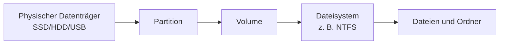
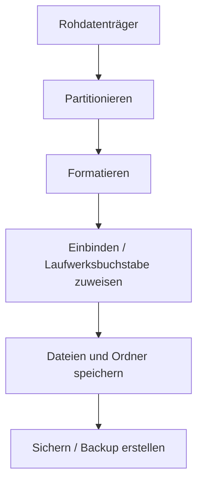
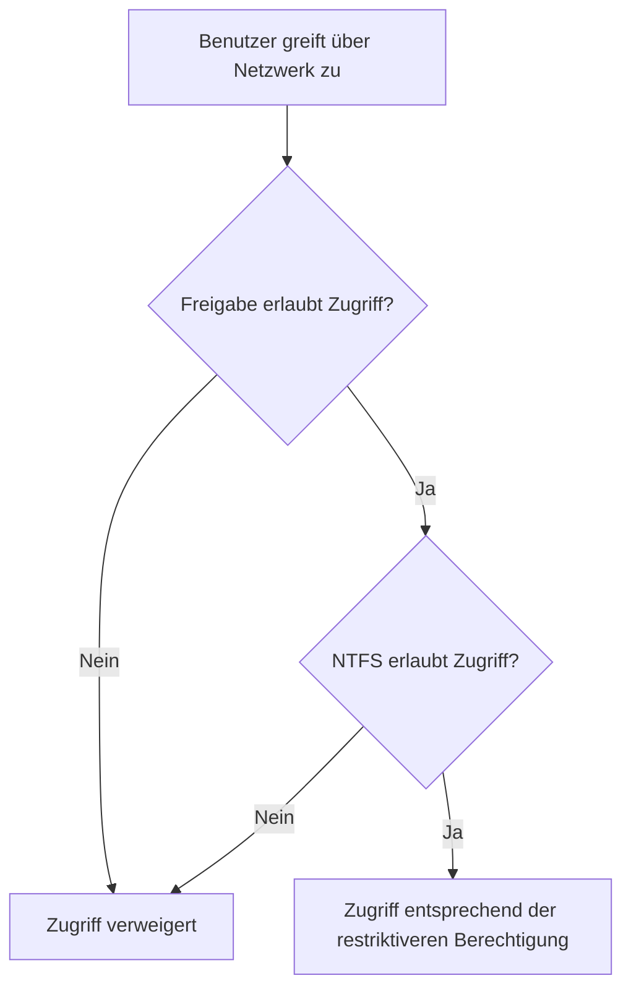

# Dateimanagement unter Betriebssystemen

## Kurzüberblick

**Dateimanagement** beschreibt, wie ein Betriebssystem Dateien, Verzeichnisse, Datenträger, Dateisysteme, Speicherorte und Zugriffsrechte verwaltet.

Eine Datei besteht nicht nur aus ihrem Inhalt. Damit ein Betriebssystem mit einer Datei arbeiten kann, benötigt es zusätzlich Informationen über Speicherort, Name, Metadaten, Rechte und die Zuordnung im Dateisystem.

> **Merksatz:**  
> Eine Datei ist nicht nur Inhalt, sondern immer auch Name, Kontext, Rechte und Speicherzuordnung.

---

## Lernziele für AP1/AP2 FIAE

Nach dieser Einheit solltest du sicher erklären können:

- wie Datenträger, Partitionen, Volumes und Dateisysteme zusammenhängen
- warum Windows-Systemlaufwerke in der Regel NTFS verwenden
- was der Unterschied zwischen Freigabeberechtigungen und NTFS-Berechtigungen ist
- wie Dateiverwaltung praktisch über Explorer, CMD und PowerShell funktioniert
- welche typischen Prüfungsfallen bei Partitionierung, Dateisystemwahl und Berechtigungen auftreten

---

## 1. Grundidee des Dateimanagements

Ein Betriebssystem muss Dateien eindeutig identifizieren, speichern, finden, schützen und verändern können.

Dazu verwaltet es unter anderem:

| Bestandteil | Bedeutung |
|---|---|
| Dateiname | Name der Datei, z. B. `angebot.docx` |
| Dateierweiterung | Hinweis auf Dateityp, z. B. `.txt`, `.pdf`, `.exe` |
| Inhalt | eigentliche Nutzdaten der Datei |
| Metadaten | Zusatzinformationen wie Größe, Erstellungsdatum, Änderungsdatum |
| Speicherort | Pfad innerhalb der Verzeichnisstruktur |
| Zugriffsrechte | wer die Datei lesen, ändern oder löschen darf |
| Dateisystem-Zuordnung | logische Zuordnung der Datei zu Speicherbereichen |
| Backup-Konzept | Schutz gegen Datenverlust |

### Beispiel

Eine Datei `angebot.docx` besteht nicht nur aus dem geschriebenen Text. Das Betriebssystem speichert zusätzlich:

- wo die Datei liegt, z. B. `C:\Users\Sean\Documents\angebot.docx`
- wie groß sie ist
- wann sie erstellt oder geändert wurde
- welcher Benutzer Besitzer der Datei ist
- welche Benutzer oder Gruppen Zugriff haben
- auf welchen Speicherblöcken des Datenträgers die Datei liegt

---

## 2. Datenträger, Partitionen und Volumes

### 2.1 Zentrale Begriffe

| Begriff | Erklärung |
|---|---|
| Datenträger | physisches Speichermedium, z. B. SSD, HDD, USB-Stick |
| Partition | abgegrenzter Bereich auf einem Datenträger |
| Volume | vom Betriebssystem nutzbare Speichereinheit mit Dateisystem |
| Dateisystem | Struktur, mit der Dateien und Ordner organisiert werden |
| Laufwerksbuchstabe | Windows-Zuordnung wie `C:`, `D:` oder `E:` |
| Mountpoint | Einbindung eines Volumes in eine Verzeichnisstruktur |

### Zusammenhang

Ein typischer Ablauf ist:



Ein Datenträger kann mehrere Partitionen enthalten. Eine Partition kann als Volume verwendet und mit einem Dateisystem formatiert werden. Erst danach können Dateien und Ordner darauf gespeichert werden.

---

## 3. Partitionsschemata

Ein **Partitionsschema** legt fest, wie Partitionen auf einem Datenträger beschrieben und organisiert werden.

### 3.1 MBR und GPT im Vergleich

| Schema | Bedeutung | Eigenschaften | Typische Nutzung |
|---|---|---|---|
| MBR | Master Boot Record | maximal 4 primäre Partitionen; Datenträger bis ca. 2 TB | ältere Systeme, Legacy BIOS |
| GPT | GUID Partition Table | sehr viele Partitionen; unterstützt sehr große Datenträger | moderne Systeme mit UEFI |

### 3.2 Wichtige Klarstellungen

| Begriff | Einordnung |
|---|---|
| MBR | Partitionsschema |
| GPT | Partitionsschema |
| NTFS | Dateisystem, kein Partitionsschema |
| FAT32 | Dateisystem, kein Partitionsschema |
| RAID | Redundanz-/Performance-Konzept für mehrere Datenträger |
| LVM | Linux-typische Volumenverwaltung, kein Windows-Standard |

> **Prüfungsfalle:**  
> RAID ist kein Partitionsschema. RAID beschreibt, wie mehrere physische Datenträger für Ausfallsicherheit oder Geschwindigkeit kombiniert werden.

---

## 4. Typische Partitionstypen

| Partitionstyp | Bedeutung |
|---|---|
| Primäre Partition | direkt nutzbare Partition, besonders relevant im MBR-Kontext |
| Erweiterte Partition | Container für logische Partitionen bei MBR |
| Logische Partition | Partition innerhalb einer erweiterten Partition |
| EFI-Systempartition | enthält Bootinformationen bei UEFI-Systemen |
| Wiederherstellungspartition | enthält Werkzeuge zur Systemreparatur oder Wiederherstellung |

Bei modernen Windows-Systemen mit UEFI ist GPT üblich. Dort gibt es typischerweise eine EFI-Systempartition, eine Windows-Partition und oft eine Wiederherstellungspartition.

---

## 5. Dateisysteme im Vergleich

Ein **Dateisystem** bestimmt, wie Dateien und Ordner auf einem Volume gespeichert, benannt, organisiert und verwaltet werden.

| Dateisystem | Typische Nutzung | Vorteile | Nachteile |
|---|---|---|---|
| FAT32 | ältere USB-Sticks, maximale Kompatibilität | sehr kompatibel | maximale Dateigröße 4 GB; keine NTFS-Rechte |
| exFAT | USB-Sticks, SD-Karten, Austausch zwischen Windows und macOS | unterstützt große Dateien; kompatibler als NTFS | keine NTFS-ACLs; weniger robust als Journaling-Dateisysteme |
| NTFS | Windows-Systemlaufwerke und Unternehmensumgebungen | ACLs, Journaling, Quotas, Komprimierung, EFS | auf Fremdsystemen teilweise eingeschränkt |
| ext4 | Linux-Systeme | stabil, performant, Journaling | unter Windows nicht nativ nutzbar |
| APFS | moderne macOS-Systeme | Snapshots, moderne Speicherfunktionen | unter Windows nicht nativ nutzbar |

---

## 6. Warum Windows meist NTFS verwendet

Windows verwendet für Systemlaufwerke in der Regel **NTFS**, weil es wichtige Funktionen für Sicherheit, Stabilität und Verwaltung bietet.

### Wichtige NTFS-Funktionen

| Funktion | Bedeutung |
|---|---|
| ACLs | detaillierte Zugriffsrechte für Benutzer und Gruppen |
| Journaling | Schutz der Dateisystemstruktur bei Abstürzen oder Stromausfall |
| Quotas | Speicherplatzbegrenzung für Benutzer |
| EFS | dateibasierte Verschlüsselung |
| Komprimierung | transparente Dateikomprimierung |
| große Dateien und Volumes | geeignet für moderne Datenträgergrößen |

### Konzeptuell wichtig

NTFS ist nicht nur ein Speicherformat, sondern auch ein Sicherheitsmechanismus. Die NTFS-Berechtigungen bestimmen, welcher Benutzer oder welche Gruppe welche Operationen ausführen darf.

Beispiele:

- Datei lesen
- Datei ändern
- Datei ausführen
- Datei löschen
- Besitz übernehmen
- Berechtigungen ändern

---

## 7. Standardablauf: Vom Rohdatenträger zur nutzbaren Datei

Ein neuer Datenträger ist nicht automatisch sofort sinnvoll nutzbar. Typischerweise erfolgt die Einrichtung in mehreren Schritten.



### 7.1 Schrittfolge

| Schritt | Bedeutung |
|---|---|
| 1. Partitionieren | Datenträger logisch aufteilen |
| 2. Formatieren | Dateisystem anlegen, z. B. NTFS oder exFAT |
| 3. Einbinden | Laufwerksbuchstabe oder Mountpoint zuweisen |
| 4. Dateioperationen | lesen, schreiben, ändern, löschen |
| 5. Sichern | Backup- oder Archivierungskonzept anwenden |

### 7.2 Was passiert beim Formatieren?

Beim Formatieren wird unter anderem:

- ein Dateisystem angelegt
- eine Dateisystemstruktur erstellt
- bei NTFS die Master File Table vorbereitet
- die Clustergröße festgelegt
- das Volume für Dateioperationen vorbereitet

> **Wichtig:**  
> Formatieren bedeutet nicht einfach „alles löschen“, sondern vor allem: ein Dateisystem auf einem Volume anlegen oder neu erzeugen.

---

## 8. Windows-Dateiverwaltung in der Praxis

## 8.1 Explorer-Funktionen

Der Windows Explorer bietet eine grafische Oberfläche zur Dateiverwaltung.

Typische Aktionen:

| Aktion | Tastenkombination oder Funktion |
|---|---|
| Kopieren | `Strg + C` |
| Ausschneiden | `Strg + X` |
| Einfügen | `Strg + V` |
| Umbenennen | `F2` |
| Eigenschaften anzeigen | Rechtsklick → Eigenschaften |
| Datei löschen | `Entf` oder Papierkorb |
| endgültig löschen | `Shift + Entf` |
| Netzlaufwerk verbinden | Explorer → Dieser PC → Netzlaufwerk verbinden |

Der Explorer zeigt außerdem Dateigröße, Änderungsdatum, Attribute und Sicherheitseinstellungen an.

---

## 8.2 Wichtige CMD-Befehle

| Befehl | Funktion | Beispiel |
|---|---|---|
| `dir` | Verzeichnisinhalt anzeigen | `dir C:\Users` |
| `cd` | Verzeichnis wechseln | `cd Documents` |
| `md` / `mkdir` | Ordner erstellen | `mkdir Projekt` |
| `copy` | Datei kopieren | `copy a.txt b.txt` |
| `move` | Datei oder Ordner verschieben | `move a.txt D:\Backup` |
| `del` | Datei löschen | `del test.txt` |
| `rmdir /s` | Ordner rekursiv löschen | `rmdir /s Projekt` |

### Beispiel

```cmd
mkdir Projekt
cd Projekt
echo Hallo > info.txt
dir
copy info.txt backup.txt
```

Dieses Beispiel erstellt einen Ordner, wechselt hinein, erzeugt eine Textdatei, listet den Inhalt auf und erstellt eine Kopie.

---

## 8.3 Wichtige PowerShell-Cmdlets

| Cmdlet | Funktion | Beispiel |
|---|---|---|
| `Get-ChildItem` | Inhalte auflisten | `Get-ChildItem` |
| `New-Item` | Datei oder Ordner erstellen | `New-Item -ItemType Directory Projekt` |
| `Copy-Item` | kopieren | `Copy-Item info.txt backup.txt` |
| `Move-Item` | verschieben | `Move-Item info.txt D:\Backup` |
| `Remove-Item` | löschen | `Remove-Item test.txt` |
| `Get-Acl` | Berechtigungen lesen | `Get-Acl .\info.txt` |
| `Set-Acl` | Berechtigungen setzen | abhängig vom ACL-Objekt |

### CMD vs. PowerShell

| CMD | PowerShell |
|---|---|
| arbeitet stärker textorientiert | arbeitet objektorientiert |
| ältere Windows-Kommandozeile | moderne Windows-Automatisierung |
| gut für einfache Befehle | besser für Skripting und Administration |

---

## 9. Berechtigungen in Windows

Berechtigungen legen fest, wer auf Dateien und Ordner zugreifen darf und welche Aktionen erlaubt sind.

Windows unterscheidet besonders zwischen:

- NTFS-Berechtigungen
- Freigabeberechtigungen
- effektiven Berechtigungen

---

## 9.1 NTFS-Berechtigungen

NTFS-Berechtigungen gelten auf Dateisystemebene. Sie greifen lokal und über das Netzwerk.

Typische Berechtigungsstufen:

| Berechtigung | Bedeutung |
|---|---|
| Vollzugriff | alles erlaubt, inklusive Rechte ändern und Besitz übernehmen |
| Ändern | lesen, schreiben, löschen, aber keine Rechteverwaltung |
| Lesen und Ausführen | Dateien lesen und Programme ausführen |
| Lesen | Dateien und Ordner anzeigen und lesen |
| Schreiben | Dateien erstellen oder ändern |

### Wichtiges Prinzip

NTFS-Berechtigungen können Benutzern oder Gruppen zugewiesen werden. In der Praxis werden Rechte bevorzugt über Gruppen verwaltet, nicht einzeln pro Benutzer.

---

## 9.2 Vererbung

Standardmäßig erben Dateien und Unterordner die Berechtigungen des übergeordneten Ordners.

Beispiel:

```text
D:\Abteilung
└── Projekte
    └── projektplan.xlsx
```

Wenn `D:\Abteilung` einer Gruppe Leserechte gibt, können diese Rechte auf `Projekte` und `projektplan.xlsx` vererbt werden.

### Vererbung kann gebrochen werden

Die Vererbung kann deaktiviert oder angepasst werden. Das ist prüfungsrelevant, weil dadurch Rechte entstehen können, die nicht direkt aus dem übergeordneten Ordner erkennbar sind.

> **Prüfungsfalle:**  
> Wenn ein Benutzer unerwartet Zugriff hat oder keinen Zugriff hat, müssen Gruppenmitgliedschaften, Vererbung und explizite Rechte gemeinsam betrachtet werden.

---

## 9.3 Freigabeberechtigungen vs. NTFS-Berechtigungen

Freigabeberechtigungen gelten beim Zugriff über das Netzwerk. NTFS-Berechtigungen gelten auf Dateisystemebene.

Beim Netzwerkzugriff wirken beide Berechtigungssysteme zusammen.

> **Merksatz:**  
> Beim Netzwerkzugriff gilt effektiv die restriktivere Kombination aus Freigabeberechtigung und NTFS-Berechtigung.

### Beispiel

| Freigabeberechtigung | NTFS-Berechtigung | Effektiver Zugriff über Netzwerk |
|---|---|---|
| Vollzugriff | Lesen | Lesen |
| Ändern | Lesen | Lesen |
| Lesen | Ändern | Lesen |
| Ändern | Ändern | Ändern |

### Warum?

Der Benutzer muss beide Prüfungen bestehen:



---

## 10. Backup-Bezug im Dateimanagement

Dateimanagement ist eng mit Datensicherung verbunden. Dateien müssen nicht nur gespeichert, sondern auch gegen Verlust geschützt werden.

### Backup-Arten

| Backup-Art | Beschreibung | Vorteil | Nachteil |
|---|---|---|---|
| Vollbackup | sichert alle ausgewählten Daten | einfache Wiederherstellung | hoher Speicherbedarf |
| Inkrementelles Backup | sichert nur Änderungen seit dem letzten Backup | spart Speicher und Zeit | Wiederherstellung benötigt mehrere Backup-Stände |
| Differentielles Backup | sichert Änderungen seit dem letzten Vollbackup | Wiederherstellung einfacher als inkrementell | wächst bis zum nächsten Vollbackup an |

### Beispiel

Sonntag wird ein Vollbackup erstellt. Danach ändern sich täglich 200 GB.

| Tag | Inkrementell | Differentiell |
|---|---:|---:|
| Montag | 200 GB | 200 GB |
| Dienstag | 200 GB | 400 GB |
| Mittwoch | 200 GB | 600 GB |
| Donnerstag | 200 GB | 800 GB |
| Freitag | 200 GB | 1000 GB |

Inkrementelle Backups sparen unter der Woche meist Speicherplatz. Differentielle Backups vereinfachen häufig die Wiederherstellung, weil nur das Vollbackup und das letzte differentielle Backup benötigt werden.

---

## 11. Praktische Beispiele

## 11.1 Geeignetes Dateisystem auswählen

### Fall 1: USB-Stick für sehr große Videodateien

Eine Datei ist größer als 4 GB.

| Dateisystem | Geeignet? | Begründung |
|---|---|---|
| FAT32 | Nein | maximale Dateigröße 4 GB |
| exFAT | Ja | unterstützt große Dateien und ist gut für Austauschmedien geeignet |
| NTFS | Möglich | technisch geeignet, aber nicht immer ideal für Austausch mit anderen Systemen |

### Fall 2: Windows-Systemlaufwerk

| Dateisystem | Geeignet? | Begründung |
|---|---|---|
| NTFS | Ja | unterstützt Berechtigungen, Journaling und Windows-Verwaltungsfunktionen |
| FAT32 | Nein | keine NTFS-ACLs, 4-GB-Grenze |
| exFAT | Nein | nicht für Windows-Systemlaufwerke üblich |

---

## 11.2 Effektive Berechtigung bestimmen

Ein Benutzer greift über das Netzwerk auf einen Ordner zu.

```text
Freigabeberechtigung: Ändern
NTFS-Berechtigung: Lesen
```

Ergebnis:

```text
Effektiver Zugriff: Lesen
```

Begründung:

Der Netzwerkzugriff wird sowohl durch die Freigabeberechtigung als auch durch die NTFS-Berechtigung begrenzt. Die restriktivere Berechtigung setzt sich effektiv durch.

---

## 12. Examensrelevanz AP1/AP2

Dieses Thema ist prüfungsrelevant, weil es Grundlagen aus Betriebssystemen, Datensicherheit, Administration und praktischer Fehleranalyse verbindet.

Typische Aufgabenformen:

| Aufgabentyp | Beispiel |
|---|---|
| Dateisystem auswählen | „Welches Dateisystem eignet sich für große Dateien auf USB-Sticks?“ |
| Partitionierung erklären | „Warum GPT statt MBR bei modernen Systemen?“ |
| Rechte analysieren | „Welche effektive Berechtigung ergibt sich aus Freigabe und NTFS?“ |
| Reihenfolge bestimmen | „Partitionieren, formatieren, einbinden, Datei speichern“ |
| Backup-Strategie beurteilen | „Welche Sicherung spart Speicher? Welche vereinfacht Restore?“ |

### Besonders wichtige Merksätze

- FAT32 unterstützt keine Dateien größer als 4 GB.
- NTFS unterstützt detaillierte Windows-Berechtigungen.
- GPT ist bei modernen UEFI-Systemen Standard.
- RAID ist kein Partitionsschema.
- Beim Netzwerkzugriff zählt die restriktivere Kombination aus Freigabe und NTFS.
- Vor riskanten Dateioperationen sollten Backup, Zielpfad und Berechtigungen geprüft werden.

---

## 13. Häufige Fehler und Klarstellungen

| Fehler | Korrektur |
|---|---|
| „MBR ist ein Dateisystem.“ | Falsch. MBR ist ein Partitionsschema. |
| „NTFS ist ein Partitionsschema.“ | Falsch. NTFS ist ein Dateisystem. |
| „RAID ersetzt Backups.“ | Falsch. RAID erhöht Verfügbarkeit, ersetzt aber keine Datensicherung. |
| „FAT32 ist für alle USB-Sticks ideal.“ | Nur bei Kompatibilität. Für Dateien über 4 GB ungeeignet. |
| „Freigaberechte reichen aus.“ | Bei NTFS-Volumes müssen auch NTFS-Rechte passen. |
| „Formatieren ist dasselbe wie Partitionieren.“ | Nein. Partitionieren teilt den Datenträger ein; Formatieren legt ein Dateisystem an. |

---

## 14. Kompakte Lernzusammenfassung

- Dateimanagement umfasst Dateien, Ordner, Metadaten, Rechte und Speicherzuordnung.
- Ein Datenträger wird partitioniert, formatiert und anschließend eingebunden.
- MBR und GPT sind Partitionsschemata.
- NTFS, FAT32, exFAT, ext4 und APFS sind Dateisysteme.
- Windows verwendet meist NTFS wegen ACLs, Journaling und Verwaltungsfunktionen.
- FAT32 hat eine maximale Dateigröße von 4 GB.
- exFAT eignet sich oft für Austauschmedien mit großen Dateien.
- Beim Netzwerkzugriff wirken Freigabe- und NTFS-Berechtigungen zusammen.
- Effektiv zählt die restriktivere Berechtigung.
- Backup-Strategien müssen nach Speicherbedarf, Wiederherstellungszeit und Risiko bewertet werden.

---

## 15. Übungsfragen im AP1/AP2-Stil

### Teil A: Single Choice

**1. Welches Dateisystem unterstützt standardmäßig detaillierte Windows-ACLs?**

- A) FAT32
- B) NTFS
- C) exFAT
- D) ext4

**2. Welche Aussage zu MBR ist korrekt?**

- A) MBR ist für UEFI zwingend erforderlich.
- B) MBR unterstützt unbegrenzt primäre Partitionen.
- C) MBR hat deutliche Grenzen bei Datenträgergröße und Partitionen.
- D) MBR ist ein Dateisystem.

**3. Ein Benutzer greift über Netzwerk auf eine Freigabe zu. Freigabe = Vollzugriff, NTFS = Lesen. Welche effektive Berechtigung hat er?**

- A) Vollzugriff
- B) Ändern
- C) Lesen
- D) Keinen Zugriff

---

### Teil B: Multiple Choice

**4. Welche Aussagen zu NTFS sind richtig?**

- A) NTFS unterstützt Journaling.
- B) NTFS unterstützt keine Dateirechte.
- C) NTFS kann Quotas verwalten.
- D) NTFS erlaubt maximal 4 GB pro Datei.

**5. Welche Reihenfolge ist für einen neuen Datenträger technisch sinnvoll?**

- A) Formatieren
- B) Partitionieren
- C) Datei schreiben
- D) Einbinden/Mounten

---

### Teil C: Kurzfall

**6. Ein Team sichert täglich 200 GB geänderte Daten. Sonntags wird ein Vollbackup erstellt.**

Beantworte:

1. Nenne je einen Vorteil von inkrementeller und differentieller Sicherung.
2. Welche Strategie minimiert in der Regel den Speicherverbrauch unter der Woche?
3. Welche Strategie vereinfacht typischerweise die Wiederherstellung im Störfall?

---

## 16. Lösungen zur Selbstkontrolle

### Lösung Teil A

| Frage | Lösung | Begründung |
|---|---|---|
| 1 | B | NTFS unterstützt Windows-ACLs. |
| 2 | C | MBR hat Grenzen bei Partitionsanzahl und Datenträgergröße. |
| 3 | C | Beim Netzwerkzugriff gilt die restriktivere Kombination. |

### Lösung Teil B

| Frage | Lösung | Begründung |
|---|---|---|
| 4 | A, C | NTFS unterstützt Journaling und Quotas. |
| 5 | B, A, D, C | Erst partitionieren, dann formatieren, dann einbinden, dann Dateien schreiben. |

### Lösung Teil C

**6.1 Vorteile**

- Inkrementell: spart meist Speicherplatz und Zeit, weil nur Änderungen seit dem letzten Backup gesichert werden.
- Differentiell: Wiederherstellung ist oft einfacher, weil nur das Vollbackup und das letzte differentielle Backup benötigt werden.

**6.2 Speicherverbrauch**

In der Regel minimiert das inkrementelle Backup den Speicherverbrauch unter der Woche.

**6.3 Wiederherstellung**

In der Regel vereinfacht das differentielle Backup die Wiederherstellung, weil weniger Backup-Stände kombiniert werden müssen.

---

## 17. Wiederholung für den nächsten Unterricht

Zur Festigung solltest du:

- die Unterschiede zwischen MBR, GPT, NTFS, FAT32 und exFAT wiederholen
- mindestens fünf CMD- oder PowerShell-Dateibefehle praktisch ausprobieren
- Berechtigungsfälle mit Freigabe und NTFS üben
- typische Dateisystem-Auswahlfragen trainieren
- den Unterschied zwischen Vollbackup, inkrementellem Backup und differentiellem Backup sicher erklären können

---

## 18. NTFS vertieft (Prüfungs- und Praxiswissen)

### 18.1 Kernmerkmale von NTFS

| Merkmal | Bedeutung für die Praxis |
|---|---|
| ACLs (Access Control Lists) | Detaillierte Rechtevergabe pro Benutzer und Gruppe |
| Journaling | Dateisystem-Operationen werden vorab protokolliert; verringert Inkonsistenzen nach Absturz |
| Quotas | Speicherplatzbegrenzung pro Benutzer |
| EFS (Encrypting File System) | Dateibasierte Verschlüsselung |
| Komprimierung | Dateien/Ordner können transparent komprimiert werden |
| Große Dateien und Volumes | Geeignet für moderne Datenträgergrößen |
| Hard Links / Symbolic Links | Flexible Verknüpfungen für Dateien und Ordner |
| Dateiattribute | Attribute wie versteckt, schreibgeschützt, System, Archiv |
| MFT (Master File Table) | Zentrale Verwaltungsstruktur für Datei-/Ordner-Einträge |
| Schattenkopien/Versionen | Frühere Dateizustände können wiederhergestellt werden |

### 18.2 Was bedeutet Journaling genau?

Beim Journaling schreibt NTFS wichtige Metadaten-Änderungen zuerst in ein Journal (Protokoll) und setzt sie danach im Dateisystem um. Fällt das System währenddessen aus, kann NTFS den letzten konsistenten Zustand schneller wiederherstellen.

Wichtig: Journaling schützt primär Dateisystemstrukturen (Metadaten), nicht automatisch jede zuletzt bearbeitete Nutzdatei bis aufs letzte Byte.

### 18.3 MFT: Aufbau eines typischen Eintrags

Ein MFT-Eintrag kann unter anderem enthalten:

- Dateiname und Dateierweiterung
- Dateigröße
- Erstellungs- und Änderungszeit
- Besitzer- und Rechteinformationen (ACL)
- Dateiattribute (z. B. versteckt, schreibgeschützt)
- Verweise auf Datencluster
- Verknüpfung in der Ordnerstruktur (Parent-Child-Bezug)

### 18.4 Streams und ADS (Alternate Data Streams)

NTFS unterstützt mehrere Datenströme pro Datei. Der Hauptinhalt liegt im Standard-Stream, zusätzliche Informationen können in alternativen Datenströmen (ADS) gespeichert werden.

Beispielnutzen:

- Metadaten speichern, ohne den sichtbaren Hauptinhalt zu verändern
- Anwendungsinterne Zusatzinformationen ablegen

Sicherheitsaspekt: ADS können bei Analysen übersehen werden, wenn Tools nur den Standard-Stream betrachten.

---

## 19. Cluster, LCN und VCN verständlich erklärt

### 19.1 Was ist ein Cluster?

Ein Cluster ist die kleinste Speichereinheit, die das Dateisystem für die Belegung verwaltet. Ein Cluster besteht aus einer festen Anzahl von Sektoren.

Konsequenz:

- Ist eine Datei kleiner als ein Cluster, belegt sie trotzdem mindestens einen ganzen Cluster (interne Fragmentierung).

Bei NTFS sind je nach Volumengröße unterschiedliche Clusterkonfigurationen möglich.

### 19.2 LCN und VCN

| Begriff | Bedeutung |
|---|---|
| VCN (Virtual Cluster Number) | Logische Cluster-Nummer innerhalb der Datei |
| LCN (Logical Cluster Number) | Physische Cluster-Position auf dem Volume |

NTFS nutzt die Zuordnung VCN -> LCN, um Dateiinhalte logisch zu organisieren und physisch auf dem Datenträger zu speichern.

---

## 20. Beispiel: MFT-Sicht auf eine größere Datei

Beispieldatei: `langer_dateiname.txt` (5 MB)

Mögliche gespeicherte Informationen:

- Name/Endung: `langer_dateiname.txt`
- Größe: 5 MB
- Zeitstempel: erstellt am 01.01.2024, geändert am 15.01.2024
- Rechte: Vollzugriff für Benutzer `Sean`, Lesen für Gruppe `Benutzer`
- Attribute: normal, nicht versteckt, nicht schreibgeschützt
- Datenzuordnung: mehrere Cluster, z. B. ein Bereich von 1000 bis 1500
- Ordnerbezug: Parent `Dokumente`, Child-Kontext `Projekte`

Hinweis: In realen Systemen liegen Dateiblöcke nicht zwingend als ein zusammenhängender Clusterbereich vor.

---

## 21. Dateisystem-Tabelle erweitert (mit FAT-Familie)

| Dateisystem | Merkmale | Vorteile | Nachteile |
|---|---|---|---|
| FAT12 | sehr einfache FAT-Variante für sehr kleine Medien | extrem leichtgewichtig | nur sehr kleine Volumes sinnvoll |
| FAT16 | frühere FAT-Variante für kleine bis mittlere Medien | hohe Alt-Kompatibilität | starke Größenlimits, keine ACLs, kein Journaling |
| FAT32 | weit verbreitet auf USB/Altgeräten | sehr kompatibel | max. 4 GB pro Datei, keine NTFS-Rechte |
| exFAT | moderne FAT-Variante für Flash/SD/USB | große Dateien, plattformübergreifend gut nutzbar | keine NTFS-ACLs, kein klassisches NTFS-Journaling |
| NTFS | Windows-Standard für System/Business | Rechte, Journaling, Quotas, EFS, robuste Verwaltung | auf Fremdsystemen teils eingeschränkt |

Merksatz: FAT steht für File Allocation Table. Die FAT-Familie ist sehr kompatibel, bietet aber weniger Sicherheits- und Verwaltungsfunktionen als NTFS.

---

## 22. Wichtige Dateiattribute (Windows)

| Attribut | Bedeutung |
|---|---|
| Versteckt | Datei wird standardmäßig im Explorer ausgeblendet |
| Schreibgeschützt | Datei soll nicht unbeabsichtigt geändert oder gelöscht werden |
| System | Kennzeichnung für betriebssystemrelevante Datei |
| Archiv | Markiert geänderte/neue Dateien für Backup-Prozesse |

---

## 23. Mini-Check für die Prüfung

- NTFS statt "NFTS" schreiben (häufiger Tippfehler).
- MBR/GPT = Partitionsschema, NTFS/FAT/exFAT = Dateisystem.
- Journaling kurz erklären können (Protokollierung von Metadaten-Änderungen).
- VCN/LCN unterscheiden können (logisch vs. physisch).
- FAT32-Grenze von 4 GB pro Datei sicher beherrschen.

---

## 24. NTFS intern: kleine vs. große Dateien (MFT und Streams)

### 24.1 Kleine Dateien: resident im MFT-Eintrag

Bei kleinen Dateien kann NTFS den Dateiinhalt direkt im MFT-Eintrag speichern. Das nennt man **residenten Datenstream**.

Vorteil:

- sehr schneller Zugriff, weil kein zusätzlicher Cluster-Lookup für den Hauptinhalt nötig ist

Praxishinweis:

- klein heißt nicht "immer gleich groß", sondern hängt von verfügbarer MFT-Record-Größe und den weiteren Attributen der Datei ab

### 24.2 Große Dateien: non-resident mit Runlist

Sobald der Inhalt nicht mehr in den MFT-Eintrag passt, speichert NTFS im MFT nur noch die Zuordnung, wo die Daten auf dem Volume liegen. Das nennt man **non-residenten Stream**.

Typischer Aufbau im MFT-Eintrag:

- Dateiattribute (Name, Zeiten, Rechte)
- Data-Attribut als non-resident
- Runlist (Mapping von VCN-Bereichen auf LCN-Bereiche)

---

## 25. Stream-Aufbau: klein und groß

### 25.1 Residenter Stream (kleine Datei)

Vereinfacht:

```text
MFT-Record
    |- STANDARD_INFORMATION
    |- FILE_NAME
    |- DATA (resident): [Dateiinhalt direkt hier]
```

### 25.2 Non-resident Stream (große Datei)

Vereinfacht:

```text
MFT-Record
    |- STANDARD_INFORMATION
    |- FILE_NAME
    |- DATA (non-resident)
             |- Run 1: VCN 0-127   -> LCN 8450-8577
             |- Run 2: VCN 128-255 -> LCN 19000-19127
             |- Run 3: VCN 256-300 -> LCN 32010-32054
```

Interpretation:

- Datei ist logisch zusammenhaengend (VCN-Reihenfolge)
- physisch kann sie verteilt liegen (mehrere LCN-Bereiche)
- dadurch entsteht Fragmentierung

---

## 26. VCN, LCN und Cluster im Zusammenhang

### 26.1 Merkkette

- Cluster = kleinste vom Dateisystem verwaltete Belegungseinheit
- VCN = logische Clusterposition innerhalb der Datei
- LCN = physische Clusterposition auf dem Volume

Formel fuer den Kopf:

$$
    ext{Datei-Offset} = \text{VCN} \cdot \text{Clustergroesse} + \text{Offset im Cluster}
$$

NTFS loest den logischen VCN auf den physischen LCN auf und kann damit die passenden Cluster lesen.

### 26.2 Beispiel mit 4-KiB-Clustern

- Clustergröße: 4096 Byte
- Gesuchter Byte-Offset in Datei: 12.500

Berechnung:

$$
    ext{VCN} = \left\lfloor \frac{12500}{4096} \right\rfloor = 3,
\quad
    ext{Offset im Cluster} = 12500 - 3 \cdot 4096 = 212
$$

Das Dateisystem sucht also den Cluster mit VCN 3 und darin Byte 212.

---

## 27. Shadow Copies (VSS) kurz und pruefungsnah

**Shadow Copies** in Windows basieren auf dem **Volume Shadow Copy Service (VSS)**.

Nutzen:

- Wiederherstellung frueherer Dateiversionen
- konsistente Snapshots auch bei geoeffneten Dateien
- Grundlage fuer Backup-Loesungen und "Vorgaengerversionen"

Prinzip vereinfacht:

- VSS erzeugt einen Zeitpunkt-Snapshot des Volumes
- geaenderte Datenbloecke werden ueber Copy-on-Write / Redirect-on-Write Verfahren verwaltet
- Anwender koennen fruehere Versionen von Dateien/Ordnern wiederherstellen (wenn konfiguriert)

Wichtig fuer die Pruefung:

- Shadow Copy ist kein Ersatz fuer ein externes Backup
- sie hilft bei versehentlichem Loeschen/Aendern, schuetzt aber nicht allein gegen Totalverlust des Datentraegers

---

## 28. Versteckte Datenstroeme (ADS) und Sicherheit

NTFS erlaubt **Alternate Data Streams (ADS)**. Eine Datei kann mehrere Streams haben:

- Hauptstream: `datei.txt`
- Zusatzstream: `datei.txt:meta`

Moegliche Nutzung:

- legitime Metadaten
- aber auch Verstecken von Inhalten vor einfachen Datei-Listings

Praxisbeispiel (CMD):

```cmd
echo normaler Inhalt > notiz.txt
echo geheimer Inhalt > notiz.txt:secret
```

In vielen Standardansichten sieht man nur `notiz.txt`.

Sicherheitsbezug:

- Forensik- und Security-Tools sollten ADS explizit pruefen
- einfache "Datei vorhanden?"-Checks reichen nicht aus

---

## 29. Links (Vertiefung)

- Microsoft Learn: NTFS technical reference  
    https://learn.microsoft.com/windows/win32/fileio/master-file-table
- Microsoft Learn: File streams (including alternate streams)  
    https://learn.microsoft.com/windows/win32/fileio/file-streams
- Microsoft Learn: Volume Shadow Copy Service overview  
    https://learn.microsoft.com/windows/win32/vss/volume-shadow-copy-service-overview
- Microsoft Learn: Previous Versions and restore points (User perspective)  
    https://support.microsoft.com/windows/previous-versions-of-files-in-windows
- Sysinternals Streams tool (ADS sichtbar machen)  
    https://learn.microsoft.com/sysinternals/downloads/streams

---

## 30. Zusatz: IHK-Style Uebungsblock zu NTFS-Interna

### Punkte und Bewertung

- Gesamt: 20 Punkte
- Empfehlung Selbstcheck:
    - 18-20 Punkte: sehr sicher
    - 14-17 Punkte: gut, aber Luecken bei Details
    - 10-13 Punkte: Grundlagen da, Wiederholung noetig
    - 0-9 Punkte: Thema gezielt neu lernen

### Teil A: Single Choice (je 2 Punkte)

**1. Welche Aussage beschreibt den Unterschied zwischen resident und non-resident in NTFS korrekt?**

- A) Resident bedeutet, dass die Datei verschluesselt ist.
- B) Resident bedeutet, dass Dateiinhalte direkt im MFT-Record stehen koennen.
- C) Non-resident bedeutet, dass die Datei nur im RAM existiert.
- D) Non-resident gilt nur fuer ADS, nicht fuer den Hauptstream.

**2. Was beschreibt eine Runlist in NTFS am treffendsten?**

- A) Reihenfolge der Dateinamen im Verzeichnis
- B) Mapping von VCN-Bereichen auf LCN-Bereiche
- C) Liste aller Benutzer mit Vollzugriff
- D) Liste der Shadow Copies eines Volumes

**3. Welche Aussage zu VCN und LCN ist korrekt?**

- A) VCN ist physisch, LCN ist logisch.
- B) Beide bezeichnen nur Metadaten im Registry-Hive.
- C) VCN ist logisch innerhalb der Datei, LCN ist physisch auf dem Volume.
- D) VCN und LCN sind nur bei FAT32 relevant.

**4. Welche Aussage zu Shadow Copies ist korrekt?**

- A) Shadow Copies ersetzen ein externes Backup vollstaendig.
- B) Shadow Copies funktionieren nur bei ausgeschalteten Systemen.
- C) Shadow Copies erlauben fruehere Dateiversionen, sind aber kein vollwertiger Ersatz fuer externe Backups.
- D) Shadow Copies speichern nur Dateinamen, nicht Inhalte.

### Teil B: Multiple Choice (je 3 Punkte)

**5. Welche Aussagen zu ADS (Alternate Data Streams) sind richtig?**

- A) ADS koennen Zusatzdaten zu einer Datei speichern.
- B) ADS sind in jeder Standard-Exploreransicht sofort sichtbar.
- C) ADS koennen bei oberflaechlicher Analyse uebersehen werden.
- D) ADS existieren nur auf FAT32.

**6. Welche Aussagen zu Clustern sind richtig?**

- A) Cluster sind die kleinste vom Dateisystem verwaltete Belegungseinheit.
- B) Eine 1-Byte-Datei belegt bei 4-KiB-Clustern nur 1 Byte auf dem Datentraeger.
- C) Interne Fragmentierung entsteht, wenn Dateigroesse und Clustergrenze nicht zusammenpassen.
- D) Clusterkonzepte sind bei NTFS irrelevant.

### Teil C: Rechen-/Analyseaufgabe (7 Punkte)

**7. Gegeben:**

- Clustergröße: 4096 Byte
- Datei-Offset: 50.000 Byte
- Runlist (verkuerzt):
    - Run 1: VCN 0-3 -> LCN 100-103
    - Run 2: VCN 4-9 -> LCN 500-505

**Aufgaben:**

1. Bestimme den VCN und den Offset im Cluster (3 Punkte).
2. Entscheide, ob der Zugriff in Run 1 oder Run 2 liegt (2 Punkte).
3. Bestimme den zugehoerigen LCN (2 Punkte).

---

## 31. Loesungen und Bepunktung

### Loesungen Teil A

| Frage | Loesung | Punkte | Kurzbegruendung |
|---|---|---:|---|
| 1 | B | 2 | Kleine Inhalte koennen resident im MFT-Record liegen. |
| 2 | B | 2 | Runlist mappt logische VCN-Bereiche auf physische LCN-Bereiche. |
| 3 | C | 2 | VCN = logisch in Datei, LCN = physisch auf Volume. |
| 4 | C | 2 | VSS hilft bei Versionen, ersetzt aber kein externes Backup. |

### Loesungen Teil B

| Frage | Loesung | Punkte |
|---|---|---:|
| 5 | A, C | 3 |
| 6 | A, C | 3 |

### Loesung Teil C (Musterweg)

1. VCN und Offset (3 Punkte)

$$
	ext{VCN} = \left\lfloor \frac{50000}{4096} \right\rfloor = 12
$$

$$
	ext{Offset im Cluster} = 50000 - 12 \cdot 4096 = 848
$$

2. Run bestimmen (2 Punkte)

- Run 1 deckt VCN 0-3 ab
- Run 2 deckt VCN 4-9 ab
- VCN 12 liegt in keinem der angegebenen Runs

Bewertung:

- Richtige Feststellung "nicht in Run 1/2 enthalten" = volle 2 Punkte

3. LCN bestimmen (2 Punkte)

- Aus den gegebenen Daten nicht bestimmbar, da VCN 12 in der gekuerzten Runlist fehlt

Bewertung:

- Richtige Begruendung "Runlist unvollstaendig" = volle 2 Punkte

Merksatz fuer die Pruefung:

- Wenn VCN bekannt ist, braucht man den passenden Run, erst dann kann der LCN berechnet werden.

---

## 32. Hardlinks und Softlinks (Symbolic Links) in NTFS

### 32.1 Hardlink: Was ist "drin"?

Ein **Hardlink** ist ein weiterer Dateiname fuer **dieselbe Datei**.

Technisch bedeutet das in NTFS:

- mehrere Verzeichniseintraege zeigen auf denselben MFT-Dateirecord
- der Datenstream der Datei ist derselbe
- der Link selbst enthaelt nicht separat den Dateiinhalt

Vereinfacht:

```text
Name A  ----\
            +--> gleicher MFT-Record --> gleicher Datenstream
Name B  ----/
```

Folgen in der Praxis:

- Aenderst du Dateiinhalt ueber Name A, siehst du denselben Inhalt bei Name B
- loeschst du Name A, bleibt Datei ueber Name B erhalten
- Daten werden erst entfernt, wenn der letzte Hardlink weg ist

Einschraenkungen:

- nur innerhalb desselben Volumes
- in der Regel fuer Dateien, nicht fuer normale Ordner

### 32.2 Softlink (Symbolic Link): Was ist "drin"?

Ein **Softlink/Symbolic Link** ist ein eigener Link-Eintrag, der auf einen Zielpfad verweist.

Technisch betrachtet enthaelt er also:

- Link-Metadaten
- Zielinformation (Pfad/Referenz auf das Zielobjekt)
- nicht den eigentlichen Dateiinhalt des Ziels

Vereinfacht:

```text
Link-Datei --> "C:\\Daten\\bericht.txt"
```

Folgen in der Praxis:

- der Link kann auf Dateien oder Ordner zeigen
- der Link kann auch auf andere Volumes zeigen
- wenn Ziel fehlt, wird der Link "haengend" (dangling)

---

## 33. Vergleich Hardlink vs. Softlink (pruefungsnah)

| Kriterium | Hardlink | Softlink (Symbolic Link) |
|---|---|---|
| Intern gespeichert | zusaetzlicher Name auf denselben MFT-Record | eigener Link mit Zielpfad |
| Eigener Dateiinhalt | nein | nein |
| Ziel ueber Volumes hinweg | nein | ja |
| Verhalten bei geloeschtem Ziel | bleibt gueltig, solange ein Link existiert | kann ungueltig/haengend werden |
| Typische Nutzung | zweiter Name fuer gleiche Datei | flexible Umleitung auf Datei/Ordner |

Merksatz:

- Hardlink = zweiter Name fuer dieselbe Datei
- Softlink = Verweis auf ein Ziel

---

## 34. Mini-Beispiele (Windows)

### 34.1 Hardlink erstellen

```cmd
mklink /H bericht_hard.txt bericht.txt
```

Interpretation:

- `bericht_hard.txt` und `bericht.txt` zeigen auf denselben Dateidatensatz.

### 34.2 Symbolic Link erstellen

```cmd
mklink bericht_link.txt C:\Daten\bericht.txt
```

Interpretation:

- `bericht_link.txt` ist ein Link auf den Zielpfad `C:\Daten\bericht.txt`.

Hinweis fuer die Praxis:

- Fuer bestimmte Link-Operationen sind passende Rechte/Policies noetig (je nach Windows-Konfiguration und Umgebung).

