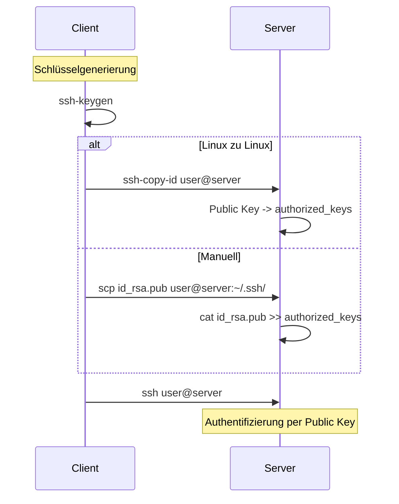

# Mittwoch, 2026-01-14_BS_WED

# Private-/Public-Key-Authentifizierung (SSH)

---

## Grundprinzip

Bei der SSH-Anmeldung mit Schlüsseln wird kein Passwort übertragen.  
Der Client besitzt einen **privaten Schlüssel**, der Server kennt den dazugehörigen **öffentlichen Schlüssel**.

Die Authentifizierung basiert auf **asymmetrischer Kryptografie**:  
Der Server prüft, ob der Client den passenden privaten Schlüssel besitzt – ohne diesen jemals zu sehen.

---

## Voraussetzungen auf dem Server

Damit SSH-Verbindungen akzeptiert werden:

- OpenSSH-Server muss installiert sein  
- Der Dienst (`sshd`) muss laufen  
- Der Dienst sollte für den automatischen Start aktiviert sein  

Erst dann werden eingehende SSH-Verbindungen angenommen.

---

## Erzeugen eines Schlüsselpaares (Client)

Die Schlüssel werden **immer auf dem Client** erzeugt.

Es entstehen zwei Dateien:

- **Privater Schlüssel** → bleibt ausschließlich auf dem Client  
- **Öffentlicher Schlüssel** → wird auf dem Server hinterlegt  

Standardmäßig werden Dateien im Verzeichnis `~/.ssh/` gespeichert.  
Es können individuelle Dateinamen vergeben werden, um mehrere Schlüssel zu verwalten.

Wichtig:  
Der private Schlüssel wird niemals auf den Server kopiert.

---

## Übertragung des öffentlichen Schlüssels

Der Server akzeptiert nur Schlüssel, die in der Datei:

```
~/.ssh/authorized_keys
```

des Zielbenutzers eingetragen sind.

---

### Linux → Linux (mit ssh-copy-id)

```bash
ssh-copy-id user@server
```

Der öffentliche Schlüssel wird automatisch an `authorized_keys` angehängt.

---

### Windows → Linux (manuell)

```bash
scp id_rsa.pub user@server:~/.ssh/
```

Auf dem Server:

```bash
cat id_rsa.pub >> ~/.ssh/authorized_keys
```

---

## Anmeldung nach erfolgreichem Setup

Standardfall:

```bash
ssh user@server
```

Bei abweichendem Schlüssel:

```bash
ssh -i ~/.ssh/mein_schluessel user@server
```

Nach korrekter Einrichtung erfolgt der Login ohne Passwortabfrage.

---

## SSH-Alias (Client-Konfiguration)

In der Datei:

```
~/.ssh/config
```

kann ein Alias definiert werden:

```
Host meinserver
    HostName 192.168.1.10
    User alice
    IdentityFile ~/.ssh/mein_schluessel
```

Login erfolgt dann mit:

```bash
ssh meinserver
```

---

## Passwort-Login deaktivieren

In der Datei:

```
/etc/ssh/sshd_config
```

kann die Passwortauthentifizierung deaktiviert werden.

Wichtig:  
Erst deaktivieren, wenn der Schlüssel-Login erfolgreich getestet wurde.

Nach Änderungen:

```bash
sudo systemctl restart ssh
```

---

## ssh, sshd und systemctl

- **ssh** → Client-Programm  
- **sshd** → Server-Dienst  
- **systemctl** → Dienstverwaltung (systemd)

---

## Protokolle & Fehlersuche

Fehlgeschlagene Login-Versuche werden protokolliert.

Debian-basierte Systeme:

- `/var/log/auth.log`
- `journalctl -u ssh`

Logs helfen bei:

- Fehlkonfiguration
- Berechtigungsproblemen
- Angriffsversuchen

---

## SSH-Banner

Ein SSH-Banner wird vor der Anmeldung angezeigt und dient rechtlichen Hinweisen.

Konfiguration über:

```
Banner /etc/issue.net
```

Es erhöht nicht die technische Sicherheit, erfüllt aber organisatorische Anforderungen.

---

## Arbeiten mit der sshd_config

Zentrale Server-Konfigurationsdatei:

```
/etc/ssh/sshd_config
```

Änderungen betreffen ausschließlich den Server-Daemon (`sshd`).

---

### Konfigurierbare Optionen (Auswahl)

- Passwort-Authentifizierung aktivieren/deaktivieren  
- Public-Key-Authentifizierung  
- SSH-Port ändern  
- Root-Login erlauben oder verbieten  
- Benutzer/Gruppen einschränken  
- Login-Banner  
- Logging-Verhalten  
- Zeitlimits  

Kommentarzeilen beginnen mit `#` und sind nicht aktiv.

---

### Dienst neu starten

Nach jeder Änderung:

```bash
sudo systemctl restart ssh
```

Ohne Neustart greifen die neuen Einstellungen nicht.

---

## Ablauf der Schlüsselverteilung (Übersicht)



---

## Kurzfazit

Schlüsselbasierte SSH-Authentifizierung:

- sicherer als Passwort-Login  
- resistent gegen Brute-Force-Angriffe  
- Standard in moderner Systemadministration  
- skalierbar für mehrere Server

