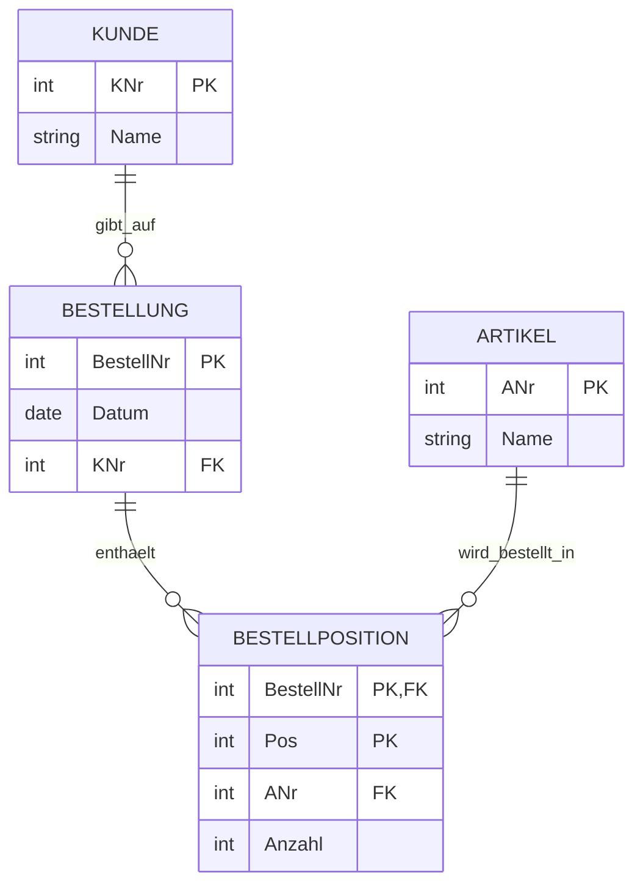

# Montag, 2026-02-02_Datenbanken_KNO

## Normalisierung

- Verfahren zur Verringerung von Datenredundanzen  
- Ziel: Daten korrekt, eindeutig und konsistent abspeichern  
- Aufteilung grosser Tabellen in logisch getrennte Tabellen  

### Warum normalisieren?

- Redundanzen vermeiden  
- Inkonsistenzen (Widersprueche) vermeiden  
- Speicherplatz sparen  
- Wartbarkeit verbessern  

Normalisierung erfolgt in Stufen, den sogenannten **Normalformen**.

---

## 1. Erste Normalform (1NF)

- Alle Attribute enthalten nur **atomare Werte**
  - keine Listen
  - keine Arrays
  - keine mehrfachen Werte in einer Zelle
- Jede Zeile ist eindeutig identifizierbar
- Ein Primaerschluessel ist vorhanden oder ableitbar

---

## 2. Zweite Normalform (2NF)

- Voraussetzung: 1NF ist erfuellt
- Relevant bei Tabellen mit **zusammengesetztem Primaerschluessel**
- Alle Nicht-Schluesselattribute muessen voll funktional
  vom gesamten Primaerschluessel abhaengen
- Partielle Abhaengigkeiten werden eliminiert:
  - Attribute, die nur von einem Teil des PK abhaengen,
    werden in eigene Tabellen ausgelagert
  - Der zugehoerige PK-Teil wird dort als Fremdschluessel gespeichert

---

## 3. Dritte Normalform (3NF)

- Voraussetzung: 2NF ist erfuellt
- Keine transitiven Abhaengigkeiten bei Nicht-Schluesselattributen
- Nicht-Schluesselattribute duerfen nicht voneinander abhaengen

### Umsetzung

- Abhaengige Attribute werden in neue Tabellen ausgelagert
- Neue Tabellen erhalten einen eigenen Primaerschluessel
- Die Ursprungstabelle behaelt einen passenden Fremdschluessel

---

## Beispiel fuer 3NF (Bestellsystem)

- Kundendaten getrennt von Bestelldaten
- Bestellungen enthalten nur bestellbezogene Informationen
- Artikeldaten sind unabhaengig von Bestellungen gespeichert
- Positionsbezogene Informationen werden separat verwaltet
- Redundanzen und Aenderungsanomalien werden vermieden

---

## Boyce-Codd-Normalform (BCNF)

- Erweiterung der dritten Normalform
- Strengere Regelung funktionaler Abhaengigkeiten

### Regel

Jede funktionale Abhaengigkeit muss von einem (Super-)Schluessel ausgehen.

### Relevanz

BCNF wird wichtig, wenn:

- mehrere Kandidatenschluessel existieren
- funktionale Abhaengigkeiten nicht eindeutig
  durch den Primaerschluessel abgedeckt sind

Ziel:
- Weitere Reduzierung von Redundanzen
- Vermeidung logischer Inkonsistenzen

---

## 4. Vierte Normalform (4NF)

- Eliminierung von mehrwertigen Abhaengigkeiten
- Ein Attribut ist mehrwertig abhaengig, wenn:
  - mehrere unabhaengige Attribute
  - vom selben Primaerschluessel abhaengen

Loesung:
- Aufteilung in mehrere Tabellen

---

## 5. Fuenfte Normalform (5NF)

- Eliminierung von Join-Abhaengigkeiten
- Eine Tabelle kann verlustfrei
  in mehrere Tabellen zerlegt werden
- Kommt in der Praxis selten vor
- Relevant vor allem in sehr komplexen Datenmodellen

