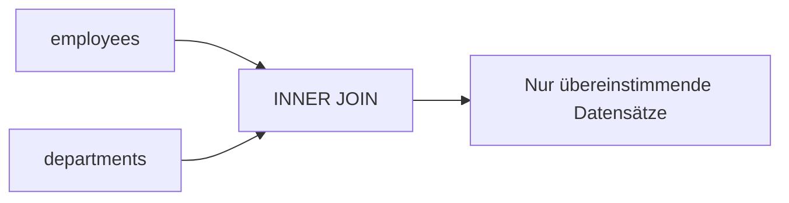
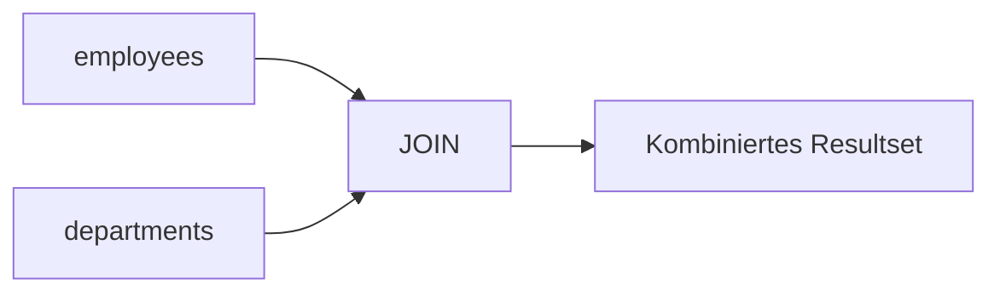

# SQL Joins (MariaDB)

## Überblick

Ein **JOIN** ist eine SQL-Operation, mit der **Daten aus mehreren Tabellen miteinander verbunden werden**.

Die Verbindung erfolgt über **gemeinsame Spalten**, meist:

- **Primärschlüssel (Primary Key)**
- **Fremdschlüssel (Foreign Key)**

Ziel eines Joins ist es, **zusammengehörige Daten aus verschiedenen Tabellen in einem Ergebnis darzustellen**.

Beispiel aus der Praxis:

| employees | departments |
|---|---|
| employee_id | department_id |
| name | department_name |
| department_id | |

Ein Join ermöglicht z. B.:

> „Zeige den Namen eines Mitarbeiters **und** den Namen seiner Abteilung.“

---

## Grundsyntax

```sql
SELECT columns
FROM table1
JOIN table2
ON table1.column = table2.column;
```

Die **JOIN-Bedingung** wird mit `ON` definiert.

---

## Überblick der wichtigsten JOIN-Typen

| Join | Beschreibung |
|---|---|
| INNER JOIN | Nur Datensätze mit Übereinstimmung in beiden Tabellen |
| LEFT JOIN | Alle Datensätze der linken Tabelle |
| RIGHT JOIN | Alle Datensätze der rechten Tabelle |
| FULL OUTER JOIN | Alle Datensätze beider Tabellen |
| CROSS JOIN | Kartesisches Produkt |
| SELF JOIN | Tabelle wird mit sich selbst verbunden |
| NATURAL JOIN | Automatische Verbindung über gleich benannte Spalten |

---

# Wichtige JOIN-Typen (AP1-relevant)

## INNER JOIN

Der **INNER JOIN** liefert nur Datensätze, bei denen **in beiden Tabellen eine passende Verbindung existiert**.

```sql
SELECT employees.name, departments.department_name
FROM employees
INNER JOIN departments
ON employees.department_id = departments.department_id;
```

### Ergebnislogik

Nur Mitarbeiter **mit existierender Abteilung** erscheinen im Ergebnis.



---

## LEFT JOIN (LEFT OUTER JOIN)

Der **LEFT JOIN** gibt **alle Datensätze der linken Tabelle zurück**, auch wenn **keine Übereinstimmung** in der rechten Tabelle existiert.

Nicht vorhandene Werte werden mit **NULL** gefüllt.

```sql
SELECT employees.name, departments.department_name
FROM employees
LEFT JOIN departments
ON employees.department_id = departments.department_id;
```

### Beispiel

| employees | departments | Ergebnis |
|---|---|---|
| Müller | IT | Müller – IT |
| Schmidt | NULL | Schmidt – NULL |

---

## RIGHT JOIN (RIGHT OUTER JOIN)

Der **RIGHT JOIN** funktioniert wie der LEFT JOIN, nur **umgekehrt**.

Alle Datensätze der **rechten Tabelle** erscheinen im Ergebnis.

```sql
SELECT employees.name, departments.department_name
FROM employees
RIGHT JOIN departments
ON employees.department_id = departments.department_id;
```

---

# Weitere JOIN-Typen

## FULL OUTER JOIN

Der **FULL OUTER JOIN** gibt **alle Datensätze aus beiden Tabellen zurück**.

Nicht vorhandene Werte werden mit `NULL` ergänzt.

```sql
SELECT employees.name, departments.department_name
FROM employees
FULL OUTER JOIN departments
ON employees.department_id = departments.department_id;
```

⚠️ **Wichtig für MariaDB / MySQL**

MariaDB unterstützt **FULL OUTER JOIN nicht direkt**.

Stattdessen muss man ihn mit **UNION kombinieren**:

```sql
SELECT employees.name, departments.department_name
FROM employees
LEFT JOIN departments 
ON employees.department_id = departments.department_id

UNION

SELECT employees.name, departments.department_name
FROM employees
RIGHT JOIN departments
ON employees.department_id = departments.department_id;
```

---

## CROSS JOIN

Der **CROSS JOIN** erzeugt das **kartesische Produkt** zweier Tabellen.

Jede Zeile der ersten Tabelle wird mit **jeder Zeile der zweiten Tabelle kombiniert**.

```sql
SELECT employees.name, departments.department_name
FROM employees
CROSS JOIN departments;
```

Beispiel:

| employees | departments | Ergebnis |
|---|---|---|
| 3 | 4 | 12 Zeilen |

Formel:

```
Ergebniszeilen = ZeilenA × ZeilenB
```

---

## SELF JOIN

Ein **SELF JOIN** verbindet **eine Tabelle mit sich selbst**.

Typischer Anwendungsfall:

- Mitarbeiter ↔ Manager
- Kategorie ↔ Oberkategorie
- Freundschaftsbeziehungen

```sql
SELECT e1.name AS employee_name, e2.name AS manager_name
FROM employees e1
JOIN employees e2
ON e1.manager_id = e2.employee_id;
```

Hier wird die Tabelle zweimal verwendet:

| Alias | Bedeutung |
|---|---|
| e1 | Mitarbeiter |
| e2 | Manager |

---

## NATURAL JOIN

Ein **NATURAL JOIN** verbindet Tabellen automatisch über **gleich benannte Spalten**.

```sql
SELECT employees.name, departments.department_name
FROM employees
NATURAL JOIN departments;
```

⚠️ Problem:

- Join-Spalten werden **automatisch gewählt**
- Kann zu **unerwarteten Ergebnissen** führen

Deshalb wird NATURAL JOIN **in der Praxis selten verwendet**.

---

# Mehrere Joins in einer Abfrage

SQL erlaubt **mehrere Joins gleichzeitig**.

Beispiel:

```sql
SELECT employees.name, departments.department_name, locations.city
FROM employees
JOIN departments 
    ON employees.department_id = departments.department_id
JOIN locations
    ON departments.location_id = locations.location_id;
```

Hier werden **3 Tabellen verbunden**.

---

# Performance und Best Practices

## Indizes

Join-Spalten sollten **indiziert** sein.

Typisch:

- Primary Key
- Foreign Key

Beispiel:

```
employees.department_id
departments.department_id
```

Dadurch kann die Datenbank schneller passende Datensätze finden.

---

## Tabellen-Aliase verwenden

Bei mehreren Joins verbessern Aliase die **Lesbarkeit**.

```sql
SELECT e.name, d.department_name
FROM employees e
JOIN departments d
ON e.department_id = d.department_id;
```

---

# Prüfungsrelevanz (AP1)

Für die **AP1-Prüfung** sind besonders wichtig:

| Join | Wichtigkeit |
|---|---|
| INNER JOIN | ⭐⭐⭐ sehr wichtig |
| LEFT JOIN | ⭐⭐⭐ sehr wichtig |
| RIGHT JOIN | ⭐⭐ |
| CROSS JOIN | ⭐ |
| SELF JOIN | ⭐⭐ |
| NATURAL JOIN | ⭐ |

Typische Prüfungsfragen:

- Unterschied zwischen **INNER JOIN und LEFT JOIN**
- Ergebnis eines JOINs interpretieren
- Join-Bedingung (`ON`) verstehen
- Unterschied **JOIN vs UNION**

---

# Häufige Fehler

## Fehlende Join-Bedingung

```sql
SELECT *
FROM employees
JOIN departments;
```

➡ erzeugt **kartesisches Produkt**

---

## Falsche Spalten im JOIN

```sql
ON employees.name = departments.department_name
```

Join-Bedingung muss **logisch zusammengehörige Spalten verbinden**.

---

# Zusammenfassung

| Konzept | Bedeutung |
|---|---|
| JOIN | verbindet Daten aus mehreren Tabellen |
| INNER JOIN | nur passende Datensätze |
| LEFT JOIN | alle Datensätze der linken Tabelle |
| RIGHT JOIN | alle Datensätze der rechten Tabelle |
| CROSS JOIN | kartesisches Produkt |
| SELF JOIN | Tabelle mit sich selbst |
| NATURAL JOIN | automatische Join-Spalten |

Mentales Modell:

```
JOIN = Tabellen nebeneinander verbinden
UNION = Resultsets untereinander stapeln
```

