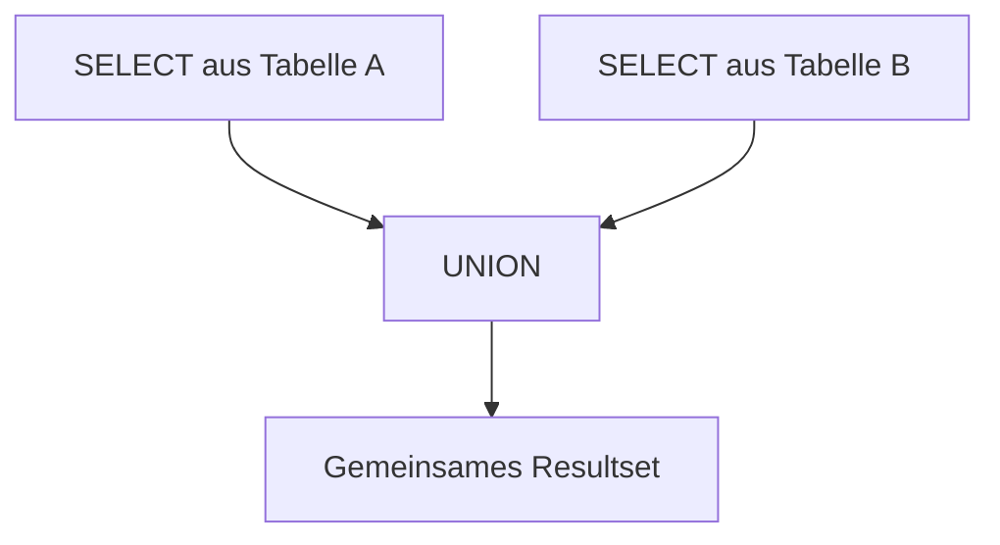

# SQL UNION

## Überblick

`UNION` ist ein SQL-Operator, der die **Ergebnisse mehrerer SELECT-Abfragen zu einer einzigen Ergebnismenge kombiniert**.

Dabei werden die Resultsets **untereinander angehängt** (vertikale Kombination).  
Standardmäßig entfernt `UNION` **Duplikate**, sodass jede Zeile im Ergebnis **nur einmal vorkommt**.

SQL kennt zwei Varianten:

| Operator | Verhalten |
|--------|--------|
| `UNION` | kombiniert Resultsets **ohne Duplikate** |
| `UNION ALL` | kombiniert Resultsets **mit Duplikaten** |

---

## Voraussetzungen für UNION

Damit `UNION` funktioniert, müssen bestimmte Bedingungen erfüllt sein:

| Regel | Erklärung |
|------|-----------|
| gleiche Spaltenanzahl | Beide `SELECT`-Abfragen müssen **gleich viele Spalten** zurückgeben |
| kompatible Datentypen | Die Datentypen der Spalten müssen **zueinander passen** |
| Reihenfolge relevant | Die Spalten werden **positionell kombiniert**, nicht nach Namen |

Beispiel:

| SELECT 1 | SELECT 2 |
|---|---|
| name (VARCHAR) | name (VARCHAR) |
| department (VARCHAR) | department (VARCHAR) |

Diese beiden Abfragen sind **UNION-kompatibel**.

---

## Grundsyntax

```sql
SELECT column1, column2, ...
FROM table1
WHERE condition

UNION

SELECT column1, column2, ...
FROM table2
WHERE condition;
```

Der zweite `SELECT` wird **unter den ersten angefügt**.

---

## Beispiel

Angenommen, es existieren zwei Tabellen:

- `employees`
- `managers`

Beide besitzen die Spalten:

| name | department |
|-----|-----|

Wir möchten **alle Personen aus beiden Tabellen in einer Liste** erhalten.

```sql
SELECT name, department
FROM employees

UNION

SELECT name, department
FROM managers;
```

### Ergebnisprinzip

```
name        department
-----------------------
Müller      IT
Schmidt     Sales
Meier       HR
```

Falls eine Person **in beiden Tabellen vorkommt**, erscheint sie bei `UNION` **nur einmal**.

---

## UNION ALL

Wenn **Duplikate erhalten bleiben sollen**, verwendet man `UNION ALL`.

```sql
SELECT name, department
FROM employees

UNION ALL

SELECT name, department
FROM managers;
```

### Unterschied

| UNION | UNION ALL |
|------|------|
| entfernt Duplikate | behält Duplikate |
| langsamer (Sortierung nötig) | schneller |
| Standardverhalten | explizit |

Beispiel:

| employees | managers |
|---|---|
| Müller | Müller |

Ergebnis:

**UNION**

```
Müller
```

**UNION ALL**

```
Müller
Müller
```

---

## ORDER BY bei UNION

Eine Sortierung kann **nur am Ende der gesamten UNION-Abfrage** erfolgen:

```sql
SELECT name, department
FROM employees

UNION

SELECT name, department
FROM managers

ORDER BY name;
```

Nicht erlaubt:

```sql
SELECT ...
ORDER BY name
UNION
SELECT ...
```

---

## Praktisches Einsatzszenario

`UNION` wird häufig verwendet, wenn Daten aus **verschiedenen Tabellen mit gleicher Struktur zusammengeführt werden sollen**.

Beispiele:

- aktive + ehemalige Mitarbeiter
- Bestellungen aus mehreren Jahren (archivierte Tabellen)
- Benutzer aus verschiedenen Systemen
- Logdaten aus mehreren Quellen

Beispiel:

```sql
SELECT email FROM customers
UNION
SELECT email FROM newsletter_subscribers;
```

Ergebnis: **eine Liste aller eindeutigen E-Mail-Adressen**.

---

## Abgrenzung zu JOIN

Ein häufiger Anfängerfehler ist die Verwechslung von `UNION` und `JOIN`.

| UNION | JOIN |
|------|------|
| kombiniert **Zeilen untereinander** | kombiniert **Spalten nebeneinander** |
| benötigt gleiche Struktur | benötigt Beziehung (Join-Bedingung) |
| arbeitet mit mehreren SELECT | arbeitet mit mehreren Tabellen |

---

## Visualisierung

### UNION (Zeilen werden untereinander gestapelt)

```text
Table A
-------
Row1
Row2

Table B
-------
Row3
Row4

Ergebnis
--------
Row1
Row2
Row3
Row4
```

---

### JOIN (Spalten werden kombiniert)

```text
Table A      Table B
-------      -------
Row1    +    Row1
Row2    +    Row2

Ergebnis
-------------------
Row1A   Row1B
Row2A   Row2B
```

---

## Prüfungsrelevanz (IHK)

Typische Prüfungsfragen:

- Unterschied zwischen `UNION` und `UNION ALL`
- Bedingungen für die Verwendung von `UNION`
- Unterschied zwischen `UNION` und `JOIN`
- Reihenfolge von `ORDER BY` in UNION-Abfragen

Merksatz:

**UNION = Tabellen untereinander stapeln**

---

## Häufige Fehler

### Unterschiedliche Spaltenanzahl

❌ Fehler:

```sql
SELECT name FROM employees
UNION
SELECT name, department FROM managers;
```

Beide Abfragen müssen **gleich viele Spalten** haben.

---

### Falsche Datentypen

Problematisch:

```
VARCHAR  ↔ INT
DATE     ↔ VARCHAR
```

Die Datentypen müssen **kompatibel** sein.

---

### ORDER BY an falscher Stelle

`ORDER BY` darf **nur einmal und ganz am Ende** stehen.

---

## Zusammenfassung

| Konzept | Bedeutung |
|---|---|
| `UNION` | kombiniert Resultsets mehrerer SELECT-Abfragen |
| Standard | entfernt Duplikate |
| `UNION ALL` | behält Duplikate |
| Voraussetzung | gleiche Spaltenanzahl und kompatible Datentypen |
| ORDER BY | nur am Ende der gesamten Abfrage |

Kurzform:

```
UNION      = Kombination ohne Duplikate
UNION ALL  = Kombination mit Duplikaten
```

**Mentales Modell:**  

```
UNION = Resultsets untereinander stapeln
JOIN  = Tabellen nebeneinander verbinden
```

