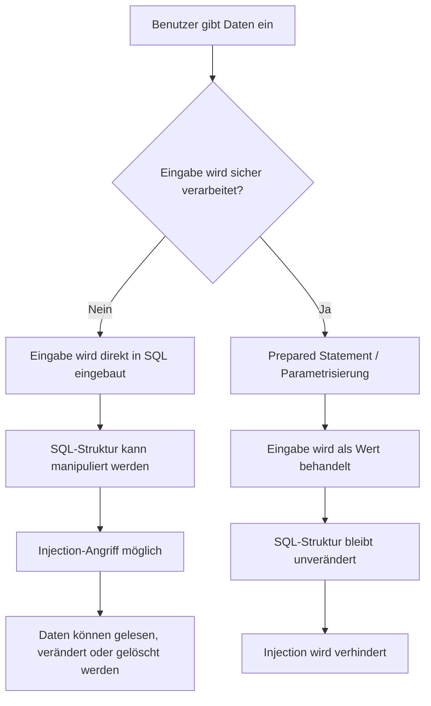

# Datenbank Injection

## Kurzüberblick / Definition

**Datenbank Injection** bezeichnet eine Sicherheitslücke, bei der Angreifer manipulierte Eingaben in eine Datenbankabfrage einschleusen, sodass diese Eingaben nicht als normale Daten, sondern als Teil der Abfrage interpretiert werden.

Die bekannteste Form ist die **SQL Injection**. Sie entsteht häufig, wenn Benutzereingaben ungeprüft oder falsch verarbeitet direkt in SQL-Abfragen eingebaut werden.

Ein erfolgreicher Injection-Angriff kann dazu führen, dass Angreifer:

- vertrauliche Daten auslesen,
- Daten verändern oder löschen,
- Authentifizierungen umgehen,
- Datenbankstrukturen analysieren,
- oder im schlimmsten Fall weitere Systeme kompromittieren.

Der zentrale Schutz besteht darin, Benutzereingaben strikt von ausführbarem Abfragecode zu trennen, zum Beispiel durch **Prepared Statements** beziehungsweise **parametrisierte Abfragen**.

---

## Kernerklärung

### Grundidee einer Injection

Eine Datenbankabfrage besteht normalerweise aus zwei Bestandteilen:

| Bestandteil | Bedeutung |
|---|---|
| Abfragecode | Die feste SQL-Struktur, zum Beispiel `SELECT`, `FROM`, `WHERE` |
| Daten | Werte, die von Benutzern oder anderen Quellen stammen |

Eine Injection entsteht, wenn diese Trennung aufgehoben wird.

Beispielhaft problematisch ist folgende Denkweise:

```sql
SELECT * FROM users WHERE username = '<Benutzereingabe>';
```

Wenn die Benutzereingabe direkt in den SQL-Text eingefügt wird, kann ein Angreifer versuchen, nicht nur einen Wert, sondern zusätzlichen SQL-Code einzuschleusen.

---

## Beispiel: Unsichere SQL-Abfrage

Angenommen, eine Anwendung prüft einen Login mit folgender Abfrage:

```sql
SELECT * FROM users
WHERE username = 'admin'
AND password = 'geheim';
```

Wenn Benutzername und Passwort direkt aus Formularfeldern in die Abfrage eingesetzt werden, könnte ein Angreifer als Benutzernamen Folgendes eingeben:

```sql
admin' --
```

Dadurch kann aus der ursprünglichen Abfrage sinngemäß werden:

```sql
SELECT * FROM users
WHERE username = 'admin' --'
AND password = 'irgendeinPasswort';
```

Das Zeichen `--` leitet in vielen SQL-Dialekten einen Kommentar ein. Dadurch wird der Rest der Abfrage ignoriert. Die Passwortprüfung kann dadurch wirkungslos werden.

> Wichtig: Die genaue Wirkung hängt vom verwendeten Datenbanksystem, SQL-Dialekt und Anwendungscode ab. Das Prinzip bleibt jedoch gleich: Benutzereingaben verändern die Struktur der Abfrage.

---

## Warum ist das gefährlich?

SQL Injection ist gefährlich, weil die Datenbank die manipulierte Eingabe nicht mehr als reinen Wert behandelt, sondern als Teil des SQL-Befehls.

Mögliche Folgen sind:

| Angriffsziel | Mögliche Auswirkung |
|---|---|
| Authentifizierung umgehen | Login ohne gültiges Passwort |
| Daten auslesen | Zugriff auf Benutzerkonten, Passwörter, Kundendaten |
| Daten verändern | Manipulation von Preisen, Rollen oder Bestellungen |
| Daten löschen | Löschen einzelner Datensätze oder ganzer Tabellen |
| Rechte ausnutzen | Missbrauch überprivilegierter Datenbankkonten |
| System analysieren | Auslesen von Tabellenstrukturen und Fehlermeldungen |

---

## Typische Arten von Injection-Angriffen

### SQL Injection

Bei einer **SQL Injection** wird SQL-Code in eine relationale Datenbankabfrage eingeschleust.

Betroffene Systeme können zum Beispiel sein:

- MySQL
- PostgreSQL
- MariaDB
- SQLite
- Microsoft SQL Server
- Oracle Database

Typische Angriffsstellen sind:

- Login-Formulare
- Suchfelder
- URL-Parameter
- Filter- und Sortierfunktionen
- API-Endpunkte
- Formularfelder

---

### Blind SQL Injection

Bei einer **Blind SQL Injection** bekommt der Angreifer keine direkten Daten oder detaillierten Fehlermeldungen zurück. Stattdessen beobachtet er indirekte Reaktionen der Anwendung.

Beispiele:

| Technik | Idee |
|---|---|
| Boolean-based Blind SQL Injection | Die Anwendung reagiert unterschiedlich auf wahre oder falsche Bedingungen |
| Time-based Blind SQL Injection | Die Datenbank wird durch bestimmte Bedingungen künstlich verzögert |

Beispielhafte Idee:

```sql
SELECT * FROM users WHERE id = 1 AND 1 = 1;
```

Wenn die Anwendung anders reagiert als bei:

```sql
SELECT * FROM users WHERE id = 1 AND 1 = 2;
```

kann ein Angreifer daraus Informationen ableiten.

---

### NoSQL Injection

Bei einer **NoSQL Injection** werden Abfragen gegen NoSQL-Datenbanken manipuliert, zum Beispiel gegen MongoDB.

Hier geht es nicht um klassischen SQL-Code, sondern um manipulierte Abfrageobjekte oder Operatoren.

Beispielhafte problematische Logik in Pseudocode:

```javascript
db.users.find({
  username: userInput,
  password: passwordInput
});
```

Wenn Eingaben nicht korrekt geprüft werden, könnten Angreifer versuchen, Operatoren oder spezielle Strukturen einzuschleusen.

---

### LDAP Injection

Bei einer **LDAP Injection** werden Abfragen gegen LDAP-Verzeichnisse manipuliert.

LDAP wird häufig für Benutzer- und Rechteverwaltung eingesetzt, zum Beispiel in Unternehmensnetzwerken.

Beispielhafte LDAP-Abfrage:

```text
(&(uid=<Benutzereingabe>)(userPassword=<Passwort>))
```

Wenn Benutzereingaben unkontrolliert eingefügt werden, kann auch hier die Suchbedingung manipuliert werden.

---

## Hauptursache: Vermischung von Code und Daten

Das Kernproblem bei Injection-Angriffen ist fast immer die Vermischung von:

1. festem Abfragecode,
2. dynamischen Benutzereingaben.

Unsicheres Prinzip:

```java
String sql = "SELECT * FROM users WHERE username = '" + username + "'";
```

Hier wird die SQL-Abfrage durch String-Verkettung zusammengesetzt. Dadurch kann die Eingabe die Struktur der Abfrage verändern.

Sicheres Prinzip:

```java
String sql = "SELECT * FROM users WHERE username = ?";
```

Der Platzhalter `?` wird später mit einem Wert befüllt. Die Datenbank behandelt diesen Wert dann nicht als SQL-Code.

---

## Schutzmaßnahme 1: Prepared Statements

**Prepared Statements** sind die wichtigste Schutzmaßnahme gegen SQL Injection.

Dabei wird die SQL-Abfrage zunächst mit Platzhaltern vorbereitet. Die konkreten Werte werden separat übergeben.

Beispiel in Java mit JDBC:

```java
String sql = "SELECT * FROM users WHERE username = ? AND password = ?";

PreparedStatement statement = connection.prepareStatement(sql);
statement.setString(1, username);
statement.setString(2, password);

ResultSet result = statement.executeQuery();
```

Vorteil:

- Die SQL-Struktur bleibt fest.
- Benutzereingaben werden als Werte behandelt.
- Eingaben können die SQL-Logik nicht verändern.
- Sonderzeichen müssen nicht manuell zusammengesetzt werden.

---

## Schutzmaßnahme 2: Keine unsichere String-Verkettung

Unsicher:

```java
String sql = "SELECT * FROM products WHERE name = '" + searchTerm + "'";
```

Sicherer:

```java
String sql = "SELECT * FROM products WHERE name = ?";
PreparedStatement statement = connection.prepareStatement(sql);
statement.setString(1, searchTerm);
```

String-Verkettung bei SQL-Abfragen ist besonders gefährlich, wenn Werte aus folgenden Quellen stammen:

- Formularen,
- URLs,
- Cookies,
- HTTP-Headern,
- JSON-Requests,
- CSV-Dateien,
- externen APIs,
- importierten Dateien.

Grundregel:

> Alle externen Daten sind zunächst nicht vertrauenswürdig.

---

## Schutzmaßnahme 3: Eingabevalidierung

Eingabevalidierung bedeutet, dass geprüft wird, ob eine Eingabe fachlich und technisch erlaubt ist.

Beispiele:

| Eingabe | Sinnvolle Validierung |
|---|---|
| Benutzer-ID | Nur positive Ganzzahlen |
| E-Mail-Adresse | Gültiges E-Mail-Format |
| Postleitzahl | Nur erlaubtes Format |
| Sortierreihenfolge | Nur `ASC` oder `DESC` |
| Kategorie-ID | Nur vorhandene Kategorie-IDs |

Validierung ist wichtig, ersetzt aber keine Prepared Statements.

Die Reihenfolge sollte sein:

1. Eingaben validieren.
2. Prepared Statements verwenden.
3. Rechte der Datenbankverbindung begrenzen.
4. Fehlerausgaben kontrollieren.

---

## Schutzmaßnahme 4: Least Privilege

**Least Privilege** bedeutet, dass ein Benutzerkonto nur die Rechte besitzt, die es wirklich benötigt.

Eine Webanwendung sollte sich nicht mit einem Datenbankkonto verbinden, das volle Administratorrechte besitzt.

Beispiel:

| Anwendungsteil | Benötigte Rechte |
|---|---|
| Produktanzeige | `SELECT` auf Produkttabelle |
| Registrierung | `INSERT` auf Benutzertabelle |
| Profilbearbeitung | `SELECT` und `UPDATE` auf eigene Profildaten |
| Normale Webanwendung | Kein `DROP TABLE`, kein globales Adminrecht |

Wenn eine Injection trotz Schutzmaßnahmen gelingt, begrenzt Least Privilege den möglichen Schaden.

---

## Schutzmaßnahme 5: Sichere Fehlerbehandlung

Detaillierte Datenbankfehler sollten nicht an Endbenutzer ausgegeben werden.

Unsichere Fehlermeldung:

```text
SQL syntax error near 'users WHERE id = ...'
```

Solche Meldungen können Angreifern helfen, Tabellen, Spaltennamen oder SQL-Dialekte zu erkennen.

Besser:

```text
Es ist ein Fehler aufgetreten. Bitte versuchen Sie es später erneut.
```

Intern sollte der Fehler trotzdem protokolliert werden, damit Entwickler oder Administratoren ihn analysieren können.

---

## Schutzmaßnahme 6: Logging und Monitoring

**Logging** und **Monitoring** helfen, Angriffe frühzeitig zu erkennen.

Verdächtige Hinweise können sein:

- ungewöhnlich viele fehlerhafte Login-Versuche,
- SQL-Sonderzeichen in Eingabefeldern,
- viele Requests mit ähnlichen Parametern,
- ungewöhnliche Datenbankfehler,
- unerwartete Verzögerungen,
- Zugriffe auf nicht vorgesehene Endpunkte.

Wichtig ist, dass Logs keine sensiblen Daten wie Passwörter im Klartext enthalten.

---

## Schutzmaßnahme 7: ORM-Frameworks bewusst verwenden

ORM steht für **Object-Relational Mapping**. ORM-Frameworks wie Hibernate, JPA, Entity Framework oder Sequelize können helfen, SQL-Abfragen sicherer zu erstellen.

Beispielhafte Vorteile:

- weniger direkte SQL-String-Verkettung,
- automatische Parametrisierung vieler Abfragen,
- klarere Trennung von Objekten und Datenbankzugriff.

Aber:

> Ein ORM schützt nicht automatisch vor jeder Injection.

Auch mit ORM können unsichere dynamische Abfragen entstehen, wenn Entwickler Benutzereingaben direkt in Query-Strings einbauen.

Unsicheres Prinzip:

```java
String query = "FROM User WHERE name = '" + username + "'";
```

Sicheres Prinzip:

```java
String query = "FROM User WHERE name = :username";
```

---

## Schutzmaßnahme 8: Dynamisches SQL vermeiden oder absichern

Dynamisches SQL bedeutet, dass SQL-Abfragen zur Laufzeit zusammengesetzt werden.

Das ist manchmal notwendig, zum Beispiel bei:

- dynamischen Filtern,
- optionalen Suchparametern,
- Sortierungen,
- Reportgeneratoren.

Problematisch sind besonders dynamische Spaltennamen, Tabellennamen oder Sortierrichtungen, weil diese oft nicht direkt als Parameter gesetzt werden können.

Beispiel für eine sichere Auswahl per Allowlist:

```java
Set<String> allowedSortColumns = Set.of("name", "price", "created_at");

if (!allowedSortColumns.contains(sortColumn)) {
    throw new IllegalArgumentException("Ungültige Sortierspalte");
}

String sql = "SELECT * FROM products ORDER BY " + sortColumn;
```

Hier wird nicht beliebiger Benutzertext übernommen, sondern nur ein bekannter erlaubter Wert.

---

## Schutzmaßnahme 9: Updates, Tests und Sicherheitsprozesse

Technische Schutzmaßnahmen sollten durch organisatorische Maßnahmen ergänzt werden.

Dazu gehören:

| Maßnahme | Zweck |
|---|---|
| Sicherheitsupdates | Schließen bekannter Schwachstellen |
| Code Reviews | Unsichere Abfragen früh erkennen |
| Penetrationstests | Schwachstellen realistisch prüfen |
| Dependency-Checks | Unsichere Bibliotheken erkennen |
| Schulungen | Sicherheitsbewusstsein bei Entwicklern stärken |
| Sicherheitsrichtlinien | Einheitliche Standards im Entwicklungsprozess schaffen |

Wichtig ist, Sicherheit nicht erst am Ende eines Projekts zu prüfen, sondern während der gesamten Entwicklung.

---

## Rolle einer Web Application Firewall

Eine **Web Application Firewall** kann verdächtige Requests erkennen und blockieren.

Sie kann zum Beispiel helfen gegen:

- bekannte Angriffsmuster,
- automatisierte Angriffe,
- auffällige SQL-Zeichenfolgen,
- ungewöhnliche Request-Strukturen.

Eine WAF ist aber nur eine zusätzliche Schutzschicht.

> Eine WAF ersetzt keine sicheren Datenbankabfragen.

Die Anwendung selbst muss weiterhin korrekt mit Eingaben umgehen.

---

## Ablauf einer SQL Injection im Überblick



---

## Vergleich: Unsicher vs. sicher

| Unsicher | Sicher |
|---|---|
| SQL durch String-Verkettung bauen | Prepared Statements verwenden |
| Eingaben direkt übernehmen | Eingaben validieren |
| Datenbankkonto mit Adminrechten nutzen | Least Privilege verwenden |
| Datenbankfehler anzeigen | Generische Fehlermeldungen ausgeben |
| Logs ignorieren | Logging und Monitoring einrichten |
| Sicherheit erst am Ende prüfen | Sicherheit in den Entwicklungsprozess integrieren |

---

## Praktisches Beispiel: Login-Prüfung

### Unsichere Variante

```java
String sql = "SELECT * FROM users WHERE username = '" 
           + username 
           + "' AND password = '" 
           + password 
           + "'";

Statement statement = connection.createStatement();
ResultSet result = statement.executeQuery(sql);
```

Problem:

- Die Eingaben werden direkt in den SQL-Text eingesetzt.
- Sonderzeichen können die Abfrage verändern.
- Angreifer können versuchen, die Passwortprüfung zu umgehen.

---

### Sichere Variante

```java
String sql = "SELECT * FROM users WHERE username = ? AND password = ?";

PreparedStatement statement = connection.prepareStatement(sql);
statement.setString(1, username);
statement.setString(2, password);

ResultSet result = statement.executeQuery();
```

Vorteil:

- Die Struktur der SQL-Abfrage ist fest.
- `username` und `password` werden als Werte behandelt.
- Eingaben können nicht als SQL-Code ausgeführt werden.

Hinweis:

In echten Anwendungen sollten Passwörter niemals im Klartext gespeichert oder direkt verglichen werden. Stattdessen verwendet man sichere Passwort-Hashing-Verfahren mit Salt, zum Beispiel bcrypt, Argon2 oder PBKDF2.

---

## Examensrelevanz

Für die FIAE-Prüfung ist Datenbank Injection besonders relevant im Zusammenhang mit:

- Datenbanksicherheit,
- Webanwendungen,
- SQL-Grundlagen,
- Benutzereingaben,
- Prepared Statements,
- Datenschutz,
- Authentifizierung,
- sichere Softwareentwicklung.

Typische Prüfungsfragen könnten sein:

| Frage | Erwartete Kernaussage |
|---|---|
| Was ist SQL Injection? | Einschleusen von SQL-Code über manipulierte Eingaben |
| Warum ist String-Verkettung gefährlich? | Eingaben können Teil der SQL-Struktur werden |
| Wie schützt man sich wirksam? | Prepared Statements und parametrisierte Abfragen |
| Reicht Eingabevalidierung allein aus? | Nein, sie ergänzt Prepared Statements nur |
| Was bedeutet Least Privilege? | Nur notwendige Datenbankrechte vergeben |
| Warum sind Fehlermeldungen kritisch? | Sie können interne Informationen preisgeben |
| Schützt ein ORM automatisch? | Nicht vollständig, unsichere dynamische Queries bleiben möglich |

---

## Häufige Fehler und Klarstellungen

### Fehler 1: „Validierung allein reicht aus“

Falsch. Validierung ist wichtig, aber kein Ersatz für Prepared Statements.

Eine Eingabe kann formal gültig aussehen und trotzdem gefährlich sein, wenn sie unsicher in eine Abfrage eingebaut wird.

---

### Fehler 2: „SQL Injection betrifft nur Login-Formulare“

Falsch. Jede Eingabe, die in eine Datenbankabfrage einfließt, kann betroffen sein.

Dazu gehören auch:

- Suchfelder,
- Filter,
- Sortierungen,
- API-Parameter,
- Importdateien,
- Cookies,
- HTTP-Header.

---

### Fehler 3: „ORMs verhindern SQL Injection immer“

Falsch. ORMs reduzieren das Risiko, aber sie verhindern Injection nicht automatisch.

Unsicherer Query-Code kann auch mit ORM entstehen, besonders bei dynamisch zusammengesetzten Abfragen.

---

### Fehler 4: „Eine WAF löst das Problem“

Falsch. Eine Web Application Firewall ist eine zusätzliche Schutzschicht, ersetzt aber keine sichere Programmierung.

Die eigentliche Abwehr muss im Anwendungscode stattfinden.

---

### Fehler 5: „Nur SQL-Datenbanken sind betroffen“

Falsch. Auch NoSQL-, LDAP- oder andere Abfragesysteme können durch Injection-Angriffe betroffen sein.

Das Grundproblem ist immer ähnlich:

> Nicht vertrauenswürdige Eingaben beeinflussen die Struktur einer Abfrage.

---

## Merksätze

- Benutzereingaben sind niemals automatisch vertrauenswürdig.
- SQL-Code und Daten müssen strikt getrennt werden.
- Prepared Statements sind die wichtigste Schutzmaßnahme gegen SQL Injection.
- Validierung ergänzt Prepared Statements, ersetzt sie aber nicht.
- Datenbankrechte sollten immer nach dem Least-Privilege-Prinzip vergeben werden.
- Fehlermeldungen dürfen keine internen Datenbankdetails offenlegen.
- Sicherheit muss während der Entwicklung, beim Testen und im Betrieb berücksichtigt werden.