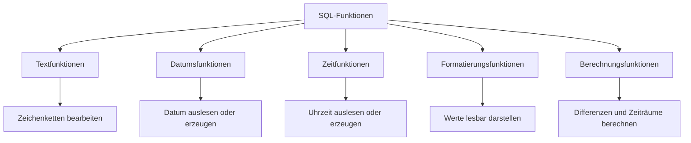

# Text-, Time- und Date-Funktionen in SQL

### Kurzüberblick / Definition

**Text-, Datums- und Zeitfunktionen** sind SQL-Funktionen, mit denen Zeichenketten, Datumswerte und Zeitangaben verarbeitet, formatiert, berechnet oder verglichen werden können.

Sie werden häufig verwendet, um:

- Texte zu verändern oder auszuwerten,
- Datums- und Zeitwerte auszugeben,
- Zeiträume zu berechnen,
- einzelne Bestandteile eines Datums zu extrahieren,
- Werte für Berichte oder Ausgaben zu formatieren,
- aktuelle Zeitpunkte in Datenbankabfragen zu verwenden.

Wichtig ist, dass SQL-Funktionen je nach Datenbanksystem unterschiedlich heißen oder sich leicht unterschiedlich verhalten können.

Beispiele für Datenbanksysteme:

- MySQL / MariaDB
- PostgreSQL
- Microsoft SQL Server
- Oracle Database
- SQLite

Für die Prüfung ist besonders wichtig, das Grundprinzip zu verstehen und typische Funktionen einordnen zu können.

---

### Grundidee: Funktionen in SQL

Eine SQL-Funktion nimmt einen oder mehrere Werte entgegen, verarbeitet diese und gibt ein Ergebnis zurück.

Allgemeine Form:

```sql
FUNKTION(argument1, argument2, ...)
```

Beispiel:

```sql
YEAR('2026-05-11')
```

Diese Funktion extrahiert aus einem Datum das Jahr.

Ergebnis:

```text
2026
```

SQL-Funktionen können unter anderem in folgenden Teilen einer Abfrage verwendet werden:

```sql
SELECT
WHERE
ORDER BY
GROUP BY
HAVING
```

Beispiel:

```sql
SELECT
    name,
    YEAR(birthdate) AS birth_year
FROM customers;
```

---

### Wichtige Kategorien



---

## Textfunktionen

### Zweck von Textfunktionen

**Textfunktionen** dienen dazu, Zeichenketten zu verarbeiten.

Typische Aufgaben sind:

- Texte verbinden,
- Textlängen bestimmen,
- Groß- und Kleinschreibung ändern,
- Teilstrings extrahieren,
- Leerzeichen entfernen,
- Inhalte ersetzen.

---

### Häufige Textfunktionen

| Funktion | Zweck | Beispiel |
|---|---|---|
| `CONCAT()` | Verbindet mehrere Texte | `CONCAT(firstname, ' ', lastname)` |
| `LENGTH()` / `LEN()` | Gibt die Länge eines Textes zurück | `LENGTH(name)` |
| `LOWER()` | Wandelt Text in Kleinbuchstaben um | `LOWER(email)` |
| `UPPER()` | Wandelt Text in Großbuchstaben um | `UPPER(lastname)` |
| `SUBSTRING()` | Gibt einen Teil eines Textes zurück | `SUBSTRING(name, 1, 3)` |
| `TRIM()` | Entfernt Leerzeichen am Anfang und Ende | `TRIM(username)` |
| `REPLACE()` | Ersetzt Textbestandteile | `REPLACE(text, 'alt', 'neu')` |

Hinweis:

Die genaue Schreibweise kann je nach Datenbanksystem abweichen. In SQL Server heißt die Längenfunktion beispielsweise häufig `LEN()`, während in MySQL häufig `LENGTH()` verwendet wird.

---

### Beispiel: Texte verbinden

```sql
SELECT
    CONCAT(firstname, ' ', lastname) AS full_name
FROM employees;
```

Ergebnis:

| firstname | lastname | full_name |
|---|---|---|
| Max | Müller | Max Müller |
| Anna | Schneider | Anna Schneider |

---

### Beispiel: Groß- und Kleinschreibung vereinheitlichen

```sql
SELECT
    LOWER(email) AS normalized_email
FROM users;
```

Das ist nützlich, wenn E-Mail-Adressen einheitlich gespeichert oder verglichen werden sollen.

---

## Datums- und Zeitfunktionen

### Zweck von Datums- und Zeitfunktionen

Datums- und Zeitfunktionen dienen dazu, mit zeitbezogenen Werten zu arbeiten.

Typische Aufgaben sind:

- aktuelles Datum ermitteln,
- aktuelle Uhrzeit ermitteln,
- Datum und Uhrzeit gemeinsam ermitteln,
- Teile eines Datums extrahieren,
- Zeiträume berechnen,
- Datumswerte addieren oder subtrahieren,
- Datumswerte formatieren.

---

### Aktuelles Datum und aktuelle Uhrzeit

Je nach Datenbanksystem gibt es unterschiedliche Funktionen für aktuelle Zeitwerte.

| Funktion | Bedeutung | Häufiges Datenbanksystem |
|---|---|---|
| `CURRENT_DATE` | Aktuelles Datum | Standard SQL, MySQL, PostgreSQL, Oracle |
| `CURRENT_TIME` | Aktuelle Uhrzeit | Standard SQL, MySQL, PostgreSQL |
| `CURRENT_TIMESTAMP` | Aktuelles Datum mit Uhrzeit | Standard SQL, viele Systeme |
| `NOW()` | Aktuelles Datum mit Uhrzeit | MySQL, PostgreSQL |
| `GETDATE()` | Aktuelles Datum mit Uhrzeit | SQL Server |
| `SYSDATE` / `SYSDATE()` | Systemdatum und Uhrzeit | Oracle, MySQL |

Beispiel:

```sql
SELECT CURRENT_DATE;
```

Mögliches Ergebnis:

```text
2026-05-11
```

Beispiel:

```sql
SELECT CURRENT_TIMESTAMP;
```

Mögliches Ergebnis:

```text
2026-05-11 14:30:25
```

---

### DATE, TIME und NOW

Die Begriffe `DATE`, `TIME` und `NOW` werden je nach Datenbanksystem unterschiedlich verwendet.

| Funktion / Begriff | Typische Bedeutung |
|---|---|
| `DATE` | Datentyp oder Funktion zur Extraktion des Datumsanteils |
| `TIME` | Datentyp oder Funktion zur Extraktion des Uhrzeitanteils |
| `NOW()` | Gibt aktuellen Zeitpunkt mit Datum und Uhrzeit zurück |

Beispiel in MySQL:

```sql
SELECT DATE(NOW()) AS current_date_part;
```

Ergebnis:

```text
2026-05-11
```

Beispiel:

```sql
SELECT TIME(NOW()) AS current_time_part;
```

Ergebnis:

```text
14:30:25
```

Wichtig:

`DATE` und `TIME` sind nicht in jedem SQL-Dialekt einfache Funktionen für „aktuelles Datum“ oder „aktuelle Uhrzeit“. Häufig sind sie auch Datentypen.

Für das aktuelle Datum ist `CURRENT_DATE` meist klarer.

Für die aktuelle Uhrzeit ist `CURRENT_TIME` meist klarer.

---

## Bestandteile eines Datums extrahieren

### DAY, MONTH und YEAR

Mit Funktionen wie `DAY`, `MONTH` und `YEAR` können einzelne Bestandteile eines Datums ausgelesen werden.

```sql
SELECT
    DAY(order_date) AS order_day,
    MONTH(order_date) AS order_month,
    YEAR(order_date) AS order_year
FROM orders;
```

Beispiel:

| order_date | order_day | order_month | order_year |
|---|---:|---:|---:|
| 2026-05-11 | 11 | 5 | 2026 |
| 2026-12-24 | 24 | 12 | 2026 |

---

### DATEPART

`DATEPART` wird besonders in SQL Server verwendet. Die Funktion gibt einen bestimmten Bestandteil eines Datums zurück.

Beispiel:

```sql
SELECT DATEPART(year, order_date) AS order_year
FROM orders;
```

Weitere mögliche Bestandteile:

| Bestandteil | Bedeutung |
|---|---|
| `year` | Jahr |
| `month` | Monat |
| `day` | Tag |
| `hour` | Stunde |
| `minute` | Minute |
| `second` | Sekunde |

Beispiel:

```sql
SELECT
    DATEPART(year, created_at) AS year_part,
    DATEPART(month, created_at) AS month_part,
    DATEPART(day, created_at) AS day_part
FROM log_entries;
```

---

### EXTRACT als SQL-nahe Alternative

In mehreren SQL-Dialekten gibt es auch `EXTRACT`.

Beispiel:

```sql
SELECT EXTRACT(YEAR FROM order_date) AS order_year
FROM orders;
```

`EXTRACT` ist besonders gut lesbar, weil klar angegeben wird, welcher Teil aus welchem Datum entnommen wird.

---

## Datumsdifferenzen berechnen

### DATEDIFF

`DATEDIFF` berechnet die Differenz zwischen zwei Datums- oder Zeitwerten.

Die genaue Syntax hängt vom Datenbanksystem ab.

#### SQL Server

```sql
SELECT DATEDIFF(day, start_date, end_date) AS days_between
FROM projects;
```

Hier wird die Differenz in Tagen berechnet.

#### MySQL

```sql
SELECT DATEDIFF(end_date, start_date) AS days_between
FROM projects;
```

In MySQL liefert `DATEDIFF` die Differenz in Tagen.

Beispiel:

| start_date | end_date | days_between |
|---|---|---:|
| 2026-05-01 | 2026-05-11 | 10 |

---

### Typische Anwendungsfälle für DATEDIFF

| Anwendungsfall | Beispiel |
|---|---|
| Alter berechnen | Differenz zwischen Geburtsdatum und aktuellem Datum |
| Laufzeit berechnen | Differenz zwischen Start- und Enddatum |
| Zahlungsziel prüfen | Differenz zwischen Rechnungsdatum und heutigem Datum |
| Fristen überwachen | Offene Aufgaben nach Tagen sortieren |
| Logdaten analysieren | Dauer zwischen zwei Ereignissen bestimmen |

---

## Datumswerte verändern

### DATEADD

`DATEADD` fügt einem Datum eine bestimmte Anzahl von Zeiteinheiten hinzu oder zieht sie ab.

Diese Funktion ist besonders typisch für SQL Server.

Beispiel:

```sql
SELECT DATEADD(day, 7, order_date) AS delivery_date
FROM orders;
```

Bedeutung:

Zum Bestelldatum werden 7 Tage addiert.

Beispiel:

| order_date | delivery_date |
|---|---|
| 2026-05-11 | 2026-05-18 |

Ein negativer Wert zieht Zeit ab:

```sql
SELECT DATEADD(month, -1, CURRENT_DATE) AS one_month_ago;
```

---

### DATE_ADD in MySQL

In MySQL wird häufig `DATE_ADD` verwendet.

```sql
SELECT DATE_ADD(order_date, INTERVAL 7 DAY) AS delivery_date
FROM orders;
```

Weitere Beispiele:

```sql
SELECT DATE_ADD(CURRENT_DATE, INTERVAL 1 MONTH);
```

```sql
SELECT DATE_ADD(CURRENT_TIMESTAMP, INTERVAL 2 HOUR);
```

---

### Datumsberechnung im Vergleich

| Aufgabe | SQL Server | MySQL |
|---|---|---|
| 7 Tage addieren | `DATEADD(day, 7, datum)` | `DATE_ADD(datum, INTERVAL 7 DAY)` |
| 1 Monat addieren | `DATEADD(month, 1, datum)` | `DATE_ADD(datum, INTERVAL 1 MONTH)` |
| 2 Stunden addieren | `DATEADD(hour, 2, zeitpunkt)` | `DATE_ADD(zeitpunkt, INTERVAL 2 HOUR)` |
| Tagesdifferenz berechnen | `DATEDIFF(day, start, ende)` | `DATEDIFF(ende, start)` |

---

## Zeitstempel-Funktionen

### TIMESTAMPDIFF

`TIMESTAMPDIFF` wird zum Beispiel in MySQL verwendet, um die Differenz zwischen zwei Zeitpunkten in einer bestimmten Einheit zu berechnen.

```sql
SELECT TIMESTAMPDIFF(HOUR, start_time, end_time) AS hours_between
FROM work_sessions;
```

Mögliche Einheiten:

| Einheit | Bedeutung |
|---|---|
| `SECOND` | Sekunden |
| `MINUTE` | Minuten |
| `HOUR` | Stunden |
| `DAY` | Tage |
| `MONTH` | Monate |
| `YEAR` | Jahre |

Beispiel:

```sql
SELECT TIMESTAMPDIFF(MINUTE, login_time, logout_time) AS session_minutes
FROM user_sessions;
```

---

### TIMESTAMPADD

`TIMESTAMPADD` fügt einem Zeitstempel eine bestimmte Anzahl von Zeiteinheiten hinzu.

```sql
SELECT TIMESTAMPADD(MINUTE, 30, start_time) AS end_time
FROM appointments;
```

Beispiel:

| start_time | end_time |
|---|---|
| 2026-05-11 10:00:00 | 2026-05-11 10:30:00 |

---

## Formatierungsfunktionen

### FORMAT

`FORMAT` wird verwendet, um Werte in einem bestimmten Format darzustellen. Die genaue Syntax ist stark vom Datenbanksystem abhängig.

Beispiel in SQL Server:

```sql
SELECT FORMAT(order_date, 'dd.MM.yyyy') AS formatted_date
FROM orders;
```

Mögliches Ergebnis:

```text
11.05.2026
```

Beispiel in MySQL:

```sql
SELECT DATE_FORMAT(order_date, '%d.%m.%Y') AS formatted_date
FROM orders;
```

Mögliches Ergebnis:

```text
11.05.2026
```

---

### FORMAT ist nicht überall gleich

| Datenbanksystem | Typische Funktion |
|---|---|
| SQL Server | `FORMAT(datum, 'dd.MM.yyyy')` |
| MySQL | `DATE_FORMAT(datum, '%d.%m.%Y')` |
| PostgreSQL | `TO_CHAR(datum, 'DD.MM.YYYY')` |
| Oracle | `TO_CHAR(datum, 'DD.MM.YYYY')` |

Wichtig:

Formatierungsfunktionen sind oft eher für Ausgaben und Berichte gedacht. Für Berechnungen und Vergleiche sollte möglichst mit echten Datums- oder Zeitwerten gearbeitet werden, nicht mit formatierten Texten.

---

## Validierung von Datumswerten

### ISDATE

`ISDATE` wird besonders in SQL Server verwendet. Die Funktion prüft, ob ein Ausdruck als gültiges Datum interpretiert werden kann.

Beispiel:

```sql
SELECT ISDATE('2026-05-11') AS is_valid_date;
```

Mögliches Ergebnis:

```text
1
```

Beispiel:

```sql
SELECT ISDATE('kein datum') AS is_valid_date;
```

Mögliches Ergebnis:

```text
0
```

Wichtig:

`ISDATE` ist nicht in jedem Datenbanksystem vorhanden. Außerdem kann das Ergebnis von Spracheinstellungen und Datumsformaten abhängen.

Beispielproblem:

```text
01/02/2026
```

Je nach Einstellung kann das als 1. Februar oder 2. Januar interpretiert werden.

---

## TEXT-Funktion: Wichtige Klarstellung

Die Funktion `TEXT()` ist keine allgemeine Standard-SQL-Funktion zur Datumsformatierung.

Der Begriff `TEXT` kann je nach Kontext unterschiedliche Bedeutungen haben:

| Kontext | Bedeutung |
|---|---|
| SQL allgemein | Häufig ein Datentyp für längere Zeichenketten |
| Tabellenentwurf | Spaltentyp für Textinhalte |
| Tabellenkalkulation | Funktion zur Formatierung von Werten als Text |
| Einzelne Datenbanksysteme | Möglicherweise spezielle oder abweichende Bedeutung |

In SQL sollte man für Formatierung je nach Datenbanksystem eher Funktionen wie diese verwenden:

| Zweck | Typische Funktion |
|---|---|
| Datum formatieren in SQL Server | `FORMAT()` |
| Datum formatieren in MySQL | `DATE_FORMAT()` |
| Datum formatieren in PostgreSQL | `TO_CHAR()` |
| Datum formatieren in Oracle | `TO_CHAR()` |

---

## Typische praktische Beispiele

### Beispiel 1: Bestellungen mit Jahr und Monat ausgeben

```sql
SELECT
    order_id,
    order_date,
    YEAR(order_date) AS order_year,
    MONTH(order_date) AS order_month
FROM orders;
```

Nutzen:

Man kann Bestellungen nach Jahr oder Monat gruppieren, filtern oder auswerten.

---

### Beispiel 2: Bestellungen aus dem aktuellen Jahr finden

```sql
SELECT
    order_id,
    order_date
FROM orders
WHERE YEAR(order_date) = YEAR(CURRENT_DATE);
```

Hinweis:

Diese Schreibweise ist leicht verständlich. In großen Tabellen kann es aber performanter sein, mit Datumsbereichen zu arbeiten, damit ein Index auf `order_date` besser genutzt werden kann.

Alternative:

```sql
SELECT
    order_id,
    order_date
FROM orders
WHERE order_date >= '2026-01-01'
  AND order_date < '2027-01-01';
```

---

### Beispiel 3: Fälligkeit einer Rechnung berechnen

```sql
SELECT
    invoice_id,
    invoice_date,
    DATE_ADD(invoice_date, INTERVAL 14 DAY) AS due_date
FROM invoices;
```

Bedeutung:

Das Fälligkeitsdatum liegt 14 Tage nach dem Rechnungsdatum.

---

### Beispiel 4: Überfällige Rechnungen finden

```sql
SELECT
    invoice_id,
    invoice_date,
    due_date
FROM invoices
WHERE due_date < CURRENT_DATE;
```

Bedeutung:

Alle Rechnungen, deren Fälligkeitsdatum vor dem aktuellen Datum liegt, sind überfällig.

---

### Beispiel 5: Dauer einer Sitzung berechnen

```sql
SELECT
    session_id,
    login_time,
    logout_time,
    TIMESTAMPDIFF(MINUTE, login_time, logout_time) AS duration_minutes
FROM user_sessions;
```

Bedeutung:

Die Sitzungsdauer wird in Minuten berechnet.

---

## Übersicht wichtiger Funktionen

### Aktuelle Datums- und Zeitwerte

| Funktion | Bedeutung | Hinweis |
|---|---|---|
| `CURRENT_DATE` | Aktuelles Datum | Standardnah |
| `CURRENT_TIME` | Aktuelle Uhrzeit | Standardnah |
| `CURRENT_TIMESTAMP` | Aktueller Zeitpunkt mit Datum und Uhrzeit | Standardnah |
| `NOW()` | Aktueller Zeitpunkt | MySQL / PostgreSQL |
| `GETDATE()` | Aktueller Zeitpunkt | SQL Server |
| `SYSDATE` / `SYSDATE()` | Systemdatum und Uhrzeit | Oracle / MySQL |

---

### Datumsteile extrahieren

| Funktion | Bedeutung |
|---|---|
| `DAY(datum)` | Tag aus Datum extrahieren |
| `MONTH(datum)` | Monat aus Datum extrahieren |
| `YEAR(datum)` | Jahr aus Datum extrahieren |
| `DATEPART(teil, datum)` | Bestimmten Datumsteil extrahieren |
| `EXTRACT(teil FROM datum)` | Standardnahe Extraktion eines Datumsteils |

---

### Datumsberechnung

| Funktion | Bedeutung |
|---|---|
| `DATEDIFF()` | Differenz zwischen zwei Datumswerten |
| `DATEADD()` | Addiert eine Zeiteinheit zu einem Datum |
| `DATE_ADD()` | MySQL-Variante zum Addieren von Intervallen |
| `TIMESTAMPDIFF()` | Differenz zwischen Zeitstempeln in bestimmter Einheit |
| `TIMESTAMPADD()` | Addiert eine Einheit zu einem Zeitstempel |

---

### Formatierung und Validierung

| Funktion | Bedeutung |
|---|---|
| `FORMAT()` | Formatiert Werte, besonders in SQL Server |
| `DATE_FORMAT()` | Formatiert Datumswerte in MySQL |
| `TO_CHAR()` | Formatiert Datumswerte in PostgreSQL / Oracle |
| `ISDATE()` | Prüft in SQL Server, ob ein Ausdruck ein gültiges Datum ist |

---

## Datenbanksysteme im Vergleich

| Aufgabe | MySQL / MariaDB | SQL Server | PostgreSQL | Oracle |
|---|---|---|---|---|
| Aktuelles Datum | `CURRENT_DATE` | `CAST(GETDATE() AS date)` | `CURRENT_DATE` | `CURRENT_DATE` |
| Aktuelle Uhrzeit | `CURRENT_TIME` | `CAST(GETDATE() AS time)` | `CURRENT_TIME` | abhängig vom Typ |
| Aktueller Zeitpunkt | `NOW()` | `GETDATE()` | `NOW()` | `SYSDATE` |
| Jahr extrahieren | `YEAR(datum)` | `YEAR(datum)` oder `DATEPART(year, datum)` | `EXTRACT(YEAR FROM datum)` | `EXTRACT(YEAR FROM datum)` |
| Datum formatieren | `DATE_FORMAT()` | `FORMAT()` | `TO_CHAR()` | `TO_CHAR()` |
| Tage addieren | `DATE_ADD()` | `DATEADD()` | `datum + INTERVAL '7 days'` | `datum + 7` |
| Datumsdifferenz | `DATEDIFF()` | `DATEDIFF()` | Datumsarithmetik | Datumsarithmetik |

---

## Wichtige Hinweise zur Arbeit mit Datum und Zeit

### 1. Datumswerte nicht als Text speichern

Datumswerte sollten in passenden Datentypen gespeichert werden, zum Beispiel:

- `DATE`
- `TIME`
- `DATETIME`
- `TIMESTAMP`

Nicht empfehlenswert:

```text
"11.05.2026"
```

als normaler Text.

Warum?

| Problem | Erklärung |
|---|---|
| Schlechte Sortierung | Textsortierung ist nicht automatisch Datumssortierung |
| Fehleranfällige Vergleiche | Datumslogik funktioniert nicht zuverlässig |
| Schwierige Berechnung | Differenzen und Intervalle sind schwerer zu berechnen |
| Unterschiedliche Formate | `11.05.2026`, `2026-05-11`, `05/11/2026` können verwechselt werden |

---

### 2. Formatierung erst bei der Ausgabe

Intern sollte die Datenbank mit echten Datumswerten arbeiten.

Formatierung sollte meist erst bei der Ausgabe erfolgen.

Guter Ablauf:


Beispiel:

```sql
SELECT
    order_date
FROM orders
WHERE order_date >= '2026-05-01';
```

Für die Anzeige kann anschließend formatiert werden:

```sql
SELECT
    DATE_FORMAT(order_date, '%d.%m.%Y') AS formatted_order_date
FROM orders;
```

---

### 3. Datenbanksystem beachten

Nicht jede Funktion existiert in jedem SQL-Dialekt.

Beispiel:

```sql
SELECT GETDATE();
```

funktioniert typischerweise in SQL Server, aber nicht in MySQL.

In MySQL wäre eher üblich:

```sql
SELECT NOW();
```

Deshalb muss man bei SQL-Funktionen immer beachten:

- Welches Datenbanksystem wird verwendet?
- Welche Syntax erwartet dieses System?
- Welcher Datentyp wird zurückgegeben?
- Wird ein Datum, eine Uhrzeit oder ein Zeitstempel benötigt?

---

### 4. Zeitzonen beachten

Bei Anwendungen mit mehreren Regionen oder Servern können Zeitzonen wichtig werden.

Beispielhafte Fragen:

- Speichert die Datenbank lokale Zeit oder UTC?
- Welche Zeitzone verwendet der Server?
- Welche Zeitzone erwartet der Benutzer?
- Werden Sommerzeitumstellungen korrekt berücksichtigt?

Für einfache Prüfungsaufgaben steht meist die Funktionsweise der SQL-Funktion im Vordergrund. In realen Anwendungen sind Zeitzonen jedoch ein wichtiger Aspekt.

---

## Examensrelevanz

Text-, Datums- und Zeitfunktionen sind prüfungsrelevant, weil sie häufig in SQL-Abfragen, Berichten und Auswertungen vorkommen.

Typische Prüfungssituationen:

| Situation | Benötigte Funktion |
|---|---|
| Aktuelles Datum ausgeben | `CURRENT_DATE` |
| Aktuellen Zeitpunkt ausgeben | `CURRENT_TIMESTAMP`, `NOW()`, `GETDATE()` |
| Jahr aus einem Datum ermitteln | `YEAR()` oder `EXTRACT()` |
| Monat aus einem Datum ermitteln | `MONTH()` oder `EXTRACT()` |
| Tage zwischen zwei Datumswerten berechnen | `DATEDIFF()` |
| Fälligkeitsdatum berechnen | `DATEADD()` oder `DATE_ADD()` |
| Datum für Bericht formatieren | `FORMAT()`, `DATE_FORMAT()`, `TO_CHAR()` |
| Textfelder zusammenführen | `CONCAT()` |
| Text vereinheitlichen | `LOWER()`, `UPPER()`, `TRIM()` |

---

### Typische Prüfungsfragen

| Frage | Erwartete Kernaussage |
|---|---|
| Was macht `CURRENT_DATE`? | Gibt das aktuelle Datum zurück |
| Was macht `CURRENT_TIMESTAMP`? | Gibt Datum und Uhrzeit des aktuellen Zeitpunkts zurück |
| Wofür nutzt man `DATEDIFF`? | Zur Berechnung der Differenz zwischen zwei Datumswerten |
| Wofür nutzt man `DATEADD`? | Zum Addieren oder Subtrahieren von Zeiteinheiten |
| Was macht `YEAR(datum)`? | Extrahiert das Jahr aus einem Datum |
| Was ist der Unterschied zwischen `DATE` und `DATETIME`? | `DATE` enthält nur das Datum, `DATETIME` Datum und Uhrzeit |
| Warum sollte man Datumswerte nicht als Text speichern? | Weil Sortierung, Vergleich und Berechnung fehleranfällig werden |
| Warum ist SQL-Dialektwissen wichtig? | Funktionen unterscheiden sich zwischen Datenbanksystemen |

---

## Häufige Fehler und Klarstellungen

### Fehler 1: „DATE gibt immer das aktuelle Datum zurück“

Nicht allgemein richtig.

`DATE` ist oft ein Datentyp oder eine Funktion zur Extraktion eines Datumsanteils. Für das aktuelle Datum ist `CURRENT_DATE` meist eindeutiger.

---

### Fehler 2: „NOW und GETDATE sind überall gleich verfügbar“

Falsch.

`NOW()` ist typisch für MySQL und PostgreSQL. `GETDATE()` ist typisch für SQL Server. Beide liefern zwar ähnliche Informationen, sind aber nicht überall gültig.

---

### Fehler 3: „Formatierte Datumswerte eignen sich gut für Berechnungen“

Falsch.

Formatierte Datumswerte sind häufig Textwerte. Für Berechnungen sollte man echte Datums- oder Zeitdatentypen verwenden.

---

### Fehler 4: „DATEDIFF hat überall dieselbe Syntax“

Falsch.

Die Reihenfolge der Argumente und die Angabe der Zeiteinheit unterscheiden sich je nach Datenbanksystem.

Beispiel:

```sql
-- SQL Server
DATEDIFF(day, start_date, end_date)
```

```sql
-- MySQL
DATEDIFF(end_date, start_date)
```

---

### Fehler 5: „TEXT ist eine normale SQL-Funktion zur Datumsformatierung“

Nicht allgemein richtig.

In SQL ist `TEXT` häufiger ein Datentyp. Für Datumsformatierung werden je nach System eher `FORMAT`, `DATE_FORMAT` oder `TO_CHAR` verwendet.

---

### Fehler 6: „Man kann Datumswerte problemlos als VARCHAR speichern“

Technisch möglich, aber fachlich meistens falsch.

Datumswerte sollten als passende Datums- oder Zeitdatentypen gespeichert werden, damit Vergleiche, Sortierungen und Berechnungen korrekt funktionieren.

---

## Merksätze

- Datumswerte sollten als Datumsdatentypen gespeichert werden, nicht als Text.
- `CURRENT_DATE` liefert das aktuelle Datum.
- `CURRENT_TIME` liefert die aktuelle Uhrzeit.
- `CURRENT_TIMESTAMP` liefert Datum und Uhrzeit.
- `NOW()` ist typisch für MySQL und PostgreSQL.
- `GETDATE()` ist typisch für SQL Server.
- `DATEDIFF` berechnet Differenzen zwischen Datumswerten.
- `DATEADD` beziehungsweise `DATE_ADD` addiert Zeitintervalle.
- `DAY`, `MONTH` und `YEAR` extrahieren Datumsteile.
- Formatierung ist abhängig vom Datenbanksystem.
- Für Berechnungen sollte man echte Datums- und Zeitwerte verwenden, keine formatierten Texte.
