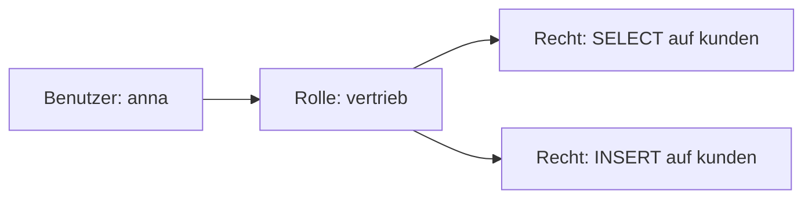

# AP2 Lernzettel: Datenbank-Zugriffsrechte mit `GRANT`, `REVOKE` und `CREATE ROLE`

## 1. Kurzüberblick

Datenbank-Zugriffsrechte steuern, welche Benutzer oder Rollen welche Aktionen auf Datenbankobjekten ausführen dürfen.

Typische Aktionen sind zum Beispiel:

- Daten lesen: `SELECT`
- Daten einfügen: `INSERT`
- Daten ändern: `UPDATE`
- Daten löschen: `DELETE`
- Objekte erstellen oder verändern: zum Beispiel `CREATE`, `ALTER`, `DROP`

In der AP2 ist besonders wichtig, Rechte nicht wahllos zu vergeben, sondern nach dem **Least-Privilege-Prinzip**: Jeder Benutzer erhält nur genau die Rechte, die er für seine Aufgabe benötigt.

---

## 2. Warum das in der AP2 wichtig ist

Zugriffsrechte sind ein typisches Prüfungsthema, weil sie mehrere Bereiche verbinden:

- SQL-Syntax
- Datenschutz und IT-Sicherheit
- Rollen- und Benutzerkonzepte
- saubere Rechteverwaltung in Unternehmen
- praktische Anforderungssituationen

Typische Prüfungsziele sind:

| Prüfungsziel | Bedeutung |
|---|---|
| Benutzer und Rollen unterscheiden | Wissen, ob Rechte direkt oder indirekt vergeben werden |
| Rechte mit `GRANT` vergeben | SQL korrekt formulieren |
| Rechte mit `REVOKE` entziehen | nicht mehr benötigte Rechte entfernen |
| Rollen sinnvoll einsetzen | Rechteverwaltung wartbar gestalten |
| Least Privilege anwenden | unnötige Sicherheitsrisiken vermeiden |

---

## 3. Grundbegriffe

### 3.1 Benutzer

Ein **Benutzer** ist ein Datenbankkonto, mit dem sich eine Person, Anwendung oder ein Dienst an der Datenbank anmeldet.

Beispiel:

```sql
GRANT SELECT ON kunden TO max;
```

Der Benutzer `max` erhält direkt das Recht, Daten aus der Tabelle `kunden` zu lesen.

Direkte Rechtevergabe an einzelne Benutzer ist möglich, aber bei vielen Benutzern oft unübersichtlich.

---

### 3.2 Rolle

Eine **Rolle** ist ein Rechtebündel. Rechte werden der Rolle zugewiesen, und Benutzer erhalten anschließend diese Rolle.

Beispiel:

```sql
CREATE ROLE vertrieb;

GRANT SELECT, INSERT ON kunden TO vertrieb;

GRANT vertrieb TO anna;
GRANT vertrieb TO ben;
```

Die Rolle `vertrieb` enthält die Rechte. Die Benutzer `anna` und `ben` erhalten diese Rechte indirekt über die Rolle.

Vorteil:

Wenn sich Rechte ändern, muss nur die Rolle angepasst werden, nicht jeder einzelne Benutzer.

---

### 3.3 Objektrechte

**Objektrechte** beziehen sich auf konkrete Datenbankobjekte.

Typische Datenbankobjekte sind:

| Objekt | Beispiel |
|---|---|
| Tabelle | `kunden` |
| View | `aktive_kunden` |
| Sequenz | `kunden_id_seq` |
| Prozedur/Funktion | `berechne_rabatt()` |

Typische Objektrechte sind:

| Recht | Bedeutung |
|---|---|
| `SELECT` | Daten lesen |
| `INSERT` | neue Datensätze einfügen |
| `UPDATE` | bestehende Datensätze ändern |
| `DELETE` | Datensätze löschen |
| `EXECUTE` | Prozedur oder Funktion ausführen |

---

### 3.4 Systemrechte

**Systemrechte** beziehen sich nicht nur auf ein einzelnes Objekt, sondern auf Fähigkeiten innerhalb des Datenbanksystems.

Beispiele können je nach DBMS sein:

- Benutzer anlegen
- Datenbanken oder Schemata erstellen
- Tabellen erstellen
- Rollen verwalten

Wichtig: Systemrechte sind stark DBMS-abhängig. MySQL, PostgreSQL und Oracle verwenden ähnliche Grundideen, aber nicht immer identische Syntax und Rechtebezeichnungen.

---

### 3.5 Least-Privilege-Prinzip

Das **Least-Privilege-Prinzip** bedeutet:

> Ein Benutzer oder eine Rolle erhält nur die Rechte, die für die jeweilige Aufgabe wirklich notwendig sind.

Beispiel:

Ein Mitarbeiter soll Kundendaten nur ansehen dürfen.

Falsch beziehungsweise zu weitgehend:

```sql
GRANT ALL PRIVILEGES ON kunden TO tim;
```

Besser:

```sql
GRANT SELECT ON kunden TO tim;
```

Noch besser bei mehreren gleichartigen Benutzern:

```sql
CREATE ROLE kunden_lesen;
GRANT SELECT ON kunden TO kunden_lesen;
GRANT kunden_lesen TO tim;
```

---

## 4. Zentrale SQL-Befehle

## 4.1 `CREATE ROLE`

Mit `CREATE ROLE` wird eine neue Rolle angelegt.

```sql
CREATE ROLE sachbearbeitung;
```

Die Rolle `sachbearbeitung` enthält zunächst noch keine Rechte. Sie ist nur eine leere Rechte-Sammelstelle.

Danach können der Rolle Rechte zugewiesen werden:

```sql
GRANT SELECT, INSERT ON kunden TO sachbearbeitung;
```

---

## 4.2 `GRANT` für Objektrechte

Mit `GRANT` werden Rechte vergeben.

Allgemeines Muster:

```sql
GRANT recht1, recht2 ON objekt TO empfaenger;
```

Beispiel:

```sql
GRANT SELECT, INSERT ON kunden TO sachbearbeitung;
GRANT SELECT ON rechnungen TO sachbearbeitung;
```

Bedeutung:

- Die Rolle `sachbearbeitung` darf Daten aus `kunden` lesen.
- Die Rolle `sachbearbeitung` darf neue Datensätze in `kunden` einfügen.
- Die Rolle `sachbearbeitung` darf Daten aus `rechnungen` lesen.
- Sie darf Rechnungen aber nicht ändern, einfügen oder löschen.

---

## 4.3 Rolle an Benutzer vergeben

Eine Rolle kann einem Benutzer mit `GRANT` zugewiesen werden.

```sql
GRANT sachbearbeitung TO max;
```

Der Benutzer `max` erhält dadurch die Rechte, die in der Rolle `sachbearbeitung` enthalten sind.

Wichtig:

```sql
GRANT SELECT ON kunden TO sachbearbeitung;
GRANT sachbearbeitung TO max;
```

bedeutet:

```text
max → besitzt Rolle sachbearbeitung → hat dadurch SELECT auf kunden
```

---

## 4.4 Rechte entziehen mit `REVOKE`

Mit `REVOKE` werden Rechte wieder entzogen.

Allgemeines Muster für Objektrechte:

```sql
REVOKE recht ON objekt FROM empfaenger;
```

Beispiel:

```sql
REVOKE INSERT ON kunden FROM sachbearbeitung;
```

Die Rolle `sachbearbeitung` darf danach keine neuen Kundendaten mehr einfügen.

Eine Rollenzuweisung kann ebenfalls entzogen werden:

```sql
REVOKE sachbearbeitung FROM max;
```

Der Benutzer `max` verliert dadurch die Rolle `sachbearbeitung` und damit die über diese Rolle erhaltenen Rechte.

---

## 5. Zusammenhang zwischen Benutzer, Rolle und Recht



Die Rechte werden nicht direkt an `anna` vergeben, sondern an die Rolle `vertrieb`.

Das ist besser wartbar:

- Neue Mitarbeiter im Vertrieb bekommen einfach die Rolle `vertrieb`.
- Rechteänderungen werden zentral an der Rolle vorgenommen.
- Beim Teamwechsel kann die alte Rolle entzogen und eine neue Rolle vergeben werden.

---

## 6. AP2-typisches Mini-Rechtekonzept

### 6.1 Ausgangssituation

Anforderung:

- Team `Vertrieb` darf Kundendaten lesen und neue Kunden anlegen.
- Team `Controlling` darf Rechnungen nur lesen.
- Benutzer `anna` arbeitet im Vertrieb.
- Benutzer `ben` arbeitet im Controlling.

---

### 6.2 Lösung mit Rollen

```sql
CREATE ROLE vertrieb;
CREATE ROLE controlling;

GRANT SELECT, INSERT ON kunden TO vertrieb;
GRANT SELECT ON rechnungen TO controlling;

GRANT vertrieb TO anna;
GRANT controlling TO ben;
```

---

### 6.3 Erklärung

| SQL-Anweisung | Bedeutung |
|---|---|
| `CREATE ROLE vertrieb;` | Erstellt die Rolle für das Vertriebsteam |
| `CREATE ROLE controlling;` | Erstellt die Rolle für das Controlling |
| `GRANT SELECT, INSERT ON kunden TO vertrieb;` | Vertrieb darf Kunden lesen und anlegen |
| `GRANT SELECT ON rechnungen TO controlling;` | Controlling darf Rechnungen lesen |
| `GRANT vertrieb TO anna;` | Anna erhält die Vertriebsrechte |
| `GRANT controlling TO ben;` | Ben erhält die Controllingrechte |

---

### 6.4 Rollenwechsel

Ben wechselt vom Controlling in den Vertrieb.

Dann muss zuerst die nicht mehr benötigte Rolle entzogen werden:

```sql
REVOKE controlling FROM ben;
GRANT vertrieb TO ben;
```

Wichtig für die Prüfung:

Nur neue Rechte zu vergeben reicht nicht aus. Nicht mehr benötigte Rechte müssen aktiv entzogen werden.

---

## 7. Typische AP2-Fallen

## 7.1 `ALL PRIVILEGES` ohne Begründung

Problematisch:

```sql
GRANT ALL PRIVILEGES ON kunden TO tim;
```

Diese Anweisung ist meist zu weitgehend.

Wenn `tim` Kundendaten nur lesen darf, ist korrekt:

```sql
GRANT SELECT ON kunden TO tim;
```

Besser rollenbasiert:

```sql
CREATE ROLE kunden_lesen;
GRANT SELECT ON kunden TO kunden_lesen;
GRANT kunden_lesen TO tim;
```

---

## 7.2 Rechte direkt an viele Benutzer vergeben

Unübersichtlich:

```sql
GRANT SELECT ON kunden TO anna;
GRANT SELECT ON kunden TO ben;
GRANT SELECT ON kunden TO clara;
GRANT SELECT ON kunden TO david;
```

Besser:

```sql
CREATE ROLE kunden_lesen;
GRANT SELECT ON kunden TO kunden_lesen;

GRANT kunden_lesen TO anna;
GRANT kunden_lesen TO ben;
GRANT kunden_lesen TO clara;
GRANT kunden_lesen TO david;
```

Vorteil:

Wenn später zusätzlich `SELECT` auf eine View benötigt wird, muss nur die Rolle angepasst werden.

---

## 7.3 `REVOKE` beim Teamwechsel vergessen

Fehlerhaft:

```sql
GRANT vertrieb TO ben;
```

Wenn `ben` vorher im Controlling war, bleibt seine alte Rolle erhalten.

Korrekt:

```sql
REVOKE controlling FROM ben;
GRANT vertrieb TO ben;
```

---

## 7.4 Schema nicht beachten

In vielen Datenbanksystemen gehören Tabellen zu einem Schema.

Beispiel:

```sql
GRANT SELECT ON public.kunden TO vertrieb;
```

oder:

```sql
GRANT SELECT ON crm.kunden TO vertrieb;
```

Die Tabelle `kunden` kann in unterschiedlichen Schemata existieren. Daher ist in Prüfungsaufgaben wichtig, auf den vollständigen Objektnamen zu achten, wenn ein Schema angegeben ist.

---

## 7.5 DDL und DML verwechseln

DML-Befehle verändern Daten:

| Befehl | Bedeutung |
|---|---|
| `SELECT` | Daten lesen |
| `INSERT` | Daten einfügen |
| `UPDATE` | Daten ändern |
| `DELETE` | Daten löschen |

DDL-Befehle verändern Datenbankstrukturen:

| Befehl | Bedeutung |
|---|---|
| `CREATE` | Objekt erstellen |
| `ALTER` | Objekt verändern |
| `DROP` | Objekt löschen |

Typische Verwechslung:

- `INSERT` erstellt keinen neuen Benutzer und keine neue Tabelle.
- `CREATE` fügt keinen neuen Datensatz in eine Tabelle ein.

---

## 8. Erweiterte Prüfungsfallen

## 8.1 `WITH GRANT OPTION`

Mit `WITH GRANT OPTION` darf ein Benutzer ein erhaltenes Recht an andere weitergeben.

Beispiel:

```sql
GRANT SELECT ON kunden TO lisa WITH GRANT OPTION;
```

Bedeutung:

- `lisa` darf Daten aus `kunden` lesen.
- `lisa` darf das `SELECT`-Recht auf `kunden` an andere Benutzer oder Rollen weitergeben.

Beispiel:

```sql
GRANT SELECT ON kunden TO tom;
```

Wenn `lisa` diese Anweisung ausführt, erhält `tom` das Recht über eine Weitergabe durch `lisa`.

Prüfungsfalle:

Wird `lisa` das Recht später entzogen, kann das Auswirkungen auf Rechte haben, die `lisa` weitergegeben hat. Das genaue Verhalten hängt vom DBMS und der verwendeten `REVOKE`-Variante ab.

---

## 8.2 `CASCADE` und abhängige Rechte

Einige DBMS unterstützen beim Entziehen von Rechten Varianten wie `CASCADE` oder `RESTRICT`.

Grundidee:

| Variante | Bedeutung |
|---|---|
| `CASCADE` | Abhängige Rechte können mit entzogen werden |
| `RESTRICT` | Entzug wird verhindert, wenn abhängige Rechte existieren |

Beispielhafte Logik:

```sql
REVOKE SELECT ON kunden FROM lisa CASCADE;
```

Mögliche Bedeutung:

Wenn `lisa` das Recht an andere weitergegeben hat, können diese abhängigen Rechte ebenfalls entzogen werden.

Wichtig:

Die genaue Syntax und Wirkung ist DBMS-abhängig. In der AP2 reicht meistens die fachliche Aussage, dass weitergegebene Rechte beim Entzug berücksichtigt werden müssen.

---

## 8.3 `PUBLIC`-Rechte

`PUBLIC` steht in vielen Datenbanksystemen sinngemäß für eine sehr breite Gruppe von Benutzern.

Beispiel:

```sql
GRANT SELECT ON kunden TO PUBLIC;
```

Das ist sicherheitskritisch, weil dadurch sehr viele Benutzer Leserechte erhalten können.

In Prüfungsaufgaben sollte `PUBLIC` nur verwendet werden, wenn die Anforderung ausdrücklich eine öffentliche oder sehr breite Berechtigung verlangt.

---

## 9. DBMS-Kurzvergleich für die AP2

| Thema | MySQL | PostgreSQL | Oracle |
|---|---|---|---|
| Rollen unterstützt | Ja | Ja | Ja |
| Objektrechte | Ja | Ja | Ja |
| Rechte anzeigen | z. B. `SHOW GRANTS FOR user;` | über Kataloge und `information_schema` | über Data-Dictionary-Views |
| Schema-Bezug | Datenbank- und Objektbezug wichtig | Schema-Bezug sehr wichtig | Schema- und Benutzerbezug wichtig |
| Typische Stolperfalle | globale vs. objektbezogene Rechte | Rechte auf Schema und Objekt unterscheiden | viele Systemprivilegien und Rollenebenen |

Merksatz:

> In der Prüfung immer genau prüfen, auf welchem Objekt, in welchem Schema und für welchen Empfänger ein Recht gelten soll.

---

## 10. Praktisches Gesamtbeispiel

### 10.1 Anforderung

Ein Unternehmen hat folgende Teams:

| Team | Benötigte Rechte |
|---|---|
| Vertrieb | Kunden lesen und neue Kunden anlegen |
| Support | Tickets lesen und bearbeiten |
| Controlling | Rechnungen nur lesen |

Benutzer:

| Benutzer | Team |
|---|---|
| `anna` | Vertrieb |
| `lea` | Support |
| `ben` | Controlling |

---

### 10.2 SQL-Lösung

```sql
CREATE ROLE vertrieb;
CREATE ROLE support;
CREATE ROLE controlling;

GRANT SELECT, INSERT ON kunden TO vertrieb;

GRANT SELECT, UPDATE ON tickets TO support;

GRANT SELECT ON rechnungen TO controlling;

GRANT vertrieb TO anna;
GRANT support TO lea;
GRANT controlling TO ben;
```

---

### 10.3 Begründung

Die Lösung ist fachlich sauber, weil:

- Rechte über Rollen vergeben werden.
- Jede Rolle nur die notwendigen Rechte erhält.
- Benutzer ihre Rechte indirekt über ihre Teamrolle erhalten.
- Das Least-Privilege-Prinzip umgesetzt wird.
- Die Lösung wartbar bleibt, wenn weitere Benutzer hinzukommen.

---

## 11. Prüfungsaufgaben im IHK-Stil

## Aufgabe 1: Single Choice

**2 Punkte**

Welcher Befehl erstellt eine neue Rolle?

1. `GRANT ROLE vertrieb;`
2. `CREATE ROLE vertrieb;`
3. `ADD ROLE vertrieb;`
4. `NEW ROLE vertrieb;`

**Lösung:** 2

**Begründung:**

```sql
CREATE ROLE vertrieb;
```

ist die korrekte SQL-Anweisung zum Erstellen einer Rolle.

**Bewertung:**

| Leistung | Punkte |
|---|---:|
| Richtige Option gewählt | 2 |
| Falsche Option gewählt | 0 |

---

## Aufgabe 2: Multiple Choice

**4 Punkte**

Welche Aussagen sind korrekt?

1. `GRANT` kann Rechte auf Tabellen vergeben.
2. `REVOKE` kann Rechte nicht von Rollen entziehen.
3. Rollen vereinfachen die Rechteverwaltung.
4. Das Least-Privilege-Prinzip bedeutet, möglichst viele Rechte zu vergeben.

**Lösung:** 1 und 3

**Begründung:**

| Aussage | Bewertung | Erklärung |
|---|---|---|
| 1 | korrekt | `GRANT` vergibt Rechte, zum Beispiel `SELECT` auf Tabellen |
| 2 | falsch | `REVOKE` kann Rechte auch von Rollen entziehen |
| 3 | korrekt | Rollen bündeln Rechte und vereinfachen die Verwaltung |
| 4 | falsch | Least Privilege bedeutet möglichst wenige notwendige Rechte |

**Bewertung:**

| Leistung | Punkte |
|---|---:|
| Beide richtigen Aussagen und keine falsche markiert | 4 |
| Teilweise korrekt | 2 |
| Sonst | 0 |

---

## Aufgabe 3: SQL-Konstruktion

**6 Punkte**

Gegeben:

- Rolle `support` soll `SELECT` auf `tickets` erhalten.
- Benutzer `lea` soll die Rolle `support` erhalten.
- Danach soll `UPDATE` auf `tickets` für die Rolle `support` entzogen werden.

**Musterlösung:**

```sql
CREATE ROLE support;
GRANT SELECT ON tickets TO support;
GRANT support TO lea;
REVOKE UPDATE ON tickets FROM support;
```

**Hinweis:**

Die letzte Anweisung ist syntaktisch korrekt, auch wenn vorher in der Aufgabe nur `SELECT` vergeben wurde. Fachlich bedeutet sie: Falls `support` ein `UPDATE`-Recht auf `tickets` besitzt, wird es entzogen.

**Bewertung:**

| Leistung | Punkte |
|---|---:|
| Rolle `support` erstellt | 1,5 |
| `SELECT` auf `tickets` an `support` vergeben | 1,5 |
| Rolle `support` an `lea` vergeben | 1,5 |
| `UPDATE` auf `tickets` von `support` entzogen | 1,5 |
| Summe | 6 |

---

## Aufgabe 4: Korrekturaufgabe

**8 Punkte**

Gegeben ist diese unsaubere Lösung:

```sql
GRANT ALL PRIVILEGES ON kunden TO tim;
```

Anforderung:

- Benutzer `tim` darf nur lesen.
- Die Vergabe soll rollenbasiert erfolgen.

**Musterlösung:**

```sql
CREATE ROLE kunden_lesen;
GRANT SELECT ON kunden TO kunden_lesen;
GRANT kunden_lesen TO tim;
```

**Begründung:**

Die ursprüngliche Lösung ist zu weitgehend, weil `ALL PRIVILEGES` mehr Rechte vergibt als benötigt. Da `tim` nur lesen darf, reicht `SELECT`. Außerdem fordert die Aufgabe eine rollenbasierte Vergabe.

**Bewertung:**

| Leistung | Punkte |
|---|---:|
| Rolle erstellt | 2 |
| Least Privilege korrekt umgesetzt: `SELECT` statt `ALL PRIVILEGES` | 4 |
| Rolle an Benutzer vergeben | 2 |
| Summe | 8 |

---

## 12. Häufige Formulierungen in Prüfungsantworten

### Unterschied zwischen Benutzer und Rolle

Ein Benutzer ist ein konkretes Datenbankkonto, während eine Rolle ein Bündel von Rechten ist, das einem oder mehreren Benutzern zugewiesen werden kann.

---

### Warum Rollen sinnvoll sind

Rollen vereinfachen die Rechteverwaltung, weil Rechte zentral an einer Rolle gepflegt und anschließend mehreren Benutzern zugewiesen werden können.

---

### Warum `ALL PRIVILEGES` kritisch ist

`ALL PRIVILEGES` ist kritisch, weil dadurch oft mehr Rechte vergeben werden als fachlich notwendig. Das widerspricht dem Least-Privilege-Prinzip.

---

### Warum `REVOKE` wichtig ist

`REVOKE` ist wichtig, um nicht mehr benötigte Rechte zu entziehen, zum Beispiel bei einem Teamwechsel oder nach Abschluss einer Aufgabe.

---

## 13. Kurz-Check vor der Prüfung

Vor der Prüfung solltest du folgende Fragen sicher beantworten können:

- Kann ich den Unterschied zwischen Benutzer und Rolle in einem Satz erklären?
- Kann ich `CREATE ROLE`, `GRANT` und `REVOKE` korrekt schreiben?
- Prüfe ich bei jeder Rechtevergabe, ob sie wirklich notwendig ist?
- Nutze ich Rollen statt Einzelvergaben, wenn mehrere Benutzer gleiche Rechte brauchen?
- Denke ich bei Teamwechseln daran, alte Rollen oder Rechte zu entziehen?
- Beachte ich Tabellenname, Schema und Empfänger korrekt?
- Kann ich erklären, warum `ALL PRIVILEGES` meistens zu weitgehend ist?

---

## 14. Schneller Erwartungshorizont

Eine gute AP2-Antwort enthält meistens:

| Erwartung | Beispiel |
|---|---|
| korrekte Fachbegriffe | Benutzer, Rolle, Objektrecht, Least Privilege |
| korrekte SQL-Syntax | `GRANT SELECT ON kunden TO vertrieb;` |
| nachvollziehbare Rechtevergabe | nur benötigte Rechte |
| Rollenansatz | Rechte an Rolle, Rolle an Benutzer |
| Entzug berücksichtigt | `REVOKE alte_rolle FROM ben;` |
| Sicherheitsbegründung | unnötige Rechte vermeiden |

---

## 15. Fazit

Für die AP2 zählt vor allem eine saubere und nachvollziehbare Rechtevergabe.

Das Grundmuster lautet:

```sql
CREATE ROLE rollenname;
GRANT recht ON objekt TO rollenname;
GRANT rollenname TO benutzer;
```

Bei Änderungen oder Rollenwechseln gehört `REVOKE` zwingend dazu:

```sql
REVOKE alte_rolle FROM benutzer;
GRANT neue_rolle TO benutzer;
```

Prüfungsentscheidend ist nicht nur die Syntax, sondern auch die Begründung: Rechte sollen gezielt, wartbar und nach dem Least-Privilege-Prinzip vergeben werden.