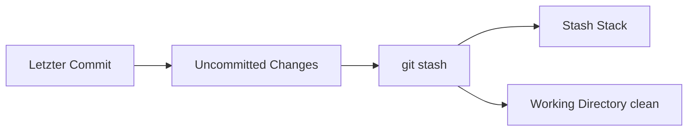

# Git Stash

## Kurzdefinition

`git stash` speichert **nicht-committete Änderungen** (Working Directory und optional Staging Area) temporär in einem internen Stack und stellt den Arbeitszustand auf den letzten Commit zurück.

Es dient dazu, **unfertige Arbeit zwischenzuspeichern**, ohne einen Commit erstellen zu müssen.

---

## 1. Ausgangssituation

Typischer Ablauf:

```bash
mkdir git
cd git
touch file1.txt
git init
git add file1.txt
git commit -m "file1 added"
```

Ergebnis:

- Ein Repository wurde initialisiert.
- Ein erster Commit existiert.
- Wir befinden uns auf dem Branch `master` (bzw. `main`, je nach Git-Version).
- Working Directory ist sauber.

---

## 2. Problemstellung

Angenommen:

- Du arbeitest direkt auf `master`
- Du änderst Dateien
- Die Änderungen sind **noch nicht commit-reif**
- Plötzlich musst du:
  - den Branch wechseln
  - auf den letzten Commit zurück
  - einen Hotfix machen
  - oder den Code in einem sauberen Zustand testen

### ❗ Was du NICHT willst

- Keinen „dirty commit“ erstellen
- Keine halbfertige Arbeit verlieren
- Kein kompliziertes Reset-Branch-Konstrukt bauen

---

## 3. Lösung: `git stash`

`git stash` speichert deine lokalen Änderungen in einem internen Stack und setzt dein Arbeitsverzeichnis auf den letzten Commit zurück.

---

## 4. Was genau wird gespeichert?

Standardmäßig:

- Änderungen im Working Directory
- Änderungen in der Staging Area

Nicht gespeichert werden:

- Untracked Files (außer mit `-u`)
- Ignorierte Dateien (außer mit `-a`)

---

## 5. Grundlegende Befehle

### Änderungen stashen

```bash
git stash
```

Alternative mit Nachricht:

```bash
git stash push -m "WIP: Feature X"
```

---

### Stashes anzeigen

```bash
git stash list
```

Beispielausgabe:

```
stash@{0}: On master: WIP: Feature X
stash@{1}: On master: experiment
```

→ `stash@{0}` ist immer der neueste Eintrag (Stack-Prinzip).

---

### Stash wiederherstellen (behalten)

```bash
git stash apply
```

oder gezielt:

```bash
git stash apply stash@{1}
```

---

### Stash anwenden und löschen

```bash
git stash pop
```

→ `apply` + automatisches Entfernen aus dem Stack.

---

### Stash löschen

Einzelner Eintrag:

```bash
git stash drop stash@{0}
```

Alle löschen:

```bash
git stash clear
```

---

## 6. Interne Funktionsweise (Konzept)

Mermaid-Darstellung:



Wichtige Punkte:

- Der Stash ist **kein Branch**
- Der Stash ist **kein Ersatz für Commits**
- Intern erstellt Git versteckte Commit-Objekte
- Stashes liegen in einem Stack (LIFO-Prinzip)

---

## 7. Praktisches Beispiel

### Schritt 1: Datei verändern

```bash
echo "Neue Zeile" >> file1.txt
```

Status prüfen:

```bash
git status
```

→ Datei ist modified.

---

### Schritt 2: Änderungen stashen

```bash
git stash
```

Jetzt:

```bash
git status
```

→ Working Directory ist sauber.

---

### Schritt 3: Später wiederherstellen

```bash
git stash pop
```

→ Änderungen sind wieder da.

---

## 8. Erweiterte Optionen

### Untracked Files mit speichern

```bash
git stash -u
```

### Auch ignorierte Dateien speichern

```bash
git stash -a
```

---

## 9. Examensrelevanz (IHK / FIAE)

Prüfungsrelevante Aspekte:

- Unterschied zwischen Commit und Stash
- Verhalten bei Branch-Wechsel
- Stack-Prinzip verstehen
- Unterschied zwischen `apply` und `pop`
- Umgang mit untracked Dateien

Typische Prüfungsfrage:

> Warum sollte man `git stash` verwenden, anstatt einen Commit zu erstellen?

Antwort:

- Vermeidung unsauberer Zwischen-Commits
- Temporäres Parken unfertiger Arbeit
- Schneller Kontextwechsel

---

## 10. Typische Fehler und Missverständnisse

### ❌ „Stash ist wie ein Backup“
Nein.  
Stashes sind temporär gedacht und können gelöscht werden.

---

### ❌ „Stash ersetzt Branches“
Nein.  
Feature-Branches bleiben Best Practice.

---

### ❌ „Stash speichert automatisch alles“
Nein.  
Untracked und ignorierte Dateien nur mit `-u` oder `-a`.

---

### ❌ Konflikte beim Anwenden

Wenn sich der Code seit dem Stash verändert hat, können Merge-Konflikte entstehen.

---

## 11. Einordnung im Git-Gesamtbild

| Mechanismus | Zweck | Dauerhaft? |
|-------------|--------|------------|
| Commit      | Versionierung | Ja |
| Branch      | Parallele Entwicklung | Ja |
| Stash       | Temporäres Parken | Nein |

---

## Kerngedanke

`git stash` ist ein **Werkzeug für Kontextwechsel**.

Es ermöglicht:

- sauberes Arbeiten
- keine unfertigen Commits
- schnelles Umschalten zwischen Aufgaben

Aber:

> Für echte Feature-Entwicklung bleibt der Branch das richtige Mittel.
