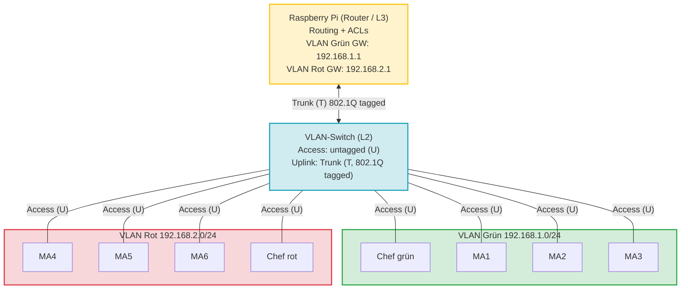
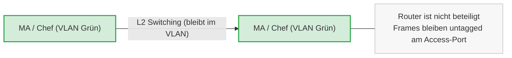
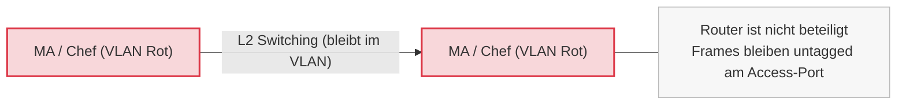
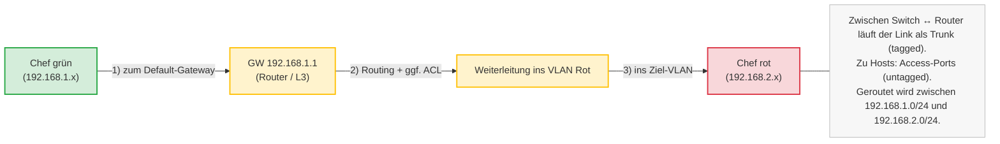

---
title: "VLANs & Layer-3-Switching – Grundlagen und Inter-VLAN-Routing"
date: 2026-01-14
weekday: "Mittwoch"
subject: "Netzwerktechnik"
instructor: "TRE"
program: "FIAE Umschulung 2025-2027"
module: "Switching & VLAN"
topic: "VLAN, 802.1Q, Inter-VLAN-Routing"
level: "Grundlagen"
tags:
  - VLAN
  - Layer-2
  - Layer-3
  - Inter-VLAN-Routing
  - 802.1Q
  - Netzwerktechnik
author: "Sean Conroy"
license: "CC BY-NC-SA 4.0"
---

# VLANs & Layer-3-Switching – 2026-01-14 (NT, TRE)

## Netzwerktechnik (TRE) – VLANs und Layer-3-Switching

## VLAN-Kommunikation ohne Routing

## VLAN-Kommunikation mit Routing

## Layer-3-Switch (VLAN-Routing)

Ein Layer-3-Switch kombiniert:

- Layer 2 (Switching, VLANs, MAC-Adressverarbeitung)
- Layer 3 (Routing, IP-Weiterleitung)

Er trennt VLANs logisch und ermöglicht gleichzeitig kontrollierte Kommunikation zwischen ihnen (Inter-VLAN-Routing).  
In vielen LAN-Szenarien ersetzt er einen klassischen Router.

---

## VLAN-Struktur im Beispiel

### VLAN Grün
- IP-Netz: 192.168.1.0/24
- Endgeräte: MA1, MA2, MA3, Chef grün

### VLAN Rot
- IP-Netz: 192.168.2.0/24
- Endgeräte: MA4, MA5, MA6, Chef rot

Die Trennung erfolgt logisch über VLAN-Tags (IEEE 802.1Q), nicht physisch über separate Switches.

---

## Rolle des Layer-3-Geräts

Das Layer-3-Gerät:

- besitzt pro VLAN eine Gateway-IP
- trifft Routing-Entscheidungen anhand der Ziel-IP
- kann ACLs anwenden
- führt Inter-VLAN-Routing durch

Wichtig: Das IP-Paket bleibt erhalten, nur der Ethernet-Frame (inkl. VLAN-Tag) wird neu erzeugt.

---

## Kommunikationsszenarien

### Innerhalb eines VLANs
- Reines Layer-2-Switching
- Keine Beteiligung des Routers
- Keine VLAN-Grenzüberschreitung

### Zwischen VLANs
- Paket geht an das Default-Gateway
- Routing-Entscheidung auf Layer 3
- Neues Frame mit Ziel-VLAN-Tag
- Weiterleitung ins Zielnetz

---

## Kernaussagen

- VLANs segmentieren ein LAN logisch.
- Ohne Routing sind VLANs strikt getrennt.
- Inter-VLAN-Kommunikation erfordert Routing.
- Ein Layer-3-Switch integriert Switching und Routing in einem Gerät.

---

## Prüfungsmerksatz

Ein Layer-3-Switch trennt VLANs auf Layer 2 und verbindet sie gezielt über Routing auf Layer 3.
