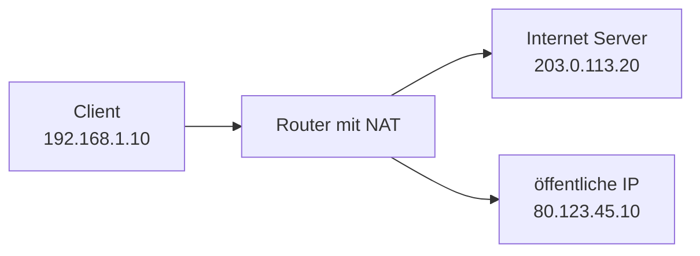
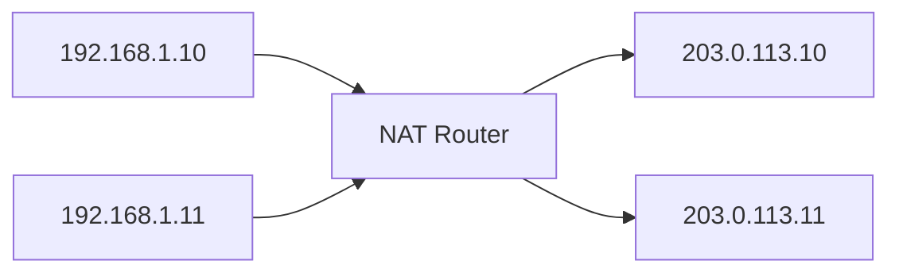
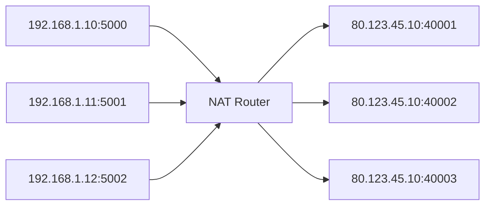

# Network Address Translation (NAT)

## Kurzüberblick

**Network Address Translation (NAT)** ist eine Technik in Routern oder Firewalls, bei der **IP-Adressen in Netzwerkpaketen verändert werden**.

Der Hauptzweck von NAT ist:

- **private Netzwerke mit dem Internet verbinden**
- **öffentliche IPv4-Adressen sparen**
- **interne Netzstrukturen verbergen**

Typisches Szenario:

Ein Heimnetz oder Firmennetz nutzt **private IP-Adressen**, die im Internet **nicht geroutet werden können**.

Der Router übersetzt deshalb:

```text
Private IP → Öffentliche IP
```

---

# Grundprinzip von NAT



Ablauf:

1. Client sendet Anfrage ins Internet
2. Router ersetzt die **private Quell-IP**
3. Paket wird mit **öffentlicher IP** weitergeleitet
4. Antwort kommt zurück
5. Router übersetzt wieder zur internen IP

---

# Warum NAT notwendig ist

IPv4-Adressen sind begrenzt:

```
≈ 4,3 Milliarden mögliche Adressen
```

Da weltweit viel mehr Geräte existieren, wurden **private Adressbereiche** eingeführt.

Private Netzbereiche:

| Bereich | CIDR |
|------|------|
| 10.0.0.0 – 10.255.255.255 | 10.0.0.0/8 |
| 172.16.0.0 – 172.31.255.255 | 172.16.0.0/12 |
| 192.168.0.0 – 192.168.255.255 | 192.168.0.0/16 |

Diese Adressen funktionieren **nur innerhalb lokaler Netzwerke**.

Der Router übernimmt daher die Übersetzung zum Internet.

---

# Arten von NAT

Es existieren mehrere Varianten von NAT, die unterschiedliche Zwecke erfüllen.

---

# Static NAT

**Static NAT** erstellt eine **feste 1:1-Zuordnung** zwischen einer privaten und einer öffentlichen IP-Adresse.


Eigenschaften:

- eine private IP ↔ eine öffentliche IP
- feste Zuordnung
- häufig für **Server im internen Netz**

Beispiel:

```
192.168.1.10 → 203.0.113.10
```

---

# Dynamic NAT

**Dynamic NAT** verwendet einen **Pool öffentlicher IP-Adressen**.

Wenn ein internes Gerät eine Verbindung startet:

1. Router wählt eine freie öffentliche IP
2. temporäre Zuordnung wird erstellt



Eigenschaften:

- Zuordnung ist **temporär**
- benötigt mehrere öffentliche IP-Adressen
- heute **seltener verwendet**

---

# PAT (Port Address Translation)

**PAT** ist die heute **am häufigsten verwendete NAT-Variante**.

Andere Bezeichnungen:

- **NAT Overload**
- **Port Address Translation**

Hier teilen sich **viele interne Geräte eine einzige öffentliche IP-Adresse**.

Die Unterscheidung erfolgt über **Ports**.



Beispiel NAT-Tabelle:

| Interne Adresse | Externe Adresse |
|------|------|
| 192.168.1.10:5000 | 80.123.45.10:40001 |
| 192.168.1.11:5001 | 80.123.45.10:40002 |

Der Router merkt sich diese Zuordnung in einer **NAT-Translation-Tabelle**.

---

# PNAT (Port-based NAT)

**PNAT** beschreibt eine Variante von NAT, bei der **Ports gezielt verwendet werden**, um Verbindungen zu unterscheiden.

In der Praxis ist PNAT meist:

- ein anderer Begriff für **portbasierte NAT-Techniken**
- oder eine spezifische Implementierung von **PAT**

Die grundlegende Idee bleibt gleich:

```
IP-Adresse + Port → eindeutige Verbindung
```

---

# Source NAT (SNAT)

**Source NAT (SNAT)** verändert die **Quell-IP-Adresse** eines Pakets.

Typischer Einsatz:

- internes Netzwerk greift auf Internet zu


Beispiel:

```
192.168.1.10 → 80.123.45.10
```

SNAT wird häufig verwendet bei:

- Internetzugang über Router
- Cloud-Netzwerken
- Firewalls

---

# Destination NAT (DNAT)

**Destination NAT (DNAT)** verändert die **Zieladresse** eines Pakets.

Typischer Einsatz:

- **Port Forwarding**
- Zugriff von außen auf interne Server


Beispiel:

```
80.123.45.10:80 → 192.168.1.20:80
```

Das ermöglicht:

- Webserver im internen Netzwerk
- Zugriff über öffentliche IP

---

# SNAT vs DNAT

| Merkmal | SNAT | DNAT |
|------|------|------|
| verändert | Quelladresse | Zieladresse |
| Einsatz | Zugriff ins Internet | Zugriff auf interne Server |
| Richtung | intern → extern | extern → intern |

---

# Praxisbeispiele

## Internetzugriff im Heimnetz

Viele Geräte:

```
192.168.0.10
192.168.0.11
192.168.0.12
```

Router öffentliche IP:

```
84.120.55.20
```

Alle Geräte nutzen:

```
PAT / NAT Overload
```

---

## Webserver im Heimnetz

Router:

```
84.120.55.20
```

Webserver intern:

```
192.168.0.100
```

Portweiterleitung:

```
84.120.55.20:80 → 192.168.0.100:80
```

Technisch:

```
DNAT
```

---

# Prüfungsrelevanz (IHK)

Wichtige Punkte für Prüfungen:

- Zweck von **NAT**
- Unterschied **private vs öffentliche IP**
- Unterschied **SNAT vs DNAT**
- Funktionsweise von **PAT**
- Rolle von **Ports bei NAT**

Sehr wichtig:

```
PAT = viele interne Geräte → eine öffentliche IP
```

---

# Häufige Missverständnisse

## NAT ist kein Sicherheitsmechanismus

NAT **verbirgt interne IP-Adressen**, bietet aber **keine echte Sicherheit**.

Sicherheit entsteht durch:

- Firewalls
- Zugriffskontrollen
- Netzwerksegmentierung

---

## NAT löst das IPv4-Adressproblem nur teilweise

NAT verlängert die Lebensdauer von IPv4, ersetzt aber nicht die langfristige Lösung:

```
IPv6
```

IPv6 bietet:

```
≈ 340 Sextillionen IP-Adressen
```

Dadurch wird NAT theoretisch nicht mehr benötigt.