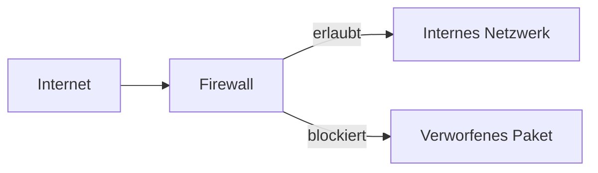
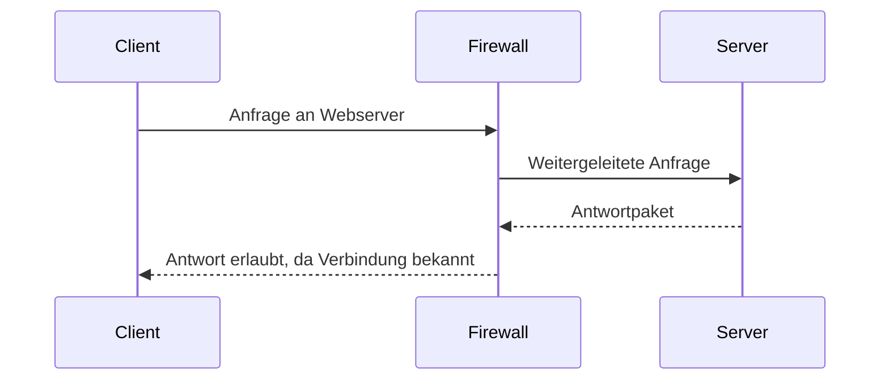
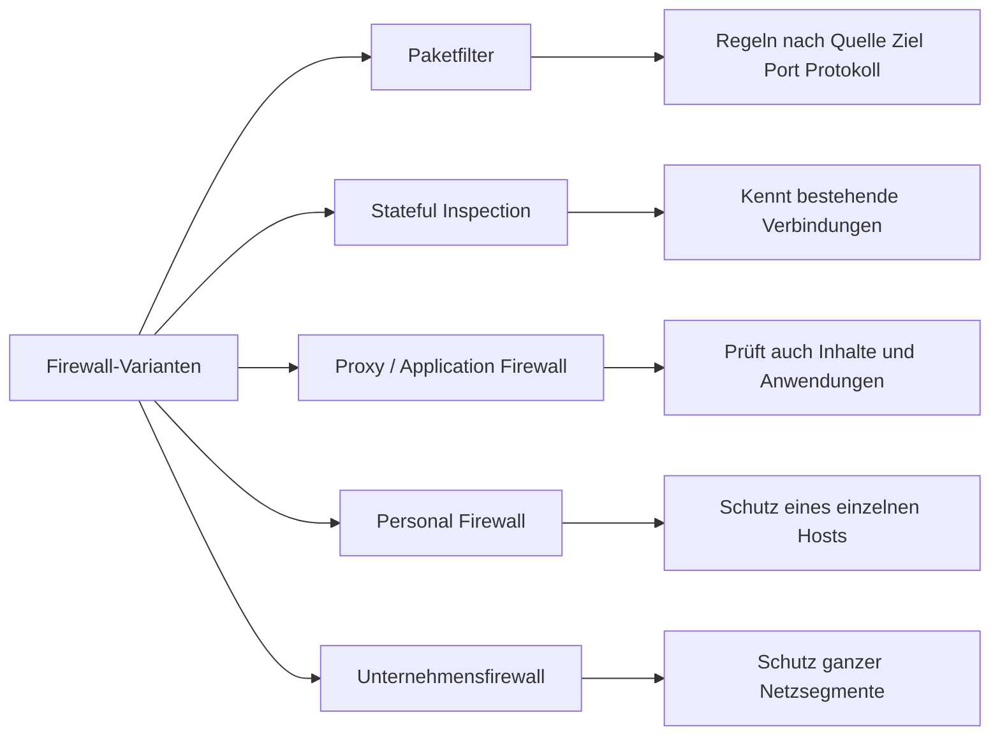
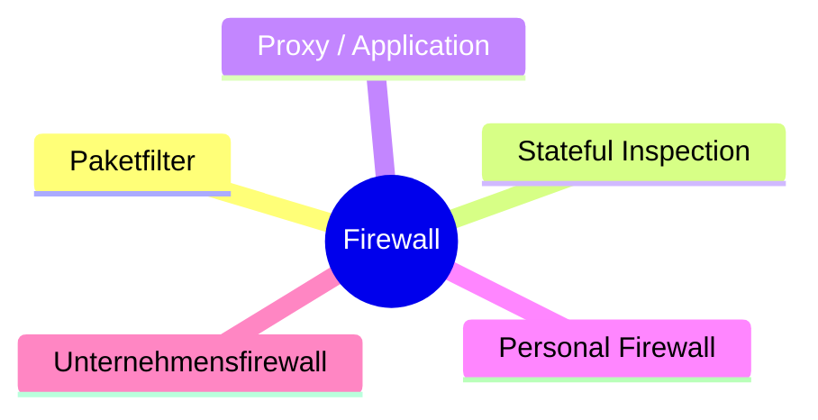
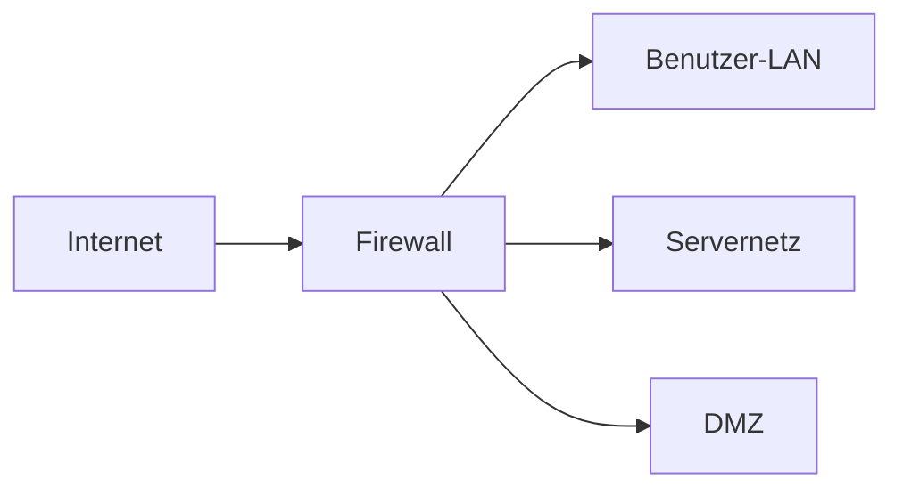
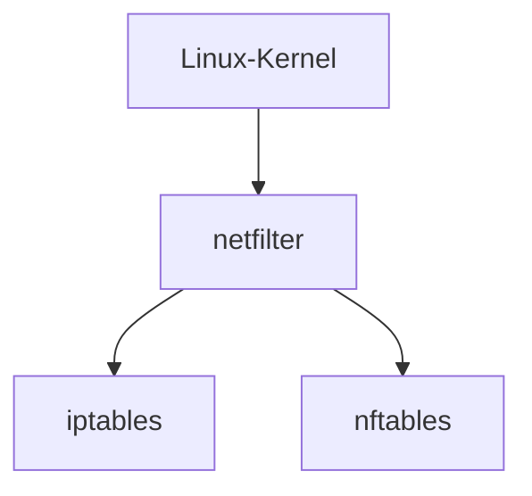

# Firewalls

## Kurzüberblick

Eine **Firewall** ist eine Sicherheitskomponente, die den Netzwerkverkehr überwacht und anhand definierter Regeln entscheidet, ob Datenpakete **erlaubt oder blockiert** werden.

Sie bildet eine zentrale Schutzschicht zwischen:

- vertrauenswürdigen Netzwerken, z. B. internem LAN
- nicht vertrauenswürdigen Netzwerken, z. B. dem Internet

Ziel ist es, **unerlaubten Zugriff zu verhindern** und gleichzeitig legitimen Datenverkehr zu ermöglichen.

---

## Grundprinzip

Eine Firewall arbeitet regelbasiert:

> **„Erlaube oder blockiere Verkehr basierend auf definierten Kriterien.“**

Diese Kriterien können sein:

- IP-Adresse von Quelle und Ziel
- Portnummer, z. B. `80` oder `443`
- Protokoll, z. B. `TCP`, `UDP`, `ICMP`
- Verbindungszustand bei Stateful Firewalls
- Anwendungsebene bei modernen Firewalls

---

## Kernerklärung

Firewalls setzen Sicherheitsregeln technisch durch. Sie prüfen eingehende und ausgehende Pakete und entscheiden, ob diese weitergeleitet oder verworfen werden.

Dabei geht es nicht nur um „Internet rein, Internet raus“, sondern allgemein um die Kontrolle von Kommunikationsbeziehungen zwischen:

- Internet und internem Netzwerk
- verschiedenen internen Netzsegmenten
- einzelnen Hosts
- Anwendungen und Diensten

Eine Firewall kann also sowohl an der **Netzwerkgrenze** als auch **direkt auf einem Endgerät** arbeiten.

---

## Kernfunktionen von Firewalls

### 1. Paketfilterung (Packet Filtering)

Die einfachste Form der Firewall überprüft jedes Paket einzeln anhand statischer Regeln.

Beispielregeln:

- Erlaube TCP-Verkehr auf Port `80`
- Erlaube TCP-Verkehr auf Port `443`
- Blockiere alle eingehenden Verbindungen aus dem Internet

Eigenschaften:

- arbeitet vor allem auf **OSI-Schicht 3 und 4**
- schnell und ressourcenschonend
- betrachtet Pakete zunächst einzeln, ohne tiefen Verbindungsbezug

### 2. Stateful Inspection (SPI)

Stateful Firewalls verfolgen den **Status einer Verbindung**.

Das bedeutet:

- Eine ausgehende Anfrage wird als erlaubte Verbindung registriert.
- Die passende Antwort wird automatisch zugelassen.
- Unerwartete eingehende Verbindungen werden blockiert.

Eigenschaften:

- sicherer als reiner Paketfilter
- Standardmechanismus vieler moderner Firewalls
- reduziert unerwünschte eingehende Verbindungen deutlich

### 3. Proxy-Funktion / Application Firewall

Hier vermittelt die Firewall als **Zwischenstation**.

Ablauf:

1. Der Client verbindet sich mit der Firewall.
2. Die Firewall baut selbst die Verbindung zum Ziel auf.
3. Inhalte können zusätzlich überprüft, protokolliert oder gefiltert werden.

Vorteile:

- interne Systeme bleiben besser verborgen
- tiefere Kontrolle auf Anwendungsebene möglich
- nützlich für Webfilter, Inhaltskontrolle und zentrale Zugriffspolitik

---

## Arten von Firewalls

| Typ | Beschreibung | Typischer Einsatz |
|---|---|---|
| Paketfilter-Firewall | Prüft Pakete anhand einfacher Regeln | Basisschutz |
| Stateful Firewall | Prüft zusätzlich den Verbindungszustand | Standard in Netzwerken |
| Proxy / Application Firewall | Vermittelt Verbindungen und analysiert Inhalte | Höhere Sicherheit |
| Netzwerk-Firewall | Schützt ein gesamtes Netzwerk am Übergang | Unternehmen, Router, Gateways |
| Host-basierte Firewall | Schützt ein einzelnes Gerät | PCs, Server, Notebooks |
| Next-Generation Firewall (NGFW) | Kombiniert klassische Firewall mit erweiterten Funktionen | Moderne Unternehmensnetze |

---

## Firewall-Varianten im Überblick

---

## Personal Firewall und Unternehmensfirewall

### Personal Firewall

Eine **Personal Firewall** läuft direkt auf einem einzelnen Gerät, zum Beispiel auf:

- Windows-PC
- Linux-Server
- Notebook
- Workstation

Sie kontrolliert den Verkehr, der dieses eine System erreicht oder von ihm ausgeht.

Typische Ziele:

- Schutz vor unerwünschten eingehenden Verbindungen
- Kontrolle ausgehender Programme
- Absicherung mobiler Geräte in fremden Netzwerken

### Unternehmensfirewall

Eine **Unternehmensfirewall** schützt nicht nur einen einzelnen Rechner, sondern meist:

- ein ganzes LAN
- mehrere VLANs
- DMZ-Bereiche
- Übergänge zwischen Sicherheitszonen

Sie steht typischerweise zwischen:

- Internet und internem Netzwerk
- internen Teilnetzen
- Servernetz und Büronetz

### Vergleich

| Merkmal | Personal Firewall | Unternehmensfirewall |
|---|---|---|
| Einsatzort | direkt auf einem Host | an der Netzwerkgrenze oder zwischen Segmenten |
| Schutzumfang | einzelnes Gerät | ganzes Netzwerk oder mehrere Zonen |
| Verwaltung | lokal oder per Endpoint-Management | zentral administriert |
| Beispiel | Windows Defender Firewall, lokale Linux-Firewall | dedizierte Firewall-Appliance oder Gateway |
| Fokus | Endgeräteschutz | Netzwerkschutz und Segmentierung |

---

## Das 5er-Diagramm: zentrale Varianten und Konzepte

Eine sinnvolle Struktur umfasst fünf zentrale Begriffe:

Diese fünf Begriffe decken die typischen Sichtweisen ab:

- **technische Funktionsweise**: Paketfilter, Stateful Inspection, Proxy
- **Einsatzort**: Personal Firewall, Unternehmensfirewall

---

## Regelprinzip

Firewall-Regeln folgen oft dem Schema:

- **Quelle**
- **Ziel**
- **Protokoll**
- **Port**
- **Aktion**

Beispiel:

| Quelle | Ziel | Protokoll | Port | Aktion |
|---|---|---|---|---|
| Internes LAN | Internet | TCP | 80 | Erlauben |
| Internes LAN | Internet | TCP | 443 | Erlauben |
| Internet | Internes LAN | TCP | * | Blockieren |
| Administrator-Netz | Servernetz | TCP | 22 | Erlauben |

Wichtige Grundprinzipien:

- **Default Deny**: Alles ist zunächst verboten, nur definierte Ausnahmen sind erlaubt.
- **Default Allow**: Alles ist zunächst erlaubt, nur definierte Ausnahmen sind verboten.

Für Sicherheitsumgebungen gilt meistens:

> **Default Deny ist der sicherere Ansatz.**

---

## Praktisches Beispiel

### Unternehmensnetzwerk

Ein Unternehmen setzt eine Firewall zwischen Internet und interner Infrastruktur ein.

### Beispielregeln

- Erlaube interne Webzugriffe nach außen auf Port `80` und `443`
- Erlaube Administratoren SSH-Zugriff auf Server
- Blockiere alle nicht autorisierten eingehenden Verbindungen aus dem Internet
- Erlaube Antwortverkehr für intern aufgebaute Verbindungen

### Ergebnis

- Mitarbeiter können kontrolliert auf Internetdienste zugreifen.
- Server sind nur nach definierten Regeln erreichbar.
- Unbekannte Angriffe von außen werden blockiert.

---

## Zusammenhang mit NAT

Wichtige fachliche Abgrenzung:

- **Firewall** entscheidet: *erlauben oder blockieren*
- **NAT** entscheidet: *IP-Adressen umschreiben*

Beides ist oft in einem Gerät kombiniert, zum Beispiel in:

- Routern
- Security Gateways
- UTM- oder NGFW-Systemen

Trotzdem sind es **unterschiedliche Funktionen**.

| Funktion | Aufgabe |
|---|---|
| Firewall | Verkehr filtern |
| NAT | Adressen übersetzen |
| Portweiterleitung | Eingehenden Verkehr an internes Ziel umleiten |

---

## Firewalls unter Linux

In Linux-basierten Systemen ist Firewalling eng mit dem Kernel und den Netzwerkschichten des Systems verbunden.

Hier sind drei Begriffe besonders wichtig:

- **netfilter**
- **iptables**
- **nftables**

### Netfilter

**netfilter** ist ein Framework im Linux-Kernel, das die Verarbeitung und Manipulation von Netzwerkpaketen ermöglicht.

Es stellt Mechanismen bereit für:

- Paketfilterung
- Stateful Inspection / Connection Tracking
- NAT
- Portweiterleitung
- Paketmanipulation

Netfilter selbst ist also die technische Grundlage im Kernel.

### Iptables

**iptables** ist ein klassisches Kommandozeilenwerkzeug, das auf netfilter aufsetzt. Es wird verwendet, um Firewall-Regeln zu definieren und zu verwalten.

Damit lassen sich Regeln erstellen auf Basis von:

- Quell-IP
- Ziel-IP
- Port
- Protokoll
- Verbindungszustand

Typische Anwendungsfälle:

- Ports freigeben oder sperren
- eingehende Verbindungen blockieren
- NAT konfigurieren
- Weiterleitungen einrichten

### Nftables

**nftables** ist die modernere Nachfolgelösung für iptables. Es basiert ebenfalls auf netfilter, bietet aber:

- konsistentere Syntax
- vereinfachte Regelverwaltung
- effizientere Verarbeitung
- flexiblere Strukturen
- moderne Verwaltung komplexer Regelwerke

nftables ersetzt in vielen modernen Linux-Systemen schrittweise iptables, auch wenn iptables in der Praxis weiterhin häufig vorkommt.

---

## Zusammenhang: netfilter, iptables, nftables

| Begriff | Rolle |
|---|---|
| netfilter | Kernel-Framework für Paketverarbeitung |
| iptables | älteres Benutzerwerkzeug zur Regelverwaltung |
| nftables | modernes Benutzerwerkzeug zur Regelverwaltung |

### Fachliche Einordnung

- **netfilter** arbeitet im Kernel
- **iptables** und **nftables** sind Werkzeuge, um Regeln für dieses Framework zu definieren
- **nftables** ist konzeptionell moderner und flexibler als **iptables**

---

## Beispiel: Linux-Firewall-Regeln konzeptionell

### Beispiel 1: Webzugriffe erlauben

Ziel:

- ausgehende Webverbindungen zulassen
- unerwünschte eingehende Verbindungen blockieren

Konzeptuell bedeutet das:

| Richtung | Protokoll | Port | Aktion |
|---|---|---|---|
| ausgehend | TCP | 80 | erlauben |
| ausgehend | TCP | 443 | erlauben |
| eingehend | alle | beliebig | standardmäßig blockieren |

### Beispiel 2: SSH nur aus Admin-Netz erlauben

| Quelle | Ziel | Protokoll | Port | Aktion |
|---|---|---|---|---|
| `192.168.10.0/24` | Linux-Server | TCP | 22 | erlauben |
| alle anderen | Linux-Server | TCP | 22 | blockieren |

Das ist ein typisches Praxisbeispiel für eine Host-basierte Firewall auf einem Linux-Server.

---

## Vorteile von Firewalls

| Vorteil | Erklärung |
|---|---|
| Zugriffskontrolle | nur definierter Verkehr wird zugelassen |
| Schutz vor unerlaubten Verbindungen | z. B. gegen Portscans oder direkte Zugriffsversuche |
| Segmentierung | Netzbereiche können voneinander getrennt werden |
| Protokollierung | Zugriffe und Regeltreffer können nachvollzogen werden |
| Richtliniendurchsetzung | zentrale Sicherheitsvorgaben können technisch erzwungen werden |

---

## Grenzen und Nachteile

| Nachteil / Grenze | Erklärung |
|---|---|
| kein vollständiger Schutz | Firewalls allein reichen nicht für umfassende IT-Sicherheit |
| Fehlkonfigurationen | falsche Regeln können Sicherheitslücken oder Ausfälle verursachen |
| eingeschränkte Sicht | ohne Deep Inspection keine vollständige Inhaltskontrolle |
| Performance-Kosten | komplexe Prüfungen benötigen Ressourcen |
| interne Gefahren | auch legitimer Verkehr kann schädlich sein |

---

## Prüfungsrelevanz (AP1)

Für AP1 und Unterricht sind vor allem diese Punkte wichtig:

### 1. Definition sicher beherrschen

Eine Firewall ist ein System zur Überwachung und Kontrolle von Netzwerkverkehr anhand definierter Regeln.

### 2. Typen unterscheiden können

- Paketfilter
- Stateful Firewall
- Proxy / Application Firewall
- Personal Firewall
- Unternehmensfirewall

### 3. Regelprinzip verstehen

- Quelle
- Ziel
- Port
- Protokoll
- Aktion

### 4. Firewall und NAT sauber trennen

- Firewall filtert
- NAT übersetzt

### 5. Linux-Begriffe korrekt einordnen

- netfilter = Kernel-Framework
- iptables = klassisches Tool
- nftables = moderne Alternative

---

## Typische Prüfungsfragen mit Kurzantworten

### Was ist eine Firewall?

Eine Firewall überwacht und kontrolliert Netzwerkverkehr anhand festgelegter Regeln, um unerlaubte Zugriffe zu verhindern.

### Was ist der Unterschied zwischen Paketfilter und Stateful Inspection?

Ein Paketfilter prüft Pakete einzeln anhand statischer Regeln. Eine Stateful-Inspection-Firewall berücksichtigt zusätzlich, ob das Paket zu einer bereits bekannten Verbindung gehört.

### Was ist der Unterschied zwischen Personal Firewall und Unternehmensfirewall?

Eine Personal Firewall schützt ein einzelnes Gerät, eine Unternehmensfirewall schützt ganze Netzwerke oder Netzsegmente.

### Wozu dienen netfilter, iptables und nftables?

Unter Linux ist netfilter das Kernel-Framework zur Paketverarbeitung. iptables und nftables sind Werkzeuge zur Definition und Verwaltung der Firewall-Regeln.

---

## Häufige Fehler und Klarstellungen

### Fehler 1: „Firewall = Virenschutz“

Falsch.  
Eine Firewall kontrolliert Netzwerkverkehr. Klassischer Virenschutz prüft Dateien, Prozesse oder Signaturen.

### Fehler 2: „NAT ersetzt eine Firewall“

Falsch.  
NAT übersetzt Adressen, trifft aber keine vollständigen Sicherheitsentscheidungen wie eine Firewall.

### Fehler 3: „Stateful bedeutet, dass alles erlaubt ist“

Falsch.  
Erlaubt sind nur Pakete, die zu einer bekannten oder erlaubten Verbindung passen.

### Fehler 4: „Personal Firewall und Paketfilter sind dasselbe“

Nicht ganz.  
Eine Personal Firewall ist nach dem **Einsatzort** benannt. Sie kann intern durchaus als Paketfilter oder Stateful Firewall arbeiten.

### Fehler 5: „iptables und netfilter sind identisch“

Falsch.  
netfilter ist das Kernel-Framework, iptables ist nur ein Verwaltungswerkzeug dafür.

### Fehler 6: „nftables ist nur ein anderer Name für iptables“

Falsch.  
nftables ist eine modernere Architektur mit anderer Syntax und flexiblerem Regelmodell.

---

## Merksätze

- **Firewall kontrolliert Verkehr**
- **NAT übersetzt Adressen**
- **Stateful kennt Verbindungen**
- **Default Deny ist sicherer**
- **netfilter ist der Kernel-Unterbau**
- **iptables ist klassisch**
- **nftables ist modern**

---

## Zusammenfassung

Firewalls sind zentrale Sicherheitskomponenten in Netzwerken. Sie überwachen Datenverkehr und entscheiden anhand von Regeln, ob Kommunikation erlaubt oder blockiert wird.

Wichtige Formen sind:

- **Paketfilter**
- **Stateful Inspection Firewalls**
- **Proxy- bzw. Application Firewalls**
- **Personal Firewalls**
- **Unternehmensfirewalls**

Unter Linux basiert Firewalling auf **netfilter**. Die Verwaltung erfolgt klassisch über **iptables** oder modern über **nftables**.

Für Prüfung und Praxis ist entscheidend:

- die Grundidee einer Firewall zu verstehen
- die wichtigsten Firewall-Typen unterscheiden zu können
- Firewall und NAT nicht zu verwechseln
- Linux-Begriffe fachlich korrekt einzuordnen

---

## Übungsaufgaben

1. Erkläre den Unterschied zwischen Paketfilter und Stateful Inspection.
2. Beschreibe den Unterschied zwischen Personal Firewall und Unternehmensfirewall.
3. Erstelle eine einfache Firewall-Regeltabelle für ein kleines Unternehmen.
4. Erkläre, warum NAT keine Firewall ersetzt.
5. Ordne die Begriffe **netfilter**, **iptables** und **nftables** korrekt ein.
6. Begründe, warum **Default Deny** in Sicherheitskonzepten meist sinnvoller ist als **Default Allow**.
7. Erkläre an einem Beispiel, wann eine Host-basierte Linux-Firewall sinnvoll ist.
8. Nenne Vorteile und Grenzen von Firewalls.
9. Erkläre, warum eine Firewall allein nicht ausreicht, um ein Netzwerk umfassend zu schützen.
10. Erstelle ein einfaches Diagramm, das die verschiedenen Firewall-Typen und ihre Einsatzorte zeigt.