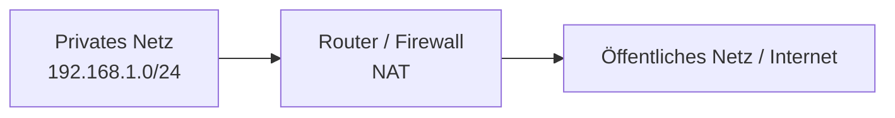
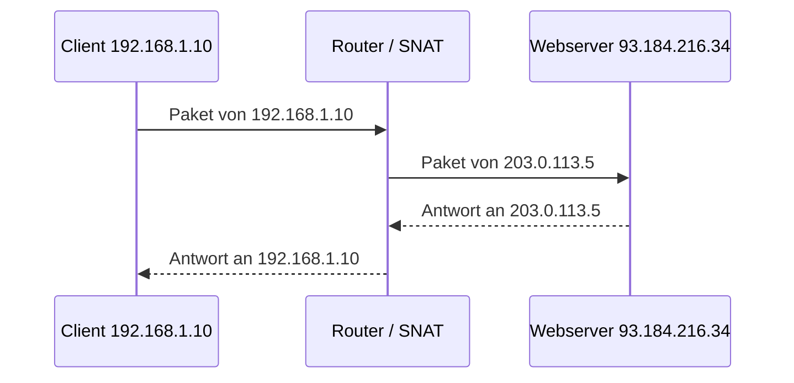
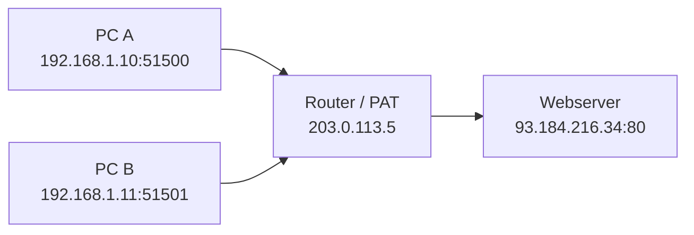
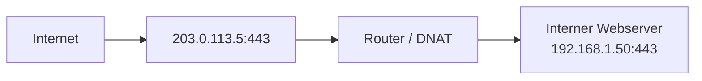

# NAT, PAT und Source NAT

## Kurzüberblick

**NAT (Network Address Translation)** ist ein Verfahren, bei dem IP-Adressen in Paketen umgeschrieben werden. Es wird vor allem verwendet, um private Netzwerke mit dem Internet zu verbinden und dabei öffentliche IPv4-Adressen einzusparen.

Wichtige Begriffe:

- **NAT**: Oberbegriff für die Adressübersetzung
- **SNAT (Source NAT)**: Änderung der **Quell-IP-Adresse**
- **DNAT (Destination NAT)**: Änderung der **Ziel-IP-Adresse**
- **PAT (Port Address Translation)**: Änderung von **IP-Adresse und Port**, meist um viele interne Geräte über **eine** öffentliche IP-Adresse ins Internet zu bringen

In der Praxis ist das, was in Heimnetzwerken meist einfach „NAT“ genannt wird, technisch sehr oft **PAT bzw. NAT Overload**.

---

## Grundidee: Warum braucht man NAT?

Private IP-Adressen wie `192.168.x.x`, `10.x.x.x` oder `172.16.x.x - 172.31.x.x` sind im Internet nicht direkt routbar. Geräte mit solchen Adressen können deshalb nicht einfach ohne Übersetzung mit dem Internet kommunizieren.

NAT löst dieses Problem, indem ein Router oder eine Firewall:

1. interne Adressen entgegennimmt,
2. diese für ausgehenden Verkehr umschreibt,
3. Antworten wieder dem richtigen internen Gerät zuordnet.

Typische Ziele von NAT:

- Einsparung öffentlicher IPv4-Adressen
- Trennung zwischen internem und externem Netz
- kontrollierter Internetzugang für private Geräte

Wichtig: NAT ist **kein vollwertiger Sicherheitsmechanismus**. Es kann interne Adressen verbergen, ersetzt aber **keine Firewall**.

---

## Einordnung der Begriffe

| Begriff | Was wird verändert? | Typischer Einsatzzweck |
|---|---|---|
| NAT | Allgemeiner Oberbegriff | Adressübersetzung allgemein |
| SNAT | Quell-IP-Adresse | Interne Clients greifen nach außen zu |
| DNAT | Ziel-IP-Adresse | Externe Anfragen werden an internen Server weitergeleitet |
| PAT | Quell-IP-Adresse **und** meist Quellport | Viele interne Geräte teilen sich eine öffentliche IP |

---

## NAT im Überblick

### Definition

NAT bedeutet, dass ein Router oder eine Firewall IP-Adressen in Netzwerkpaketen verändert. Der Begriff selbst ist allgemein und beschreibt noch nicht genau, **welche** Adresse geändert wird.

In der Praxis unterscheidet man deshalb präziser:

- **Source NAT (SNAT)** für ausgehende Verbindungen
- **Destination NAT (DNAT)** für eingehende Verbindungen
- **PAT** für die Übersetzung mehrerer Verbindungen über eine einzige öffentliche IP-Adresse mit unterschiedlichen Ports

### Vereinfachtes Schema

---

## Source NAT (SNAT)

### Definition

Bei **Source NAT** wird die **Quell-IP-Adresse** eines ausgehenden Pakets geändert.

Beispiel:

- intern: `192.168.1.10`
- nach außen sichtbar: `203.0.113.5`

Das interne Gerät bleibt im LAN mit seiner privaten Adresse erhalten, aber nach außen tritt es mit einer anderen Quelladresse auf.

### Typischer Ablauf

1. Ein internes Gerät sendet ein Paket ins Internet.
2. Der Router ersetzt die private **Quell-IP-Adresse** durch eine öffentliche Adresse.
3. Die Antwort des externen Servers geht an diese öffentliche Adresse zurück.
4. Der Router ordnet die Antwort wieder dem internen Gerät zu.

### Diagramm

### Tabelle: Vorher / Nachher

| Richtung | Vor NAT | Nach SNAT |
|---|---|---|
| Ausgehend | Quelle `192.168.1.10` → Ziel `93.184.216.34` | Quelle `203.0.113.5` → Ziel `93.184.216.34` |
| Eingehende Antwort | Quelle `93.184.216.34` → Ziel `203.0.113.5` | Quelle `93.184.216.34` → Ziel `192.168.1.10` |

### Wichtige Klarstellung

Dein ursprünglicher Text beschreibt SNAT teilweise so, als bekämen interne Geräte „unterschiedliche Quell-IP-Adressen zugewiesen“. Das ist missverständlich. In vielen realen Szenarien teilen sich mehrere interne Geräte **dieselbe öffentliche Quell-IP-Adresse**. Die Unterscheidung der einzelnen Verbindungen erfolgt dann meist zusätzlich über **Ports** — und genau das ist der Bereich von **PAT**.

---

## PAT (Port Address Translation)

### Definition

PAT ist eine spezielle Form von NAT, bei der **nicht nur die IP-Adresse**, sondern zusätzlich auch die **Portnummer** geändert wird.

Dadurch können viele interne Geräte gleichzeitig dieselbe öffentliche IP-Adresse verwenden. Die Zuordnung erfolgt dann über unterschiedliche Portnummern.

PAT wird auch häufig genannt als:

- **NAT Overload**
- **Masquerading** (je nach System oder Plattform)

### Warum ist PAT so wichtig?

Wenn nur SNAT ohne Portübersetzung verwendet würde, könnte es zu Problemen kommen, sobald mehrere interne Geräte gleichzeitig dieselbe Zieladresse mit denselben Portkombinationen verwenden.

PAT löst das, indem der Router für jede Verbindung eine eindeutige Portzuordnung anlegt.

### Praktisches Beispiel

Zwei Clients greifen gleichzeitig auf einen Webserver im Internet zu:

- Client A: `192.168.1.10:51500`
- Client B: `192.168.1.11:51501`

Der Router übersetzt beides auf dieselbe öffentliche IP `203.0.113.5`, aber mit verschiedenen Quellports:

- `203.0.113.5:40001`
- `203.0.113.5:40002`

### Diagramm

### Übersetzungstabelle

| Intern | Extern nach PAT | Ziel |
|---|---|---|
| `192.168.1.10:51500` | `203.0.113.5:40001` | `93.184.216.34:80` |
| `192.168.1.11:51501` | `203.0.113.5:40002` | `93.184.216.34:80` |

### Antwortverkehr

| Antwort von extern | Router-Zuordnung | Weiterleitung intern |
|---|---|---|
| `93.184.216.34:80 -> 203.0.113.5:40001` | gehört zu PC A | `93.184.216.34:80 -> 192.168.1.10:51500` |
| `93.184.216.34:80 -> 203.0.113.5:40002` | gehört zu PC B | `93.184.216.34:80 -> 192.168.1.11:51501` |

### Merksatz

**PAT ermöglicht es vielen internen Geräten, über eine einzige öffentliche IP-Adresse gleichzeitig Verbindungen ins Internet aufzubauen.**

---

## NAT vs. PAT vs. SNAT

### Verständliche Abgrenzung

- **NAT** ist der Oberbegriff.
- **SNAT** sagt aus, dass die **Quelladresse** verändert wird.
- **PAT** sagt aus, dass zusätzlich **Ports** übersetzt werden.

In vielen Heim- und Firmennetzen laufen ausgehende Verbindungen technisch als:

- **SNAT + Portübersetzung**
- also praktisch **PAT**

### Vergleichstabelle

| Merkmal | NAT | SNAT | PAT |
|---|---|---|---|
| Oberbegriff | Ja | Nein | Nein |
| Ändert Quell-IP | Kann sein | Ja | Ja |
| Ändert Ziel-IP | Kann sein | Nein | Normalerweise nein |
| Ändert Ports | Nicht zwingend | Nicht zwingend | Ja |
| Typischer Einsatz | Allgemein | Ausgehende Verbindungen | Viele Clients über eine öffentliche IP |

---

## Konkrete Praxisbeispiele

## Beispiel 1: Heimnetzwerk

Ein Router zu Hause verbindet:

- Laptop
- Smartphone
- Tablet
- Smart-TV

mit dem Internet.

Alle Geräte haben private Adressen, zum Beispiel:

- `192.168.178.10`
- `192.168.178.20`
- `192.168.178.30`

Nach außen ist nur **eine** öffentliche IP sichtbar, z. B. `198.51.100.25`.

### Was passiert technisch?

Der Heimrouter verwendet in der Regel **PAT**:

- interne Quell-IP wird ersetzt
- interner Quellport wird auf einen externen Port abgebildet

### Typischer Nutzen

- nur eine öffentliche IP-Adresse nötig
- alle Geräte können gleichzeitig surfen
- private Adressen bleiben intern verborgen

---

## Beispiel 2: Unternehmensnetz

In einem Unternehmen greifen hunderte Arbeitsplätze gleichzeitig auf Webanwendungen, Updateserver und Cloud-Dienste zu.

Ohne PAT müsste für viele Verbindungen wesentlich mehr öffentlicher Adressraum bereitgestellt werden. Stattdessen bündelt die Firewall alle ausgehenden Verbindungen über wenige öffentliche IP-Adressen.

### Typischer Nutzen

- effizienter Umgang mit IPv4-Adressen
- zentrale Kontrolle des Internetverkehrs
- einfachere Protokollierung und Richtliniensteuerung

---

## Beispiel 3: Cloud-Umgebung

Virtuelle Maschinen in einem privaten Subnetz sollen Updates laden oder APIs im Internet aufrufen, sind aber selbst nicht direkt öffentlich erreichbar.

Hier wird oft **SNAT** oder **PAT** über ein Gateway oder eine Cloud-Firewall eingesetzt.

### Typischer Nutzen

- interne Systeme bleiben privat
- ausgehende Internetkommunikation funktioniert trotzdem
- öffentliche Erreichbarkeit muss nicht für jede VM einzeln eingerichtet werden

---

## Beispiel 4: Veröffentlichung eines internen Servers

Ein Webserver im LAN mit `192.168.1.50` soll von außen erreichbar sein.

Dann reicht SNAT nicht aus. Stattdessen benötigt man **DNAT** bzw. **Portweiterleitung**.

Beispiel:

- öffentliche Adresse: `203.0.113.5:443`
- interne Weiterleitung: `192.168.1.50:443`

### Diagramm

### Wichtige Prüfungsfalle

Viele verwechseln:

- **SNAT** = ausgehender Verkehr
- **DNAT / Portweiterleitung** = eingehender Verkehr zu internem Server

---

## NAT-Tabelle in der Praxis

Ein NAT-Gerät führt intern eine Zuordnungstabelle. Darin wird gespeichert, welche interne Verbindung welcher externen Verbindung entspricht.

### Beispiel einer Zuordnungstabelle

| Interne Quelle | Externe Quelle nach PAT | Ziel | Status |
|---|---|---|---|
| `192.168.1.10:51500` | `203.0.113.5:40001` | `93.184.216.34:80` | aktiv |
| `192.168.1.11:51501` | `203.0.113.5:40002` | `93.184.216.34:80` | aktiv |
| `192.168.1.12:53000` | `203.0.113.5:40003` | `142.250.74.14:443` | aktiv |

Ohne diese Tabelle könnte der Router eingehende Antworten nicht dem richtigen internen Gerät zuordnen.

---

## Vorteile und Nachteile

## Vorteile

| Vorteil | Erklärung |
|---|---|
| Spart öffentliche IPv4-Adressen | Viele interne Geräte teilen sich wenige oder eine öffentliche Adresse |
| Trennung von intern und extern | Private Adressen werden nicht direkt ins Internet geroutet |
| Flexibilität | Interne Adressierung kann unabhängig vom Provider gestaltet werden |
| Zentrale Steuerung | Router oder Firewall kontrollieren die Übersetzung |

## Nachteile

| Nachteil | Erklärung |
|---|---|
| Erschwerte Erreichbarkeit von innen nach außen | Interne Server brauchen Portweiterleitung / DNAT |
| Höhere Komplexität | Fehleranalyse und Protokollanalyse werden schwieriger |
| Probleme mit manchen Protokollen | Manche Protokolle transportieren IP/Port-Infos im Nutzdatenbereich |
| Ende-zu-Ende-Prinzip wird aufgebrochen | Direkte Adressierbarkeit ist eingeschränkt |

---

## Blacklist, Whitelist, Blocklist, Allowlist

Diese Begriffe gehören **nicht direkt zu NAT**, werden aber in Netzwerken oft zusammen mit Firewalls, Proxys und Inhaltsfiltern verwendet.

### Begriffe

| Begriff | Bedeutung |
|---|---|
| Blocklist / Blacklist | Einträge, die gesperrt sind |
| Allowlist / Whitelist | Einträge, die ausdrücklich erlaubt sind |

### Beispiele

- Eine **Blocklist** kann bekannte schädliche Domains sperren.
- Eine **Allowlist** kann festlegen, dass nur bestimmte Webseiten oder IP-Adressen erreichbar sind.

### Wichtige Abgrenzung

NAT entscheidet **nicht**, ob etwas erlaubt oder verboten ist. NAT übersetzt Adressen.  
Ob Verkehr zugelassen oder blockiert wird, entscheidet typischerweise:

- eine **Firewall**
- ein **Proxy**
- ein **Webfilter**
- eine **Access Control List (ACL)**

---

## Squid und SquidGuard

### Squid

**Squid** ist ein Proxy-Server. Er kann unter anderem verwendet werden für:

- Web-Zugriffe über einen zentralen Proxy
- Caching
- Protokollierung
- Zugriffskontrolle

### SquidGuard

**SquidGuard** ist ein Inhaltsfilter, der mit Squid zusammenarbeiten kann. Damit lassen sich Regeln definieren, zum Beispiel:

- bestimmte Domains blockieren
- Kategorien von Webseiten sperren
- nur freigegebene Ziele erlauben

### Fachliche Einordnung

Squid und SquidGuard gehören eher in den Bereich:

- Proxy
- Content Filtering
- Zugriffskontrolle

nicht in den Kernbereich von NAT. Inhaltlich kann man sie aber im Unterricht gemeinsam besprechen, weil alle Themen mit Netzwerkzugriff und Steuerung zusammenhängen.

---

## Prüfungsrelevanz

Für Klassenarbeiten, Prüfungen und Fachgespräche solltest du Folgendes sicher beherrschen:

### 1. Begriffe sauber unterscheiden

- NAT = Oberbegriff
- SNAT = Änderung der Quelladresse
- DNAT = Änderung der Zieladresse
- PAT = Änderung von Adresse und Port

### 2. Typische Richtung kennen

- **SNAT / PAT**: meist **von innen nach außen**
- **DNAT / Portweiterleitung**: meist **von außen nach innen**

### 3. Private und öffentliche IP-Adressen unterscheiden

Private Netze sind typischerweise:

- `10.0.0.0/8`
- `172.16.0.0/12`
- `192.168.0.0/16`

Diese Adressen sind im Internet nicht direkt routbar.

### 4. NAT nicht mit Firewall verwechseln

NAT übersetzt Adressen.  
Eine Firewall filtert Verkehr anhand von Regeln.

### 5. PAT als Standardfall verstehen

In typischen Heimroutern wird meist nicht nur eine Adresse übersetzt, sondern zusätzlich mit Ports gearbeitet. Praktisch ist das also sehr oft **PAT**.

---

## Häufige Fehler und Klarstellungen

## Fehler 1: „NAT ist automatisch Sicherheit“

Das ist so nicht korrekt. NAT versteckt interne Adressen, aber es ersetzt keine Sicherheitsrichtlinien, keine Paketfilterung und keine Firewall.

## Fehler 2: „SNAT und PAT sind dasselbe“

Nicht ganz. PAT ist eine spezielle Form, bei der zusätzlich Ports übersetzt werden. SNAT beschreibt zunächst nur die Änderung der Quelladresse.

## Fehler 3: „Mit NAT kann jeder interne Server automatisch von außen erreicht werden“

Falsch. Für eingehende Verbindungen braucht man in der Regel **DNAT** bzw. **Portweiterleitung**.

## Fehler 4: „Jedes interne Gerät bekommt bei SNAT eine eigene öffentliche IP“

Das kann vorkommen, ist aber nicht der typische Standardfall im Heimnetz. Häufig teilen sich viele Geräte **eine** öffentliche IP, und die Unterscheidung erfolgt über **PAT**.

## Fehler 5: „Blacklist und Whitelist sind NAT-Funktionen“

Nein. Diese Mechanismen gehören zu Zugriffssteuerung, Proxys, Filtern oder Firewalls.

---

## Zusammenfassung

NAT ist ein Sammelbegriff für Adressübersetzungen in Netzwerken. In der Praxis sind besonders drei Dinge wichtig:

- **SNAT**: ändert die Quelladresse ausgehender Pakete
- **PAT**: erweitert SNAT um Portübersetzung, damit viele interne Geräte eine öffentliche IP gemeinsam nutzen können
- **DNAT**: leitet eingehende Verbindungen an interne Ziele weiter

Für den Alltag gilt:

- Heimrouter verwenden meistens **PAT**
- Unternehmensfirewalls bündeln ausgehende Verbindungen oft ebenfalls über **PAT**
- Cloud-Umgebungen nutzen häufig **SNAT/PAT** für private Instanzen
- veröffentlichte interne Dienste benötigen meist **DNAT/Portweiterleitung**

---

## Lernhilfe: Merksätze

- **NAT** = Oberbegriff
- **SNAT** = Source wird geändert
- **DNAT** = Destination wird geändert
- **PAT** = Ports helfen bei der Unterscheidung vieler Verbindungen
- **NAT übersetzt, Firewall entscheidet**

---

## Übungsaufgaben

1. Erkläre den Unterschied zwischen NAT, SNAT und PAT in eigenen Worten.
2. Beschreibe, warum ein Heimrouter in der Regel PAT verwendet.
3. Erstelle eine Tabelle für drei interne Clients, die gleichzeitig denselben Webserver auf Port 80 aufrufen.
4. Erläutere, warum ein interner Webserver ohne Portweiterleitung nicht direkt aus dem Internet erreichbar ist.
5. Begründe, warum NAT keine Firewall ersetzt.
6. Ordne folgende Begriffe korrekt zu: NAT, PAT, SNAT, DNAT, Allowlist, Blocklist, Proxy.
