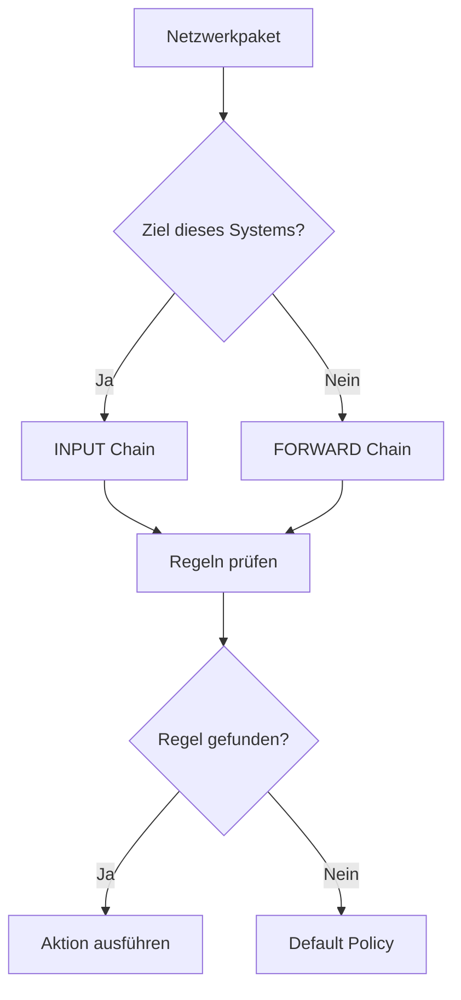

# IPTables

**IPTables** ist ein zentrales Werkzeug unter Linux zur **Konfiguration von Firewall-Regeln**.  
Es steuert, **welche Netzwerkpakete erlaubt, blockiert oder verändert werden**, und ist damit ein essenzieller Bestandteil der **Netzwerksicherheit**.

---

## Core Explanation

### 1. Grundprinzip

IPTables arbeitet regelbasiert:

- **Match (Bedingung)** → z. B. IP-Adresse, Port, Protokoll  
- **Target (Aktion)** → z. B. ACCEPT, DROP, REJECT  

-> Für jedes Paket wird geprüft:  
**„Trifft eine Regel zu?“ → „Dann führe die Aktion aus“**

---

### 2. Aufbau von IPTables

#### Tables (Tabellen)

| Tabelle | Zweck |
|--------|------|
| **filter** | Standard → Paketfilterung |
| **nat** | Netzwerkadressübersetzung (NAT) |
| **mangle** | Paketmanipulation |
| **raw** | Sonderfälle / Performance |

---

#### Chains (Ketten)

| Chain | Beschreibung |
|------|-------------|
| **INPUT** | eingehender Verkehr zum System |
| **OUTPUT** | ausgehender Verkehr |
| **FORWARD** | Weiterleitung durch das System |

-> Pakete durchlaufen diese Chains in definierter Reihenfolge

---

### 3. Ablauf eines Pakets



---

### 4. Targets (Aktionen)

| Target | Bedeutung |
|--------|----------|
| **ACCEPT** | Paket erlauben |
| **DROP** | Paket verwerfen (ohne Antwort) |
| **REJECT** | Paket ablehnen (mit Fehlermeldung) |
| **LOG** | Paket protokollieren |

---

### 5. Matches (Filterkriterien)

Typische Kriterien:

- `-p tcp` → Protokoll
- `--dport 80` → Zielport
- `-s 192.168.1.1` → Quell-IP
- `-d` → Ziel-IP

---

### 6. Beispielregel

```bash
iptables -A INPUT -p tcp --dport 80 -j ACCEPT
```

**Bedeutung:**

- `-A INPUT` → Regel zur INPUT-Chain hinzufügen  
- `-p tcp` → nur TCP-Verkehr  
- `--dport 80` → Zielport 80 (HTTP)  
- `-j ACCEPT` → Paket erlauben  

---

### 7. Default Policy

Wenn **keine Regel greift**, wird die **Standardaktion (Policy)** angewendet:

```bash
iptables -P INPUT DROP
```

-> Alle eingehenden Pakete werden blockiert, wenn keine Regel passt

---

### 8. Stateful Firewall (Verbindungszustände)

IPTables kann Verbindungen verfolgen:

| Zustand | Bedeutung |
|--------|----------|
| **NEW** | neue Verbindung |
| **ESTABLISHED** | bestehende Verbindung |
| **RELATED** | zu bestehender Verbindung gehörig |

#### Beispiel

```bash
iptables -A INPUT -m state --state ESTABLISHED,RELATED -j ACCEPT
```

-> Erlaubt Antworten auf bestehende Verbindungen

---

### 9. NAT und Masquerading

#### NAT (Network Address Translation)

- **SNAT** → Quelladresse ändern  
- **DNAT** → Zieladresse ändern  

#### Masquerading

```bash
iptables -t nat -A POSTROUTING -o eth0 -j MASQUERADE
```

-> Typisch für Router: internes Netzwerk → Internet

---

## Practical Example

### Minimal sichere Konfiguration

```bash
# Alles blockieren
iptables -P INPUT DROP

# Loopback erlauben
iptables -A INPUT -i lo -j ACCEPT

# Bestehende Verbindungen erlauben
iptables -A INPUT -m state --state ESTABLISHED,RELATED -j ACCEPT

# SSH erlauben
iptables -A INPUT -p tcp --dport 22 -j ACCEPT
```

-> Ergebnis: Nur notwendiger Verkehr wird erlaubt

---

## Exam Relevance

Wichtige Prüfungsinhalte:

- Aufbau:
  - Tables, Chains, Regeln
- Unterschied:
  - ACCEPT vs. DROP vs. REJECT
- Bedeutung der Chains:
  - INPUT / OUTPUT / FORWARD
- Stateful Firewall (NEW, ESTABLISHED, RELATED)
- Default Policy
- NAT und Masquerading

Typische Prüfungsfrage:

> Was passiert, wenn keine Regel zutrifft?

**Antwort:**

Die **Default Policy** der jeweiligen Chain wird angewendet.

---

## Common Mistakes & Clarifications

### 1. Reihenfolge der Regeln

-> IPTables arbeitet **von oben nach unten**

```bash
iptables -A INPUT ...
```

❗ Erste passende Regel gewinnt

---

### 2. DROP vs. REJECT

- **DROP** → keine Antwort (unsichtbar)
- **REJECT** → aktive Ablehnung

---

### 3. Sich selbst aussperren

```bash
iptables -P INPUT DROP
```

❗ ohne SSH-Regel → kein Zugriff mehr möglich

---

### 4. Regeln sind temporär

-> Nach Neustart oft gelöscht

✔ Lösung:
- `iptables-save`
- `iptables-persistent`

---

### 5. Veraltetes System

.> IPTables wird zunehmend ersetzt durch:

- **nftables** (moderner, effizienter)

---

## Merksätze

- IPTables = **regelbasierte Firewall**
- Reihenfolge der Regeln ist **entscheidend**
- Default Policy greift, wenn nichts passt
- Stateful Inspection ermöglicht **intelligente Filterung**
- Vorsicht: falsche Regeln können System unzugänglich machen

---

## Zusammenfassung

IPTables ist ein leistungsstarkes Werkzeug zur Kontrolle des Netzwerkverkehrs unter Linux. Es arbeitet mit Regeln, Chains und Tabellen, um Pakete gezielt zu filtern oder zu manipulieren. Besonders wichtig ist das Verständnis der Reihenfolge von Regeln, der Default Policies und der zustandsbasierten Verarbeitung, um sichere und funktionale Firewall-Konfigurationen zu erstellen.