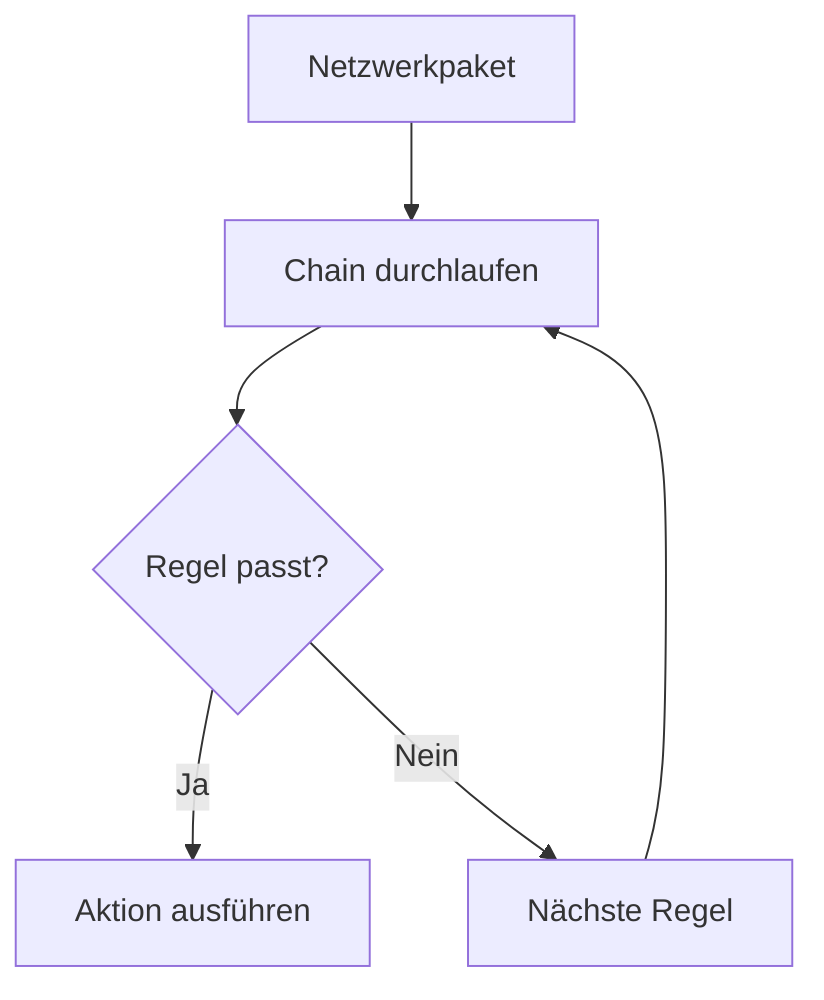

# NFTables

**NFTables** ist das moderne Framework zur **Firewall- und Paketfilterung unter Linux** und ersetzt langfristig **IPTables**.  
Es ermöglicht die **zentrale, effiziente und flexible Steuerung von Netzwerkverkehr** über eine einheitliche Syntax.

---

## Core Explanation

### 1. Grundprinzip

NFTables basiert auf einer klar strukturierten Architektur:

- **Tables** → Container für Regeln  
- **Chains** → Reihenfolge von Regeln  
- **Rules** → konkrete Filterlogik  

-> Jedes Netzwerkpaket wird anhand dieser Regeln bewertet:

**„Passt die Regel?“ → „Dann Aktion ausführen“**

---

### 2. Architektur von NFTables

#### Zentrale Komponenten

| Komponente | Beschreibung |
|-----------|-------------|
| **Table** | Sammlung von Chains |
| **Chain** | Sequenz von Regeln |
| **Rule** | Bedingung + Aktion |
| **Set** | Sammlung von Werten (z. B. IPs) |
| **Map** | Zuordnung von Werten (z. B. Port → Aktion) |

---

### 3. Ablauf der Paketverarbeitung



-> Verarbeitung erfolgt **sequenziell**, ähnlich wie bei IPTables – aber effizienter

---

### 4. Beispielregel

```bash
nft add rule ip filter input tcp dport 22 accept
```

**Bedeutung:**

- `ip filter input` → Tabelle + Chain  
- `tcp dport 22` → TCP-Port 22 (SSH)  
- `accept` → Paket erlauben  

---

### 5. Vorteile gegenüber IPTables

| Vorteil | Erklärung |
|--------|----------|
| **Einheitliche Syntax** | gleiche Struktur für IPv4, IPv6, ARP |
| **Bessere Performance** | effizientere Verarbeitung im Kernel |
| **Weniger Redundanz** | keine getrennten Tools wie iptables/ip6tables |
| **Sets & Maps** | leistungsstarke Gruppierungen |
| **Atomare Updates** | Änderungen ohne Zwischenzustände |

---

### 6. Sets und Maps (wichtiger Unterschied!)

#### Set-Beispiel

```bash
nft add set ip filter blacklist { type ipv4_addr\; }
```

-> Sammlung von IP-Adressen

---

#### Nutzung eines Sets

```bash
nft add rule ip filter input ip saddr @blacklist drop
```

-> Alle IPs im Set werden blockiert

---

### 7. Stateful Firewall (Verbindungsstatus)

NFTables unterstützt ebenfalls Zustände:

```bash
nft add rule ip filter input ct state established,related accept
```

-> Erlaubt Rückverkehr bestehender Verbindungen

---

### 8. NAT in NFTables

Beispiel (Masquerading):

```bash
nft add rule ip nat postrouting oifname "eth0" masquerade
```

-> Typisch für Router / Internetzugang

---

## Practical Example

### Minimal sichere Konfiguration

```bash
# Tabelle erstellen
nft add table ip filter

# Chain erstellen
nft add chain ip filter input { type filter hook input priority 0\; policy drop\; }

# Loopback erlauben
nft add rule ip filter input iif lo accept

# Bestehende Verbindungen erlauben
nft add rule ip filter input ct state established,related accept

# SSH erlauben
nft add rule ip filter input tcp dport 22 accept
```

-> Standardmäßig alles blockiert → nur definierte Regeln erlaubt

---

## Exam Relevance

Wichtige Prüfungsinhalte:

- Aufbau:
  - Tables, Chains, Rules
- Unterschied zu IPTables
- Vorteile:
  - einheitliche Syntax
  - höhere Effizienz
- Bedeutung von:
  - **Sets und Maps**
- Stateful Firewall (`ct state`)
- Default Policy (z. B. `drop`)

Typische Prüfungsfrage:

> Warum gilt NFTables als moderner als IPTables?

**Antwort:**

Weil es eine einheitliche Syntax, bessere Performance, weniger Redundanz und erweiterte Funktionen wie Sets und Maps bietet.

---

## Common Mistakes & Clarifications

### 1. Verwechslung mit IPTables-Syntax

❌ falsch:
```bash
iptables -A INPUT ...
```

✔ richtig:
```bash
nft add rule ...
```

---

### 2. Reihenfolge der Regeln

-> Auch hier gilt:

- Regeln werden **der Reihe nach geprüft**
- Erste passende Regel entscheidet

---

### 3. Fehlende Default Policy

Ohne Policy kann unerwarteter Traffic erlaubt sein

✔ Best Practice:
```bash
policy drop
```

---

### 4. Sets nicht nutzen

❌ viele Einzelregeln  
✔ besser: **Sets verwenden → effizienter**

---

### 5. Persistenz vergessen

-> Regeln gehen nach Neustart verloren

✔ Lösung:
- Konfiguration in `/etc/nftables.conf`

---

## Merksätze

- NFTables = **moderne Linux-Firewall**
- Einheitliche Syntax für alle Protokolle
- **Sets & Maps = großer Vorteil**
- Effizienter als IPTables
- Default Policy bestimmt Verhalten ohne Treffer

---

## Zusammenfassung

NFTables ist die moderne und leistungsfähigere Alternative zu IPTables und bietet eine klar strukturierte, einheitliche und effiziente Möglichkeit zur Firewall-Konfiguration unter Linux. Besonders hervorzuheben sind die erweiterten Funktionen wie Sets und Maps sowie die verbesserte Performance, die NFTables zur bevorzugten Lösung in aktuellen Linux-Systemen machen.