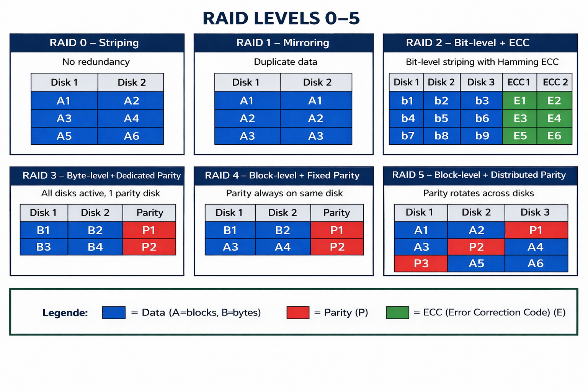
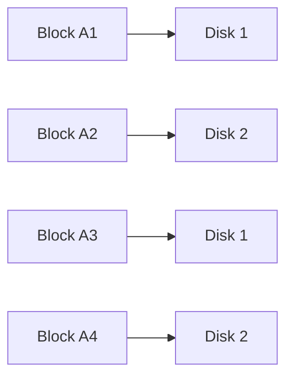
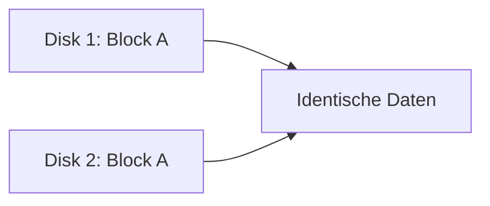
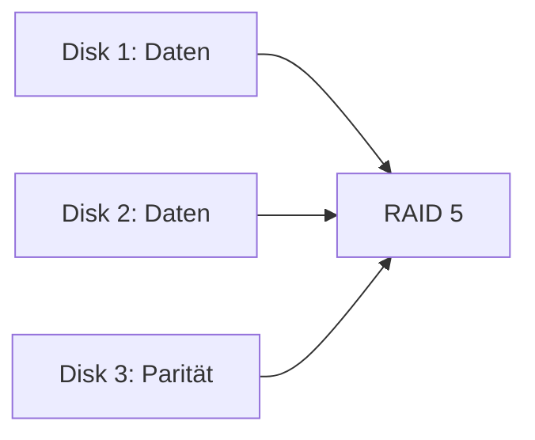
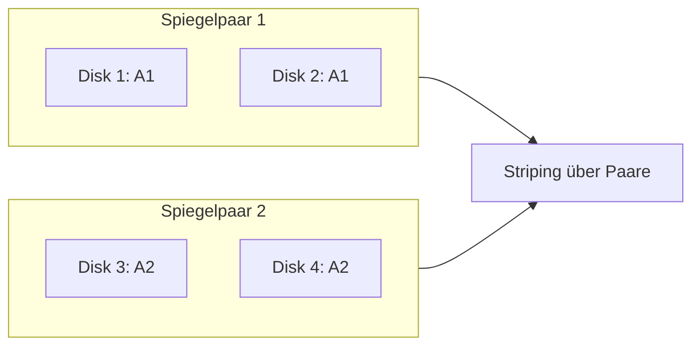
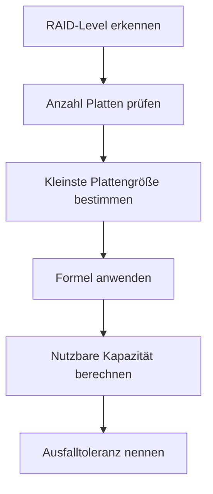

# RAID (Redundant Array of Independent Disks)

**RAID (Redundant Array of Independent Disks)** bezeichnet die Zusammenfassung mehrerer physischen Festplatten zu einem **logischen Laufwerk**, um je nach RAID-Level:

- die **Leistung** zu erhöhen,
- die **Verfügbarkeit** zu verbessern,
- oder **Datenredundanz** bereitzustellen.



Für die **AP1** ist RAID vor allem wichtig, weil man häufig:

- RAID-Level **vergleichen** muss,
- den **nutzbaren Speicherplatz berechnen** muss,
- die **Ausfallsicherheit bestimmen** muss,
- und ein geeignetes RAID für ein Szenario **begründen** soll.

---

## Core Explanation

### 1. Grundprinzip

RAID nutzt mehrere Festplatten nach bestimmten Verfahren:

- **Striping**: Daten werden auf mehrere Platten verteilt  
- **Mirroring**: Daten werden gespiegelt  
- **Parität**: zusätzliche Prüfdaten ermöglichen Rekonstruktion bei Ausfall  

Diese Verfahren führen zu unterschiedlichen Eigenschaften bei:

- **Kapazität**
- **Geschwindigkeit**
- **Ausfallsicherheit**
- **Kosten**

---

### 2. Wichtige Begriffe

| Begriff | Bedeutung |
|---|---|
| **Redundanz** | Daten liegen mehrfach oder rekonstruierbar vor |
| **Striping** | Verteilung von Datenblöcken auf mehrere Festplatten |
| **Mirroring** | exakte Spiegelung auf eine zweite Platte |
| **Parität** | Zusatzinformationen zur Wiederherstellung verlorener Daten |
| **Rebuild** | Wiederaufbau des RAID nach Austausch einer defekten Platte |
| **Hot Spare** | Reserveplatte, die bei Ausfall automatisch einspringen kann |

---

### 3. Die wichtigsten RAID-Level

## RAID 0

### Funktionsweise
RAID 0 verwendet **Striping**. Daten werden auf mindestens zwei Festplatten verteilt.



### Eigenschaften

- **Mindestanzahl Festplatten:** 2
- **Redundanz:** keine
- **Performance:** hoch
- **Ausfallsicherheit:** keine

### Bedeutung
RAID 0 ist schnell, aber sehr riskant. Fällt **eine** Platte aus, sind **alle Daten verloren**.

---

## RAID 1

### Funktionsweise
RAID 1 verwendet **Mirroring**. Alle Daten werden identisch auf zwei Festplatten gespeichert.



### Eigenschaften

- **Mindestanzahl Festplatten:** 2
- **Redundanz:** ja
- **Performance Lesen:** oft besser
- **Performance Schreiben:** ungefähr wie Einzeldisk
- **Ausfallsicherheit:** hoch

### Bedeutung
RAID 1 ist einfach und sicher. Es eignet sich gut, wenn Verfügbarkeit wichtiger ist als maximale Speicherausnutzung.

---

## RAID 5

### Funktionsweise
RAID 5 verwendet **Striping mit verteilter Parität**.



Die Paritätsblöcke liegen **verteilt** auf verschiedenen Festplatten, nicht immer auf derselben.

### Eigenschaften

- **Mindestanzahl Festplatten:** 3
- **Redundanz:** ja
- **Performance Lesen:** gut
- **Performance Schreiben:** langsamer als RAID 0/1 wegen Paritätsberechnung
- **Ausfallsicherheit:** Ausfall von **1** Platte tolerierbar

### Bedeutung
RAID 5 ist ein typischer Kompromiss aus Kapazität, Leistung und Sicherheit.

---

## RAID 6

### Funktionsweise
RAID 6 arbeitet wie RAID 5, aber mit **doppelter Parität**.

### Eigenschaften

- **Mindestanzahl Festplatten:** 4
- **Redundanz:** ja
- **Performance Lesen:** gut
- **Performance Schreiben:** langsamer als RAID 5
- **Ausfallsicherheit:** Ausfall von **2** Platten tolerierbar

### Bedeutung
RAID 6 eignet sich für Systeme mit hoher Verfügbarkeit und größeren Festplatten, weil das Risiko während des Rebuilds höher ist.

---

## RAID 10 (RAID 1+0)

### Funktionsweise
RAID 10 kombiniert **Mirroring (RAID 1)** und **Striping (RAID 0)**. Jeweils zwei Festplatten bilden ein Spiegelpaar (RAID 1), und diese Paare werden dann gestriped (RAID 0).



### Eigenschaften

- **Mindestanzahl Festplatten:** 4
- **Redundanz:** ja
- **Performance Lesen:** sehr gut (Striping + paralleles Lesen)
- **Performance Schreiben:** gut
- **Ausfallsicherheit:** mindestens 1 Platte pro Spiegelpaar; im günstigsten Fall bis zu n/2 Platten

### Nutzbare Kapazität

```text
(Anzahl der Platten / 2) × Kapazität der kleinsten Platte
```

**Beispiel:** 4 Platten × 1 TB → **(4 / 2) × 1 TB = 2 TB nutzbar**

### Bedeutung
RAID 10 bietet hohe Leistung und hohe Ausfallsicherheit, ist aber teuer (50 % Overhead). Es eignet sich besonders für Datenbanken und Systeme mit hohen Schreiblasten.

---

### 4. Vergleich der RAID-Level

| RAID-Level | Technik | Min. Platten | Nutzbare Kapazität | Ausfalltoleranz | Typische Eigenschaft |
|---|---:|---:|---|---|---|
| **RAID 0** | Striping | 2 | Summe aller Platten | 0 | sehr schnell, keine Sicherheit |
| **RAID 1** | Mirroring | 2 | Kapazität einer Platte | 1 Platte pro Spiegelpaar | einfach, sicher |
| **RAID 5** | Striping + Parität | 3 | Summe minus 1 Platte | 1 | guter Kompromiss |
| **RAID 6** | Striping + doppelte Parität | 4 | Summe minus 2 Platten | 2 | sehr hohe Sicherheit |
| **RAID 10** | Mirroring + Striping | 4 | Hälfte aller Platten | mind. 1 pro Spiegelpaar | schnell und sicher, aber teuer |

---

## Berechnungen für die AP1

### 1. IHK-Terminologie: Brutto- und Nettokapazität

Die IHK verwendet in Prüfungsaufgaben diese spezifischen Begriffe — lerne sie auswendig:

| IHK-Begriff | Bedeutung | Entspricht in diesen Notizen |
|---|---|---|
| **Bruttokapazität** | Gesamte Rohkapazität aller Festplatten | Rohkapazität / Gesamtkapazität |
| **Nettokapazität** | Tatsächlich nutzbare Kapazität nach RAID-Overhead | Nutzbare Kapazität |

```text
Bruttokapazität = Anzahl Platten × Kapazität einer Platte
Nettokapazität  = Bruttokapazität - Overhead (je nach RAID-Level)
```

**Prüfungsbeispiel:**

> Gegeben: 4 Festplatten à 2 TB im RAID 5  
> Bruttokapazität: 4 × 2 TB = **8 TB**  
> Nettokapazität:  (4 − 1) × 2 TB = **6 TB**  
> Overhead:  8 TB − 6 TB = **2 TB** (für Parität)

---

### 2. Grundregel für Prüfungsaufgaben

In AP1-Aufgaben gilt fast immer:

> **Alle Festplatten werden nur mit der Kapazität der kleinsten Festplatte genutzt.**

Beispiel:

- 1 TB
- 1 TB
- 2 TB

Dann rechnet man oft mit:

- **3 × 1 TB**, nicht mit 4 TB Gesamtrohkapazität

---

### 3. Formeln

## RAID 0

**Nutzbare Kapazität:**

```text
Anzahl der Platten × Kapazität der kleinsten Platte
```

**Beispiel:**

4 Platten × 2 TB = **8 TB**

**Ausfalltoleranz:**

```text
0 Platten
```

---

## RAID 1

**Nutzbare Kapazität:**

```text
Kapazität einer Platte
```

bei klassischem 2er-Spiegel.

Allgemeiner bei Spiegelung mehrerer Platten:

```text
Kapazität einer Platte pro Spiegelgruppe
```

**Beispiel:**

2 Platten × 1 TB → **1 TB nutzbar**

**Ausfalltoleranz:**

```text
Mindestens 1 Platte, solange noch eine Spiegelplatte vorhanden ist
```

Für AP1 meist vereinfacht:

- Bei 2 Platten im RAID 1 darf **1 Platte** ausfallen.

---

## RAID 5

**Nutzbare Kapazität:**

```text
(Anzahl der Platten - 1) × Kapazität der kleinsten Platte
```

**Beispiel:**

4 Platten × 2 TB:

```text
(4 - 1) × 2 TB = 6 TB
```

**Ausfalltoleranz:**

```text
1 Platte
```

---

## RAID 6

**Nutzbare Kapazität:**

```text
(Anzahl der Platten - 2) × Kapazität der kleinsten Platte
```

**Beispiel:**

6 Platten × 2 TB:

```text
(6 - 2) × 2 TB = 8 TB
```

**Ausfalltoleranz:**

```text
2 Platten
```

---

### 4. Typische AP1-Berechnungen: Nettokapazität

## Aufgabe 1: RAID 0

Gegeben:

- 2 Festplatten
- je 500 GB

Frage: Nutzbare Kapazität?

**Lösung:**

```text
2 × 500 GB = 1000 GB
```

**Ergebnis:** **1000 GB bzw. 1 TB**

---

## Aufgabe 2: RAID 1

Gegeben:

- 2 Festplatten
- je 2 TB

Frage: Nutzbare Kapazität?

**Lösung:**

```text
2 TB
```

weil die zweite Platte nur spiegelt.

**Ergebnis:** **2 TB**

---

## Aufgabe 3: RAID 5

Gegeben:

- 5 Festplatten
- je 1 TB

Frage: Nutzbare Kapazität?

**Lösung:**

```text
(5 - 1) × 1 TB = 4 TB
```

**Ergebnis:** **4 TB**

---

## Aufgabe 4: RAID 6

Gegeben:

- 6 Festplatten
- je 4 TB

Frage: Nutzbare Kapazität?

**Lösung:**

```text
(6 - 2) × 4 TB = 16 TB
```

**Ergebnis:** **16 TB**

---

## Aufgabe 5: Gemischte Plattengrößen

Gegeben:

- 3 Festplatten
- 500 GB, 500 GB, 1 TB
- RAID 5

**Prüfungslogik:**
Es zählt die kleinste Platte, also **500 GB**.

**Lösung:**

```text
(3 - 1) × 500 GB = 1000 GB
```

**Ergebnis:** **1 TB**

---

### 4b. Typische AP1-Berechnungen: Ausfallsicherheit

Nicht nur Nettokapazität wird gefragt — auch Ausfalltoleranz ist eine häufige Aufgabenart.

## Aufgabe 6: Ausfalltoleranz bestimmen

Gegeben:

- RAID 5
- 4 Festplatten

Frage: Wie viele Festplatten dürfen gleichzeitig ausfallen, ohne Datenverlust?

**Lösung:**

```text
RAID 5 → Ausfalltoleranz = 1 Platte
```

**Ergebnis:** **1 Festplatte**

---

## Aufgabe 7: Welches RAID überlebt diesen Ausfall?

Gegeben:

- Ein System mit 6 Festplatten
- 2 Festplatten fallen gleichzeitig aus

Frage: Welche RAID-Level würden diesen Ausfall **überstehen**?

**Lösung:**

| RAID-Level | Ausfalltoleranz | Übersteht 2 Ausfälle? |
|---|---|---|
| RAID 0 | 0 | Nein |
| RAID 1 | 1 | Nein (bei klassischem 2er-Paar) |
| RAID 5 | 1 | **Nein** |
| RAID 6 | 2 | **Ja** |
| RAID 10 | mind. 1 pro Paar | **Ja**, wenn je 1 aus verschiedenen Paaren |

**Ergebnis:** **RAID 6** und (unter Umständen) **RAID 10**

---

## Aufgabe 8: Vollständige Berechnung (Brutto + Netto + Overhead)

Gegeben:

- RAID 6
- 8 Festplatten à 4 TB

Fragen:

a) Bruttokapazität?  
b) Nettokapazität?  
c) Overhead-Kapazität?  
d) Ausfalltoleranz?

**Lösung:**

```text
a) Bruttokapazität = 8 × 4 TB = 32 TB
b) Nettokapazität  = (8 - 2) × 4 TB = 24 TB
c) Overhead        = 32 TB - 24 TB = 8 TB (= 2 Paritätsplatten)
d) Ausfalltoleranz = 2 Platten
```

---

### 5. Merktabelle: Alle Formeln auf einen Blick (Prüfungsreferenz)

| RAID | Min. Platten | Nettokapazität (Formel) | Bruttokapazität | Ausfalltoleranz | Effizienz |
|---|---:|---|---|---:|---:|
| **RAID 0** | 2 | `n × P` | `n × P` | 0 | 100 % |
| **RAID 1** | 2 | `1 × P` | `n × P` | n−1 (ein Exemplar muss übrig) | 50 % |
| **RAID 5** | 3 | `(n−1) × P` | `n × P` | 1 | (n−1)/n |
| **RAID 6** | 4 | `(n−2) × P` | `n × P` | 2 | (n−2)/n |
| **RAID 10** | 4 | `(n/2) × P` | `n × P` | mind. 1 pro Paar | 50 % |

> **Legende:** n = Anzahl Platten, P = Kapazität der kleinsten Platte

---

### 6. Rückwärtsrechnung: Wie viele Platten brauche ich?

Manchmal fragt die Prüfung nicht nach der nutzbaren Kapazität, sondern wie viele Platten man für eine **gewünschte** Kapazität benötigt.

**Vorgehen:**

```text
Nutzdaten-Platten = Gewünschte Kapazität / Plattenkapazität
Gesamtplatten     = Nutzdaten-Platten + Overhead-Platten (aufgerundet auf ganze Zahl)
```

| RAID-Level | Overhead-Platten |
|---|---|
| RAID 0 | 0 |
| RAID 1 | +1 (Spiegel) |
| RAID 5 | +1 (Parität) |
| RAID 6 | +2 (doppelte Parität) |
| RAID 10 | doppelt so viele wie Nutzdaten-Platten |

**Beispiel: RAID 5, Ziel 6 TB, Platten à 2 TB**

```text
Nutzdaten-Platten = 6 TB / 2 TB = 3 Platten
Gesamtplatten     = 3 + 1       = 4 Platten
```

**Probe:** (4 − 1) × 2 TB = 6 TB ✓

**Beispiel: RAID 6, Ziel 8 TB, Platten à 2 TB**

```text
Nutzdaten-Platten = 8 TB / 2 TB = 4 Platten
Gesamtplatten     = 4 + 2       = 6 Platten
```

**Probe:** (6 − 2) × 2 TB = 8 TB ✓

---

### 7. Speichereffizienz

Die **Speichereffizienz** gibt an, wie viel Prozent der Rohkapazität tatsächlich nutzbar ist:

```text
Effizienz = (nutzbare Kapazität / Gesamtkapazität) × 100 %
```

| RAID-Level | Effizienz (Mindestzahl Platten) | Effizienz (mehr Platten) |
|---|---|---|
| RAID 0 | 100 % | 100 % |
| RAID 1 | 50 % | 50 % |
| RAID 5 | 67 % (3 Platten) | 75 % (4), 80 % (5) ... |
| RAID 6 | 50 % (4 Platten) | 67 % (6), 75 % (8) ... |
| RAID 10 | 50 % | 50 % |

> **Prüfungstipp:** Bei RAID 5 und 6 steigt die Effizienz mit mehr Platten. Bei RAID 0, 1 und 10 bleibt sie konstant.

---

## Practical Example

### Beispiel: Auswahl für einen Fileserver

Ein Unternehmen benötigt:

- gute Kapazität
- Schutz vor Festplattenausfall
- akzeptable Schreib- und Lesegeschwindigkeit

Mögliche Bewertung:

- **RAID 0**: zu unsicher
- **RAID 1**: sicher, aber geringe Speicherausnutzung
- **RAID 5**: oft gute Wahl
- **RAID 6**: besser bei höherem Sicherheitsbedarf

**Begründete Entscheidung:**
Für einen normalen Fileserver ist **RAID 5** oft wirtschaftlich sinnvoll, weil eine Platte ausfallen darf und trotzdem relativ viel Speicher nutzbar bleibt.

---

## AP1-Prüfungsrelevanz

### Was du für die AP1 wirklich können musst

Für die AP1 solltest du RAID nicht nur definieren können, sondern vor allem **anwenden**.

Wichtige Kompetenzen:

1. **RAID-Level erkennen und unterscheiden**
2. **Nutzbare Kapazität berechnen**
3. **Anzahl tolerierbarer Plattenausfälle angeben**
4. **geeignetes RAID für ein Szenario auswählen**
5. **erklären, warum RAID kein Backup ersetzt**

---

### Typische AP1-Fragen

#### Frage 1
Welches RAID-Level bietet **keine Redundanz**, aber hohe Leistung?

**Antwort:** RAID 0

---

#### Frage 2
Wie viel nutzbarer Speicher steht bei **4 × 2 TB in RAID 5** zur Verfügung?

**Lösung:**

```text
(4 - 1) × 2 TB = 6 TB
```

**Antwort:** 6 TB

---

#### Frage 3
Wie viele Festplatten dürfen bei RAID 6 ausfallen, ohne dass Daten verloren gehen?

**Antwort:** 2 Festplatten

---

#### Frage 4
Warum ersetzt RAID kein Backup?

**Antwort:**
Weil RAID nur gegen den **Ausfall von Festplatten** schützt, nicht gegen:

- versehentliches Löschen
- Schadsoftware
- Ransomware
- Dateibeschädigung
- Feuer, Diebstahl, Überspannung

| Merkmal | RAID | Backup |
|---|---|---|
| Schutz vor Plattenausfall | Ja | Nur durch Wiederherstellung |
| Schutz vor versehentlichem Löschen | **Nein** | Ja |
| Schutz vor Ransomware | **Nein** | Ja (wenn Backup offline) |
| Schutz vor Feuer / Diebstahl | **Nein** | Ja (wenn externes Backup) |
| Datenzugriff ohne Unterbrechung | Ja | Nein (Restore dauert) |
| Beides zusammen empfohlen? | **Ja — RAID ersetzt kein Backup** | |

---

### Prüfungstipp

Bei AP1-Aufgaben fast immer in dieser Reihenfolge denken:



---

## Common Mistakes & Clarifications

### 1. RAID mit Backup verwechseln

Das ist einer der häufigsten Fehler.

**RAID schützt vor Plattenausfall.**  
**Backup schützt vor Datenverlust allgemein.**

Beides hat unterschiedliche Aufgaben.

---

### 2. Gesamtkapazität einfach addieren

Falsch wäre z. B. bei RAID 5 mit 4 × 2 TB einfach **8 TB** zu schreiben.

Richtig ist:

```text
(4 - 1) × 2 TB = 6 TB
```

Denn eine Plattenkapazität geht für Parität drauf.

---

### 3. Unterschied zwischen Performance und Sicherheit nicht beachten

- RAID 0: Fokus auf Geschwindigkeit
- RAID 1: Fokus auf Sicherheit
- RAID 5: Balance
- RAID 6: höhere Sicherheit, mehr Overhead

---

### 4. Gemischte Festplattengrößen falsch rechnen

In Prüfungen wird meist mit der **kleinsten Platte** gerechnet.

---

### 5. Rebuild-Risiko unterschätzen

Gerade bei RAID 5 und RAID 6 ist der Wiederaufbau nach einem Defekt kritisch:

- dauert lange
- belastet das System
- erhöht das Risiko eines zweiten Ausfalls

---

## Merksätze

- **RAID 0 = schnell, aber ohne Schutz**
- **RAID 1 = Spiegelung, einfach und sicher**
- **RAID 5 = eine Platte für Parität**
- **RAID 6 = zwei Platten für Parität**
- **RAID ist kein Backup**
- **Für Prüfungen immer mit der kleinsten Festplatte rechnen**

---

## Zusammenfassung

RAID kombiniert mehrere Festplatten zu einem logischen Speicherverbund, um je nach RAID-Level entweder die Leistung, die Verfügbarkeit oder beides zu verbessern. Für die AP1 ist vor allem wichtig, die Unterschiede zwischen **RAID 0, 1, 5 und 6** sicher zu beherrschen, die **nutzbare Kapazität korrekt zu berechnen** und die **Ausfallsicherheit** angeben zu können. Entscheidend ist nicht nur die Definition, sondern die praktische Anwendung in Rechen- und Entscheidungssituationen.