# UML-Klassendiagramm

## Kurzüberblick

Ein **UML-Klassendiagramm** zeigt die **statische Struktur** eines objektorientierten Systems.

Es beschreibt:

- welche **Klassen** es gibt,
- welche **Attribute** und **Methoden** diese Klassen besitzen,
- und **wie Klassen miteinander verbunden sind**.

Das Klassendiagramm gehört zu den wichtigsten UML-Diagrammen für die FIAE-Ausbildung und ist **stark AP1-relevant**.

---

## Definition

Ein **Klassendiagramm** ist ein UML-Strukturdiagramm zur Darstellung von Klassen, ihren Eigenschaften, ihren Operationen und ihren Beziehungen.

Es beantwortet typische Fragen wie:

- Welche Klassen gibt es?
- Welche Daten speichert eine Klasse?
- Welche Funktionen bietet eine Klasse an?
- Welche Beziehungen bestehen zwischen Klassen?

Wichtig:

Ein Klassendiagramm zeigt **nicht den Programmablauf**, sondern den **Aufbau** eines Systems.

---

## Aufbau einer Klasse

Eine Klasse wird in UML typischerweise als Rechteck mit **drei Bereichen** dargestellt:

1. **Klassenname**
2. **Attribute**
3. **Methoden / Operationen**

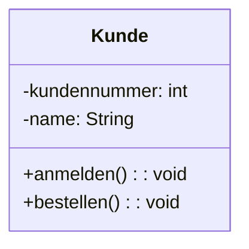

### Bedeutung der Bereiche

| Bereich | Inhalt |
|---|---|
| Klassenname | Name der Klasse |
| Attribute | Daten / Eigenschaften der Klasse |
| Methoden | Verhalten / Funktionen der Klasse |

---

## Schreibweise im Klassendiagramm

### Klassenname

Der Klassenname steht oben und wird üblicherweise:

- **im Singular**
- **mit großem Anfangsbuchstaben**
- als **Substantiv**

geschrieben.

Beispiele:

- `Kunde`
- `Produkt`
- `Rechnung`
- `Bestellung`

---

### Attribute

Attribute beschreiben die **Eigenschaften** einer Klasse.

Typische Schreibweise:

```text
sichtbarkeit attributname: datentyp
```

Beispiel:

```text
-name: String
-preis: double
-lagerbestand: int
```

### Beispiel

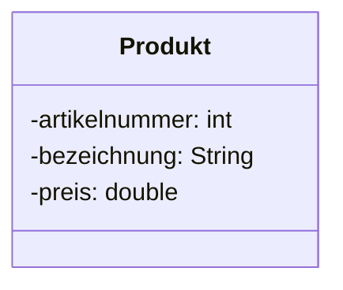

---

### Methoden / Operationen

Methoden beschreiben das **Verhalten** einer Klasse.

Typische Schreibweise:

```text
sichtbarkeit methodenname(parameter: typ): rückgabetyp
```

Beispiele:

```text
+berechnePreis(): double
+setzePreis(neuerPreis: double): void
```

### Beispiel

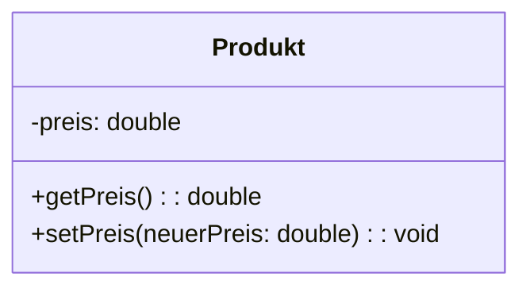

---

## Sichtbarkeitssymbole

Die Sichtbarkeit ist ein zentrales Thema im Klassendiagramm.

| Symbol | Bedeutung | Sichtbarkeit |
|---|---|---|
| `+` | public | öffentlich |
| `-` | private | privat |
| `#` | protected | geschützt |
| `~` | package | paketintern |

### Für AP1 besonders wichtig

In Einsteiger- und Prüfungsaufgaben sind vor allem diese beiden wichtig:

- `+` = öffentlich
- `-` = privat

### Beispiel

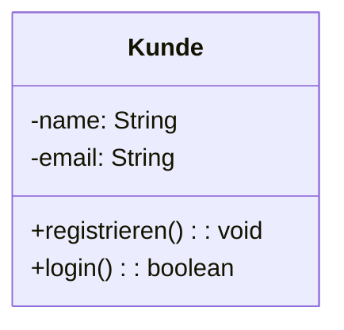

Hier gilt:

- `name` und `email` sind **private**
- `registrieren()` und `login()` sind **public**

---

## Datentypen

Attribute und Methoden verwenden Datentypen.

Typische Datentypen in UML-Notizen:

- `int`
- `double`
- `boolean`
- `char`
- `String`

Beispiel:

| Attribut | Datentyp |
|---|---|
| `name` | `String` |
| `alter` | `int` |
| `preis` | `double` |
| `aktiv` | `boolean` |

---

## Beziehungen zwischen Klassen

Ein Klassendiagramm besteht nicht nur aus einzelnen Klassen, sondern vor allem auch aus deren **Beziehungen**.

Die wichtigsten Beziehungen für AP1 sind:

- Assoziation
- Aggregation
- Komposition
- Vererbung
- Abhängigkeit

---

### 1. Assoziation

Eine **Assoziation** ist eine allgemeine Beziehung zwischen zwei Klassen.

Beispiel:

- Ein `Kunde` gibt eine `Bestellung` auf.

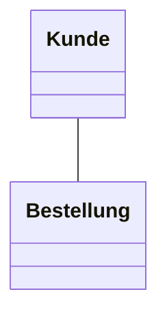

### Bedeutung

Zwischen den Klassen besteht eine fachliche Verbindung.

---

### 2. Multiplizität / Kardinalität

An Beziehungen kann angegeben werden, **wie viele Objekte** beteiligt sind.

Typische Angaben:

- `1`
- `0..1`
- `*`
- `0..*`
- `1..*`

### Beispiele

| Schreibweise | Bedeutung |
|---|---|
| `1` | genau eins |
| `0..1` | null oder eins |
| `*` | beliebig viele |
| `0..*` | null bis viele |
| `1..*` | mindestens eins |

### Beispiel

Ein Kunde kann viele Bestellungen haben, eine Bestellung gehört genau einem Kunden.

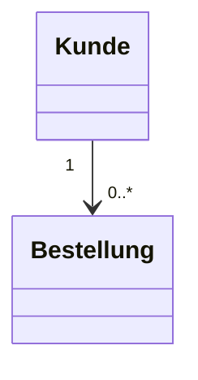

---

### 3. Vererbung / Generalisierung

Bei der **Vererbung** übernimmt eine Unterklasse Eigenschaften und Methoden einer Oberklasse.

Beispiel:

- `Mitarbeiter` ist Oberklasse
- `Administrator` ist Unterklasse

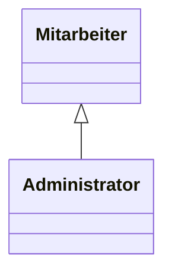

### Bedeutung

- Unterklasse **erbt** von Oberklasse
- gemeinsames Verhalten kann zentral modelliert werden

### Beispiel mit Inhalt

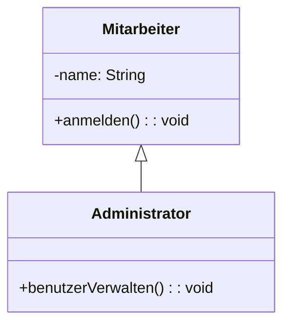

---

### 4. Aggregation

Eine **Aggregation** beschreibt eine schwache Teil-Ganzes-Beziehung.

Beispiel:

- Eine `Klasse` enthält `Schüler`
- Die Schüler können aber auch ohne diese konkrete Klasse existieren

Symbol:

- **leere Raute**

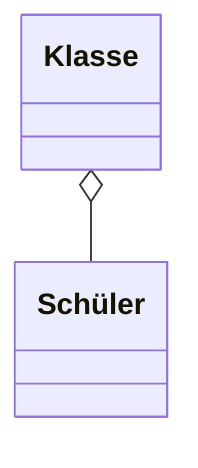

### Bedeutung

Das Teil kann auch unabhängig vom Ganzen existieren.

---

### 5. Komposition

Eine **Komposition** beschreibt eine starke Teil-Ganzes-Beziehung.

Beispiel:

- Ein `Haus` besteht aus `Räumen`
- Die Räume gehören fest zu diesem Haus

Symbol:

- **gefüllte Raute**

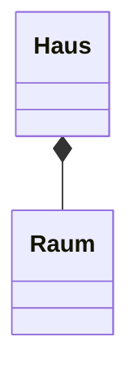

### Bedeutung

Das Teil ist eng an das Ganze gebunden.

---

### 6. Abhängigkeit

Eine **Abhängigkeit** liegt vor, wenn eine Klasse eine andere nur kurzzeitig nutzt.

Beispiel:

- `RechnungService` nutzt `Drucker`

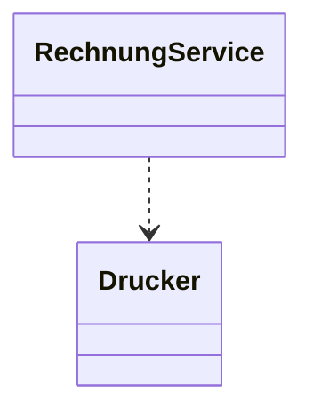

### Bedeutung

Eine Klasse verwendet eine andere, ohne eine dauerhafte starke Beziehung aufzubauen.

---

## Übersicht der wichtigsten Beziehungssymbole

| Beziehung | Symbolidee | Bedeutung |
|---|---|---|
| Assoziation | einfache Linie | allgemeine Verbindung |
| Vererbung | Linie mit hohlem Dreieck | ist-ein-Beziehung |
| Aggregation | Linie mit leerer Raute | schwache Teil-Ganzes-Beziehung |
| Komposition | Linie mit gefüllter Raute | starke Teil-Ganzes-Beziehung |
| Abhängigkeit | gestrichelte Linie mit Pfeil | verwendet kurzzeitig |

---

## Beispiel eines vollständigen UML-Klassendiagramms

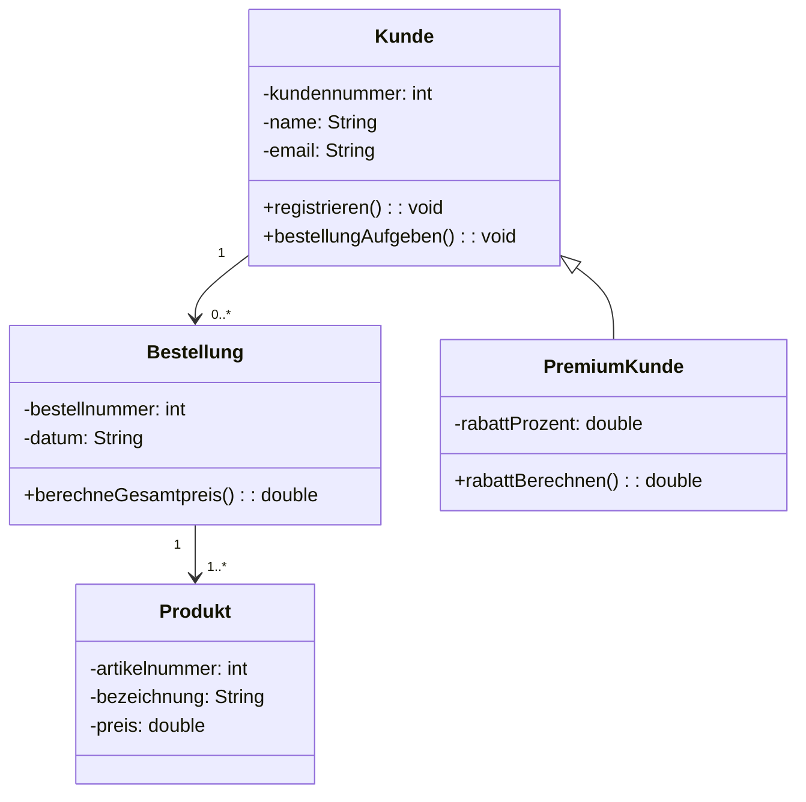

---

## Erklärung des Beispiels

### Klassen

- `Kunde`
- `Bestellung`
- `Produkt`
- `PremiumKunde`

### Beziehungen

- Ein **Kunde** kann **0 bis viele Bestellungen** haben.
- Eine **Bestellung** enthält **mindestens ein Produkt**.
- `PremiumKunde` ist eine Spezialisierung von `Kunde`.

### Fachliche Aussage

Das Diagramm beschreibt die Grundstruktur eines kleinen Shopsystems.

---

## Wie erstellt man ein UML-Klassendiagramm?

### Schritt 1: Fachliche Klassen finden

Zuerst werden wichtige Begriffe des Problems identifiziert.

Beispiel Onlineshop:

- Kunde
- Produkt
- Bestellung
- Rechnung

### Schritt 2: Attribute festlegen

Dann wird überlegt:

- Welche Daten gehören zu dieser Klasse?

Beispiel `Produkt`:

- artikelnummer
- bezeichnung
- preis

### Schritt 3: Methoden ergänzen

Danach wird festgelegt:

- Was kann die Klasse tun?

Beispiel `Bestellung`:

- gesamtpreisBerechnen()
- stornieren()

### Schritt 4: Beziehungen eintragen

Jetzt wird modelliert:

- Welche Klassen hängen zusammen?
- Wie viele Objekte stehen zueinander in Beziehung?
- Gibt es Vererbung?

### Schritt 5: Sichtbarkeiten sauber setzen

Typisch in OOP:

- Attribute oft `private`
- Methoden oft `public`

---

## Typische Modellierungsregeln

- Klassen als **Substantive** benennen
- Methoden als **Verben** formulieren
- Attribute möglichst **privat**
- Beziehungen fachlich sinnvoll setzen
- Kardinalitäten nicht vergessen
- nicht zu viele Details in ein einziges Diagramm packen

---

## Häufige Fehler

### 1. Attribute und Methoden verwechseln

Falsch:

- `name()` als Attribut
- `preis` als Methode

Richtig:

- `name: String` ist Attribut
- `berechnePreis(): double` ist Methode

### 2. Sichtbarkeit vergessen

Gerade in Prüfungen sollte klar erkennbar sein:

- `+` öffentlich
- `-` privat

### 3. Keine Datentypen angeben

Datentypen gehören in UML-Grundaufgaben meist dazu.

### 4. Beziehungen ohne Bedeutung zeichnen

Nicht jede Klasse muss mit jeder anderen verbunden sein.

### 5. Vererbung und Assoziation verwechseln

- Vererbung = **ist-ein**
- Assoziation = **hat / kennt / nutzt**

Beispiel:

- `Administrator` **ist ein** `Mitarbeiter`
- `Kunde` **hat** `Bestellungen`

---

## AP1-Prüfungsrelevanz

Für AP1 solltest du beim UML-Klassendiagramm besonders sicher können:

### 1. Klasse aufbauen

- Klassenname
- Attribute
- Methoden

### 2. Sichtbarkeitssymbole lesen

- `+`
- `-`
- `#`

### 3. Datentypen verstehen

- `int`
- `String`
- `boolean`
- `double`

### 4. Beziehungen erkennen

- Assoziation
- Vererbung
- Aggregation
- Komposition

### 5. Kardinalitäten lesen

- `1`
- `0..1`
- `0..*`
- `1..*`

### 6. Ein einfaches Klassendiagramm selbst erstellen

Zum Beispiel für:

- Bibliothek
- Onlineshop
- Schule
- Ticketsystem

---

## Typische AP1-Fragen

### Was zeigt ein UML-Klassendiagramm?

Ein UML-Klassendiagramm zeigt die statische Struktur eines Systems mit Klassen, Attributen, Methoden und Beziehungen.

### Wofür stehen `+` und `-`?

- `+` steht für `public`
- `-` steht für `private`

### Was ist der Unterschied zwischen Attribut und Methode?

- Ein Attribut speichert Daten.
- Eine Methode beschreibt Verhalten.

### Was bedeutet Vererbung?

Eine Unterklasse übernimmt Eigenschaften und Methoden einer Oberklasse.

### Was bedeuten Kardinalitäten?

Sie geben an, wie viele Objekte in einer Beziehung beteiligt sind.

---

## Merksätze

- **Klassendiagramm = statischer Aufbau eines Systems**
- **Klasse = Name + Attribute + Methoden**
- **Attribute speichern Daten**
- **Methoden beschreiben Verhalten**
- **`+` = public, `-` = private**
- **Vererbung = ist-ein**
- **Assoziation = kennt / hat Beziehung**
- **Kardinalitäten zeigen die Anzahl von Beziehungen**

---

## Zusammenfassung

Das **UML-Klassendiagramm** ist eines der wichtigsten Diagramme der objektorientierten Modellierung. Es zeigt:

- Klassen
- Attribute
- Methoden
- Sichtbarkeiten
- Datentypen
- Beziehungen zwischen Klassen
- Kardinalitäten

Für FIAE und besonders für **AP1** ist es zentral, den **Aufbau**, die **Symbole** und die **Bedeutung der Verbindungen** sicher lesen und selbst anwenden zu können.

---

## Übungsaufgaben

1. Erkläre den Aufbau einer UML-Klasse.
2. Nenne die Bedeutung von `+`, `-`, `#` und `~`.
3. Erstelle ein Klassendiagramm für ein Bibliothekssystem mit den Klassen `Buch`, `Leser`, `Ausleihe`.
4. Erkläre den Unterschied zwischen Assoziation und Vererbung.
5. Erkläre den Unterschied zwischen Aggregation und Komposition.
6. Lies das folgende fachliche Szenario und modelliere ein Klassendiagramm:  
   Ein Kunde kann mehrere Bestellungen aufgeben. Jede Bestellung enthält mindestens ein Produkt.
7. Begründe, warum Attribute meist `private` und Methoden oft `public` sind.
8. Erkläre, was eine Kardinalität von `0..*` bedeutet.
9. Erstelle ein Klassendiagramm für ein Ticketsystem mit den Klassen `Ticket`, `Benutzer`, `SupportMitarbeiter`.
10. Erkläre, warum Vererbung in der objektorientierten Programmierung wichtig ist.
