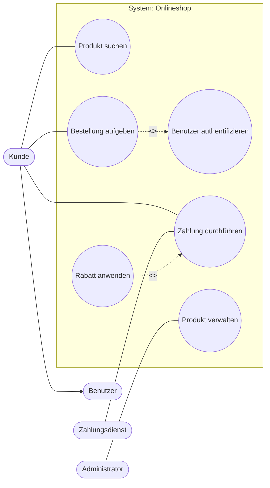

# Use-Case-Diagramm

## AP1-Fokus in 60 Sekunden

Ein Use-Case-Diagramm zeigt die fachliche Sicht auf ein System:

- Wer interagiert mit dem System? (Akteure)
- Welche Ziele/Funktionen liefert das System? (Use Cases)
- Wo liegt die Grenze zwischen System und Umgebung? (Systemgrenze)

Es zeigt nicht die technische Umsetzung (kein Code, keine Klassen, keine Datenbankstruktur).

---

## UML-Symbole und Linientypen (wichtig fuer AP1)

| Element | UML-Darstellung | Linie/Notation | Bedeutung |
|---|---|---|---|
| Akteur | Strichmaennchen | - | Externe Rolle/System |
| Use Case | Ellipse | - | Fachlicher Anwendungsfall mit Nutzen |
| Systemgrenze | Rechteck um Use Cases | - | Was zum betrachteten System gehoert |
| Assoziation | Verbindung Akteur <-> Use Case | durchgezogene Linie | Akteur nutzt Use Case |
| Include | Use Case -> Use Case | gestrichelter Pfeil + `<<include>>` | Pflicht-Teilablauf, immer |
| Extend | Use Case -> Use Case | gestrichelter Pfeil + `<<extend>>` | Optionale/bedingte Erweiterung |
| Generalisierung | Spezialisierung | durchgezogene Linie mit hohlem Dreieck | Vererbung/Spezialisierung |

Richtung merken:

- `<<include>>`: Pfeil zeigt auf den eingebundenen (wiederverwendeten) Use Case.
- `<<extend>>`: Pfeil zeigt auf den Basis-Use-Case, der erweitert wird.
- Generalisierung: Dreieck zeigt auf das allgemeinere Element.

---

## Mini-Legende 

| Was? | So erkennst du es | Bedeutung |
|---|---|---|
| Assoziation | Akteur --- Use Case (durchgezogen) | Akteur nutzt den Use Case |
| Include | Use Case A -.-> Use Case B + `<<include>>` | Pflicht-Teilablauf |
| Extend | Use Case A -.-> Use Case B + `<<extend>>` | Optionale/bedingte Erweiterung |
| Generalisierung | Spezialisiert --|> Allgemein | Vererbung/Spezialisierung |

Kurz zur Richtung:

- Bei `<<include>>` zeigt der Pfeil auf den eingebundenen Use Case.
- Bei `<<extend>>` zeigt der Pfeil auf den Basis-Use-Case.
- Bei Generalisierung zeigt das Dreieck auf das allgemeinere Element.

---

## Beispieldiagramm (Onlineshop)

Hinweis: Mermaid ist fuer Lernnotizen gut, aber nicht 100 % UML-Notation. Die Bedeutung von gestrichelt/durchgezogen und Pfeilrichtung bleibt aber pruefungsrelevant gleich.

---

## AP1-Pruefungsaufgaben mit Loesungen

## Aufgabe 1 - Begriffssicherheit (Einfachauswahl)

Welche Aussage ist korrekt?

- (A) Ein Use Case beschreibt interne Klassenstrukturen.
- (B) Ein Akteur ist immer eine konkrete Person mit Namen.
- (C) Ein Use Case beschreibt ein fachliches Ziel mit Nutzen.
- (D) Die Systemgrenze zeigt nur die Datenbanktabellen.

Antwort anzeigen

**Loesung: (C)**

---

## Aufgabe 2 - Include vs. Extend (Mehrfachauswahl)

Welche Aussagen treffen zu?

- (A) `<<include>>` steht fuer verpflichtende Wiederverwendung.
- (B) `<<extend>>` wird immer ausgefuehrt.
- (C) `<<extend>>` modelliert optionale oder bedingte Erweiterungen.
- (D) Bei `<<include>>` zeigt der Pfeil auf den eingebundenen Use Case.

Antwort anzeigen

**Loesung: (A), (C), (D)**

---

## Aufgabe 3 - Linien und Symbole (Zuordnung)

Ordne richtig zu:

| Darstellung | Bedeutung |
|---|---|
| Durchgezogene Linie Akteur-Use Case | ? |
| Gestrichelter Pfeil mit `<<include>>` | ? |
| Gestrichelter Pfeil mit `<<extend>>` | ? |
| Hohles Dreieck | ? |

Loesung anzeigen

- Assoziation
- Pflicht-Einbindung eines Use Cases
- Optionale/bedingte Erweiterung
- Generalisierung

---

## Aufgabe 4 - Modellierungsfehler erkennen (Strukturierte Aufgabe)

Gegeben: In einem Diagramm steht die interne Datenbank als Akteur ausserhalb der Systemgrenze.

1. Nenne den Fehler. (1 Punkt)
2. Begruende fachlich. (2 Punkte)
3. Nenne eine korrekte Alternative. (1 Punkt)

Loesung anzeigen

1. Fehler: Die interne Datenbank wurde als externer Akteur modelliert.
2. Begruendung: Akteure sind Rollen oder externe Systeme ausserhalb des betrachteten Systems. Interne Komponenten gehoeren in die Systemumsetzung, nicht ins Use-Case-Diagramm.
3. Alternative: Nur externe Rollen/Systeme als Akteur zeigen (z. B. Kunde, Zahlungsdienst).

---

## Aufgabe 5 - Kurzfall AP1 (Anwendungsaufgabe)

Szenario: Ticketshop mit Akteuren Kunde, Admin, Zahlungsanbieter.

1. Nenne 4 sinnvolle Use Cases. (2 Punkte)
2. Formuliere 1 `<<include>>`-Beziehung. (1 Punkt)
3. Formuliere 1 `<<extend>>`-Beziehung. (1 Punkt)

Beispielloesung anzeigen

1. Veranstaltung suchen, Ticket kaufen, Zahlung durchfuehren, Veranstaltung verwalten
2. `Ticket kaufen` `<<include>>` `Zahlung durchfuehren`
3. `Gutschein einloesen` `<<extend>>` `Zahlung durchfuehren`

---

## AP1-Schnellcheck (Selbsttest)

- Kann ich Akteur vs. Use Case in 10 Sekunden unterscheiden?
- Kenne ich die Richtung von `<<include>>` und `<<extend>>`?
- Erkenne ich technische statt fachlicher Bezeichnungen sofort?
- Nutze ich die Systemgrenze konsequent?

Wenn du 3 von 4 mit Ja beantwortest, bist du bei dem Thema meist pruefungssicher.

---

## Reflexion (spaeter ausfuellen)

## Direkt nach dem Lernen

| Frage | Deine Notiz |
|---|---|
| Was war heute neu fuer mich? | |
| Wo verwechsel ich noch `include`/`extend`? | |
| Welche typische AP1-Falle habe ich erkannt? | |

## Vor der naechsten Wiederholung

| Frage | Deine Notiz |
|---|---|
| Welche Aufgabe konnte ich ohne Hilfe loesen? | |
| Wo brauche ich noch ein eigenes Beispiel? | |
| Was ist mein Fokus fuer die naechste Einheit? | |

---

## Merksaetze

- Use-Case-Diagramme zeigen fachliche Anforderungen, nicht Technik.
- Akteure sind Rollen ausserhalb der Systemgrenze.
- `<<include>>` = Pflichtbaustein.
- `<<extend>>` = optionale/bedingte Erweiterung.
- Pfeilrichtung und Linientyp sind in AP1 oft der Schluessel zur richtigen Antwort.