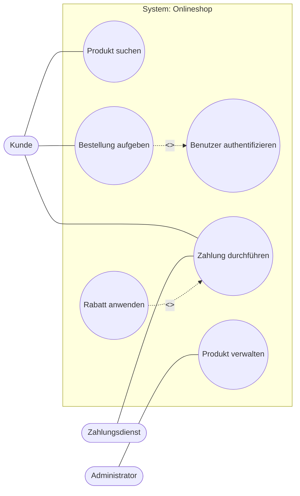

# Use-Case-Diagramm

## Kurzüberblick

Ein **Use-Case-Diagramm** beschreibt, **welche fachlichen Funktionen** ein System aus Sicht von Benutzern oder externen Systemen bereitstellt.

Es gehört zur **Anforderungsanalyse** und beantwortet vor allem diese Fragen:

- **Wer** nutzt das System?
- **Welche fachlichen Ziele** verfolgen diese Nutzer?
- **Welche Leistungen** stellt das System dafür bereit?

Ein Use-Case-Diagramm zeigt **nicht**, wie das System intern technisch umgesetzt wird. Es modelliert also **keine Klassen**, **keine Datenbanktabellen**, **keinen Programmcode** und **keine Benutzeroberflächen im Detail**.

---

## Einordnung in UML

Das Use-Case-Diagramm ist ein **UML-Diagramm zur fachlichen Sicht auf ein System**. Es hilft dabei, Anforderungen verständlich darzustellen, bevor die technische Umsetzung geplant wird.

Damit ist es besonders nützlich in frühen Projektphasen, zum Beispiel bei:

- Anforderungsaufnahme
- Fachkonzept
- Kommunikation mit Auftraggebern
- Abgrenzung des Systemumfangs

---

## Kernelemente

## 1. Akteur

Ein **Akteur** ist eine **Rolle außerhalb des Systems**, die mit dem System interagiert.

Typische Beispiele:

- Kunde
- Administrator
- Mitarbeiter
- Zahlungsdienst
- externes Buchhaltungssystem

Wichtig:

Ein Akteur ist **keine konkrete Person**, sondern eine **Rolle**.  
Also nicht:

- „Max Mustermann“

sondern:

- „Kunde“
- „Sachbearbeiter“

---

## 2. Use Case

Ein **Use Case** beschreibt eine **fachliche Funktion** oder einen **fachlichen Anwendungsfall**, der für einen Akteur einen erkennbaren Nutzen liefert.

Beispiele:

- Konto registrieren
- Produkt suchen
- Bestellung aufgeben
- Rechnung anzeigen
- Passwort zurücksetzen

Ein Use Case beschreibt also **nicht einzelne Klicks**, sondern ein **fachliches Ziel**.

---

## 3. Systemgrenze

Die **Systemgrenze** wird als Rechteck dargestellt und zeigt, **was zum betrachteten System gehört**.

- **Innerhalb** der Systemgrenze liegen die Use Cases.
- **Außerhalb** der Systemgrenze liegen die Akteure.

Die Systemgrenze ist wichtig, weil sie klar macht:

- Was gehört zu unserem System?
- Was gehört zur Umgebung?
- Welche Rollen oder Fremdsysteme greifen von außen darauf zu?

---

## 4. Beziehungen

Zwischen Akteuren und Use Cases sowie zwischen Use Cases selbst gibt es verschiedene Beziehungsarten.

### Assoziation

Eine **Assoziation** zeigt, dass ein Akteur einen Use Case nutzt.

Beispiel:

- Kunde — Bestellung aufgeben

### `<<include>>`

`<<include>>` bedeutet:

- ein Use Case enthält **verpflichtend** einen anderen Use Case
- dieser Teilablauf wird **immer** ausgeführt
- häufig genutzt für wiederverwendbare Standardabläufe

Beispiel:

- `Bestellung aufgeben` **include** `Benutzer authentifizieren`

### `<<extend>>`

`<<extend>>` bedeutet:

- ein Use Case erweitert einen anderen **optional** oder **nur unter bestimmten Bedingungen**
- der Basis-Use-Case funktioniert grundsätzlich auch ohne diese Erweiterung

Beispiel:

- `Rabatt anwenden` **extend** `Zahlung durchführen`

### Generalisierung

Eine **Generalisierung** beschreibt Vererbung bzw. Spezialisierung bei:

- Akteuren
- Use Cases

Beispiel bei Akteuren:

- `Mitarbeiter` als allgemeine Rolle
- `Administrator` als spezialisierte Rolle

---

## Include vs. Extend

Diese Unterscheidung ist besonders prüfungsrelevant.

### `<<include>>`

Eigenschaften:

- verpflichtend
- immer Bestandteil des Basis-Use-Cases
- dient der Wiederverwendung gemeinsamer Schritte

Beispiel:

- `Bestellung aufgeben` kann `Benutzer authentifizieren` enthalten, wenn eine Anmeldung immer erforderlich ist

### `<<extend>>`

Eigenschaften:

- optional oder bedingt
- ergänzt einen bestehenden Use Case
- wird nur in bestimmten Fällen ausgeführt

Beispiel:

- `Rabatt anwenden` tritt nur dann auf, wenn ein gültiger Gutschein vorhanden ist

### Merksatz

- **Include = Pflichtbaustein**
- **Extend = optionale Erweiterung**

### Gegenüberstellung

| Beziehung | Bedeutung | Ausführung |
|---|---|---|
| `<<include>>` | ausgelagerter Pflichtteil | immer |
| `<<extend>>` | optionale Erweiterung | nur bei Bedingung |

---

## Fachlich saubere Modellierung

Ein gutes Use-Case-Diagramm konzentriert sich auf den **fachlichen Nutzen** und nicht auf technische Details.

### Gute Formulierungen für Use Cases

- Produkt suchen
- Bestellung aufgeben
- Benutzer anmelden
- Rechnung herunterladen

### Schlechte Formulierungen

- Button klicken
- Formular öffnen
- Datenbank aktualisieren
- API aufrufen

Warum sind diese schlecht?

Weil sie zu technisch oder zu kleinteilig sind. Ein Use-Case-Diagramm soll die **Anforderungen aus fachlicher Sicht** beschreiben, nicht die Benutzeroberfläche oder die Implementierung.

---

---

## Beispieldiagramm: Onlineshop

Hinweis: Mermaid bildet UML-Use-Case-Diagramme nur **annähernd** nach. Für Lernunterlagen und Notizen ist das meist ausreichend, auch wenn es keine vollständige UML-Notation ersetzt.

---

## Erklärung des Beispiels

Im Beispiel gibt es drei Akteure:

- **Kunde**
- **Administrator**
- **Zahlungsdienst**

Das System ist der **Onlineshop**.

### Fachliche Bedeutung der Use Cases

- **Produkt suchen**: Kunde durchsucht das Sortiment
- **Bestellung aufgeben**: Kunde bestellt ausgewählte Produkte
- **Benutzer authentifizieren**: Anmeldung oder Identitätsprüfung
- **Zahlung durchführen**: Bezahlung der Bestellung
- **Rabatt anwenden**: optionaler Zusatz bei vorhandener Rabattmöglichkeit
- **Produkt verwalten**: Administrator pflegt das Sortiment

### Beziehungen im Beispiel

- Der Kunde nutzt `Produkt suchen`, `Bestellung aufgeben` und `Zahlung durchführen`.
- Der Administrator nutzt `Produkt verwalten`.
- Der Zahlungsdienst ist ein externer Akteur, der bei `Zahlung durchführen` beteiligt ist.
- `Bestellung aufgeben` **include** `Benutzer authentifizieren`, wenn die Anmeldung zwingend erforderlich ist.
- `Rabatt anwenden` **extend** `Zahlung durchführen`, weil dies nur in bestimmten Fällen passiert.

---

## Praktisches Beispiel aus der Praxis

### Szenario: Online-Ticketshop

Ein Ticketshop verkauft Konzertkarten. Beteiligte Rollen sind:

- Kunde
- Administrator
- externer Zahlungsanbieter

Mögliche Use Cases:

- Veranstaltung suchen
- Ticket auswählen
- Ticket kaufen
- Bezahlen
- Rechnung abrufen
- Veranstaltung verwalten

Fachlich sinnvoll wäre zum Beispiel:

- `Ticket kaufen` **include** `Bezahlen`
- `Gutschein einlösen` **extend** `Bezahlen`

Warum?

- Bezahlen ist ein notwendiger Bestandteil des Ticketkaufs.
- Ein Gutschein ist nur ein optionaler Zusatzfall.

---

## Modellierungsregeln

Für gute Use-Case-Diagramme gelten einige Grundregeln.

### 1. Use Cases als Ziele formulieren

Ein Use Case sollte immer ein **fachliches Ergebnis** oder Ziel ausdrücken.

Gut:

- Konto erstellen
- Bestellung abschicken

Nicht gut:

- Eingabefeld ausfüllen
- Weiter-Button klicken

### 2. Akteure sind Rollen

Akteure sind Rollen oder externe Systeme, keine konkreten Personen und keine internen technischen Komponenten.

### 3. Systemgrenze nicht vergessen

Ohne Systemgrenze ist unklar, was zum betrachteten System gehört und was extern ist.

### 4. Nicht zu viel Detail in ein Diagramm packen

Zu große Diagramme werden unübersichtlich. Dann sind mehrere kleinere Diagramme oft besser.

### 5. `include` und `extend` nur bewusst verwenden

Diese Beziehungen sind nützlich, werden aber oft falsch eingesetzt. Man sollte sie nur verwenden, wenn der Unterschied fachlich wirklich klar ist.

---

## Häufige Fehler

## Technische Komponenten als Akteure modellieren

Ein internes Modul oder eine Datenbank ist normalerweise **kein Akteur**, wenn es Teil des Systems ist.

Falsch:

- Datenbank als Akteur, obwohl sie innerhalb des Systems liegt

Richtig:

- nur externe Systeme oder Rollen außerhalb der Systemgrenze als Akteure darstellen

## Zu technische Use Cases

Ein Use Case wie „Button klicken“ beschreibt keinen fachlichen Nutzen.

Use Cases müssen fachlich formuliert sein, zum Beispiel:

- Rechnung anzeigen
- Bestellung stornieren

## `<<include>>` und `<<extend>>` verwechseln

Ein häufiger Fehler:

- `include` für optionale Abläufe verwenden
- `extend` für verpflichtende Teilschritte verwenden

Merke:

- **Pflicht = include**
- **optional = extend**

## Systemgrenze fehlt

Dann ist nicht klar, welches System überhaupt modelliert wird.

## Zu viele Details in einem Diagramm

Ein einzelnes Diagramm soll einen verständlichen Überblick geben. Zu viele Akteure und Use Cases machen es schwer lesbar.

---

## Prüfungsrelevanz (AP1)

Das Use-Case-Diagramm ist ein klassisches Thema in der Anforderungsanalyse und deshalb gut für AP1 geeignet.

### Typische Prüfungsfragen

1. Was beschreibt ein Use-Case-Diagramm?
2. Was ist ein Akteur?
3. Was ist ein Use Case?
4. Warum ist die Systemgrenze wichtig?
5. Was ist der Unterschied zwischen `<<include>>` und `<<extend>>`?
6. Warum zeigt ein Use-Case-Diagramm kein technisches Design?

### Kurzantworten

**Was beschreibt ein Use-Case-Diagramm?**  
Es beschreibt die fachlichen Anforderungen eines Systems aus Sicht von Nutzern oder externen Systemen.

**Was ist ein Akteur?**  
Ein Akteur ist eine externe Rolle, die mit dem System interagiert.

**Was ist ein Use Case?**  
Ein Use Case ist eine fachliche Funktion bzw. ein Anwendungsfall mit erkennbarem Nutzen für einen Akteur.

**Warum ist die Systemgrenze wichtig?**  
Sie zeigt, was zum System gehört und was außerhalb liegt.

**Unterschied `<<include>>` und `<<extend>>`?**  
`<<include>>` ist verpflichtend, `<<extend>>` ist optional oder bedingt.

**Warum kein technisches Design?**  
Weil Use-Case-Diagramme Anforderungen auf hoher Ebene modellieren, nicht die technische Umsetzung.

---

## Merksätze

- **Use-Case-Diagramme zeigen fachliche Anforderungen, nicht Technik.**
- **Akteure sind Rollen außerhalb des Systems.**
- **Use Cases beschreiben Ziele mit Nutzen.**
- **Include = Pflichtteil.**
- **Extend = optionale Erweiterung.**
- **Die Systemgrenze trennt System und Umgebung.**

---

## Zusammenfassung

Ein Use-Case-Diagramm ist ein UML-Diagramm zur Darstellung von **Anforderungen aus fachlicher Sicht**. Es zeigt:

- welche **Akteure** mit dem System interagieren
- welche **Use Cases** das System bereitstellt
- wie diese funktional zusammenhängen

Zentrale Bestandteile sind:

- **Akteure**
- **Use Cases**
- **Systemgrenze**
- **Beziehungen** wie Assoziation, `<<include>>`, `<<extend>>` und Generalisierung

Für die Prüfung ist besonders wichtig:

- den fachlichen Zweck des Diagramms zu verstehen
- Akteure und Use Cases korrekt zu unterscheiden
- `<<include>>` und `<<extend>>` sauber auseinanderzuhalten
- technische Details nicht mit fachlicher Modellierung zu vermischen

---

## Übungsaufgaben

1. Erkläre in eigenen Worten, was ein Use-Case-Diagramm beschreibt.
2. Nenne drei mögliche Akteure für ein Bibliothekssystem.
3. Formuliere fünf fachlich sinnvolle Use Cases für einen Onlineshop.
4. Erkläre den Unterschied zwischen `<<include>>` und `<<extend>>` an einem eigenen Beispiel.
5. Zeichne ein einfaches Use-Case-Diagramm für ein Ticketsystem.
6. Prüfe folgende Formulierung: „Button klicken“ – warum ist das kein guter Use Case?
7. Beschreibe, warum die Systemgrenze für die Modellierung wichtig ist.
8. Nenne einen häufigen Fehler bei der Modellierung von Use-Case-Diagrammen und erkläre, wie man ihn vermeidet.