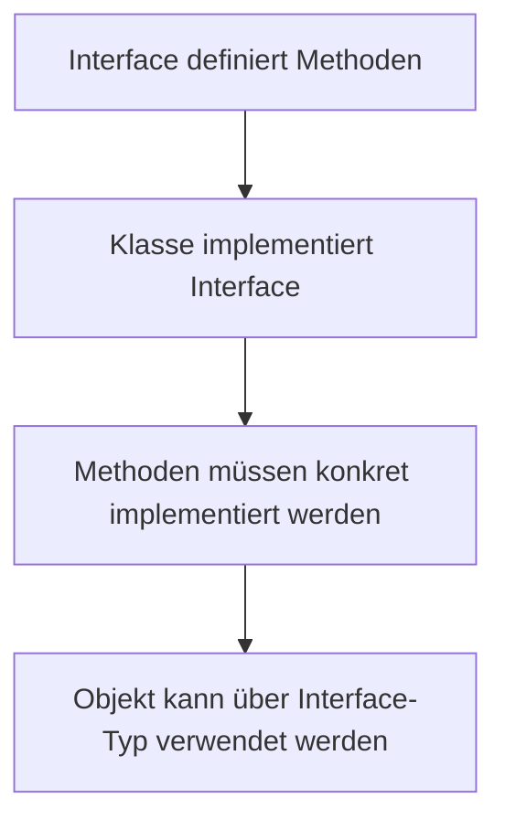

# Interfaces

## Kurzüberblick

Ein **Interface** ist eine **Schnittstelle bzw. ein Vertrag**, der festlegt, **welche Methoden eine Klasse bereitstellen muss**, ohne deren konkrete Implementierung vorzugeben.

-> Ziel: **Trennung von *Was* (Schnittstelle) und *Wie* (Implementierung)**

## Grundprinzip

Ein Interface beschreibt **nur die Fähigkeiten** eines Objekts, nicht dessen konkrete Umsetzung.

- Eine Klasse, die ein Interface implementiert, ist verpflichtet:
  - **alle Methoden zu implementieren**
- Das Schlüsselwort dafür lautet: `implements`

## Struktur eines Interfaces

```java
interface Fahrzeug {
    void starten();
    void stoppen();
}
```

-> Enthält nur Methodensignaturen (ohne Implementierung)

## Implementierung eines Interfaces

```java
class Auto implements Fahrzeug {

    @Override
    public void starten() {
        System.out.println("Auto startet");
    }

    @Override
    public void stoppen() {
        System.out.println("Auto stoppt");
    }
}
```

### Erklärung

- `Auto` **verpflichtet sich**, den Vertrag von `Fahrzeug` zu erfüllen
- Alle Methoden müssen implementiert werden
- `@Override` ist optional, aber Best Practice

## Ablauf (Konzeptuell)



## Zentrale Eigenschaften von Interfaces

### 1. Abstraktion

- Interfaces beschreiben **nur Verhalten**
- Keine konkrete Logik (Ausnahme: `default`-Methoden seit Java 8)

---

### 2. Mehrfachvererbung (wichtig!)

```java
class Amphibienfahrzeug implements Fahrzeug, Schwimmbar {
}
```

-> Eine Klasse kann **mehrere Interfaces gleichzeitig implementieren**

---

### 3. Standardregeln (klassisches Java-Verständnis)

- Methoden sind implizit:
  - `public`
  - `abstract`
- Variablen sind:
  - `public static final` (Konstanten)

---

### 4. Erweiterungen (moderne Java-Versionen)

Interfaces können zusätzlich enthalten:

- `default`-Methoden (mit Implementierung)
- `static`-Methoden
- (seit Java 9) auch `private` Hilfsmethoden

-> Wichtig für Prüfung: **Grundprinzip bleibt trotzdem "Vertrag"**

## Praktisches Beispiel (Polymorphismus)

```java
Fahrzeug f = new Auto();
f.starten();
```

### Erklärung

- Variable ist vom Typ **Interface**
- Objekt ist konkrete Klasse
- → **Polymorphismus**

-> Vorteil: Austauschbarkeit der Implementierung

## Praxisbeispiel (echter Nutzen)

Stell dir ein Zahlungssystem vor:

```java
interface Payment {
    void pay(double amount);
}
```

Implementierungen:

```java
class CreditCardPayment implements Payment {
    public void pay(double amount) {
        System.out.println("Bezahlt mit Kreditkarte");
    }
}

class PayPalPayment implements Payment {
    public void pay(double amount) {
        System.out.println("Bezahlt mit PayPal");
    }
}
```

-> Neue Zahlungsmethoden können hinzugefügt werden, ohne bestehenden Code zu ändern.

## Interfaces vs. abstrakte Klassen

| Merkmal               | Interface                              | Abstrakte Klasse                     |
|----------------------|----------------------------------------|--------------------------------------|
| Zweck                | Vertrag definieren                     | Gemeinsame Basis + Verhalten         |
| Methoden             | (klassisch) abstrakt                   | abstrakt + konkret                   |
| Konstruktoren        | ❌ Nein                                | ✅ Ja                                |
| Mehrfachvererbung    | ✅ Ja                                  | ❌ Nein                              |
| Variablen            | Konstanten (`static final`)            | Instanzvariablen möglich             |
| Zugriff              | Methoden sind `public`                 | alle Sichtbarkeiten möglich          |
| Verwendung           | Verhalten definieren                   | gemeinsame Logik teilen              |

### Wichtige Einordnung

- **Interface = "Was kann ein Objekt?"**
- **Abstrakte Klasse = "Was ist ein Objekt?"**

-> Interfaces fördern stärkere **Entkopplung**

## Wann verwendet man Interfaces?

Typische Einsatzfälle:

- Definition von **APIs / Schnittstellen**
- Austauschbare Implementierungen (z. B. Datenbanken, Zahlungsarten)
- **Testbarkeit (Mocks, Stubs)**
- Umsetzung von **Design Patterns** (z. B. Strategy, Factory)

## Prüfungsrelevanz

Du solltest sicher erklären können:

- Was ein Interface ist (→ Vertrag!)
- Unterschied zu abstrakten Klassen
- Bedeutung von `implements`
- Warum Mehrfachvererbung nur mit Interfaces möglich ist
- Wie Polymorphismus mit Interfaces funktioniert

Typische Prüfungsfrage:

> Warum sind Interfaces wichtig für lose Kopplung?

**Antwort:**

> Weil Code gegen ein Interface programmiert wird und nicht gegen eine konkrete Implementierung. Dadurch können Implementierungen leicht ausgetauscht werden, ohne den restlichen Code zu verändern.

## Häufige Fehler und Missverständnisse

### „Interface = keine Implementierung“ (nicht mehr ganz korrekt)

Seit Java 8:

```java
default void starten() {
    System.out.println("Standardstart");
}
```

-> Interfaces können teilweise Verhalten enthalten

---

### Verwechslung mit abstrakten Klassen

- Interface = Vertrag
- Abstrakte Klasse = teilweise fertige Klasse

---

### Methoden nicht implementiert

```java
class Auto implements Fahrzeug {
    // Fehler, wenn Methoden fehlen
}
```

-> Compilerfehler, wenn nicht alle Methoden implementiert sind

---

### Falsche Verwendung für gemeinsame Daten

Interfaces sind **nicht** dafür gedacht, viele Variablen zu speichern.

## Merksätze

- Ein Interface ist ein **Vertrag für Verhalten**
- `implements` = „Ich erfülle diesen Vertrag“
- Eine Klasse kann **mehrere Interfaces** implementieren
- Interfaces ermöglichen **Polymorphismus und Austauschbarkeit**
- Interfaces fördern **lose Kopplung und sauberes Design**

## Zusammenfassung

Interfaces sind ein zentrales Konzept der objektorientierten Programmierung in Java. Sie definieren, **welche Methoden eine Klasse bereitstellen muss**, ohne die Implementierung festzulegen. Dadurch ermöglichen sie flexible, erweiterbare und wartbare Softwarearchitekturen. Besonders wichtig sind sie für Polymorphismus, Mehrfachvererbung und lose Kopplung zwischen Systemkomponenten.