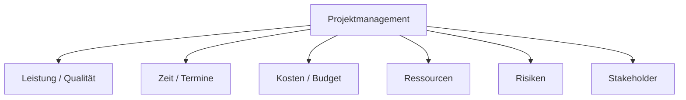
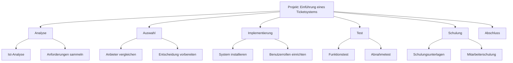
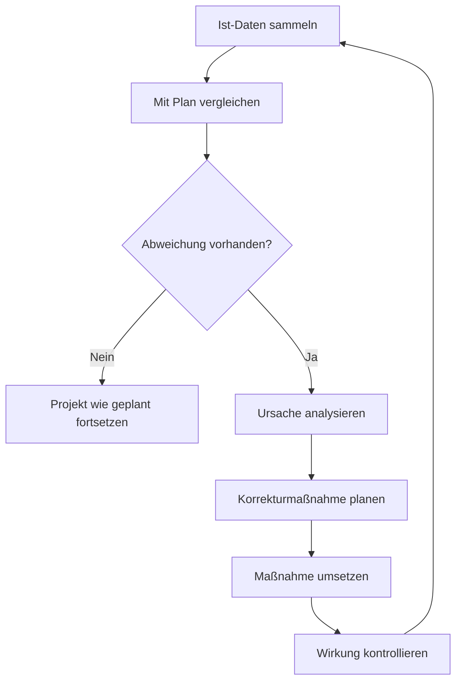
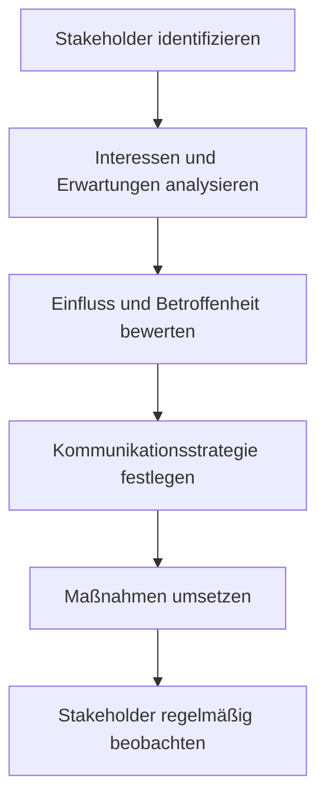
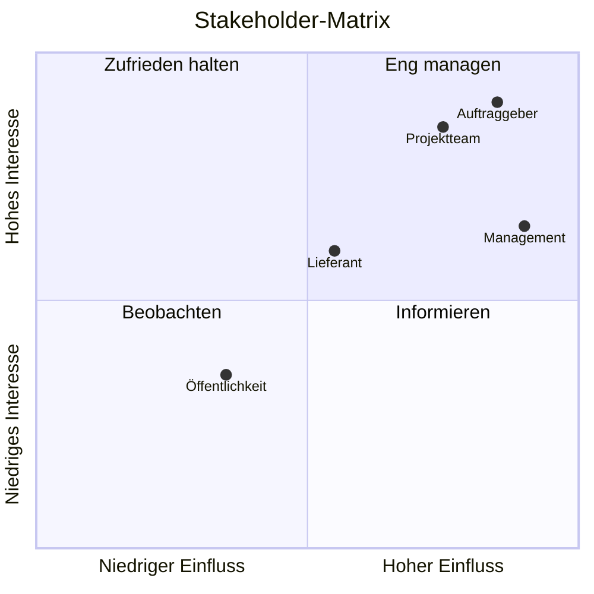
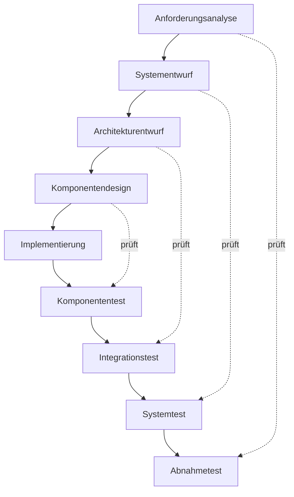

# Projektmanagement

## Kurzüberblick / Definition

**Projektmanagement** bezeichnet die Gesamtheit von Führungsaufgaben, Führungsorganisation, Führungstechniken und Führungsmitteln zur erfolgreichen Abwicklung eines Projekts.

Nach DIN 69901 ist Projektmanagement sinngemäß die Anwendung von Methoden, Werkzeugen, Techniken und Kompetenzen, um ein Projekt zielgerichtet zu planen, zu steuern und abzuschließen.

Ein **Projekt** ist ein einmaliges Vorhaben mit einem klaren Ziel, begrenzten Ressourcen, definiertem Anfang und Ende sowie einer gewissen Komplexität.

Typische Merkmale eines Projekts:

| Merkmal | Bedeutung |
|---|---|
| Einmaligkeit | Das Vorhaben ist kein dauerhaft wiederholter Routineprozess |
| Zielvorgabe | Es gibt ein konkretes Projektergebnis |
| Zeitliche Begrenzung | Start und Ende sind festgelegt oder geplant |
| Begrenzte Ressourcen | Personal, Budget und Sachmittel sind begrenzt |
| Komplexität | Mehrere Aufgaben, Beteiligte oder Abhängigkeiten müssen koordiniert werden |
| Risiko | Unsicherheiten können Ziel, Kosten oder Termine beeinflussen |

Projektmanagement sorgt dafür, dass ein Projekt strukturiert geplant, durchgeführt, überwacht und abgeschlossen wird.

---

## Projektarten

Je nach Ziel und Umfeld lassen sich Projekte in verschiedene Arten einteilen.

| Projektart | Typische Beispiele |
|---|---|
| Bau- und Investitionsprojekte | Neubau, Umbau, Fabrikerweiterung |
| Forschungs- und Entwicklungsprojekte | Prototyp, neue Produktidee, Pilotlösung |
| Organisationsprojekte | Reorganisation, Einführung neuer Prozesse |
| IT-Projekte | Softwareentwicklung, Migration, Infrastrukturaufbau |
| Marketingprojekte | Kampagnen, Events, Markteinführung |

Merksatz:

> Projektarten helfen bei der Wahl von Vorgehensmodell, Teamaufbau und Steuerungsgrad.

---

## Kernerklärung

## Ziel des Projektmanagements

Das Ziel des Projektmanagements ist es, ein Projekt so zu organisieren, dass die vereinbarten Ziele möglichst effizient erreicht werden.

Dabei müssen häufig mehrere Zielgrößen gleichzeitig beachtet werden:



Besonders wichtig ist das sogenannte **magische Dreieck** des Projektmanagements:

| Zielgröße | Leitfrage |
|---|---|
| Leistung / Qualität | Was soll geliefert werden und in welcher Qualität? |
| Zeit | Bis wann soll das Ergebnis fertig sein? |
| Kosten | Welches Budget steht zur Verfügung? |

Wenn eine Zielgröße verändert wird, beeinflusst das häufig auch die anderen Zielgrößen.

Beispiel:

Wenn ein Projekt schneller fertig werden soll, können zusätzliche Mitarbeitende oder Überstunden nötig werden. Dadurch steigen möglicherweise die Kosten.

---

## SMART-Ziele

Damit Projektziele wirklich steuerbar und prüfbar sind, sollten sie nach dem **SMART-Prinzip** formuliert werden.

| Buchstabe | Bedeutung | Leitfrage |
|---|---|---|
| **S** — Spezifisch | Das Ziel ist klar und eindeutig beschrieben | Was genau soll erreicht werden? |
| **M** — Messbar | Der Zielerreichungsgrad ist überprüfbar | Woran erkennt man, dass das Ziel erreicht ist? |
| **A** — Attraktiv / Akzeptiert | Das Ziel ist sinnvoll und wird vom Team mitgetragen | Warum ist dieses Ziel wichtig? |
| **R** — Realistisch | Das Ziel ist mit den vorhandenen Mitteln erreichbar | Ist das Ziel umsetzbar? |
| **T** — Terminiert | Es gibt ein klares Datum oder einen Zeitraum | Bis wann soll das Ziel erreicht sein? |

Beispiel für ein SMART-Ziel:

> „Das Ticketsystem wird bis zum 30.06.2026 in allen drei Fachabteilungen eingeführt, sodass 100 % der Supportanfragen darüber erfasst werden."

Vergleich:

| Nicht SMART | SMART |
|---|---|
| „Das System soll besser werden." | „Die Bearbeitungszeit pro Ticket wird bis Q3 2026 um 20 % gesenkt." |
| „Wir wollen mehr dokumentieren." | „Bis 31.05.2026 ist für jedes Arbeitspaket ein Protokoll abgelegt." |

---

## Projektphasen

Ein Projekt wird häufig in mehrere Phasen eingeteilt. Diese Phasen helfen dabei, das Vorhaben übersichtlich zu strukturieren.

Typische Projektphasen sind:

1. Projektinitialisierung
2. Projektplanung
3. Projektdurchführung
4. Projektsteuerung und Projektcontrolling
5. Projektabschluss


In der Praxis laufen Durchführung und Steuerung oft parallel, weil der Projektfortschritt laufend überwacht und bei Bedarf korrigiert wird.

---

## Projektinitialisierung

## Bedeutung

Die **Projektinitialisierung** ist die Startphase eines Projekts. In dieser Phase wird eine Projektidee konkretisiert und mit Informationen angereichert.

Ziel ist es, eine Entscheidungsgrundlage zu schaffen:

> Lohnt es sich, dieses Projekt durchzuführen?

Die Projektinitialisierung endet häufig mit einem **Projektauftrag** oder einer **Projektfreigabe**.

---

## Aufgaben der Projektinitialisierung

Typische Aufgaben sind:

| Aufgabe | Bedeutung |
|---|---|
| Projektidee beschreiben | Was soll grundsätzlich erreicht werden? |
| Ausgangssituation analysieren | Welches Problem oder welcher Bedarf besteht? |
| Ziele formulieren | Was soll am Ende erreicht sein? |
| Nutzen bewerten | Warum ist das Projekt sinnvoll? |
| Machbarkeit prüfen | Ist das Projekt technisch, wirtschaftlich und organisatorisch möglich? |
| Risiken grob einschätzen | Welche Unsicherheiten gibt es? |
| Stakeholder identifizieren | Wer ist betroffen oder beteiligt? |
| Projektauftrag vorbereiten | Formale Grundlage für den Projektstart schaffen |

---

## Projektauftrag

Der **Projektauftrag** ist ein zentrales Dokument zur Freigabe eines Projekts.

Er enthält typischerweise:

- Projektname,
- Projektziel,
- Ausgangssituation,
- Auftraggeber,
- Projektleiter,
- grober Projektumfang,
- Termine,
- Budgetrahmen,
- wichtige Stakeholder,
- Rahmenbedingungen,
- Risiken,
- Freigabeentscheidung.

Der Projektauftrag schafft Klarheit darüber, ob ein Projekt offiziell gestartet wird.

---

## Projektrollen und Lenkungsausschuss

In mittleren und großen Projekten ist eine klare Rollenverteilung wichtig.

| Rolle | Typische Aufgaben |
|---|---|
| Lenkungsausschuss | Projektauftrag freigeben, Ziele bestätigen, Prioritäten setzen, Grundsatzentscheidungen treffen |
| Projektleitung | Projekt planen und steuern, berichten, Entscheidungen vorbereiten, Koordination sicherstellen |
| Teilprojektleitung | Teilbereiche fachlich und organisatorisch steuern |
| Projektteam | Arbeitspakete umsetzen, Ergebnisse liefern, Probleme an die Projektleitung melden |

Merksatz:

> Der Lenkungsausschuss entscheidet strategisch, die Projektleitung steuert operativ.

---

## Kick-off-Meeting

Das **Kick-off-Meeting** markiert den offiziellen Projektstart nach der Freigabe.

Ziele des Kick-offs:

- Projektziele und Rahmenbedingungen einheitlich vermitteln,
- Rollen, Verantwortlichkeiten und Kommunikationswege klären,
- Vorgehensweise, Meilensteine und nächste Schritte abstimmen,
- Teamverständnis und Motivation fördern.

Typische Agenda:

1. Projektanlass und Zielbild,
2. Projektorganisation und Rollen,
3. Zeitplan, Meilensteine und Risiken,
4. Kommunikation, Regeln und nächste Schritte.

---

## Projektplanung

## Bedeutung

In der Projektplanung wird festgelegt, **was** getan werden muss, **wann** es getan werden soll, **wer** dafür zuständig ist und **welche Ressourcen** benötigt werden.

Eine gute Projektplanung beantwortet unter anderem folgende Fragen:

| Frage | Bedeutung |
|---|---|
| Was ist zu tun? | Aufgaben und Arbeitspakete festlegen |
| Wer macht was? | Verantwortlichkeiten klären |
| Wann passiert was? | Terminplanung erstellen |
| Welche Ressourcen werden benötigt? | Personal, Sachmittel und Budget planen |
| Welche Risiken gibt es? | Risikomanagement vorbereiten |
| Wie wird kommuniziert? | Informationswege festlegen |
| Wie wird Qualität geprüft? | Abnahmekriterien definieren |

---

## Projektstrukturplan

Der **Projektstrukturplan**, abgekürzt **PSP**, ist ein wichtiges Planungsinstrument im Projektmanagement.

Er zerlegt das Projekt in kleinere, überschaubare Bestandteile.

Diese Bestandteile können zum Beispiel sein:

- Teilprojekte,
- Arbeitspakete,
- Aufgaben,
- Lieferobjekte.

Der PSP hilft dabei, den gesamten Projektumfang sichtbar zu machen.



---

## Nutzen des Projektstrukturplans

Ein PSP ist nützlich, weil sich daraus weitere Planungen ableiten lassen.

| Aus dem PSP ergibt sich | Bedeutung |
|---|---|
| Zeitplanung | Wann müssen Arbeitspakete erledigt werden? |
| Kostenplanung | Welche Arbeitspakete verursachen welche Kosten? |
| Ressourcenplanung | Wer oder was wird benötigt? |
| Verantwortlichkeiten | Wer ist für welches Arbeitspaket zuständig? |
| Risikobewertung | Wo können Probleme auftreten? |
| Fortschrittskontrolle | Welche Teile sind bereits erledigt? |

Merksatz:

> Der Projektstrukturplan zeigt, was im Projekt alles zu erledigen ist.

---

## Terminplanung: Balkendiagramm (Gantt-Diagramm)

Das **Gantt-Diagramm** (Balkendiagramm) ist eines der am häufigsten verwendeten Werkzeuge zur Terminplanung.

Jedes Arbeitspaket wird als horizontaler Balken in einem Zeitstrahl dargestellt.

Vorteile:

- einfach zu lesen und zu erstellen,
- Terminsituation auf einen Blick erkennbar,
- Überschneidungen und Parallelarbeit sichtbar,
- gut für Statusberichte und Präsentationen.

Nachteile:

- Abhängigkeiten zwischen Aufgaben sind nicht immer sichtbar,
- kein automatischer kritischer Pfad erkennbar.

Beispiel (Ticketsystem, vereinfacht):

| Arbeitspaket | Woche 1 | Woche 2 | Woche 3 | Woche 4 | Woche 5 | Woche 6 |
|---|---|---|---|---|---|---|
| Ist-Analyse | ████ | | | | | |
| Anforderungen sammeln | ████ | ████ | | | | |
| Anbieter vergleichen | | ████ | ████ | | | |
| Entscheidung | | | ████ | | | |
| Installation | | | | ████ | | |
| Funktionstests | | | | ████ | ████ | |
| Schulung | | | | | ████ | ████ |
| Übergabe | | | | | | ████ |

Merksatz:

> Das Gantt-Diagramm zeigt den zeitlichen Ablauf aller Arbeitspakete auf einem Blick.

---

## Terminplanung: Netzplantechnik

Die **Netzplantechnik** ist ein Verfahren zur Terminplanung, das Abhängigkeiten zwischen Vorgängen abbildet und den **kritischen Pfad** berechnet.

Die Netzplantechnik wird in der IHK-Prüfung häufig gefragt.

---

### Grundbegriffe der Netzplantechnik

| Begriff | Abkürzung | Bedeutung |
|---|---|---|
| Vorgang | — | Einzelne Aufgabe im Projekt mit einer Dauer |
| Dauer | D | Zeitbedarf für einen Vorgang (in Tagen, Wochen usw.) |
| Frühester Anfangszeitpunkt | FAZ | Frühester Zeitpunkt, zu dem ein Vorgang starten kann |
| Frühester Endzeitpunkt | FEZ | FAZ + Dauer |
| Spätester Anfangszeitpunkt | SAZ | Spätester Start, ohne das Projektende zu gefährden |
| Spätester Endzeitpunkt | SEZ | SAZ + Dauer |
| Gesamtpuffer | GP | SAZ − FAZ = SEZ − FEZ (wie viel Verzögerung möglich ohne Projektverzögerung) |
| Freier Puffer | FP | Wie viel Puffer, ohne den Nachfolger zu verzögern |
| Kritischer Pfad | — | Alle Vorgänge mit GP = 0; jede Verzögerung verzögert das Gesamtprojekt |

---

### Vorwärtsrechnung (FAZ und FEZ berechnen)

Die **Vorwärtsrechnung** ermittelt die frühestmöglichen Zeiten.

Regel:

$$FAZ = \max(FEZ \text{ aller Vorgänger})$$

$$FEZ = FAZ + D$$

---

### Rückwärtsrechnung (SAZ und SEZ berechnen)

Die **Rückwärtsrechnung** ermittelt die spätestzulässigen Zeiten.

Ausgangspunkt: Beim letzten Vorgang gilt SEZ = FEZ (kein Zeitpuffer am Ende).

Regel:

$$SEZ = \min(SAZ \text{ aller Nachfolger})$$

$$SAZ = SEZ - D$$

---

### Pufferberechnung

$$GP = SAZ - FAZ$$

Ein Vorgang liegt auf dem **kritischen Pfad**, wenn GP = 0.

---

### Darstellung eines Vorgangsknotens (VKN-Methode)

In der IHK-Prüfung wird häufig die **Vorgangsknoten-Methode** verwendet. Jeder Vorgang wird als Kasten dargestellt:

```
┌────────────────────────────────────┐
│ FAZ     │   Dauer (D)   │   FEZ   │
│─────────┼───────────────┼─────────│
│         │  Vorgangsname │         │
│─────────┼───────────────┼─────────│
│ SAZ     │      GP       │   SEZ   │
└────────────────────────────────────┘
```

---

### Beispiel: Netzplanberechnung

Vorgangsliste:

| Vorgang | Bezeichnung | Dauer | Vorgänger |
|---|---|---|---|
| A | Analyse | 3 | — |
| B | Konzept | 2 | A |
| C | Hardwarebeschaffung | 5 | A |
| D | Installation | 4 | B, C |
| E | Test | 2 | D |

**Vorwärtsrechnung:**

| Vorgang | D | FAZ | FEZ |
|---|---|---|---|
| A | 3 | 0 | 3 |
| B | 2 | 3 | 5 |
| C | 5 | 3 | 8 |
| D | 4 | max(5, 8) = 8 | 12 |
| E | 2 | 12 | 14 |

Projektdauer = **14**

**Rückwärtsrechnung** (SEZ von E = 14):

| Vorgang | D | SEZ | SAZ |
|---|---|---|---|
| E | 2 | 14 | 12 |
| D | 4 | 12 | 8 |
| C | 5 | 8 | 3 |
| B | 2 | 8 | 6 |
| A | 3 | min(6, 3) = 3 | 0 |

**Puffer:**

| Vorgang | FAZ | SAZ | GP | Kritisch? |
|---|---|---|---|---|
| A | 0 | 0 | 0 | ✓ Ja |
| B | 3 | 6 | 3 | Nein |
| C | 3 | 3 | 0 | ✓ Ja |
| D | 8 | 8 | 0 | ✓ Ja |
| E | 12 | 12 | 0 | ✓ Ja |

**Kritischer Pfad: A → C → D → E** (Gesamtdauer 14)

Merksatz:

> Vorgänge auf dem kritischen Pfad haben keinen Puffer — jede Verzögerung dort verlängert das Projekt.

---

## Arbeitspaket

Ein **Arbeitspaket** ist eine kleinste sinnvoll planbare Einheit im Projektstrukturplan.

Ein gutes Arbeitspaket enthält:

- eindeutige Bezeichnung,
- Beschreibung der Aufgabe,
- Verantwortlichen,
- erwartetes Ergebnis,
- Aufwandsschätzung,
- Termine,
- benötigte Ressourcen,
- Abnahmekriterien.

Beispiel:

| Arbeitspaket | Inhalt |
|---|---|
| Benutzerverwaltung einrichten | Rollen, Benutzergruppen und Rechte im Ticketsystem konfigurieren |
| Verantwortlich | Systemadministrator |
| Ergebnis | Benutzer können sich anmelden und passende Rechte nutzen |
| Abnahmekriterium | Testbenutzer mit verschiedenen Rollen funktionieren korrekt |

---

## Meilensteine

Ein **Meilenstein** ist ein klar definierter, überprüfbarer Zwischenstand im Projekt.

Meilensteine sind keine Arbeitspakete — sie haben keine Dauer, sondern markieren einen Zeitpunkt.

Eigenschaften eines Meilensteins:

- eindeutig benannt,
- mit konkretem Datum versehen,
- klar überprüfbar (Kriterium für Erfüllung),
- Grundlage für Entscheidungen oder Freigaben.

Beispiel:

| Meilenstein | Datum | Kriterium |
|---|---|---|
| M1: Analysephase abgeschlossen | 15.01.2026 | Anforderungsliste liegt vor und ist freigegeben |
| M2: Systemauswahl getroffen | 01.02.2026 | Entscheidung für ein System ist dokumentiert |
| M3: Installation abgeschlossen | 15.03.2026 | System läuft und ist erreichbar |
| M4: Abnahmetest bestanden | 10.04.2026 | Alle Testfälle erfolgreich, Protokoll unterschrieben |
| M5: Produktivstart | 01.05.2026 | System ist in Betrieb, Schulungen sind abgeschlossen |

Meilensteine helfen, den Projektfortschritt zu kontrollieren und Freigabeentscheidungen zu treffen.

---

## Aufwandsschätzung

Die **Aufwandsschätzung** ermittelt, wie viel Zeit und Personal für Arbeitspakete und das Gesamtprojekt benötigt werden.

Eine realistische Schätzung ist wichtig für Terminplanung, Kostenplanung und Ressourcenplanung.

---

### Schätzmethoden im Überblick

| Methode | Beschreibung | Einsatz |
|---|---|---|
| Analogieschätzung | Ähnliches vergangenes Projekt als Referenz nutzen | Wenn Erfahrungswerte vorhanden sind |
| Expertenschätzung | Fachleute schätzen direkt | Schnell, aber subjektiv |
| Dreipunktschätzung (PERT) | Drei Szenarien werden kombiniert | Wenn Unsicherheit hoch ist |
| Planning Poker | Team schätzt anonym mit Karten | Agile Projekte |
| Function-Point-Analyse | Fachliche Funktionen werden gezählt und gewichtet | Softwareprojekte |

---

### Dreipunktschätzung (PERT)

Bei der **Dreipunktschätzung** werden drei Szenarien geschätzt:

| Szenario | Bedeutung |
|---|---|
| O (Optimistisch) | Bestfall — alles läuft perfekt |
| M (Wahrscheinlichst) | Realistischer Normalfall |
| P (Pessimistisch) | Schlechtfall — alles läuft schief |

Die **PERT-Formel** gewichtet den wahrscheinlichsten Wert stärker:

$$E = \frac{O + 4 \cdot M + P}{6}$$

Beispiel:

Ein Arbeitspaket „Datenbankschema entwerfen" wird geschätzt:

- O = 2 Tage
- M = 4 Tage
- P = 9 Tage

$$E = \frac{2 + 4 \cdot 4 + 9}{6} = \frac{2 + 16 + 9}{6} = \frac{27}{6} = 4{,}5 \text{ Tage}$$

---

### Personalkosten berechnen

In der IHK-Prüfung müssen häufig Personalkosten aus Aufwand und Stundensatz berechnet werden.

Formel:

$$\text{Personalkosten} = \text{Aufwand (Stunden)} \times \text{Stundensatz (€/h)}$$

Beispiel:

> Ein Entwickler benötigt 36 Stunden für ein Arbeitspaket. Sein Stundensatz beträgt 65 €/h.

$$\text{Personalkosten} = 36 \text{ h} \times 65 \text{ €/h} = 2.340 \text{ €}$$

---

## Lastenheft und Pflichtenheft

## Lastenheft

Das **Lastenheft** beschreibt aus Sicht des Auftraggebers, **was** gefordert wird.

Es enthält Anforderungen, Wünsche und Rahmenbedingungen.

Typische Inhalte:

- Ausgangssituation,
- Zielsetzung,
- fachliche Anforderungen,
- technische Rahmenbedingungen,
- Qualitätsanforderungen,
- Lieferumfang,
- Abnahmekriterien,
- Termine,
- Budgetrahmen.

Merksatz:

> Das Lastenheft beschreibt, was der Auftraggeber haben möchte.

---

## Pflichtenheft

Das **Pflichtenheft** beschreibt aus Sicht des Auftragnehmers, **wie** die Anforderungen umgesetzt werden sollen.

Es konkretisiert die Lösung.

Typische Inhalte:

- technische Umsetzung,
- Systemarchitektur,
- Funktionen,
- Schnittstellen,
- Datenmodell,
- Sicherheitskonzept,
- Testkonzept,
- Realisierungsplan,
- konkrete Umsetzung der Anforderungen aus dem Lastenheft.

Merksatz:

> Das Pflichtenheft beschreibt, wie der Auftragnehmer die Anforderungen umsetzt.

---

## Vergleich: Lastenheft und Pflichtenheft

| Dokument | Perspektive | Leitfrage | Erstellt durch |
|---|---|---|---|
| Lastenheft | Auftraggeber | Was wird benötigt? | Auftraggeber |
| Pflichtenheft | Auftragnehmer | Wie wird es umgesetzt? | Auftragnehmer / Auftraggeber |

Beispiel:

| Lastenheft-Anforderung | Pflichtenheft-Umsetzung |
|---|---|
| Benutzer sollen sich anmelden können | Login über Benutzername und Passwort mit Rollenprüfung |
| Das System soll Tickets verwalten | Datenbanktabellen für Tickets, Status, Prioritäten und Kommentare |
| Es soll eine Suche geben | Volltextsuche über Titel, Beschreibung und Kommentare |

---

## Projektdurchführung

## Bedeutung

In der **Projektdurchführung** werden die geplanten Arbeitspakete umgesetzt.

Dabei entstehen die eigentlichen Projektergebnisse, zum Beispiel:

- Softwaremodule,
- Dokumentationen,
- Konfigurationen,
- Tests,
- Schulungen,
- technische Systeme,
- Prozessänderungen.

Die Projektdurchführung orientiert sich an der Projektplanung, muss aber flexibel auf Änderungen und Probleme reagieren.

---

## Projektsteuerung

## Bedeutung

Die **Projektsteuerung** sorgt dafür, dass das Projekt auf Kurs bleibt.

Dabei werden laufend Informationen gesammelt und mit dem Plan verglichen.

Typische Fragen:

| Frage | Bedeutung |
|---|---|
| Liegt das Projekt im Zeitplan? | Terminüberwachung |
| Wird das Budget eingehalten? | Kostenkontrolle |
| Sind Arbeitspakete erledigt? | Fortschrittskontrolle |
| Treten Risiken ein? | Risikokontrolle |
| Gibt es Qualitätsprobleme? | Qualitätskontrolle |
| Müssen Maßnahmen angepasst werden? | Korrektur und Steuerung |

---

## Ablauf der Projektsteuerung



---

## Beispiel für Projektsteuerung

Ein Arbeitspaket sollte am Freitag abgeschlossen sein, ist aber erst zu 60 % fertig.

Mögliche Steuerungsmaßnahmen:

- Ursache klären,
- zusätzliche Unterstützung einplanen,
- Prioritäten anpassen,
- Terminplan aktualisieren,
- Auftraggeber informieren,
- Risiko dokumentieren,
- Folgeaufgaben neu bewerten.

Projektsteuerung bedeutet nicht nur, Abweichungen zu erkennen, sondern aktiv gegenzusteuern.

---

## Projektführung

## Bedeutung

**Projektführung** ist die zielgerichtete Beeinflussung der Projektbeteiligten, damit Projektziele erreicht werden.

Dabei geht es vor allem um Menschen, Zusammenarbeit und Kommunikation.

Typische Aufgaben der Projektführung:

- Projektteam aufbauen,
- Team motivieren,
- Aufgaben klar verteilen,
- Kommunikation fördern,
- Konflikte lösen,
- Entscheidungen vorbereiten,
- Zusammenarbeit stärken,
- Verantwortung klären,
- Projektkultur entwickeln.

---

## Führungsqualitäten im Projekt

Ein Projektleiter benötigt verschiedene Kompetenzen.

| Kompetenz | Bedeutung |
|---|---|
| Fachliche Kompetenz | Verständnis für Projektinhalt und fachliche Anforderungen |
| Methodische Kompetenz | Kenntnis von Projektmanagementmethoden |
| Soziale Kompetenz | Umgang mit Menschen, Kommunikation und Konfliktlösung |
| Persönliche Kompetenz | Zuverlässigkeit, Entscheidungsfähigkeit und Selbstorganisation |

Merksatz:

> Der Umgang mit Menschen ist ein zentraler Baustein für den Projekterfolg.

---

## Projektmarketing

## Bedeutung

**Projektmarketing** bedeutet die zielgerichtete Beeinflussung der Projektumwelt.

Ziel ist es, das Projekt bekannt zu machen, Unterstützung zu gewinnen und Widerstände zu reduzieren.

Projektmarketing richtet sich an Personen oder Gruppen, die das Projekt beeinflussen oder vom Projekt betroffen sind.

Typische Ziele:

- Akzeptanz schaffen,
- Unterstützung gewinnen,
- Nutzen sichtbar machen,
- Stakeholder informieren,
- Widerstände abbauen,
- Vertrauen schaffen,
- Projekterfolg wahrscheinlicher machen.

---

## Beispiele für Projektmarketing

| Maßnahme | Zweck |
|---|---|
| Informationsveranstaltung | Projekt bekannt machen |
| Statusbericht | Transparenz schaffen |
| Newsletter | Stakeholder regelmäßig informieren |
| Demo oder Prototyp | Nutzen sichtbar machen |
| Schulung | Akzeptanz bei Nutzern erhöhen |
| Projektpräsentation | Entscheidungsträger überzeugen |

Projektmarketing ist besonders wichtig, wenn Projektergebnisse Veränderungen für Benutzer oder Organisationen mit sich bringen.

---

## Projektinformation und Dokumentation

## Projektinformation

**Projektinformation** bedeutet, relevante Informationen zum Projekt gezielt zu sammeln, aufzubereiten und weiterzugeben.

Dazu gehören zum Beispiel:

- Projektstatus,
- Projektrisiken,
- Projektergebnisse,
- Entscheidungen,
- Änderungen,
- offene Punkte,
- Abweichungen,
- Termine,
- Kosteninformationen.

Eine gute Informationspolitik ist wichtig für:

- Projektsteuerung,
- Projektführung,
- Transparenz,
- Vertrauen,
- Entscheidungsfähigkeit.

---

## Projektdokumentation

Die **Projektdokumentation** hält den Projektverlauf und die Projektergebnisse nachvollziehbar fest.

Typische Dokumente:

| Dokument | Zweck |
|---|---|
| Projektauftrag | Formale Projektfreigabe |
| Projektstrukturplan | Übersicht über Aufgaben und Arbeitspakete |
| Terminplan | Zeitliche Planung |
| Ressourcenplan | Planung von Personal und Sachmitteln |
| Risikoregister | Übersicht über Risiken und Maßnahmen |
| Protokolle | Dokumentation von Besprechungen |
| Statusberichte | Fortschritt und Abweichungen darstellen |
| Lösungskonzept | Beschreibung der geplanten Lösung |
| Projekthandbuch | Zentrale Regeln und Informationen zum Projekt |
| Testprotokolle | Nachweis durchgeführter Tests |
| Abnahmeprotokoll | Bestätigung der Abnahme |
| Abschlussbericht | Zusammenfassung des Projekts |

Dokumentation sorgt für Nachvollziehbarkeit, Transparenz und Wiederverwendbarkeit von Erfahrungen.

---

## Projektabschluss

## Bedeutung

Der **Projektabschluss** ist der formale Abschluss eines Projekts.

Er stellt sicher, dass das Projektergebnis übergeben, bewertet und dokumentiert wird.

Typische Aufgaben:

- Projektergebnis an Auftraggeber oder Nutzer übergeben,
- Abnahme durchführen,
- offene Punkte dokumentieren,
- Projektdokumentation vervollständigen,
- Projektabschlussbericht erstellen,
- Projektabschlusspräsentation durchführen,
- Projektteam auflösen,
- Betrieb oder Betreuung des Ergebnisses sicherstellen,
- Projektverlauf analysieren,
- Erfahrungen für zukünftige Projekte sichern.

---

## Lessons Learned

**Lessons Learned** sind Erkenntnisse aus dem Projekt, die für zukünftige Projekte genutzt werden sollen.

Typische Fragen:

| Frage | Zweck |
|---|---|
| Was lief gut? | Erfolgsfaktoren erkennen |
| Was lief schlecht? | Fehlerquellen erkennen |
| Was würden wir beim nächsten Mal anders machen? | Verbesserungen ableiten |
| Welche Risiken wurden unterschätzt? | Risikomanagement verbessern |
| Welche Kommunikation war hilfreich? | Zusammenarbeit verbessern |

Lessons Learned helfen, Projektmanagement im Unternehmen langfristig zu verbessern.

---

## Risikomanagement

## Definition

Ein **Risiko** ist ein unsicheres Ereignis, das den Projektverlauf negativ beeinflussen kann.

Risiken sind keine Fehler — sie sind Möglichkeiten, die eintreten **können**, aber nicht müssen.

**Risikomanagement** umfasst die systematische Identifikation, Bewertung, Planung und Überwachung von Risiken.

---

## Risikoarten

| Risikoart | Beispiele |
|---|---|
| Technische Risiken | Inkompatible Systeme, unbekannte Technologie, Performanzprobleme |
| Organisatorische Risiken | Personalausfall, unklare Zuständigkeiten, fehlende Freigaben |
| Terminrisiken | Verzögerungen bei Lieferanten, zu knappe Puffer |
| Kostenrisiken | Überschreitung des Budgets, unvorhergesehene Ausgaben |
| Qualitätsrisiken | Fehlerhafte Anforderungen, mangelnde Tests |
| Externe Risiken | Gesetzesänderungen, Marktveränderungen, Naturereignisse |

---

## Risikobewertung

Risiken werden typischerweise anhand von zwei Kriterien bewertet:

$$\text{Risikowert} = \text{Eintrittswahrscheinlichkeit} \times \text{Schadensausmaß}$$

| Eintrittswahrscheinlichkeit | Beschreibung |
|---|---|
| Hoch (3) | Tritt wahrscheinlich ein |
| Mittel (2) | Kann eintreten |
| Niedrig (1) | Unwahrscheinlich |

| Schadensausmaß | Beschreibung |
|---|---|
| Hoch (3) | Projektgefährdend |
| Mittel (2) | Merkliche Auswirkungen |
| Niedrig (1) | Geringe Auswirkungen |

---

## Risikomatrix

```
Schadensausmaß
    Hoch (3)  │  3  │  6  │  9  │
    Mittel (2)│  2  │  4  │  6  │
    Niedrig(1)│  1  │  2  │  3  │
              └─────┴─────┴─────┘
                Niedrig Mittel Hoch
                Eintrittswahrscheinlichkeit
```

Bewertung:

| Risikowert | Handlungsbedarf |
|---|---|
| 7–9 | Kritisch — sofortige Maßnahmen notwendig |
| 4–6 | Erhöht — Maßnahmen planen und beobachten |
| 1–3 | Gering — beobachten |

---

## Risikomaßnahmen

| Strategie | Bedeutung | Beispiel |
|---|---|---|
| Vermeiden | Risikoquelle beseitigen | Andere Technologie wählen |
| Vermindern | Wahrscheinlichkeit oder Auswirkung reduzieren | Frühzeitige Tests einplanen |
| Übertragen | Risiko auf Dritten verlagern | Versicherung, Vertragsklauseln |
| Akzeptieren | Risiko bewusst in Kauf nehmen | Puffer einplanen, kein aktives Handeln |

---

## Risikoregister

Das **Risikoregister** ist ein zentrales Dokument im Risikomanagement.

Typische Spalten:

| Risiko-ID | Risikobeschreibung | EW | Ausmaß | Wert | Maßnahme | Verantwortlich | Status |
|---|---|---|---|---|---|---|---|
| R01 | Serverausfall während Migration | 2 | 3 | 6 | Backup erstellen | Admin | Offen |
| R02 | Schlüsselmitarbeiter fällt aus | 1 | 3 | 3 | Vertretungsregelung | PL | Offen |
| R03 | Lieferant liefert zu spät | 2 | 2 | 4 | Frühzeitig bestellen | Einkauf | Beobachten |

EW = Eintrittswahrscheinlichkeit

---

## Stakeholder

## Definition

**Stakeholder** sind alle Personen, Gruppen oder Organisationen, die ein Interesse am Projekt haben oder von dessen Ergebnissen betroffen sind.

Stakeholder können das Projekt unterstützen, beeinflussen, behindern oder von den Projektergebnissen abhängig sein.

Beispiele:

- Auftraggeber,
- Kunden,
- Nutzer,
- Projektteam,
- Management,
- Mitarbeitende,
- Lieferanten,
- Kapitalgeber,
- Behörden,
- Öffentlichkeit,
- Konkurrenz,
- gesellschaftliche Organisationen.

---

## Interne und externe Stakeholder

| Stakeholder-Art | Beispiele |
|---|---|
| Interne Stakeholder | Projektteam, Management, Mitarbeitende, Fachabteilungen |
| Externe Stakeholder | Kunden, Lieferanten, Behörden, Öffentlichkeit, Kapitalgeber |

---

## Stakeholder-Interessen

Stakeholder haben unterschiedliche Erwartungen, Interessen und Einflussmöglichkeiten.

| Stakeholder | Typische Interessen |
|---|---|
| Auftraggeber | Zielerreichung, Nutzen, Budgeteinhaltung |
| Kunden | Qualität, Funktionalität, Zuverlässigkeit |
| Nutzer | Bedienbarkeit, Unterstützung, geringe Belastung durch Veränderung |
| Projektteam | Klare Aufgaben, realistische Termine, gute Zusammenarbeit |
| Management | Wirtschaftlicher Erfolg, strategischer Nutzen |
| Lieferanten | Faire Bezahlung, klare Anforderungen, langfristige Zusammenarbeit |
| Kapitalgeber | Wirtschaftlichkeit und Rendite |
| Behörden | Einhaltung von Gesetzen und Vorschriften |
| Öffentlichkeit | Transparenz, Verantwortung, geringe negative Auswirkungen |
| Konkurrenz | Marktveränderungen und Wettbewerbssituation |

---

## Stakeholdermanagement

**Stakeholdermanagement** umfasst die Identifikation, Analyse, Planung und Steuerung der Beziehungen zu Stakeholdern.

Typische Schritte:



Ziel ist es, Unterstützung zu gewinnen, Konflikte früh zu erkennen und Widerstände zu reduzieren.

---

## Stakeholderanalyse

Bei der **Stakeholderanalyse** werden Stakeholder systematisch betrachtet.

Wichtige Kriterien:

| Kriterium | Leitfrage |
|---|---|
| Interesse | Wie stark interessiert sich der Stakeholder für das Projekt? |
| Einfluss | Wie stark kann der Stakeholder das Projekt beeinflussen? |
| Erwartung | Was erwartet der Stakeholder vom Projekt? |
| Haltung | Unterstützt der Stakeholder das Projekt oder lehnt er es ab? |
| Betroffenheit | Wie stark ist der Stakeholder vom Ergebnis betroffen? |

---

## Stakeholder-Matrix

Eine einfache Stakeholder-Matrix unterscheidet nach Einfluss und Interesse.



Typische Ableitung:

| Einfluss | Interesse | Umgang |
|---|---|---|
| Hoch | Hoch | Eng einbinden und aktiv managen |
| Hoch | Niedrig | Zufrieden halten |
| Niedrig | Hoch | Regelmäßig informieren |
| Niedrig | Niedrig | Beobachten |

---

## Organisationsformen im Projektmanagement

## Bedeutung

Die Projektorganisation legt fest, wie ein Projekt in die bestehende Unternehmensorganisation eingebunden ist.

Wichtig ist vor allem die Frage:

> Welche Befugnisse hat der Projektleiter gegenüber den Projektmitarbeitenden?

Typische Organisationsformen sind:

1. Reine Projektorganisation
2. Einfluss-Projektorganisation / Stabs-Projektorganisation
3. Matrix-Projektorganisation

Diese Begriffe sind für die IHK-Prüfung besonders relevant.

---

## 1. Reine Projektorganisation

Bei der **reinen Projektorganisation** werden Mitarbeitende für die Dauer des Projekts weitgehend aus ihren Linienabteilungen herausgelöst und dem Projekt zugeordnet.

Der Projektleiter hat eine starke Weisungsbefugnis.

Merkmale:

- eigenständiges Projektteam,
- Projektmitarbeitende arbeiten hauptsächlich oder vollständig im Projekt,
- Projektleiter hat hohe Entscheidungskompetenz,
- klare Verantwortung im Projekt.

Vorteile:

- klare Zuständigkeiten,
- schnelle Entscheidungen,
- starke Identifikation mit dem Projekt,
- gute Fokussierung auf Projektziele.

Nachteile:

- hoher Ressourcenaufwand,
- Mitarbeitende fehlen in der Linienorganisation,
- Wiedereingliederung nach Projektende kann schwierig sein,
- Fachwissen aus Linienabteilungen kann isoliert werden.

---

## 2. Einfluss-Projektorganisation / Stabs-Projektorganisation

Bei der **Einfluss-Projektorganisation** bleibt die Linienorganisation vollständig bestehen. Der Projektleiter hat meist keine direkte Weisungsbefugnis gegenüber den Projektmitarbeitenden.

Er koordiniert, informiert und berät.

Diese Form wird auch häufig als **Stabs-Projektorganisation** bezeichnet, wenn der Projektleiter als Stabsstelle unterstützend tätig ist.

Merkmale:

- Mitarbeitende bleiben in ihren Fachabteilungen,
- Projektleiter koordiniert das Projekt,
- Weisungsbefugnis bleibt bei den Linienvorgesetzten,
- Projektleiter hat begrenzte formale Macht.

Vorteile:

- geringe Veränderung der Unternehmensstruktur,
- Fachabteilungen behalten ihre Mitarbeitenden,
- gute Nutzung vorhandener Fachkompetenz,
- geringer organisatorischer Aufwand.

Nachteile:

- Projektleiter hat wenig Durchsetzungsmacht,
- Konflikte mit Linienaufgaben möglich,
- Entscheidungen können langsam sein,
- Projektpriorität kann zu niedrig sein.

---

## 3. Matrix-Projektorganisation

Bei der **Matrix-Projektorganisation** haben Projektmitarbeitende zwei Bezugspunkte:

1. den Linienvorgesetzten,
2. den Projektleiter.

Der Projektleiter ist für Projektziele, Termine und Koordination verantwortlich. Der Linienvorgesetzte bleibt häufig für fachliche Führung, Personalthemen oder Ressourcenzuordnung zuständig.

Merkmale:

- Mitarbeitende arbeiten gleichzeitig in Linie und Projekt,
- Projektleiter und Linienvorgesetzter teilen Verantwortung,
- Ressourcen werden flexibel genutzt,
- Abstimmung ist besonders wichtig.

Vorteile:

- gute Nutzung von Fachwissen,
- flexible Ressourcennutzung,
- Projektinteressen werden stärker vertreten als bei reiner Stabsorganisation,
- Mitarbeitende bleiben in Fachabteilungen eingebunden.

Nachteile:

- mögliche Kompetenzkonflikte,
- Doppelunterstellung,
- erhöhter Abstimmungsaufwand,
- unklare Prioritäten bei schlechter Organisation.

---

## Vergleich der Projektorganisationsformen

| Organisationsform | Projektleiter-Befugnis | Mitarbeitende | Vorteil | Nachteil |
|---|---:|---|---|---|
| Reine Projektorganisation | Hoch | Hauptsächlich im Projekt | Klare Verantwortung und schnelle Entscheidungen | Hoher Ressourcenaufwand |
| Einfluss-/Stabs-Projektorganisation | Niedrig | Bleiben in Linie | Geringer organisatorischer Aufwand | Wenig Durchsetzungsmacht |
| Matrix-Projektorganisation | Mittel | Linie und Projekt | Flexible Ressourcennutzung | Konflikte durch Doppelunterstellung |

---

## Einlinien- und Mehrlinienorganisation

Die Begriffe **Einlinienorganisation**, **Stablinienorganisation** und **Mehrlinienorganisation** beschreiben allgemeine Organisationsprinzipien.

### Einlinienorganisation

Bei der **Einlinienorganisation** hat jede Stelle genau einen direkten Vorgesetzten.

Vorteile:

- klare Weisungswege,
- eindeutige Verantwortlichkeiten,
- einfache Struktur.

Nachteile:

- längere Informationswege,
- starke Belastung einzelner Führungskräfte,
- weniger Flexibilität.

---

### Stablinienorganisation

Die **Stablinienorganisation** basiert auf der Einlinienorganisation und ergänzt sie um **Stabsstellen**.

Stabsstellen haben in der Regel **keine Weisungsbefugnis**, sondern beraten und entlasten die Linienführung durch Analysen, Vorbereitung von Entscheidungen und Spezialwissen.

Typische Beispiele für Stabsstellen:

- Qualitätsmanagement,
- Rechtsabteilung,
- Datenschutz,
- Projektmanagement-Office (PMO).

Vorteile:

- Führungskräfte werden fachlich entlastet,
- Spezialwissen steht zentral zur Verfügung,
- Entscheidungen können besser vorbereitet werden.

Nachteile:

- Stäbe tragen Verantwortung ohne direkte Weisungsrechte,
- mögliche Konflikte zwischen Stabsempfehlung und Linienentscheidung,
- zusätzlicher Abstimmungsaufwand.

Merksatz:

> In der Stablinienorganisation berät der Stab, entschieden und angewiesen wird in der Linie.

---

### Mehrlinienorganisation

Bei der **Mehrlinienorganisation** kann eine Stelle Weisungen von mehreren Vorgesetzten erhalten.

Vorteile:

- Nutzung verschiedener Fachkompetenzen,
- kürzere Fachwege,
- flexible Steuerung.

Nachteile:

- Kompetenzkonflikte,
- widersprüchliche Anweisungen,
- unklare Verantwortlichkeiten.

Die Matrixorganisation ist eine typische Form, bei der Mehrlinienprinzipien auftreten können.

---

## Funktionale Organisation und agile Organisation

### Funktionale Organisation

In einer **funktionalen Organisation** ist das Unternehmen nach Funktionen oder Fachbereichen gegliedert.

Beispiele:

- Einkauf,
- Entwicklung,
- Vertrieb,
- Buchhaltung,
- IT,
- Personal.

Projekte werden dabei oft zusätzlich zur Linienarbeit durchgeführt.

Vorteile:

- klare fachliche Spezialisierung,
- effiziente Nutzung von Expertenwissen,
- stabile Linienstruktur.

Nachteile:

- Projekte können langsamer werden,
- Abteilungsdenken möglich,
- Projektleiter hat oft begrenzte Macht.

---

### Agile Organisation

Eine **agile Organisation** arbeitet flexibel, iterativ und stark kunden- oder nutzerorientiert.

Typische Merkmale:

- kurze Entwicklungszyklen,
- regelmäßiges Feedback,
- selbstorganisierte Teams,
- hohe Anpassungsfähigkeit,
- kontinuierliche Verbesserung,
- enge Zusammenarbeit mit Stakeholdern.

Agile Vorgehensweisen sind besonders in der Softwareentwicklung verbreitet, zum Beispiel mit Scrum oder Kanban.

---

## Vorgehensmodelle in der Softwareentwicklung

Ein **Vorgehensmodell** beschreibt, wie ein Softwareprojekt strukturiert und durchgeführt wird.

Die IHK-Prüfung verlangt das Unterscheiden klassischer und agiler Vorgehensmodelle.

---

## Wasserfallmodell

Beim **Wasserfallmodell** werden die Projektphasen streng sequenziell durchlaufen.


Merkmale:

- eine Phase muss abgeschlossen sein, bevor die nächste beginnt,
- Rücksprünge sind formal nicht vorgesehen,
- vollständige Anforderungen werden zu Beginn definiert.

| Vorteile | Nachteile |
|---|---|
| Klare Struktur und Dokumentation | Änderungen in späten Phasen sind teuer |
| Gut bei stabilen Anforderungen | Kein Kundenfeedback während der Entwicklung |
| Einfach planbar | Fehler werden oft erst am Ende entdeckt |

---

## V-Modell

Das **V-Modell** erweitert das Wasserfallmodell um explizite Testphasen, die den Entwicklungsphasen gegenüberstehen.



Jede Entwicklungsphase hat eine zugehörige Testphase.

| Vorteile | Nachteile |
|---|---|
| Tests werden systematisch geplant | Unflexibel bei Änderungen |
| Qualitätssicherung ist integriert | Aufwändige Dokumentation |
| Klare Verifikation und Validierung | Wenig Kundenbeteiligung während der Entwicklung |

Merksatz:

> Im V-Modell wird jede Entwicklungsphase durch eine entsprechende Testphase auf der rechten Seite des „V" geprüft.

---

## Spiralmodell (klassisch, iterativ)

Das **Spiralmodell** kombiniert strukturiertes Vorgehen mit wiederholten Zyklen und starkem Risikofokus.

Jede Schleife der Spirale enthält typischerweise:

1. Ziele und Alternativen festlegen,
2. Risiken analysieren und bewerten,
3. Prototypen/Umsetzungsschritt durchführen,
4. Ergebnisse prüfen und nächste Runde planen.

Typische Einsatzfälle:

- große, komplexe oder risikoreiche Projekte,
- Vorhaben mit unsicheren Anforderungen,
- Projekte, bei denen frühe Prototypen hilfreich sind.

| Vorteile | Nachteile |
|---|---|
| Früher Fokus auf Risiken | Höherer Planungs- und Managementaufwand |
| Iteratives Lernen durch Prototypen | Für kleine Projekte oft zu aufwendig |
| Änderungen besser integrierbar als bei rein sequenziellen Modellen | Gute Risikoanalyse-Kompetenz erforderlich |

Merksatz:

> Das Spiralmodell ist klassisch geprägt, aber iterativ und risikogesteuert.

---

## Scrum (agil)

**Scrum** ist ein agiles Rahmenwerk für iterative und inkrementelle Entwicklung.

Entwicklung erfolgt in kurzen Zyklen, den **Sprints** (typisch 1–4 Wochen).

### Rollen in Scrum

| Rolle | Aufgabe |
|---|---|
| Product Owner | Anforderungen priorisieren (Product Backlog pflegen), Stakeholder vertreten |
| Scrum Master | Prozess begleiten, Hindernisse beseitigen, Team schützen |
| Entwicklungsteam | Selbstorganisiertes Team, das die Arbeit umsetzt |

### Scrum-Artefakte

| Artefakt | Bedeutung |
|---|---|
| Product Backlog | Priorisierte Liste aller Anforderungen |
| Sprint Backlog | Ausgewählte Aufgaben für den aktuellen Sprint |
| Increment | Lauffähiges Ergebnis am Ende eines Sprints |

### Scrum-Events

| Event | Zweck |
|---|---|
| Sprint Planning | Sprint-Ziel und -Backlog festlegen |
| Daily Scrum | Kurzes tägliches Koordinationstreffen (max. 15 min) |
| Sprint Review | Ergebnis des Sprints dem Product Owner und Stakeholdern zeigen |
| Sprint Retrospective | Team reflektiert Prozess und plant Verbesserungen |

---

## Kanban (agil)

**Kanban** visualisiert den Arbeitsfluss mit einem Board und begrenzt gleichzeitig laufende Arbeit (**Work in Progress, WiP**).

Typische Spalten eines Kanban-Boards:

| Backlog | In Bearbeitung | Review | Fertig |
|---|---|---|---|
| Aufgabe 1 | Aufgabe 3 | Aufgabe 5 | Aufgabe 6 |
| Aufgabe 2 | Aufgabe 4 | | 

Merkmale:

- kontinuierlicher Fluss statt fester Sprints,
- WiP-Limits verhindern Überlastung,
- einfach einzuführen, da kein festes Rollenmodell notwendig.

---

## Vergleich der Vorgehensmodelle

| Merkmal | Wasserfall | V-Modell | Spiralmodell | Scrum | Kanban |
|---|---|---|---|---|---|
| Ablauf | Sequenziell | Sequenziell mit Testphasen | Iterativ in Risikoschleifen | Iterativ in Sprints | Kontinuierlicher Fluss |
| Anforderungen | Vollständig zu Beginn | Vollständig zu Beginn | Schritweise konkretisiert | Iterativ verfeinert | Laufend angepasst |
| Kundenbeteiligung | Gering | Gering | Mittel | Hoch (Sprint Review) | Mittel |
| Flexibilität | Niedrig | Niedrig | Mittel bis hoch | Hoch | Hoch |
| Dokumentation | Sehr umfangreich | Sehr umfangreich | Umfangreich | Leichtgewichtig | Minimal |
| Geeignet für | Stabile Anforderungen | Sicherheitskritische Systeme | Große/risikoreiche Projekte | Wechselnde Anforderungen | Wartung, Support |

---

## Klassisch vs. agil: Vor- und Nachteile

### Klassische Modelle (z. B. Wasserfall, V-Modell, Spiralmodell)

| Vorteile | Nachteile |
|---|---|
| Klare Struktur, Phasen und Verantwortlichkeiten | Änderungen später oft teuer |
| Gute Planbarkeit bei stabilen Anforderungen | Kundenfeedback kommt häufig später |
| Hohe Nachvollziehbarkeit durch Dokumentation | Höherer Dokumentationsaufwand |
| Besonders geeignet für regulierte Umfelder | Bei dynamischen Anforderungen weniger flexibel |

### Agile Modelle (z. B. Scrum, Kanban)

| Vorteile | Nachteile |
|---|---|
| Schnelle Reaktion auf Änderungen | Planbarkeit über lange Zeiträume schwieriger |
| Frühes und häufiges Feedback | Hohe Teamdisziplin und Kommunikation nötig |
| Frühe sichtbare Zwischenergebnisse | Gefahr unklarer Zielbilder ohne gutes Backlog |
| Starker Kundennutzen durch kurze Iterationen | In stark regulierten Umfeldern oft Zusatzaufwand |

Prüfungsmerksatz:

> Klassisch punktet bei Stabilität und Nachweisbarkeit, agil bei Anpassungsfähigkeit und schnellem Feedback.

---

## Projektmanagement-Aufgaben im Überblick

## Projektinitialisierung

| Aufgabe | Zweck |
|---|---|
| Projektidee konkretisieren | Aus einer Idee ein prüfbares Vorhaben machen |
| Entscheidungsgrundlage schaffen | Nutzen, Aufwand und Machbarkeit bewerten |
| Projektauftrag erstellen | Formale Freigabe ermöglichen |

---

## Projektplanung

| Aufgabe | Zweck |
|---|---|
| Projektstrukturplan erstellen | Aufgaben strukturieren |
| Zeitplanung erstellen | Termine und Reihenfolge festlegen |
| Kostenplanung erstellen | Budgetbedarf ermitteln |
| Ressourcenplanung erstellen | Personal und Sachmittel planen |
| Risiken analysieren | Probleme früh erkennen |
| Lastenheft und Pflichtenheft nutzen | Anforderungen und Umsetzung klären |

---

## Projektsteuerung

| Aufgabe | Zweck |
|---|---|
| Fortschritt erfassen | Ist-Zustand kennen |
| Plan-Ist-Vergleich durchführen | Abweichungen erkennen |
| Ursachen analysieren | Gründe für Abweichungen verstehen |
| Maßnahmen einleiten | Projekt wieder auf Kurs bringen |
| Plan anpassen | Realistische Steuerung ermöglichen |

---

## Projektführung

| Aufgabe | Zweck |
|---|---|
| Team motivieren | Leistungsbereitschaft fördern |
| Kommunikation sichern | Missverständnisse vermeiden |
| Konflikte lösen | Zusammenarbeit erhalten |
| Team entwickeln | Leistungsfähigkeit verbessern |
| Verantwortung klären | Orientierung schaffen |

---

## Projektmarketing

| Aufgabe | Zweck |
|---|---|
| Projekt bekannt machen | Sichtbarkeit schaffen |
| Unterstützung gewinnen | Akzeptanz erhöhen |
| Stakeholder überzeugen | Widerstände reduzieren |
| Nutzen kommunizieren | Motivation fördern |

---

## Projektinformation und Dokumentation

| Aufgabe | Zweck |
|---|---|
| Informationen sammeln | Aktuellen Stand kennen |
| Informationen aufbereiten | Entscheidungsgrundlagen schaffen |
| Informationen verteilen | Beteiligte einbinden |
| Dokumentation führen | Nachvollziehbarkeit sichern |
| Ergebnisse festhalten | Wissen erhalten |

---

## Projektabschluss

| Aufgabe | Zweck |
|---|---|
| Ergebnis übergeben | Nutzung ermöglichen |
| Abnahme durchführen | Auftrag formal abschließen |
| Dokumentation abschließen | Nachvollziehbarkeit sichern |
| Projektteam auflösen | Ressourcen freigeben |
| Lessons Learned durchführen | Erfahrungen für Zukunft nutzen |
| Abschlussbericht erstellen | Projekt bewerten und dokumentieren |

---

## Praktisches Beispiel: IT-Projekt

Ein Unternehmen möchte ein neues Ticketsystem einführen.

## Projektinitialisierung

| Punkt | Beispiel |
|---|---|
| Problem | Supportanfragen gehen per E-Mail verloren |
| Ziel | Zentrales Ticketsystem für alle Supportanfragen |
| Nutzen | Schnellere Bearbeitung, bessere Nachverfolgung |
| Ergebnis | Projektauftrag zur Einführung des Ticketsystems |

---

## Projektplanung

| Planungselement | Beispiel |
|---|---|
| PSP | Analyse, Auswahl, Installation, Test, Schulung, Übergabe |
| Zeitplan | Einführung innerhalb von 3 Monaten |
| Ressourcen | IT-Team, Fachabteilungen, externer Anbieter |
| Kosten | Lizenzen, Arbeitszeit, Schulungen |
| Risiken | Akzeptanzprobleme, Datenmigration, Schnittstellenprobleme |
| Lastenheft | Anforderungen der Fachabteilungen |
| Pflichtenheft | Technisches Umsetzungskonzept des Anbieters |

---

## Projektdurchführung

Beispiele:

- System installieren,
- Benutzerrollen einrichten,
- E-Mail-Schnittstelle konfigurieren,
- Testdaten importieren,
- Schulungen durchführen,
- Pilotbetrieb starten.

---

## Projektsteuerung

Beispiele:

- Fortschritt wöchentlich prüfen,
- offene Risiken bewerten,
- Abweichungen dokumentieren,
- Zeitplan bei Verzögerungen anpassen,
- Auftraggeber informieren.

---

## Projektabschluss

Beispiele:

- Ticketsystem offiziell übergeben,
- Abnahmeprotokoll erstellen,
- Projektdokumentation ablegen,
- Supportprozess dokumentieren,
- Lessons Learned durchführen.

---

## Prüfungsrelevanz

Projektmanagement ist für die IHK-Prüfung besonders relevant, weil Fachinformatiker häufig Projekte planen, durchführen, dokumentieren und präsentieren müssen.

Besonders wichtig sind:

- Definition und Merkmale eines Projekts,
- Aufgaben des Projektmanagements,
- Projektphasen,
- Projektauftrag,
- Projektstrukturplan,
- Arbeitspakete,
- Zeit-, Kosten- und Ressourcenplanung,
- Lastenheft und Pflichtenheft,
- Projektsteuerung und Plan-Ist-Vergleich,
- Stakeholder und Stakeholdermanagement,
- Projektorganisationen,
- Projektabschluss und Lessons Learned,
- Projektdokumentation.

---

## Lernstruktur für AP1 und AP2

Da du jetzt auf **AP1** lernst und später **AP2** folgt, hilft eine zweistufige Lernstruktur:

### AP1-Fokus (jetzt)

- Begriffe sicher beherrschen (Projekt, Projektphasen, Stakeholder, Lasten-/Pflichtenheft),
- Standardaufgaben rechnen (Netzplan, PERT, Kosten, Risikowert),
- kurze Definitionen in 1-3 Sätzen formulieren,
- typische Multiple-Choice-Fallen erkennen.

Empfehlung für jede Lerneinheit:

1. 20 Minuten Grundlagen wiederholen,
2. 20 Minuten 3-5 Prüfungsaufgaben,
3. 10 Minuten Fehleranalyse mit eigener Merkliste.

### AP2-Fokus (später)

- Transfer auf größere Handlungssituationen (GA1/GA2),
- begründete Entscheidungen schreiben (nicht nur Definitionen),
- Aufgaben vernetzt lösen (z. B. Anforderungen -> Planung -> Risiko -> Qualität),
- Fachsprache präzise und knapp anwenden.

Schreibraster für AP2-Antworten:

1. Ausgangslage kurz benennen,
2. Entscheidung/Empfehlung nennen,
3. fachlich begründen,
4. Auswirkung auf Zeit/Kosten/Qualität darstellen.

---

## Typische Prüfungsfragen

| Frage | Erwartete Kernaussage |
|---|---|
| Was ist Projektmanagement? | Gesamtheit der Aufgaben, Methoden und Mittel zur Planung, Steuerung und Durchführung eines Projekts |
| Was sind typische Projektmerkmale? | Einmaligkeit, Zielvorgabe, Zeitbegrenzung, begrenzte Ressourcen, Komplexität |
| Was passiert in der Projektinitialisierung? | Projektidee wird konkretisiert und Projektfreigabe vorbereitet |
| Was ist ein Projektauftrag? | Formale Grundlage und Freigabe für ein Projekt |
| Was ist ein Projektstrukturplan? | Zerlegung des Projekts in Teilaufgaben und Arbeitspakete |
| Wozu dient ein PSP? | Grundlage für Zeit-, Kosten- und Ressourcenplanung |
| Was ist ein Lastenheft? | Anforderungen aus Sicht des Auftraggebers |
| Was ist ein Pflichtenheft? | Umsetzungskonzept aus Sicht des Auftragnehmers |
| Was ist Projektsteuerung? | Projektfortschritt überwachen und bei Abweichungen gegensteuern |
| Was sind Stakeholder? | Personen oder Gruppen, die betroffen sind oder Interesse am Projekt haben |
| Was ist Stakeholdermanagement? | Identifikation, Analyse und Steuerung der Beziehungen zu Stakeholdern |
| Welche Projektorganisationsformen sind wichtig? | Reine Projektorganisation, Einfluss-/Stabsorganisation, Matrixorganisation |
| Was bedeutet Lessons Learned? | Auswertung von Erfahrungen für zukünftige Projekte |

---

## Häufige Fehler und Klarstellungen

### Fehler 1: „Projektmanagement ist nur Terminplanung“

Falsch. Terminplanung ist nur ein Teil. Projektmanagement umfasst auch Ziele, Ressourcen, Kosten, Risiken, Kommunikation, Stakeholder, Dokumentation und Führung.

---

### Fehler 2: „Projektsteuerung und Projektplanung sind dasselbe“

Falsch. Projektplanung legt den Soll-Zustand fest. Projektsteuerung vergleicht später den Ist-Zustand mit dem Plan und leitet Maßnahmen bei Abweichungen ein.

---

### Fehler 3: „Stakeholder sind nur Kunden“

Falsch. Stakeholder können alle Personen, Gruppen oder Organisationen sein, die betroffen sind oder Einfluss auf das Projekt haben.

---

### Fehler 4: „Lastenheft und Pflichtenheft sind dasselbe“

Falsch.

| Dokument | Merksatz |
|---|---|
| Lastenheft | Was will der Auftraggeber? |
| Pflichtenheft | Wie setzt der Auftragnehmer es um? |

---

### Fehler 5: „Der Projektleiter hat immer volle Weisungsbefugnis“

Falsch. Die Befugnisse des Projektleiters hängen von der Projektorganisationsform ab.

In einer reinen Projektorganisation hat er meist viel Einfluss. In einer Einfluss- oder Stabs-Projektorganisation hat er eher koordinierende Aufgaben.

---

### Fehler 6: „Projektdokumentation ist nur Bürokratie“

Falsch. Dokumentation sorgt für Transparenz, Nachvollziehbarkeit, Übergabe, Qualitätssicherung und spätere Auswertung.

---

### Fehler 7: „Projektabschluss bedeutet nur, dass die Arbeit fertig ist“

Falsch. Zum Projektabschluss gehören auch Übergabe, Abnahme, Dokumentation, Abschlussbericht, Lessons Learned und organisatorische Nachbereitung.

---

## Merksätze

- Ein Projekt ist einmalig, zielgerichtet, zeitlich begrenzt und ressourcenbeschränkt.
- Projektmanagement plant, steuert, führt und dokumentiert Projekte.
- Der Projektauftrag gibt ein Projekt formal frei.
- Der Projektstrukturplan zerlegt das Projekt in überschaubare Arbeitspakete.
- Aus dem PSP ergeben sich Zeit-, Kosten- und Ressourcenplanung.
- Das Lastenheft beschreibt, was der Auftraggeber will.
- Das Pflichtenheft beschreibt, wie der Auftragnehmer die Anforderungen umsetzt.
- Projektsteuerung bedeutet Plan-Ist-Vergleich und Korrektur bei Abweichungen.
- Stakeholder können ein Projekt unterstützen oder behindern.
- Stakeholdermanagement erhöht die Akzeptanz und reduziert Risiken.
- Projektorganisation bestimmt die Befugnisse des Projektleiters.
- Projektdokumentation schafft Transparenz und Nachvollziehbarkeit.
- Lessons Learned helfen, zukünftige Projekte besser durchzuführen.

---

## IHK AP1 / AP2 Prüfungsaufgaben (Übungen)

## Aufgabe 1 — Projektmerkmale (Einfachauswahl)

Ein Unternehmen plant, sein bestehendes Warenwirtschaftssystem jährlich zu aktualisieren. Der IT-Leiter fragt, ob es sich dabei um ein **Projekt** im Sinne der DIN 69901 handelt.

Welche Aussage ist korrekt?

- (A) Ja, weil IT-Updates immer Projekte sind.
- (B) Nein, weil ein jährlich wiederholter Prozess kein einmaliges Vorhaben ist.
- (C) Ja, weil dabei Ressourcen eingesetzt werden.
- (D) Nein, weil kein Pflichtenheft erstellt wird.

<details>
<summary>Antwort anzeigen</summary>

**Lösung: (B)**  
Ein Projekt ist per Definition einmalig. Wiederkehrende Routineprozesse sind keine Projekte.

</details>

---

## Aufgabe 2 — Lastenheft und Pflichtenheft (Mehrfachauswahl)

Welche der folgenden Aussagen treffen zu?

- (A) Das Lastenheft wird vom Auftraggeber erstellt.
- (B) Das Pflichtenheft beschreibt, was der Auftraggeber wünscht.
- (C) Das Pflichtenheft konkretisiert die technische Umsetzung.
- (D) Das Lastenheft enthält die Abnahmekriterien aus Sicht des Auftraggebers.
- (E) Lastenheft und Pflichtenheft sind dasselbe Dokument.

<details>
<summary>Antwort anzeigen</summary>

**Lösung: (A), (C), (D)**  
Das Lastenheft = Auftraggeber, „Was wird gebraucht?".  
Das Pflichtenheft = Auftragnehmer, „Wie wird es umgesetzt?".

</details>

---

## Aufgabe 3 — Projektorganisation (Zuordnung)

Ordne jede Aussage der passenden Projektorganisationsform zu.

| Aussage | Organisationsform |
|---|---|
| Der Projektleiter koordiniert nur, hat keine Weisungsbefugnis | ? |
| Mitarbeitende sind vollständig aus der Linie herausgelöst | ? |
| Mitarbeitende haben sowohl einen Linienvorgesetzten als auch einen Projektleiter | ? |

<details>
<summary>Lösung anzeigen</summary>

**Lösung:**
- Einfluss-/Stabs-Projektorganisation  
- Reine Projektorganisation  
- Matrix-Projektorganisation

</details>

---

## Aufgabe 4 — SMART-Ziele (Strukturierte Aufgabe)

Das Projektteam formuliert folgendes Ziel:

> „Das System soll nach dem Projekt besser sein."

**a)** Begründe, warum dieses Ziel **nicht** SMART ist. (2 Punkte)

<details>
<summary>Lösung a) anzeigen</summary>

**Lösung:**  
Das Ziel ist weder messbar (kein konkretes Kriterium), noch spezifisch (was genau soll besser sein?), noch terminiert (kein Datum).

</details>

**b)** Formuliere ein verbessertes, SMART-konformes Ziel. (2 Punkte)

<details>
<summary>Lösung b) anzeigen</summary>

**Beispiellösung:**  
„Die Ladezeit der Startseite wird bis zum 30.06.2026 auf unter 2 Sekunden reduziert."

</details>

---

## Aufgabe 5 — Netzplanberechnung (Rechenaufgabe)

Gegeben ist folgende Vorgangsliste:

| Vorgang | Dauer (Tage) | Vorgänger |
|---|---|---|
| A | 4 | — |
| B | 3 | A |
| C | 6 | A |
| D | 2 | B |
| E | 5 | C, D |

**a)** Erstelle eine Tabelle mit FAZ, FEZ, SAZ, SEZ und Gesamtpuffer (GP) für alle Vorgänge. (6 Punkte)

**b)** Benenne den kritischen Pfad. (2 Punkte)

**c)** Wie lang ist die Gesamtprojektdauer? (1 Punkt)

<details>
<summary>Lösung anzeigen</summary>

**Lösung:**

**Vorwärtsrechnung:**

| Vorgang | D | FAZ | FEZ |
|---|---|---|---|
| A | 4 | 0 | 4 |
| B | 3 | 4 | 7 |
| C | 6 | 4 | 10 |
| D | 2 | 7 | 9 |
| E | 5 | max(10, 9) = 10 | 15 |

**Rückwärtsrechnung** (SEZ von E = 15):

| Vorgang | D | SEZ | SAZ |
|---|---|---|---|
| E | 5 | 15 | 10 |
| C | 6 | 10 | 4 |
| D | 2 | 10 | 8 |
| B | 3 | 8 | 5 |
| A | 4 | min(5, 4) = 4 | 0 |

**Puffer:**

| Vorgang | FAZ | SAZ | GP | Kritisch? |
|---|---|---|---|---|
| A | 0 | 0 | 0 | ✓ |
| B | 4 | 5 | 1 | Nein |
| C | 4 | 4 | 0 | ✓ |
| D | 7 | 8 | 1 | Nein |
| E | 10 | 10 | 0 | ✓ |

**b)** Kritischer Pfad: **A → C → E**  
**c)** Gesamtprojektdauer: **15 Tage**

</details>

---

## Aufgabe 6 — Dreipunktschätzung (Rechenaufgabe)

Für ein Arbeitspaket werden folgende Aufwände geschätzt:

- Optimistisch: 3 Tage
- Wahrscheinlichst: 6 Tage
- Pessimistisch: 15 Tage

**a)** Berechne den PERT-Erwartungswert. (2 Punkte)

**b)** Ein Entwickler arbeitet zu einem Tagessatz von 480 €. Berechne die erwarteten Personalkosten für dieses Arbeitspaket. (2 Punkte)

<details>
<summary>Lösung anzeigen</summary>

**Lösung:**

**a)** $$E = \frac{3 + 4 \cdot 6 + 15}{6} = \frac{3 + 24 + 15}{6} = \frac{42}{6} = 7 \text{ Tage}$$

**b)** $$\text{Kosten} = 7 \text{ Tage} \times 480 \text{ €/Tag} = 3.360 \text{ €}$$

</details>

---

## Aufgabe 7 — Risikomanagement (Strukturierte Aufgabe)

Ein Unternehmen plant die Migration einer Datenbank auf eine neue Plattform.

**a)** Nenne drei mögliche Risiken für dieses Projekt und ordne sie einer Risikoart zu. (3 Punkte)

<details>
<summary>Lösung a) anzeigen</summary>

**Beispiellösung:**
- Datenverlust während der Migration → technisches Risiko
- Datenbankadministrator erkrankt → organisatorisches Risiko
- Migration dauert länger als geplant → Terminrisiko

</details>

**b)** Bewerte das Risiko „Datenverlust" mit Eintrittswahrscheinlichkeit 2 und Schadensausmaß 3. Berechne den Risikowert und gib den Handlungsbedarf an. (2 Punkte)

<details>
<summary>Lösung b) anzeigen</summary>

**Lösung:**  
$$\text{Risikowert} = 2 \times 3 = 6$$  
Handlungsbedarf: **Erhöht** — Maßnahmen planen und beobachten.

</details>

**c)** Welche Maßnahme empfiehlst du für das Risiko „Datenverlust"? Nenne die Strategie und eine konkrete Maßnahme. (2 Punkte)

<details>
<summary>Antwort c) anzeigen</summary>

**Beispiellösung:**  
Strategie: Vermindern — vollständiges Backup vor der Migration erstellen und Rollback-Plan dokumentieren.

</details>

---

## Aufgabe 8 — Vorgehensmodelle (Mehrfachauswahl)

Welche der folgenden Aussagen zum **V-Modell** sind korrekt?

- (A) Jeder Entwicklungsphase ist eine Testphase zugeordnet.
- (B) Das V-Modell ist besonders für agile Projekte geeignet.
- (C) Der Abnahmetest prüft die Anforderungen aus der Anforderungsanalyse.
- (D) Das V-Modell ermöglicht flexible Anforderungsänderungen während der Entwicklung.
- (E) Der Systemtest prüft den Systementwurf.

<details>
<summary>Antwort anzeigen</summary>

**Lösung: (A), (C), (E)**  
Das V-Modell ist klassisch/sequenziell, nicht agil. Änderungen sind schwierig einzubringen.

</details>

---

## Aufgabe 9 — Scrum-Rollen (Zuordnung)

Ordne jede Aufgabe der passenden Scrum-Rolle zu.

| Aufgabe | Rolle |
|---|---|
| Priorisiert die Anforderungen im Product Backlog | ? |
| Beseitigt Hindernisse und schützt das Team | ? |
| Entwickelt selbstorganisiert die Software | ? |
| Plant den Sprint und legt das Sprint-Ziel fest | ? (gemeinsam) |

<details>
<summary>Lösung anzeigen</summary>

**Lösung:**
- Product Owner  
- Scrum Master  
- Entwicklungsteam  
- Alle drei Rollen gemeinsam (Sprint Planning)

</details>

---

## Aufgabe 10 — Stakeholder-Matrix (Analyse)

Ein Unternehmen führt ein neues ERP-System ein.

Stakeholder:
- Geschäftsführung (hoher Einfluss, hohes Interesse)
- Lagerarbeiter (geringer Einfluss, hohes Interesse)
- Datenschutzbeauftragter (hoher Einfluss, geringes Interesse)
- Reinigungspersonal (geringer Einfluss, geringes Interesse)

**a)** Ordne jeden Stakeholder in die Stakeholder-Matrix ein und nenne die empfohlene Umgangsstrategie. (4 Punkte)

<details>
<summary>Lösung anzeigen</summary>

**Lösung:**

| Stakeholder | Einfluss | Interesse | Strategie |
|---|---|---|---|
| Geschäftsführung | Hoch | Hoch | Eng einbinden und aktiv managen |
| Lagerarbeiter | Gering | Hoch | Regelmäßig informieren |
| Datenschutzbeauftragter | Hoch | Gering | Zufrieden halten |
| Reinigungspersonal | Gering | Gering | Beobachten |

</details>

---

## AP1 1-Seiten-Crashkarte

### 1) Definitionen (ultrakurz)

- **Projekt:** Einmalig, zielgerichtet, zeitlich und ressourcenmäßig begrenzt, komplex.
- **Projektmanagement:** Planen, Steuern, Führen, Dokumentieren und Abschließen eines Projekts.
- **Stakeholder:** Personen/Gruppen mit Interesse am Projekt oder Einfluss auf das Projekt.
- **Meilenstein:** Prüfbare Zwischenmarke ohne eigene Dauer.
- **Arbeitspaket:** Kleinste sinnvoll planbare und zuordenbare Einheit.

### 2) Projektphasen (Reihenfolge)

1. Initialisierung
2. Planung
3. Durchführung
4. Steuerung/Controlling (parallel zur Durchführung)
5. Abschluss

### 3) Lastenheft vs. Pflichtenheft

- **Lastenheft:** Was wird benötigt? (Sicht Auftraggeber)
- **Pflichtenheft:** Wie wird es umgesetzt? (Sicht Auftragnehmer)

### 4) Wichtige Formeln

- **PERT:** $$E = \frac{O + 4M + P}{6}$$
- **Personalkosten:** $$\text{Kosten} = \text{Aufwand} \times \text{Satz}$$
- **Risikowert:** $$R = \text{Eintrittswahrscheinlichkeit} \times \text{Schadensausmaß}$$
- **Netzplan:** $$FEZ = FAZ + D$$ und $$GP = SAZ - FAZ$$

### 5) Kritischer Pfad (Prüfungskern)

- Kritischer Pfad = alle Vorgänge mit **GP = 0**.
- Verzögerung auf kritischem Pfad verzögert das Gesamtprojekt.
- Gesamtdauer = FEZ des letzten Vorgangs.

### 6) Stakeholder-Matrix (Standardstrategie)

- Hoch Einfluss / Hoch Interesse -> eng managen
- Hoch Einfluss / Niedrig Interesse -> zufrieden halten
- Niedrig Einfluss / Hoch Interesse -> informieren
- Niedrig Einfluss / Niedrig Interesse -> beobachten

### 7) Projektorganisationen (Unterscheidung)

- **Reine Projektorganisation:** hohe Projektleiter-Befugnis, Team weitgehend aus Linie gelöst.
- **Einfluss-/Stabsorganisation:** Projektleiter koordiniert, wenig Weisungsbefugnis.
- **Matrixorganisation:** Doppelunterstellung (Linie + Projekt), hoher Abstimmungsbedarf.

### 8) SMART in 10 Sekunden

- **S** spezifisch
- **M** messbar
- **A** akzeptiert/attraktiv
- **R** realistisch
- **T** terminiert

### 9) Typische AP1-Fehler

- Projektplanung mit Projektsteuerung verwechseln.
- Lastenheft/Pflichtenheft vertauschen.
- Stakeholder nur als Kunden sehen.
- Kritischen Pfad ohne Pufferprüfung bestimmen.

### 10) 20-Minuten-Wiederholung direkt vor Übung

1. 5 Min: Definitionen + Phasen laut aufsagen.
2. 5 Min: Formeln ohne Hilfe notieren.
3. 5 Min: 1 Netzplan-Miniaufgabe rechnen.
4. 5 Min: 5 MC-Fragen mit Fehleranalyse.

---

## AP1 30-Sekunden-Drillblatt (MC-Speed)

### Ziel

In maximal **30 Sekunden pro Frage** die wahrscheinlich richtige Antwort eingrenzen und typische Fallen vermeiden.

### 5-Schritte-Methode (30 Sekunden)

1. **Fragetyp erkennen (5 s):** Definition, Unterschied, Reihenfolge, Rechnung, Anwendung?
2. **Signalwort markieren (5 s):** z. B. *immer*, *nur*, *typischerweise*, *kritisch*, *zuerst*.
3. **2 Optionen sofort streichen (8 s):** offensichtlich fachfremd oder absolut formuliert.
4. **Fachregel prüfen (8 s):** kurze Kernregel abrufen (z. B. GP = 0 -> kritisch).
5. **Finale Plausibilitätskontrolle (4 s):** passt zur Projektpraxis und zum Begriff?

### Signalwörter und Bedeutung

| Signalwort | Bedeutung für die Antwortwahl |
|---|---|
| immer / ausschließlich | Häufig falsch, wenn Ausnahmen existieren |
| zuerst / primär | Fragt nach der Hauptfunktion, nicht nach Nebeneffekten |
| typischerweise | Sucht Standardfall, nicht Spezialfall |
| formal / offiziell | Meist Dokument oder Freigabeprozess gemeint |
| kritisch | Im Netzplan meist GP = 0 |

### Sofortregeln (Direktabruf)

- Lastenheft = **Was** (Auftraggeber), Pflichtenheft = **Wie** (Auftragnehmer).
- Projektsteuerung = Plan-Ist-Vergleich + Gegenmaßnahmen.
- Projektplanung = Soll-Konzept vor Umsetzung.
- Kritischer Pfad = Vorgänge mit **GP = 0**.
- Meilenstein = Zeitpunkt ohne Dauer.
- Stakeholder = betroffen **oder** einflussreich.

### 10 Drillfragen (ohne Rechnen)

1. Was beschreibt das Pflichtenheft primär?
- A: Anforderungen des Auftraggebers
- B: Technische Umsetzung der Anforderungen
- C: Budgetfreigabe
- D: Projektabschlussbericht

2. Welche Aussage zur Projektsteuerung ist korrekt?
- A: Sie findet nur am Projektende statt
- B: Sie ersetzt die Planung vollständig
- C: Sie überwacht Abweichungen und steuert nach
- D: Sie betrifft nur Kosten

3. Ein Vorgang hat GP = 0. Was folgt?
- A: Er kann beliebig verschoben werden
- B: Er liegt auf dem kritischen Pfad
- C: Er ist ein Meilenstein
- D: Er hat keine Vorgänger

4. Welche Aussage zu Meilensteinen ist richtig?
- A: Meilensteine dauern immer 1 Tag
- B: Meilensteine sind Arbeitspakete mit Puffer
- C: Meilensteine markieren prüfbare Zustände
- D: Meilensteine ersetzen den Projektauftrag

5. Wer erstellt typischerweise das Lastenheft?
- A: Auftraggeber
- B: Auftragnehmer
- C: Scrum Master
- D: Lenkungsausschuss

6. Was ist typisch für Matrixorganisation?
- A: Nur ein Vorgesetzter pro Mitarbeitendem
- B: Keine Abstimmungsnotwendigkeit
- C: Doppelunterstellung Linie/Projekt
- D: Projektleiter ohne Einfluss

7. Was ist **kein** Projektmerkmal im engeren Sinn?
- A: Einmaligkeit
- B: Begrenzte Ressourcen
- C: Dauerhafter Routineprozess
- D: Klare Zielvorgabe

8. Welche SMART-Komponente fordert Messbarkeit?
- A: S
- B: M
- C: A
- D: T

9. Wofür steht Projektinitialisierung typischerweise?
- A: Produktivsetzung nach Abnahme
- B: Projektidee konkretisieren und Freigabe vorbereiten
- C: Nur Dokumentation archivieren
- D: Tägliche Team-Standups

10. Welche Stakeholder-Strategie passt zu hohem Einfluss und geringem Interesse?
- A: Beobachten
- B: Informieren
- C: Zufrieden halten
- D: Eng managen

<details>
<summary>Lösungen anzeigen</summary>

**1:B, 2:C, 3:B, 4:C, 5:A, 6:C, 7:C, 8:B, 9:B, 10:C**

</details>

### Mini-Auswertung (nach 10 Fragen)

- **9-10 richtig:** Sehr prüfungsnah, Tempo beibehalten.
- **7-8 richtig:** Gut, aber gezielt Schwachthemen wiederholen.
- **0-6 richtig:** Erst Crashkarte wiederholen, dann neuen Drilllauf.

### Wiederholungsrhythmus

1. Morgen: 10 Fragen in 5 Minuten.
2. Übermorgen: dieselben 10 + 5 neue.
3. In einer Woche: 20 gemischte Fragen unter Zeitdruck.

---

## AP1 30-Sekunden-Rechendrill (Netzplan, PERT, Risiko, Kosten)

### Ziel

Rechenaufgaben in kurzer Zeit sicher lösen: **ca. 30-45 Sekunden pro Mikrofrage**.

### Formeln (Sofortabruf)

- $$E = \frac{O + 4M + P}{6}$$
- $$\text{Personalkosten} = \text{Stunden} \times \text{€/h}$$
- $$R = EW \times SA$$
- $$FEZ = FAZ + D$$
- $$GP = SAZ - FAZ$$

### 10 Mikrofragen (mit kurzer Angabe)

1. **PERT:** O = 2, M = 5, P = 8. Wie groß ist $E$?
2. **Personalkosten:** 14 h zu 72 €/h. Ergebnis?
3. **Risikowert:** EW = 3, SA = 2. Wie groß ist $R$?
4. **FEZ:** FAZ = 7, D = 4. FEZ?
5. **GP:** SAZ = 13, FAZ = 9. GP?
6. **PERT:** O = 1, M = 4, P = 13. Wie groß ist $E$?
7. **Personalkosten:** 36 h zu 65 €/h. Ergebnis?
8. **Risikowert + Bewertung:** EW = 2, SA = 3. Wert und Handlungsbedarf (1-3 gering, 4-6 erhöht, 7-9 kritisch)?
9. **Kritischer Pfad:** Ein Vorgang hat GP = 0. Liegt er auf dem kritischen Pfad? (Ja/Nein)
10. **Gesamtdauer:** Letzter Vorgang hat FEZ = 18. Projektdauer?

<details>
<summary>Lösungen anzeigen</summary>

1. $$E = \frac{2 + 4\cdot5 + 8}{6} = \frac{30}{6} = 5$$
2. $$14 \cdot 72 = 1.008\,€$$
3. $$R = 3 \cdot 2 = 6$$
4. $$FEZ = 7 + 4 = 11$$
5. $$GP = 13 - 9 = 4$$
6. $$E = \frac{1 + 4\cdot4 + 13}{6} = \frac{30}{6} = 5$$
7. $$36 \cdot 65 = 2.340\,€$$
8. $$R = 2 \cdot 3 = 6$$ -> **erhöht**
9. **Ja**
10. **18 Zeiteinheiten**

</details>

### 5-Minuten-Tempo-Test

1. Stoppuhr auf 5:00 Minuten stellen.
2. Alle 10 Fragen ohne Hilfsmittel rechnen.
3. Fehler markieren nach Typ: Formel, Rechenfehler, Begriffsfehler.
4. Nur den häufigsten Fehlertyp direkt 3-mal gezielt nachüben.
