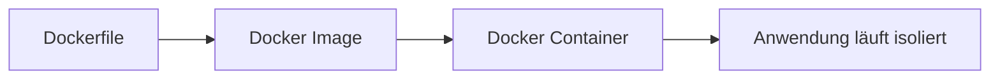
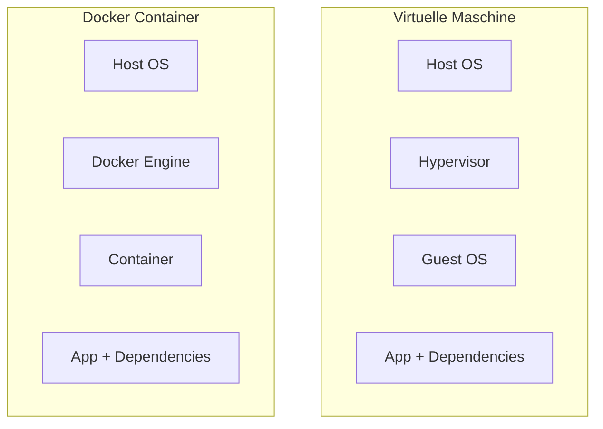
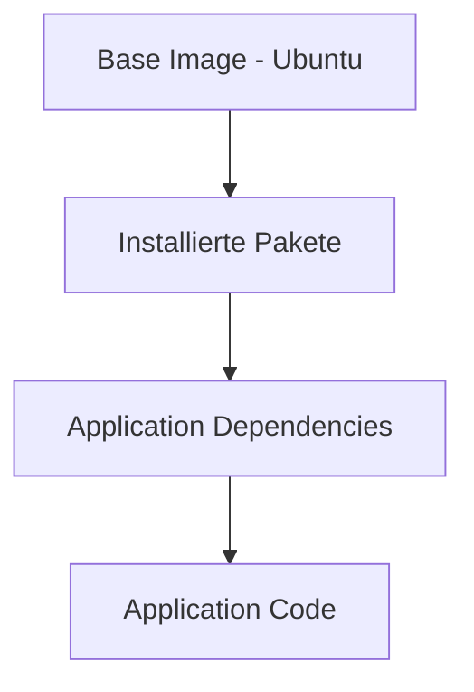
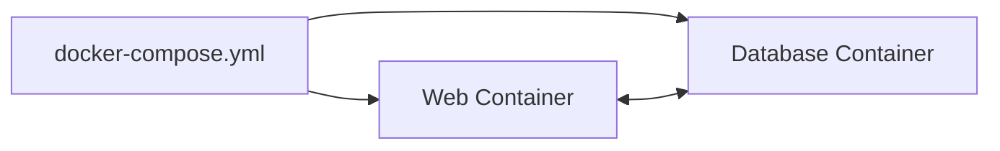

# Docker – Grundlagen: Images, Container und Compose

## Kurzüberblick

**Docker** ist eine Plattform zur Entwicklung, Bereitstellung und Ausführung von Anwendungen in **Containern**.  
Ein Container enthält eine Anwendung **inklusive aller benötigten Abhängigkeiten**, sodass sie auf jedem System identisch ausgeführt werden kann.

Docker löst damit das klassische Problem:

> *"Bei mir funktioniert es, aber auf dem Server nicht."*

Die zentrale Idee:

```text
Dockerfile → Image → Container
```

- **Dockerfile** beschreibt, wie ein Image gebaut wird
- **Image** ist eine unveränderliche Vorlage
- **Container** ist eine laufende Instanz dieses Images

---

## Grundprinzip von Docker



1. Entwickler schreibt ein **Dockerfile**
2. Daraus wird ein **Docker Image gebaut**
3. Das Image kann beliebig oft als **Container gestartet werden**

---

## Kernkonzepte von Docker

### Docker Image

Ein **Image** ist eine **schreibgeschützte Vorlage**, aus der Container erstellt werden.

Eigenschaften:

- enthält Betriebssystembasis, z. B. Linux
- enthält benötigte Software
- enthält Anwendungscode
- ist **immutable**, also unveränderlich

Ein Image ist im Grunde:

> eine **Momentaufnahme eines Dateisystems plus Konfiguration**

Beispiel:

```text
nginx:latest
```

- `nginx` = Repository beziehungsweise Image-Name
- `latest` = Tag

---

### Docker Container

Ein **Container** ist eine **laufende Instanz eines Images**.

Eigenschaften:

- isolierte Umgebung
- eigener Prozessraum
- eigenes Netzwerk
- eigenes Dateisystem über Layer

Wichtig:

Container **teilen sich den Kernel des Host-Systems**.  
Dadurch müssen Container **kein eigenes vollständiges Betriebssystem** starten. Sie sind deshalb **leichter** und **starten schneller** als virtuelle Maschinen.

---

## Unterschied: Container vs. Virtuelle Maschine



| Virtuelle Maschine | Container |
|---|---|
| enthält ein vollständiges eigenes Betriebssystem | teilt sich den Kernel mit dem Host |
| schwergewichtiger | leichtgewichtiger |
| höherer Ressourcenverbrauch | geringerer Ressourcenverbrauch |
| startet vergleichsweise langsamer | startet meist sehr schnell |

Der wichtigste Unterschied liegt darin, dass eine virtuelle Maschine ein vollständiges **Guest OS** startet, während ein Container lediglich isolierte Prozesse auf Basis des Host-Kernels ausführt.

---

## Aufbau eines Docker Images

Docker Images bestehen aus **mehreren Schichten**, sogenannten **Layers**.  
Jede Dockerfile-Anweisung erzeugt typischerweise einen neuen Layer.

### Layer-System



Eigenschaften der Layers:

- **read-only**, also nach Erstellung nicht mehr veränderbar
- können **von mehreren Images geteilt** werden
- sparen Speicherplatz
- beschleunigen Builds durch Caching

Beispiel:

```dockerfile
FROM node:20
RUN apt-get update
RUN npm install
COPY . /app
```

Jede Zeile erzeugt einen **neuen Layer**.

---

### Layer Sharing in der Praxis

Viele Images bauen auf denselben Basisschichten auf, zum Beispiel `ubuntu`, `debian` oder `alpine`.  
Docker kann diese Layers **einmal speichern** und **für mehrere Images wiederverwenden**.

Effekte:

- **weniger Speicherbedarf**, weil gemeinsame Basisschichten nicht dupliziert werden
- **schnellere Builds**, weil unveränderte Layers aus dem Cache wiederverwendet werden
- **schnellere Pulls**, weil vorhandene Layers nicht erneut heruntergeladen werden müssen

Beispiel-Szenario:

- Image A basiert auf `ubuntu`
- Image B basiert ebenfalls auf `ubuntu`

Dann kann Docker den `ubuntu`-Layer **einmal** speichern und für beide Images nutzen.

Ohne Layer-Sharing müsste jedes Image alle Layers vollständig selbst enthalten. Das würde mehr Speicher verbrauchen und Builds sowie Downloads verlangsamen.

> Layer-Sharing ist einer der großen Performance- und Speicher-Vorteile von Docker.

---

## Dockerfile

Ein **Dockerfile** ist eine Textdatei, die beschreibt, wie ein Docker Image gebaut wird.

Es legt unter anderem fest:

- welches Basis-Image verwendet wird
- welche Pakete installiert werden
- welche Dateien kopiert werden
- welcher Befehl beim Start ausgeführt wird

Beispiel:

```dockerfile
FROM node:20

WORKDIR /app

COPY package.json .

RUN npm install

COPY . .

CMD ["node", "server.js"]
```

Ablauf:

1. Docker liest das Dockerfile.
2. Docker erstellt Schritt für Schritt Image-Layer.
3. Am Ende entsteht ein fertiges **Docker Image**.

---

## Docker Hub

**Docker Hub** ist eine öffentliche **Image Registry**.

Funktionen:

- Images speichern
- Images teilen
- Images herunterladen

Beispiel:

```bash
docker pull nginx
```

Dieser Befehl lädt das **offizielle Nginx Image** herunter.

Viele offizielle Images existieren, zum Beispiel:

- `nginx`
- `mysql`
- `node`
- `python`
- `postgres`
- `redis`

---

## Image Tags

Tags sind ein zentraler Mechanismus für **Versionierung** und **kontrollierbare Deployments**.

### Wozu Tags dienen

Tags ermöglichen:

- **Versionierung**, zum Beispiel `nginx:1.21`
- **gezielte Deployments**, weil eine bestimmte Image-Version genutzt wird
- **Stabilität**, weil nicht unbeabsichtigt eine andere Version verwendet wird

### Problem ohne spezifische Tags

Wenn man kein Tag angibt, wird häufig automatisch `latest` verwendet:

```text
nginx
```

entspricht in vielen Fällen:

```text
nginx:latest
```

Das ist in der Praxis riskant:

- `latest` kann sich ändern
- Builds und Deployments werden schwer nachvollziehbar
- Fehler können plötzlich auftreten, obwohl sich der eigene Code nicht geändert hat

### Best Practice

Für produktive Systeme gilt:

- möglichst **immer spezifische Tags** verwenden, zum Beispiel `1.21.6` oder `20-alpine`
- `latest` in Production vermeiden
- `latest` höchstens für Experimente oder einfache Tests nutzen

---

### Aufbau von Tags

Format:

```text
repository:tag
```

| Bestandteil | Bedeutung | Beispiel |
|---|---|---|
| `repository` | Name des Images | `nginx`, `mysql`, `node` |
| `tag` | Variante oder Version | `1.21`, `latest`, `alpine` |

Beispiele:

```text
nginx:1.21
nginx:latest
node:20-alpine
mysql:8
```

Wichtig:

Tags sind **Labels**. Sie sind nicht automatisch semantische Versionen.  
Ihre genaue Bedeutung hängt vom jeweiligen Publisher des Images ab.

---

## Wichtige Docker-Befehle

### Images verwalten

| Befehl | Beschreibung |
|---|---|
| `docker build` | erstellt ein Image aus einem Dockerfile |
| `docker images` | listet lokale Images auf |
| `docker pull` | lädt ein Image aus einer Registry herunter |
| `docker push` | lädt ein Image in eine Registry hoch |
| `docker rmi` | löscht ein Image |

---

### Container verwalten

| Befehl | Beschreibung |
|---|---|
| `docker run` | startet einen neuen Container |
| `docker ps` | zeigt laufende Container |
| `docker ps -a` | zeigt alle Container |
| `docker stop` | stoppt einen Container |
| `docker rm` | entfernt einen Container |
| `docker logs` | zeigt Container-Logs |

---

## Wichtige Optionen für `docker run`

| Option | Bedeutung |
|---|---|
| `-d` | startet den Container im Hintergrund |
| `-p` | Port-Mapping von Host zu Container |
| `-v` | Volume oder Dateisystem-Mount |
| `--name` | vergibt einen Container-Namen |
| `--rm` | löscht den Container nach dem Stop automatisch |
| `-e` | setzt eine Umgebungsvariable |
| `--network` | verbindet den Container mit einem Netzwerk |
| `--restart` | legt eine Restart Policy fest |

---

### Beispiel für `docker run`

```bash
docker run -d -p 8080:80 --name web nginx
```

Bedeutung:

| Teil | Erklärung |
|---|---|
| `-d` | Container läuft im Hintergrund |
| `-p 8080:80` | Host-Port `8080` wird auf Container-Port `80` weitergeleitet |
| `--name web` | Container erhält den Namen `web` |
| `nginx` | verwendetes Image |

Danach ist der Webserver erreichbar unter:

```text
http://localhost:8080
```

---

## Restart Policies

Docker kann Container automatisch neu starten.

| Policy | Verhalten |
|---|---|
| `no` | kein automatischer Neustart |
| `on-failure` | Neustart nur bei Fehler |
| `always` | Container wird immer neu gestartet |
| `unless-stopped` | Neustart, außer der Container wurde manuell gestoppt |

Beispiel:

```bash
docker run --restart unless-stopped nginx
```

---

## Container und Images analysieren

### Images anzeigen

```bash
docker images
```

Zeigt unter anderem:

- Repository
- Tag
- Image ID
- Größe

---

### Container anzeigen

```bash
docker ps
```

Zeigt unter anderem:

- Container ID
- Image
- Status
- Ports
- Name

---

### Container oder Images detailliert untersuchen

```bash
docker inspect <container-id>
```

Liefert unter anderem Informationen zu:

- Netzwerken
- Volumes
- Konfiguration
- Ressourcenlimits

---

## Docker Compose

**Docker Compose** ermöglicht es, **mehrere Container gemeinsam zu definieren und zu starten**.

Sobald eine Anwendung aus mehreren Komponenten besteht, zum Beispiel Webserver und Datenbank, werden einzelne `docker run`-Befehle schnell unübersichtlich. Compose löst dieses Problem mit **einer zentralen YAML-Datei**.

Typische Datei:

```text
docker-compose.yml
```

---

### Beispiel für eine Compose-Datei

```yaml
version: "3"

services:
  web:
    image: nginx
    ports:
      - "8080:80"

  database:
    image: mysql
    environment:
      MYSQL_ROOT_PASSWORD: example
```

---

### Compose-Architektur



Compose erstellt automatisch:

- Netzwerk
- Container
- optional Volumes

---

### Wichtige Compose-Befehle

| Befehl | Funktion |
|---|---|
| `docker compose up` | startet die Anwendung |
| `docker compose up -d` | startet die Anwendung im Hintergrund |
| `docker compose down` | stoppt und entfernt Container |
| `docker compose ps` | zeigt Compose-Container |
| `docker compose logs` | zeigt Logs |

---

## Docker Swarm

**Docker Swarm** ist eine **Orchestrierungslösung für Docker-Cluster**.

Funktionen:

- mehrere Docker Hosts verbinden
- Container über mehrere Server verteilen
- Skalierung ermöglichen
- Load Balancing bereitstellen

Ein Swarm-Cluster sieht für Docker aus wie **ein einziger virtueller Host**.

---

## Praxisbeispiel

Ein Entwickler möchte eine Web-App deployen.

Ohne Docker müssen auf dem Zielsystem manuell passende Abhängigkeiten eingerichtet werden:

- Node.js installieren
- Dependencies installieren
- richtige Versionen sicherstellen
- Umgebungsunterschiede beachten

Mit Docker:

```bash
docker build -t my-app .
docker run -p 3000:3000 my-app
```

Die Anwendung läuft dadurch **identisch auf jedem System**, auf dem Docker verfügbar ist.

---

## Prüfungsrelevanz für die IHK

Typische prüfungsrelevante Themen:

- Unterschied zwischen **Image** und **Container**
- Aufbau eines **Docker Images** mit Layers
- Zweck eines **Dockerfiles**
- Rolle von **Docker Hub**
- Nutzen und Risiken von **Tags**, besonders `latest`
- Unterschied zwischen **Docker-Containern** und **virtuellen Maschinen**
- Grundidee und Nutzen von **Docker Compose**

Sehr wichtig:

```text
Dockerfile → Image → Container
```

Diese Reihenfolge beschreibt den zentralen Docker-Workflow:

1. Im Dockerfile wird der Bauprozess beschrieben.
2. Daraus wird ein Image erstellt.
3. Aus dem Image wird ein Container gestartet.

---

## Häufige Missverständnisse

### Container sind keine virtuellen Maschinen

Container:

- teilen sich den Kernel mit dem Host-System
- starten sehr schnell
- benötigen weniger Ressourcen als virtuelle Maschinen

Virtuelle Maschinen dagegen enthalten ein vollständiges eigenes Betriebssystem.

---

### Images sind unveränderlich

Ein Image kann nach seiner Erstellung **nicht direkt verändert** werden.

Stattdessen wird bei Änderungen ein neues Image erzeugt:

- neue Dockerfile-Anweisung
- neuer Layer
- neues Image

---

### `latest` ist nicht automatisch stabil

`latest` bedeutet nicht automatisch „neueste stabile Version“.  
Es ist lediglich ein Tag, den der Publisher so benennt.

In produktiven Umgebungen sind daher besser:

- feste Versionen, zum Beispiel `nginx:1.21.6`
- definierte Varianten, zum Beispiel `node:20-alpine`

---

### Container sind kurzlebig

Best Practice:

Container sollten möglichst **stateless** sein.

Daten werden ausgelagert in:

- Volumes
- Datenbanken
- externe Speicher

Dadurch können Container problemlos gelöscht, ersetzt oder neu gestartet werden, ohne dass wichtige Anwendungsdaten verloren gehen.
