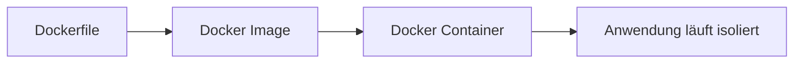
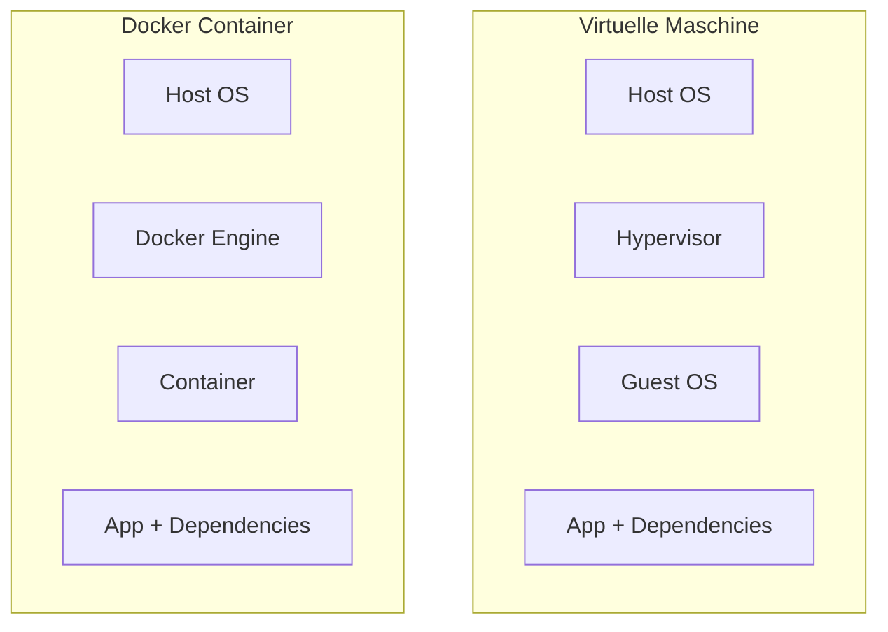
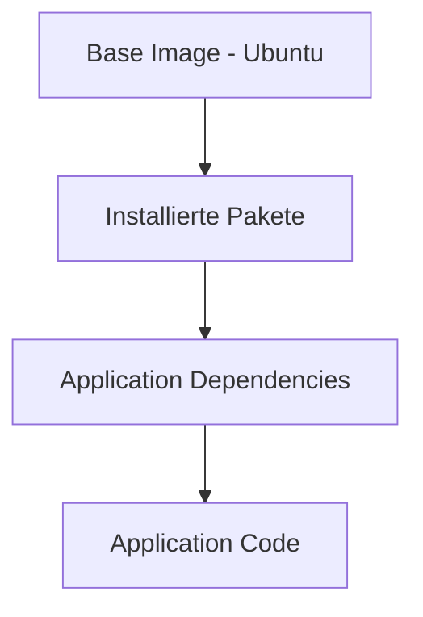
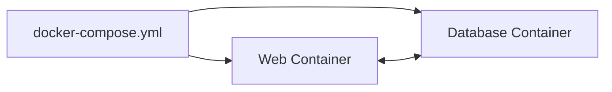

# Docker – Grundlagen

## Kurzüberblick

**Docker** ist eine Plattform zur Entwicklung, Bereitstellung und Ausführung von Anwendungen in **Containern**.  
Ein Container enthält eine Anwendung **inklusive aller benötigten Abhängigkeiten**, sodass sie auf jedem System identisch ausgeführt werden kann.

Docker löst damit das klassische Problem:

> *"Bei mir funktioniert es, aber auf dem Server nicht."*

Die zentrale Idee:

```text
Dockerfile → Image → Container
```

- **Dockerfile** beschreibt, wie ein Image gebaut wird
- **Image** ist eine unveränderliche Vorlage
- **Container** ist eine laufende Instanz dieses Images

---

# Grundprinzip von Docker



1. Entwickler schreibt ein **Dockerfile**
2. Daraus wird ein **Docker Image gebaut**
3. Das Image kann beliebig oft als **Container gestartet werden**

---

# Kernkonzepte von Docker

## Docker Image

Ein **Image** ist eine **schreibgeschützte Vorlage**, aus der Container erstellt werden.

Eigenschaften:

- enthält Betriebssystembasis (z. B. Linux)
- enthält benötigte Software
- enthält Anwendungscode
- ist **immutable (unveränderlich)**

Ein Image ist im Grunde:

> eine **Momentaufnahme eines Dateisystems + Konfiguration**

Beispiel:

```text
nginx:latest
```

- `nginx` = Repository (Image-Name)
- `latest` = Tag

---

## Docker Container

Ein **Container** ist eine **laufende Instanz eines Images**.

Eigenschaften:

- isolierte Umgebung
- eigener Prozessraum
- eigenes Netzwerk
- eigenes Dateisystem (über Layer)

Wichtig:

Container **teilen sich den Kernel des Host-Systems**.  
Dadurch müssen Container **kein eigenes vollständiges Betriebssystem** starten → sie sind **leichter** und **starten schneller** als virtuelle Maschinen.

---

# Unterschied: Container vs. Virtuelle Maschine



**Virtuelle Maschine**

- vollständiges Betriebssystem pro VM
- schwergewichtig
- hoher Ressourcenverbrauch

**Container**

- teilen sich Host-Kernel
- leichtgewichtig
- starten in Sekunden

---

# Aufbau eines Docker Images

Docker Images bestehen aus **mehreren Schichten (Layers)**.  
Jede Dockerfile-Anweisung erzeugt typischerweise einen neuen Layer.

## Layer-System (Prinzip)



Eigenschaften der Layers:

- **read-only** (einmal erstellt, nicht mehr veränderbar)
- können **von mehreren Images geteilt** werden
- sparen Speicherplatz
- beschleunigen Builds (Caching)

Beispiel:

```dockerfile
FROM node:20
RUN apt-get update
RUN npm install
COPY . /app
```

Jede Zeile erzeugt einen **neuen Layer**.

---

## Layer Sharing in der Praxis

### Warum Sharing?

Viele Images bauen auf denselben Basisschichten auf (z. B. `ubuntu`, `debian`, `alpine`).  
Docker kann diese Layers **einmal speichern** und **für mehrere Images wiederverwenden**.

**Effekte:**

- **weniger Speicherbedarf**: gemeinsame Basisschichten werden nicht dupliziert
- **schnellere Builds**: unveränderte Layers werden aus dem Cache wiederverwendet
- **schnellere Pulls**: vorhandene Layers müssen nicht erneut geladen werden

### Beispiel-Szenario

- Image A basiert auf `ubuntu`
- Image B basiert ebenfalls auf `ubuntu`

Dann kann Docker den `ubuntu`-Layer **einmal** halten und für beide Images nutzen.

### Ohne Sharing (als Gedankenmodell)

Ohne Layer-Sharing müsste jedes Image alle Layers komplett selbst enthalten:

- mehr Speicherverbrauch
- langsameres Bauen und Laden

> In der Realität ist genau dieses Sharing einer der großen Performance- und Speicher-Vorteile von Docker.

---

# Dockerfile

Ein **Dockerfile** ist eine Textdatei, die beschreibt:

- welches Basis-Image verwendet wird
- welche Pakete installiert werden
- welche Dateien kopiert werden
- welcher Befehl beim Start ausgeführt wird

Beispiel:

```dockerfile
FROM node:20

WORKDIR /app

COPY package.json .

RUN npm install

COPY . .

CMD ["node", "server.js"]
```

Ablauf:

1. Docker liest Dockerfile
2. erstellt Schritt für Schritt Image-Layer
3. erzeugt final ein **Docker Image**

---

# Docker Hub

**Docker Hub** ist eine öffentliche **Image Registry**.

Funktionen:

- Images speichern
- Images teilen
- Images herunterladen

Beispiel:

```bash
docker pull nginx
```

lädt das **offizielle Nginx Image**.

Viele offizielle Images existieren:

- nginx
- mysql
- node
- python
- postgres
- redis

---

# Image Tags

Tags sind ein zentraler Mechanismus für **Versionierung** und **kontrollierbare Deployments**.

## Wozu Tags?

- **Versionierung**: z. B. `nginx:1.21` statt "irgendeine" Version
- **Gezielte Deployments**: exakt reproduzierbar (wichtig für Tests & Produktion)
- **Stabilität**: verhindert, dass ein Deployment plötzlich eine andere Version bekommt

### Problem ohne (spezifische) Tags

Wenn man kein Tag angibt, wird häufig automatisch `latest` verwendet:

- `nginx` ≈ `nginx:latest`

Das ist in der Praxis riskant:

- `latest` kann sich ändern
- Builds/Deployments werden schwer nachvollziehbar
- Fehler können "plötzlich" auftreten, obwohl man nichts am Code geändert hat

## Best Practice

- **In Produktion**: möglichst **immer spezifische Tags** verwenden (z. B. `1.21.6`, `20-alpine`)
- **`latest` vermeiden** in Production (nur für Experimente/Tests)

---

## Aufbau von Tags

Format:

```text
repository:tag
```

- **repository**: Name des Images (z. B. `nginx`, `mysql`, `node`)
- **tag**: Variante/Version (z. B. `1.21`, `latest`, `alpine`)

Beispiele:

```text
nginx:1.21
nginx:latest
node:20-alpine
mysql:8
```

Hinweis: Tags sind **Labels**, nicht automatisch "semantische Versionen" – ihre Bedeutung hängt vom Publisher ab.

---

# Wichtige Docker Befehle

## Images verwalten

| Befehl | Beschreibung |
|------|-------------|
| `docker build` | erstellt Image aus Dockerfile |
| `docker images` | listet lokale Images |
| `docker pull` | lädt Image aus Registry |
| `docker push` | lädt Image in Registry hoch |
| `docker rmi` | löscht Image |

---

## Container verwalten

| Befehl | Beschreibung |
|------|-------------|
| `docker run` | startet neuen Container |
| `docker ps` | zeigt laufende Container |
| `docker ps -a` | zeigt alle Container |
| `docker stop` | stoppt Container |
| `docker rm` | entfernt Container |
| `docker logs` | zeigt Container Logs |

---

# Wichtige Optionen für `docker run`

| Option | Bedeutung |
|------|-----------|
| `-d` | startet Container im Hintergrund |
| `-p` | Port-Mapping Host → Container |
| `-v` | Volume / Dateisystem Mount |
| `--name` | Containername vergeben |
| `--rm` | Container nach Stop automatisch löschen |
| `-e` | Umgebungsvariable setzen |
| `--network` | Container mit Netzwerk verbinden |
| `--restart` | Restart Policy festlegen |

---

## Beispiel

```bash
docker run -d -p 8080:80 --name web nginx
```

Bedeutung:

| Teil | Erklärung |
|----|-----------|
| `-d` | Container im Hintergrund |
| `-p 8080:80` | Host Port → Container Port |
| `--name web` | Containername |
| `nginx` | verwendetes Image |

Danach erreichbar:

```text
http://localhost:8080
```

---

# Restart Policies

Docker kann Container automatisch neu starten.

| Policy | Verhalten |
|------|-----------|
| `no` | kein automatischer Neustart |
| `on-failure` | nur bei Fehler |
| `always` | immer neu starten |
| `unless-stopped` | neu starten außer manuell gestoppt |

Beispiel:

```bash
docker run --restart unless-stopped nginx
```

---

# Container und Images analysieren

## Images anzeigen

```bash
docker images
```

zeigt:

- Repository
- Tag
- Image ID
- Größe

---

## Container anzeigen

```bash
docker ps
```

zeigt:

- Container ID
- Image
- Status
- Ports
- Name

---

## Container/Images detailliert untersuchen

```bash
docker inspect <container-id>
```

liefert (u. a.):

- Netzwerke
- Volumes
- Konfiguration
- Ressourcenlimits

---

# Docker Compose

**Docker Compose** ermöglicht es, **mehrere Container gleichzeitig zu definieren und zu starten**.  
Sobald eine Anwendung aus mehreren Komponenten besteht (z. B. Webserver + Datenbank), werden einzelne `docker run` Befehle schnell unübersichtlich. Compose löst das mit **einer zentralen YAML-Datei**.

Datei:

```text
docker-compose.yml
```

---

## Beispiel Compose Datei

```yaml
version: "3"

services:
  web:
    image: nginx
    ports:
      - "8080:80"

  database:
    image: mysql
    environment:
      MYSQL_ROOT_PASSWORD: example
```

---

## Compose Architektur



Compose erstellt automatisch:

- Netzwerk
- Container
- Volumes (optional)

---

## Wichtige Compose Befehle

| Befehl | Funktion |
|------|----------|
| `docker compose up` | startet Anwendung |
| `docker compose up -d` | startet im Hintergrund |
| `docker compose down` | stoppt und entfernt Container |
| `docker compose ps` | zeigt Container |
| `docker compose logs` | Logs anzeigen |

---

# Docker Swarm

**Docker Swarm** ist eine **Orchestrierungslösung für Docker Cluster**.

Funktion:

- mehrere Docker Hosts verbinden
- Container über mehrere Server verteilen
- automatische Skalierung
- Load Balancing

Cluster sieht für Docker aus wie **ein einziger virtueller Host**.

---

# Praxisbeispiel

Ein Entwickler möchte eine Web-App deployen.

Ohne Docker:

- Node installieren
- Dependencies installieren
- richtige Versionen sicherstellen

Mit Docker:

```bash
docker build -t my-app .
docker run -p 3000:3000 my-app
```

Die Anwendung läuft **identisch auf jedem System**.

---

# Prüfungsrelevanz (IHK)

Typische Prüfungsfragen:

- Unterschied **Image vs Container**
- Aufbau eines **Docker Images (Layer)**
- Zweck eines **Dockerfiles**
- Rolle von **Docker Hub**
- Nutzen und Risiken von **Tags** (z. B. `latest`)
- Unterschiede **Docker vs VM**
- Funktionsweise von **Docker Compose**

Sehr wichtig:

> Dockerfile → Image → Container

---

# Häufige Missverständnisse

## Container sind keine virtuellen Maschinen

Container:

- teilen sich den Kernel
- starten extrem schnell
- benötigen weniger Ressourcen

---

## Images sind unveränderlich

Ein Image kann **nicht verändert werden**.

Stattdessen:

- neue Layer
- neues Image

---

## `latest` ist nicht automatisch "stabil"

`latest` bedeutet nicht "die beste Version", sondern nur "ein Tag, den der Publisher so benennt".  
In Production daher besser:

- feste Versionen (z. B. `nginx:1.21.6`)
- oder definierte Varianten (z. B. `node:20-alpine`)

---

## Container sind kurzlebig

Best Practice:

Container sind **stateless**.

Daten werden ausgelagert in:

- Volumes
- Datenbanken
- externe Speicher
