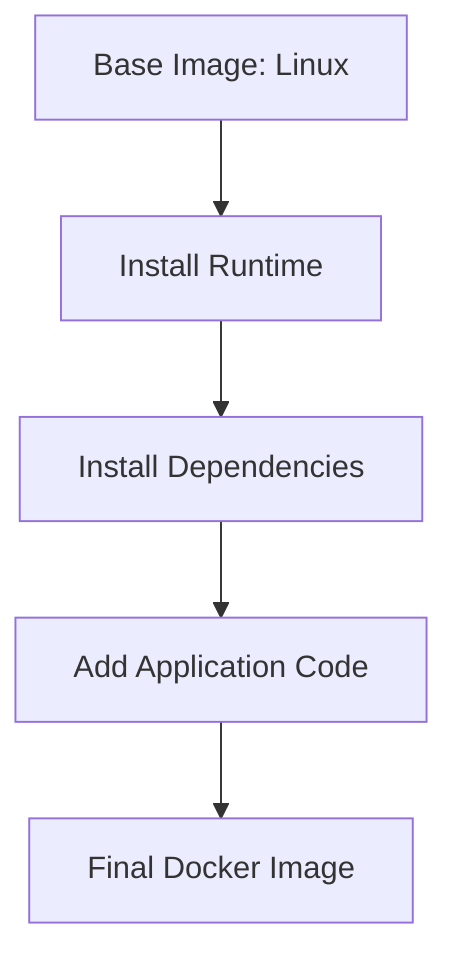
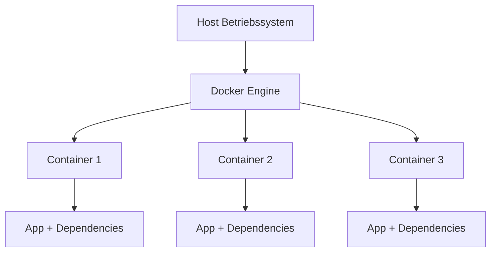
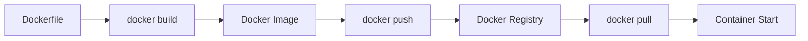

# Docker Images und Container

## Kurzüberblick

**Docker** ist eine Containerplattform, mit der Anwendungen zusammen mit allen benötigten Abhängigkeiten in **Container** verpackt werden können.

Das Grundprinzip besteht aus zwei zentralen Bausteinen:

| Begriff | Bedeutung |
|---|---|
| **Docker Image** | Eine unveränderliche Vorlage (Blueprint) für Container |
| **Docker Container** | Eine laufende Instanz eines Images |

Damit können Anwendungen **identisch auf verschiedenen Systemen** ausgeführt werden – unabhängig von Betriebssystem, Infrastruktur oder Umgebung.

---

## Docker Images

Ein **Docker Image** ist eine **read-only Vorlage**, die alles enthält, was eine Anwendung zum Start benötigt:

- Anwendungscode
- Runtime (z. B. Java, Node, Python)
- Systembibliotheken
- Konfiguration
- Tools

Images sind **unveränderlich** (immutable).  
Wenn sich etwas ändern soll, wird **ein neues Image gebaut**.

### Aufbau eines Images

Images bestehen aus **Layern**.

Jeder Schritt im Buildprozess erzeugt einen neuen Layer.



Vorteile dieses Layer-Prinzips:

- schneller Download (Layer werden wiederverwendet)
- effizientes Caching beim Build
- kleine Updates möglich

---

## Dockerfile – Bauplan eines Images

Ein **Dockerfile** beschreibt, wie ein Image erstellt wird.

Beispiel:

```dockerfile
FROM node:20-alpine

WORKDIR /app

COPY package.json .

RUN npm install

COPY . .

CMD ["node", "server.js"]
```

Erklärung:

| Befehl | Bedeutung |
|---|---|
| `FROM` | Basis-Image |
| `WORKDIR` | Arbeitsverzeichnis |
| `COPY` | Dateien in das Image kopieren |
| `RUN` | Befehle während des Builds ausführen |
| `CMD` | Standardstartbefehl des Containers |

---

## Docker Container

Ein **Docker Container** ist eine **laufende Instanz eines Images**.

Eigenschaften:

- isolierte Umgebung
- eigenes Dateisystem
- eigene Prozesse
- eigene Netzwerkkonfiguration

Der Container nutzt jedoch **den Kernel des Host-Betriebssystems**.



Dadurch sind Container:

- **leichtgewichtig**
- **schnell startbar**
- **ressourcensparend**

Im Gegensatz zu **virtuellen Maschinen**, die ein vollständiges Betriebssystem enthalten.

---

## Docker Registry

Docker Images werden typischerweise in einer **Registry** gespeichert.

Bekannte Registries:

| Registry | Beschreibung |
|---|---|
| Docker Hub | öffentliche Standard-Registry |
| GitHub Container Registry | Integration mit GitHub |
| GitLab Registry | Integration mit GitLab |
| Private Registry | interne Unternehmenslösungen |

Workflow:



---

## Image-Varianten: Größe vs. Komfort

Viele Images existieren in verschiedenen Varianten.

Grundprinzip:

**Je kleiner das Image → desto weniger Tools sind enthalten.**

| Variante | Eigenschaften | Typischer Use Case |
|---|---|---|
| **Full Version** | vollständige Linux-Distribution | Entwicklung |
| **Slim** | reduzierte Pakete | Produktionscontainer |
| **Alpine** | extrem kleines Linux | Microservices |

### Full Version

Beispiel:

```
python:3.12
```

Eigenschaften:

- viele Tools vorinstalliert
- einfacher zu debuggen
- größer (mehrere hundert MB)

Use Case:

- Entwicklung
- Debugging
- komplexe Builds

---

### Slim Version

Beispiel:

```
python:3.12-slim
```

Eigenschaften:

- weniger Systempakete
- kleiner als Full-Version
- schneller Download

Use Case:

- Produktionscontainer
- Standard-Deployment

---

### Alpine Version

Beispiel:

```
python:3.12-alpine
```

Eigenschaften:

- basiert auf **Alpine Linux**
- sehr klein (oft < 50 MB)
- minimale Tools

Use Case:

- Microservices
- Cloud Deployments
- CI/CD Pipelines

Nachteil:

- weniger kompatible Libraries
- manchmal komplizierter zu debuggen

---

## Wichtige Docker Container Befehle

### Image bauen

```bash
docker build -t myapp .
```

- `-t` → Image tag/name vergeben  
- `.` → aktuelles Verzeichnis als Build-Kontext

---

### Container starten

```bash
docker run -d -p 8080:80 --name webserver nginx
```

Bedeutung:

| Teil | Erklärung |
|---|---|
| `docker run` | Container starten |
| `-d` | detached mode (Hintergrund) |
| `-p 8080:80` | Portweiterleitung |
| `--name webserver` | Containername |
| `nginx` | verwendetes Image |

---

### Laufende Container anzeigen

```bash
docker ps
```

Alle Container (auch gestoppte):

```bash
docker ps -a
```

---

### Container stoppen

```bash
docker stop <container_id>
```

---

### Container löschen

```bash
docker rm <container_id>
```

---

### Image löschen

```bash
docker rmi <image_name>
```

---

### Logs eines Containers anzeigen

```bash
docker logs <container_id>
```

Beispiel:

```bash
docker logs webserver
```

---

### Befehl im Container ausführen

```bash
docker exec -it <container_id> bash
```

Parameter:

| Flag | Bedeutung |
|---|---|
| `-i` | interaktiver Modus |
| `-t` | Terminal (TTY) |
| `bash` | gestartete Shell |

---

## Wichtige Flags bei `docker run`

| Flag | Bedeutung |
|---|---|
| `-t` | Pseudo-Terminal (TTY) |
| `-i` | Interaktiver Modus |
| `-d` | Detached Mode (Hintergrund) |
| `--name` | Containername vergeben |
| `-p` | Port Mapping (Host:Container) |

Beispiel:

```bash
docker run -it --name testcontainer ubuntu bash
```

Startet einen interaktiven Ubuntu-Container mit Shell.

---

## Dateien zwischen Host und Container kopieren

Docker erlaubt es, Dateien **zwischen dem Host-System und einem Container** zu kopieren.

### Datei vom Host in den Container kopieren

```bash
docker cp <local_path> <container_id>:<container_path>
```

Beispiel:

```bash
docker cp ./config.json myapp_container:/app/config.json
```

Erklärung:

| Teil | Bedeutung |
|---|---|
| `./config.json` | lokale Datei |
| `myapp_container` | Zielcontainer |
| `/app/config.json` | Zielpfad im Container |

---

### Datei aus dem Container auf den Host kopieren

```bash
docker cp <container_id>:<container_path> <local_path>
```

Beispiel:

```bash
docker cp myapp_container:/app/logs.txt ./logs.txt
```

Erklärung:

| Teil | Bedeutung |
|---|---|
| `myapp_container` | Container |
| `/app/logs.txt` | Datei im Container |
| `./logs.txt` | Ziel auf dem Host |

---

## Praktisches Beispiel

### Schritt 1 – Image bauen

```bash
docker build -t myapp .
```

### Schritt 2 – Container starten

```bash
docker run -d -p 3000:3000 myapp
```

### Schritt 3 – Logs ansehen

```bash
docker logs <container_id>
```

---

## Prüfungsrelevanz (IHK)

Typische Prüfungsfragen:

### Unterschied Image vs Container

| Image | Container |
|---|---|
| Vorlage | laufende Instanz |
| unveränderlich | veränderlich |
| wird gebaut | wird gestartet |

---

### Warum Docker verwenden?

- reproduzierbare Umgebung
- Portabilität
- schnelle Deploymentzeiten
- Isolation von Anwendungen
- effiziente Ressourcennutzung

---

## Häufige Missverständnisse

### Docker ist keine virtuelle Maschine

Docker nutzt **keine vollständige VM**, sondern:

- **shared OS Kernel**
- **Namespaces** zur Prozessisolierung
- **cgroups** zur Ressourcenverwaltung

Dadurch sind Container **viel leichter als virtuelle Maschinen**.

---

### Container sind nicht dauerhaft

Standardmäßig sind Container **ephemeral**.

Das bedeutet:

- Container gelöscht → Daten verschwinden

Persistente Daten werden über **Docker Volumes** oder **Bind Mounts** gespeichert.

---

## Merksatz

**Image = Bauplan**  
**Container = laufende Instanz des Bauplans**

Oder:

> **Images werden gebaut – Container werden gestartet.**
