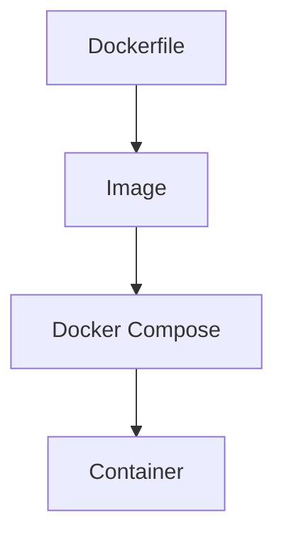

## Überblick / Definition

**Docker Compose** ist ein Werkzeug zur Definition und Ausführung von **Multi-Container-Anwendungen**.

Anstatt einzelne Container manuell zu starten, wird eine gesamte Anwendung (z. B. Webserver + Datenbank) in einer **YAML-Datei (`docker-compose.yml`)** beschrieben und mit einem einzigen Befehl gestartet.

---

## Kernkonzept: Was löst Docker Compose?

Ohne Docker Compose:

- mehrere `docker run` Befehle notwendig
- Reihenfolge und Abhängigkeiten müssen manuell beachtet werden
- Netzwerke und Konfiguration müssen separat erstellt werden

Mit Docker Compose:

- **zentrale Konfigurationsdatei**
- **automatischer Start aller Services**
- **integriertes Netzwerk**
- **Abhängigkeiten werden berücksichtigt**

---

## Aufbau einer docker-compose.yml

Eine Compose-Datei besteht typischerweise aus:

- **services** → Container (z. B. Web, DB)
- **networks** → Kommunikation zwischen Containern
- **volumes** → persistente Daten

### Beispiel

```yaml
version: '3'

services:
  web:
    image: nginx
    ports:
      - "80:80"

  db:
    image: mysql
    environment:
      MYSQL_ROOT_PASSWORD: example
```

### Erklärung

| Element | Bedeutung |
|---|---|
| `services` | definiert alle Container |
| `web` | Name des Containers |
| `image` | welches Image verwendet wird |
| `ports` | Port-Mapping (Host:Container) |
| `environment` | Umgebungsvariablen |

👉 Beide Container laufen im selben Netzwerk und können sich gegenseitig erreichen.

---

## Ablauf mit Docker Compose

Typischer Workflow:

```bash
docker-compose up
```


---

## Vorteile von Docker Compose

- einfache Verwaltung komplexer Anwendungen
- einheitliche Konfiguration
- schnelle Reproduzierbarkeit
- geeignet für Entwicklung und Testing
- einfache Skalierung:

```bash
docker-compose up --scale web=3
```

---

## Dockerfile – Grundlage eines Images

Ein **Dockerfile** beschreibt, wie ein **Docker-Image gebaut wird**.

👉 Unterschied:

- **Dockerfile** → erstellt ein Image  
- **Docker Compose** → startet mehrere Container

---

## Aufbau eines Dockerfiles

Ein Dockerfile besteht aus Befehlen, die **schrittweise ein Image aufbauen**.

### Beispiel

```Dockerfile
# Basis-Image
FROM python:3.8-slim

# Arbeitsverzeichnis setzen
WORKDIR /app

# Dateien kopieren
COPY . /app

# Abhängigkeiten installieren
RUN pip install -r requirements.txt

# Startbefehl
CMD ["python", "app.py"]
```

---

## Wichtige Dockerfile-Befehle

| Befehl | Bedeutung |
|---|---|
| `FROM` | Basis-Image |
| `WORKDIR` | Arbeitsverzeichnis |
| `COPY` | Dateien ins Image kopieren |
| `RUN` | Befehle beim Build ausführen |
| `CMD` | Startbefehl des Containers |

---

## Zusammenspiel: Dockerfile + Docker Compose



- Dockerfile erstellt das Image
- Docker Compose nutzt dieses Image, um Container zu starten

---

## Praktisches Beispiel

Eine typische Webanwendung:

- **Frontend** → Webserver (nginx)
- **Backend** → App (z. B. Python)
- **Datenbank** → MySQL

👉 Alle drei werden in **einer Compose-Datei** definiert und gemeinsam gestartet.

---

## Prüfungsrelevanz

Wichtig für die Prüfung:

- Unterschied:
  - **Dockerfile = Image bauen**
  - **Docker Compose = Container orchestrieren**
- Aufbau einer `docker-compose.yml`
- Bedeutung von:
  - `services`
  - `ports`
  - `environment`
- Grundbefehl:
  ```bash
  docker-compose up
  ```

---

## Häufige Fehler

❌ Docker Compose erstellt Images automatisch  
→ nur, wenn `build:` definiert ist

❌ Container sind automatisch verbunden  
→ nur innerhalb des gleichen Compose-Projekts

❌ Dockerfile und Compose sind das Gleiche  
→ falsch, unterschiedliche Aufgaben

---

## Zusammenfassung

- **Dockerfile** definiert, *wie ein Image gebaut wird*
- **Docker Compose** definiert, *wie mehrere Container zusammenarbeiten*

👉 Gemeinsam ermöglichen sie:

- reproduzierbare Umgebungen
- einfache Entwicklung komplexer Systeme
- schnelle Bereitstellung von Anwendungen