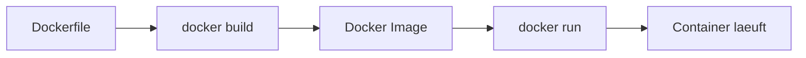
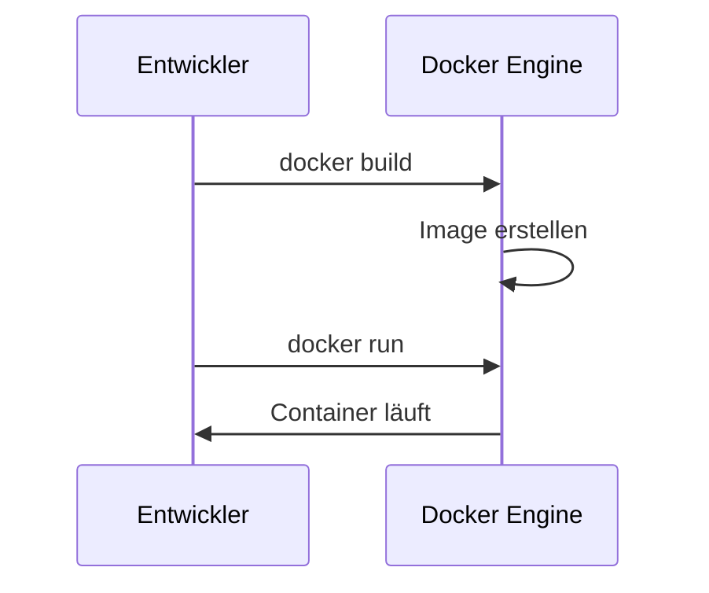

# Dockerfile & Dockerisierung

## Kurzdefinition
Ein **Dockerfile** ist eine textbasierte Bauanleitung zur Erstellung eines Docker-Images.  
Es beschreibt **Schritt für Schritt**, wie eine lauffähige Umgebung für eine Anwendung aufgebaut wird.

---

## Grundprinzip (Wie Docker funktioniert)



- **Dockerfile** → Bauplan  
- **Image** → fertiges "Abbild"  
- **Container** → laufende Instanz des Images  

---

## Aufbau eines Dockerfiles

Ein Dockerfile besteht aus aufeinanderfolgenden Anweisungen:

| Anweisung | Zweck |
|----------|------|
| `FROM` | Basis-Image (z. B. Betriebssystem + Runtime) |
| `ARG` | Build-Variable (nur waehrend Build) |
| `WORKDIR` | Arbeitsverzeichnis im Container |
| `COPY` | Dateien ins Image kopieren |
| `RUN` | Befehle beim Build ausführen |
| `ENV` | Umgebungsvariablen setzen |
| `EXPOSE` | Port dokumentieren |
| `USER` | User im Container setzen |
| `ENTRYPOINT` | Fester Startprozess |
| `CMD` | Startbefehl beim Containerstart |
| `HEALTHCHECK` | Container-Gesundheit pruefen |
| `VOLUME` | Persistenten Speicherpunkt definieren |

---

## `CMD` vs `ENTRYPOINT` (sehr wichtig)

| Direktive | Verhalten |
|---|---|
| `CMD` | Standard-Argumente/Startbefehl, leicht beim `docker run` ueberschreibbar |
| `ENTRYPOINT` | Hauptprozess, wird immer ausgefuehrt |

Typisches Muster:

```Dockerfile
ENTRYPOINT ["node", "app.js"]
CMD ["--port", "3000"]
```

Dann ist moeglich:

```bash
docker run mein-image --port 8080
```

---

## Wichtige Konzepte (Verständnis!)

### 1. Layer-Prinzip
Jede Anweisung erzeugt eine neue Schicht (Layer):

- Vorteil: Caching → schneller Build
- Nachteil: falsche Reihenfolge → ineffizient

 Beispiel:
- Erst `package.json` kopieren → dann `npm install`
- Nicht umgekehrt!

---

### 2. RUN erzeugt eigene Layer (sehr wichtig!)

Jede `RUN`-Anweisung erstellt **einen eigenen Layer** im Image.

❗ Problem:
- Viele `RUN`-Befehle → viele Layer → größeres Image

---

###  Schlechtes Beispiel (zu viele Layer)

```Dockerfile
RUN apt-get update
RUN apt-get install -y curl
RUN apt-get install -y git
```

→ Ergebnis:
- 3 Layer
- ineffizient
- größeres Image

---

###  Best Practice: Befehle kombinieren mit `&&`

```Dockerfile
RUN apt-get update && \
    apt-get install -y curl git && \
    apt-get clean
```

→ Ergebnis:
- nur **1 Layer**
- kleineres Image
- schnellerer Build

---

### Warum `&&`?

- sorgt dafür, dass Befehle **nacheinander ausgeführt werden**
- nächster Befehl nur, wenn vorheriger erfolgreich war
- reduziert Layer + verbessert Performance

---

### Extra Best Practice (wichtig für Prüfungen!)

```Dockerfile
RUN apt-get update && \
    apt-get install -y curl git && \
    rm -rf /var/lib/apt/lists/*
```

 Warum löschen?
- entfernt Cache-Dateien
- reduziert Image-Größe deutlich

---

## 3. Reproduzierbarkeit
Ein Dockerfile stellt sicher:

- gleiche Umgebung auf jedem System
- keine "läuft nur auf meinem Rechner"-Probleme

---

## 4. Isolation
Container laufen:

- unabhängig vom Host-System
- mit eigenen Abhängigkeiten

---

## 5. Multi-Stage Builds (haeufig in der Praxis)

Nutzen:

- Build-Tools bleiben nur im Build-Stage
- Runtime-Image wird deutlich kleiner
- weniger Angriffsflaeche

```Dockerfile
# Stage 1: Build
FROM node:20-alpine AS build
WORKDIR /app
COPY package*.json ./
RUN npm ci
COPY . .
RUN npm run build

# Stage 2: Runtime
FROM node:20-alpine
WORKDIR /app
COPY --from=build /app/dist ./dist
COPY --from=build /app/package*.json ./
RUN npm ci --omit=dev
USER node
EXPOSE 3000
CMD ["node", "dist/app.js"]
```

---

## 6. Sicherheit (Basics)

- nicht als `root` laufen -> `USER node` (oder eigener User)
- keine Secrets ins Image (`.env`, API-Keys)
- keine sensiblen Werte in `Dockerfile`
- Basis-Image regelmaessig aktualisieren
- feste Versionen verwenden (`node:20-alpine` statt `latest`)

---

## Praktisches Beispiel (Node.js)

```Dockerfile
# Basis-Image
FROM node:20-alpine

# Arbeitsverzeichnis
WORKDIR /app

# Nur Dependencies zuerst (Caching!)
COPY package*.json ./
RUN npm ci

# Restliche Dateien
COPY . .

# Port
EXPOSE 3000

# Keine root-Rechte
USER node

# Startbefehl
CMD ["node", "app.js"]
```

---

## Was braucht man, um eine App zu dockerisieren?

### Mindestanforderungen

1. **Anwendung**
   - Source Code
   - Abhängigkeiten (z. B. package.json)

2. **Dockerfile**
   - beschreibt Build-Prozess

3. **Docker Engine / CLI**
   - zum Bauen & Starten

4. *(optional)* **Registry**
   - z. B. Docker Hub (zum Teilen von Images)

---

### Ablauf der Dockerisierung



---

## Zentrale Docker-Befehle

### Image & Container

| Befehl | Beschreibung |
|-------|-------------|
| `docker build -t name .` | Image bauen |
| `docker run -d -p 3000:3000 name` | Container starten |
| `docker run --rm -it name sh` | interaktiv starten und danach entfernen |
| `docker ps` | laufende Container |
| `docker ps -a` | alle Container |
| `docker stop <id>` | Container stoppen |
| `docker logs <id>` | Logs anzeigen |
| `docker exec -it <id> bash` | in Container gehen |

---

### Images verwalten

| Befehl | Beschreibung |
|-------|-------------|
| `docker images` | Images anzeigen |
| `docker rmi <id>` | Image löschen |
| `docker pull <image>` | Image laden |
| `docker push <image>` | Image hochladen |
| `docker image prune` | ungenutzte Images aufraeumen |

---

### Docker Compose (mehrere Container)

Hinweis: Moderne Syntax ist **`docker compose`** (ohne Bindestrich).

| Befehl | Beschreibung |
|-------|-------------|
| `docker compose up -d` | alles starten |
| `docker compose down` | alles stoppen |
| `docker compose build` | Images bauen |
| `docker compose logs -f` | Logs anzeigen |

---

## Common Uses (haeufige Einsatzmuster)

### 1. Web-App + Datenbank lokal

```yaml
services:
    app:
        build: .
        ports:
            - "3000:3000"
        depends_on:
            - db
    db:
        image: postgres:16
        environment:
            POSTGRES_PASSWORD: example
        volumes:
            - db_data:/var/lib/postgresql/data

volumes:
    db_data:
```

### 2. Entwicklungsmodus mit Bind Mount

- Source-Code vom Host ins Container-Dateisystem mounten
- Code-Änderungen sofort wirksam (Hot Reload)

Beispiel:

```bash
docker run -p 3000:3000 -v "$PWD":/app mein-image
```

### 3. Build + Push fuer Registry

```bash
docker build -t user/app:1.0.0 .
docker push user/app:1.0.0
```

---

## Volumes und Netzwerk (Pflichtwissen)

### Volumes

- **Bind Mount**: direkter Ordner vom Host (`-v /host:/container`)
- **Named Volume**: von Docker verwaltet (besser fuer DB-Daten)

### Netzwerke

- Standard: Bridge-Netzwerk
- In Compose erhalten Services DNS-Namen (z. B. `db`)
- App verbindet sich dann mit Hostname `db`, nicht mit `localhost`

---

## Unterschied: Dockerfile vs Image

| Dockerfile | Docker Image |
|-----------|-------------|
| Bauanleitung | Ergebnis |
| Textdatei | Binäres Artefakt |
| veränderbar | unveränderlich (immutable) |
| wird gebaut | wird ausgeführt |

---

## Troubleshooting (sehr haeufig)

### Problem: Container beendet sich sofort

- Ursache: Hauptprozess endet
- Loesung: Startkommando pruefen (`CMD`/`ENTRYPOINT`), Logs lesen

```bash
docker logs <id>
```

### Problem: Port ist bereits belegt

- Ursache: Host-Port schon genutzt
- Loesung: anderen Host-Port waehlen (`-p 3001:3000`)

### Problem: App erreicht DB nicht

- Ursache: falscher Hostname (`localhost` statt Service-Name)
- Loesung: in Compose den Service-Namen nutzen (`db`)

### Problem: Berechtigungsfehler bei Dateien

- Ursache: User/Group im Container passt nicht zum Host
- Loesung: passenden `USER` setzen oder Rechte anpassen

---

## Prüfungsrelevanz (AP1)

### Typische Fragen + Kernaussagen

**Was ist ein Dockerfile?**  
→ Bauanleitung für ein Image

**Warum `RUN` kombinieren?**  
→ weniger Layer → kleineres Image

**Wie erstellt man ein Image?**  
→ `docker build`

**Wie startet man einen Container?**  
→ `docker run`

**Warum Docker verwenden?**  
→ Portabilität + Reproduzierbarkeit

**Wie setzt man Umgebungsvariablen?**  
→ `ENV KEY=value`

**Unterschied `CMD` und `ENTRYPOINT`?**
→ `CMD` ist ueberschreibbar, `ENTRYPOINT` ist der feste Startprozess

**Warum Multi-Stage Build?**
→ kleineres und sichereres Runtime-Image

---

## Häufige Fehler & Stolperfallen

###  Häufige Anfängerfehler

- zu viele `RUN`-Befehle → unnötige Layer
- falsche Reihenfolge im Dockerfile → langsame Builds
- zu große Images (unnötige Dateien kopiert)
- `latest` Tag blind verwenden
- kein `.dockerignore` → unnötige Dateien im Image
- als `root` laufen
- Secrets ins Image kopieren

---

###  Best Practices

- mehrere Befehle mit `&&` kombinieren
- kleine Basis-Images nutzen (z. B. `node:20-alpine`)
- Dependencies zuerst kopieren (Caching nutzen)
- `.dockerignore` verwenden
- explizite Versionen nutzen (z. B. `node:18` statt `latest`)
- wenn moeglich Multi-Stage Build verwenden
- nicht als root laufen (`USER` setzen)

---

## Zusammenfassung

- Dockerfile = **Rezept**
- Image = **fertiges Gericht**
- Container = **serviertes Gericht**
- `RUN` = erzeugt Layer → **minimieren!**
- `&&` = mehrere Befehle → **effizienter Build**
- `docker compose` = mehrere Services gemeinsam starten
- `ENTRYPOINT` + `CMD` sauber trennen
- Security: keine Secrets, nicht als root, Versionen pinnen

👉 Ziel: **portable, reproduzierbare, isolierte Anwendungen**

---