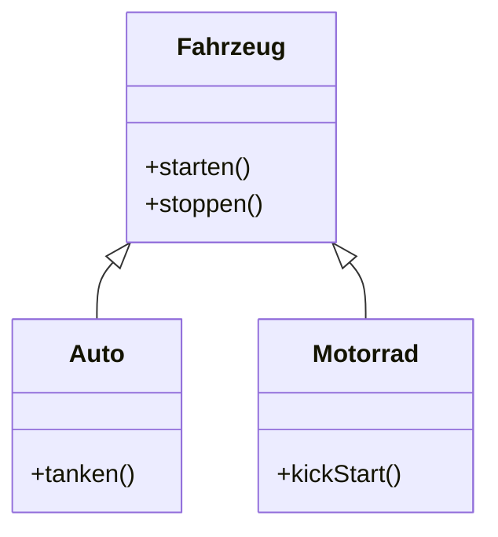
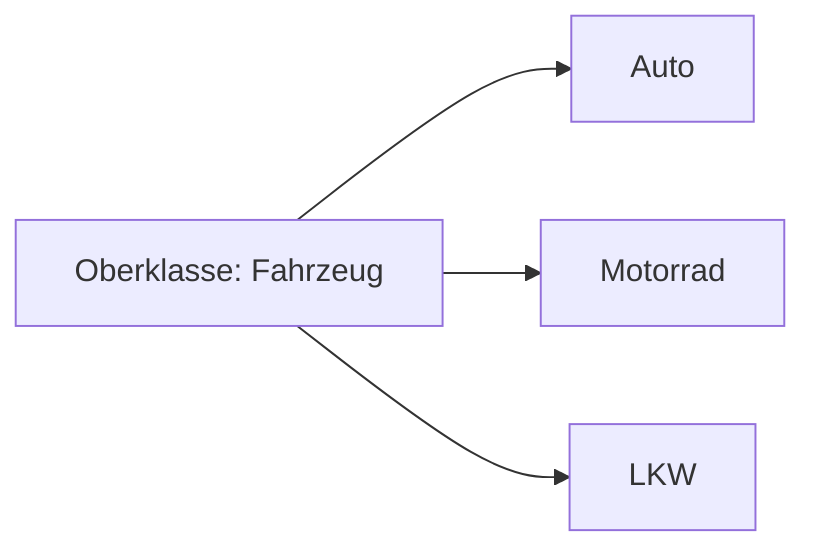
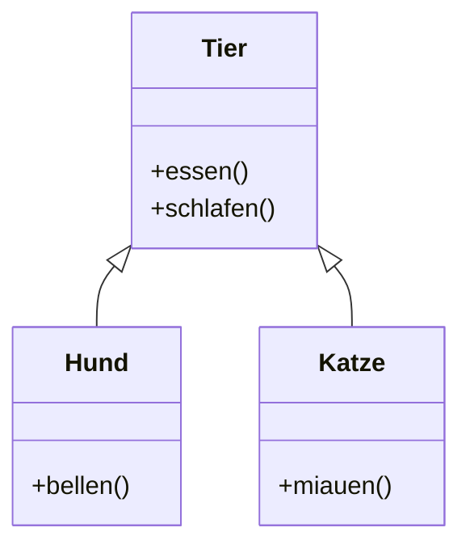

# Vererbung (Inheritance) in Java

## Overview

**Vererbung (Inheritance)** ist ein zentrales Konzept der **Objektorientierten Programmierung (OOP)**.  
Sie ermöglicht es, eine **neue Klasse (Unterklasse / Subclass)** aus einer bestehenden **Klasse (Oberklasse / Superclass)** abzuleiten.

Die Unterklasse **erbt Attribute und Methoden** der Oberklasse und kann:

- neue Eigenschaften hinzufügen
- bestehende Methoden überschreiben
- zusätzliche Funktionalität implementieren

In Java wird Vererbung mit dem Schlüsselwort **`extends`** umgesetzt.

---

## Grundidee der Vererbung

Vererbung beschreibt eine **„ist-ein“-Beziehung (is-a relationship)**.

Beispiel:

```
Auto ist ein Fahrzeug
Hund ist ein Tier
Student ist eine Person
```

Daraus ergibt sich eine **Klassenhierarchie**.



- `Fahrzeug` = Oberklasse
- `Auto` und `Motorrad` = Unterklassen

---

## Vererbung in Java

### Syntax

```java
class Unterklasse extends Oberklasse {
}
```

Beispiel:

```java
class Fahrzeug {

    String marke;

    void starten() {
        System.out.println("Fahrzeug startet");
    }
}
```

Unterklasse:

```java
class Auto extends Fahrzeug {

    int anzahlTueren;

    void hupen() {
        System.out.println("Auto hupt");
    }
}
```

Hier erbt `Auto` automatisch:

- das Attribut `marke`
- die Methode `starten()`

---

## Was wird vererbt?

Eine Unterklasse erhält Zugriff auf:

| Element | Wird vererbt? |
|------|------|
| Attribute | Ja |
| Methoden | Ja |
| Konstruktoren | Nein |
| private Mitglieder | Nein |

Private Felder sind **nicht direkt zugänglich**, können aber über Methoden der Oberklasse genutzt werden.

---

## Methodenüberschreibung (Method Overriding)

Eine Unterklasse kann eine Methode der Oberklasse **überschreiben**, um ein anderes Verhalten zu implementieren.

Beispiel:

```java
class Fahrzeug {

    void starten() {
        System.out.println("Fahrzeug startet");
    }
}
```

Unterklasse:

```java
class Auto extends Fahrzeug {

    @Override
    void starten() {
        System.out.println("Auto startet mit Zündschlüssel");
    }
}
```

Wichtig:

- gleiche Methode
- gleiche Parameter
- gleiche Rückgabe

Das nennt man **Method Overriding**.

---

## Zugriff auf Oberklassenmethoden (`super`)

Mit `super` kann eine Unterklasse auf Methoden oder Konstruktoren der Oberklasse zugreifen.

Beispiel:

```java
class Auto extends Fahrzeug {

    @Override
    void starten() {
        super.starten();
        System.out.println("Auto ist jetzt bereit zu fahren");
    }
}
```

---

## Polymorphismus

Ein wichtiger Vorteil der Vererbung ist **Polymorphismus**.

Ein Objekt einer Unterklasse kann **als Objekt der Oberklasse behandelt werden**.

Beispiel:

```java
Fahrzeug meinFahrzeug = new Auto();
```

Obwohl das Objekt ein `Auto` ist, wird es als `Fahrzeug` referenziert.

Das ermöglicht flexible Programme.



Alle Unterklassen können **gleich behandelt werden**, solange sie das Verhalten der Oberklasse erfüllen.

---

## Warum Vererbung wichtig ist

### 1. Code-Wiederverwendbarkeit

Gemeinsame Funktionen werden nur einmal in der Oberklasse geschrieben.

Beispiel:

```
starten()
stoppen()
beschleunigen()
```

Alle Fahrzeugtypen können diese Methoden nutzen.

---

### 2. Bessere Wartbarkeit

Wenn sich eine gemeinsame Funktion ändert, muss sie **nur an einer Stelle** angepasst werden.

---

### 3. Klare Struktur

Vererbung ermöglicht eine **hierarchische Modellierung von Systemen**.

Beispiel:

```
Lebewesen
 ├─ Tier
 │   ├─ Hund
 │   └─ Katze
 └─ Mensch
```

---

### 4. Grundlage für Polymorphismus

Programme können mit **abstrakten Typen** arbeiten.

Beispiel:

```java
List<Fahrzeug> fahrzeuge;
```

Diese Liste kann enthalten:

```
Auto
Motorrad
LKW
```

---

## Einschränkungen in Java

Java erlaubt **keine Mehrfachvererbung von Klassen**.

Das bedeutet:

```
class A extends B, C   ❌ nicht erlaubt
```

Grund:

Mehrfachvererbung kann zu Konflikten führen  
(z.B. gleiche Methode in zwei Oberklassen).

---

## Lösung: Interfaces

Java nutzt **Interfaces**, um Mehrfachvererbung von Verhalten zu ermöglichen.

Beispiel:

```java
class Auto implements Fahrbar, Wartbar {
}
```

Eine Klasse kann **mehrere Interfaces implementieren**.

---

## Klassenhierarchie Beispiel



---

## Exam Relevance (FIAE)

Wichtige Prüfungsfragen:

- Was ist **Vererbung in OOP**?
- Unterschied zwischen **Oberklasse und Unterklasse**
- Bedeutung von **`extends`**
- Unterschied zwischen **Overriding und Overloading**
- Zusammenhang zwischen **Vererbung und Polymorphismus**
- Warum Java **keine Mehrfachvererbung** unterstützt

Typische Definition:

> Vererbung ist ein Mechanismus der objektorientierten Programmierung, bei dem eine Klasse Eigenschaften und Methoden einer anderen Klasse übernimmt und erweitern oder überschreiben kann.

---

## Häufige Fehler

### Verwechslung von Overriding und Overloading

| Konzept | Bedeutung |
|------|------|
| Overriding | Methode wird in Unterklasse neu implementiert |
| Overloading | gleiche Methode mit anderen Parametern |

---

### Falsche Modellierung

Nicht jede Beziehung ist Vererbung.

Falsch:

```
Auto -> Motor
```

Das ist **keine Vererbung**, sondern **Komposition**.

---

### Zu tiefe Vererbungshierarchien

Sehr tiefe Hierarchien machen Code schwer verständlich.

Best Practice:

```
maximal wenige Ebenen
```

---

## Wichtigste Regeln

1. Vererbung beschreibt eine **is-a Beziehung**
2. Umsetzung mit **`extends`**
3. Unterklassen können Methoden **überschreiben**
4. Java erlaubt **keine Mehrfachvererbung von Klassen**
5. **Interfaces** lösen dieses Problem
6. Vererbung ist Grundlage für **Polymorphismus**

---