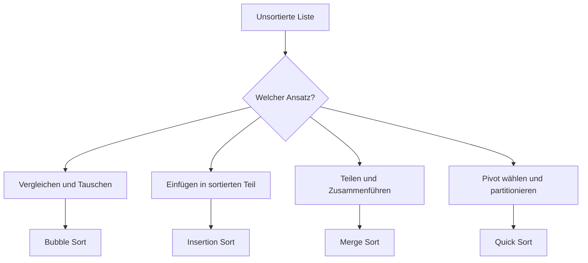
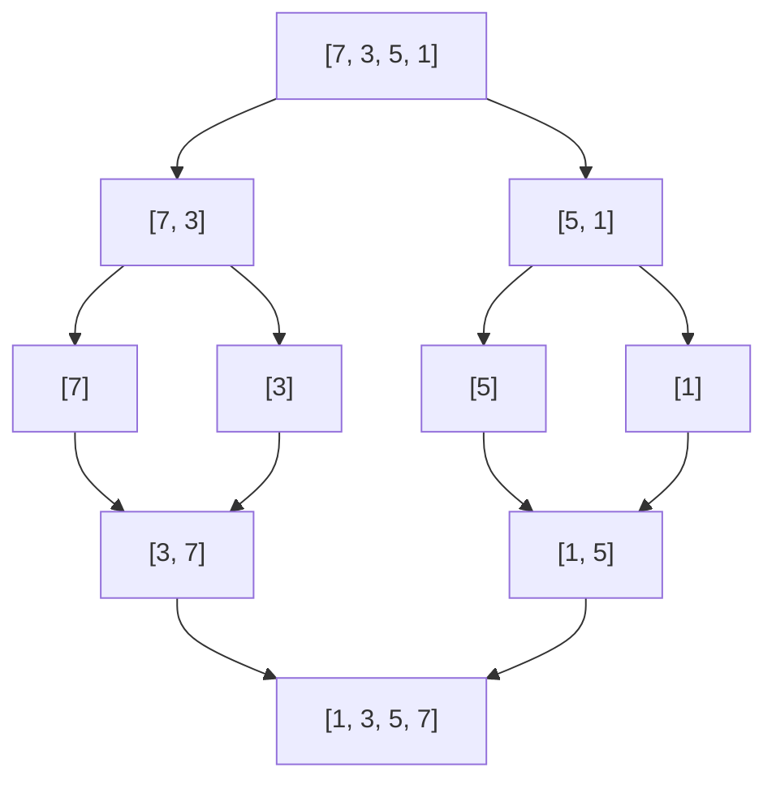

# Sortieralgorithmen

## Kurzüberblick

Sortieralgorithmen sind Verfahren, mit denen Elemente einer Datenmenge in eine festgelegte Reihenfolge gebracht werden, zum Beispiel aufsteigend nach Zahl, alphabetisch nach Name oder nach einem Objektattribut wie Preis.

Sie gehören zu den wichtigsten Grundlagen der Informatik, weil sortierte Daten viele weitere Operationen vereinfachen oder beschleunigen, etwa:

- binäre Suche
- Gruppierung und Auswertung
- übersichtliche Ausgabe
- effiziente Weiterverarbeitung

Wichtige Unterscheidungsmerkmale von Sortieralgorithmen sind:

- **Zeitkomplexität**: Wie schnell sortiert der Algorithmus?
- **Speicherbedarf**: Wird zusätzlicher Speicher benötigt?
- **Stabilität**: Bleibt die Reihenfolge gleichwertiger Elemente erhalten?
- **Eignung für bestimmte Datensituationen**: z. B. kleine Listen, große Listen oder fast sortierte Daten

---

## Grundidee: Was bedeutet „sortieren“?

Beim Sortieren wird eine ungeordnete Folge von Elementen so umgeordnet, dass für alle benachbarten Elemente die gewünschte Ordnung gilt.

Beispiel:

Unsortiert: `7, 3, 9, 1, 5`  
Sortiert aufsteigend: `1, 3, 5, 7, 9`

Viele Algorithmen erreichen dieses Ziel auf unterschiedliche Weise:

- durch wiederholtes Vertauschen benachbarter Elemente
- durch Einfügen eines Elements an die richtige Stelle
- durch rekursives Zerlegen in kleinere Teilprobleme
- durch Auswahl eines Pivotelements und Aufteilung in Teilbereiche



---

## Bubble Sort

### Definition

Bubble Sort vergleicht wiederholt benachbarte Elemente und vertauscht sie, wenn sie in der falschen Reihenfolge stehen. Dadurch „wandern“ größere Elemente schrittweise nach rechts, ähnlich wie Luftblasen nach oben steigen.

### Funktionsweise

Bei jedem Durchlauf wird das größte noch unsortierte Element an das Ende des betrachteten Bereichs verschoben.

Beispiel mit `5, 3, 8, 1`:

1. Vergleiche `5` und `3` → tauschen → `3, 5, 8, 1`
2. Vergleiche `5` und `8` → nichts
3. Vergleiche `8` und `1` → tauschen → `3, 5, 1, 8`

Nach dem ersten Durchlauf steht `8` bereits korrekt ganz rechts.

### Eigenschaften

| Kriterium | Bewertung |
|---|---|
| Grundidee | Nachbarschaftsvergleiche mit Vertauschung |
| Zeitkomplexität best case | `O(n)` mit Optimierung über Abbruchbedingung |
| Zeitkomplexität average case | `O(n²)` |
| Zeitkomplexität worst case | `O(n²)` |
| Speicherbedarf | `O(1)` |
| Stabil | Ja |
| Praxisrelevanz | Eher gering |

### Java-Beispiel

```java
public class BubbleSort {
    public static void bubbleSort(int[] arr) {
        int n = arr.length;
        boolean swapped;

        for (int i = 0; i < n - 1; i++) {
            swapped = false;

            for (int j = 0; j < n - i - 1; j++) {
                if (arr[j] > arr[j + 1]) {
                    int temp = arr[j];
                    arr[j] = arr[j + 1];
                    arr[j + 1] = temp;
                    swapped = true;
                }
            }

            if (!swapped) {
                break;
            }
        }
    }
}
```

### Hinweis zur Schleifenvariante

Eine Variante mit

```java
for (int i = 0; i < n; i++) {
    for (int j = 0; j < n - 1; j++) {
```

funktioniert in vielen Fällen ebenfalls, ist aber **unnötig ineffizient**, weil sie auch bereits korrekt einsortierte Endbereiche weiter prüft. Die übliche und bessere Variante ist:

```java
for (int i = 0; i < n - 1; i++) {
    for (int j = 0; j < n - i - 1; j++) {
```

Dadurch verkleinert sich der zu prüfende Bereich nach jedem Durchlauf.

### Beispiel mit Objekten

Sortiert wird hier nicht nach dem Objekt selbst, sondern nach einem Attribut, nämlich `preis`.

```java
public static void bubbleSort(Stift[] federtasche) {
    int n = federtasche.length;

    for (int i = 0; i < n - 1; i++) {
        for (int j = 0; j < n - i - 1; j++) {
            if (federtasche[j].getPreis() > federtasche[j + 1].getPreis()) {
                Stift temp = federtasche[j];
                federtasche[j] = federtasche[j + 1];
                federtasche[j + 1] = temp;
            }
        }
    }

    System.out.println("Stifte sortiert nach Preis:");
    for (int i = 0; i < federtasche.length; i++) {
        System.out.println(
            "Stift " + (i + 1)
            + ": Farbe: " + federtasche[i].getFarbe()
            + ", Preis: " + federtasche[i].getPreis()
            + ", Länge: " + federtasche[i].getLaenge()
        );
    }
}
```

### Einordnung

Bubble Sort ist didaktisch nützlich, weil er leicht verständlich ist. In realen Anwendungen wird er wegen seiner schlechten Effizienz jedoch kaum verwendet.

---

## Insertion Sort

### Definition

Insertion Sort baut schrittweise einen sortierten Teil der Liste auf. Jedes neue Element wird an der richtigen Stelle in diesen bereits sortierten Bereich eingefügt.

### Funktionsweise

Man betrachtet das Array von links nach rechts:

- Das erste Element gilt als sortiert.
- Das nächste Element wird mit den vorherigen verglichen.
- Es wird so weit nach links verschoben, bis es an der richtigen Position steht.

Beispiel mit `5, 3, 8, 1`:

- `5` ist zunächst sortiert
- `3` wird vor `5` eingefügt → `3, 5, 8, 1`
- `8` bleibt hinter `5`
- `1` wird ganz nach vorne verschoben → `1, 3, 5, 8`

### Eigenschaften

| Kriterium | Bewertung |
|---|---|
| Grundidee | Einfügen in sortierten Teilbereich |
| Zeitkomplexität best case | `O(n)` |
| Zeitkomplexität average case | `O(n²)` |
| Zeitkomplexität worst case | `O(n²)` |
| Speicherbedarf | `O(1)` |
| Stabil | Ja |
| Praxisrelevanz | Gut für kleine oder fast sortierte Datenmengen |

### Java-Beispiel

```java
public class InsertionSort {
    public static void insertionSort(int[] arr) {
        int n = arr.length;

        for (int i = 1; i < n; i++) {
            int key = arr[i];
            int j = i - 1;

            while (j >= 0 && arr[j] > key) {
                arr[j + 1] = arr[j];
                j--;
            }

            arr[j + 1] = key;
        }
    }
}
```

### Einordnung

Insertion Sort ist oft deutlich sinnvoller als Bubble Sort, wenn:

- die Liste klein ist
- die Liste bereits fast sortiert ist
- eine einfache Implementierung gewünscht ist

---

## Merge Sort

### Definition

Merge Sort ist ein rekursiver Sortieralgorithmus nach dem Prinzip **Teile und Herrsche**. Die Liste wird in zwei Hälften geteilt, jede Hälfte wird sortiert, und anschließend werden beide sortierten Hälften wieder zusammengeführt.

### Funktionsweise

1. Teile die Liste in zwei Hälften.
2. Sortiere beide Hälften rekursiv.
3. Führe die beiden sortierten Teilarrays zusammen.



### Eigenschaften

| Kriterium | Bewertung |
|---|---|
| Grundidee | Zerlegen und sortiert zusammenführen |
| Zeitkomplexität best case | `O(n log n)` |
| Zeitkomplexität average case | `O(n log n)` |
| Zeitkomplexität worst case | `O(n log n)` |
| Speicherbedarf | meist `O(n)` zusätzlicher Speicher |
| Stabil | Ja |
| Praxisrelevanz | Sehr hoch |

### Java-Beispiel

```java
public class MergeSort {
    public static void mergeSort(int[] arr) {
        if (arr.length < 2) {
            return;
        }

        int mid = arr.length / 2;
        int[] left = new int[mid];
        int[] right = new int[arr.length - mid];

        for (int i = 0; i < mid; i++) {
            left[i] = arr[i];
        }

        for (int i = mid; i < arr.length; i++) {
            right[i - mid] = arr[i];
        }

        mergeSort(left);
        mergeSort(right);

        merge(arr, left, right);
    }

    public static void merge(int[] arr, int[] left, int[] right) {
        int i = 0, j = 0, k = 0;

        while (i < left.length && j < right.length) {
            if (left[i] <= right[j]) {
                arr[k++] = left[i++];
            } else {
                arr[k++] = right[j++];
            }
        }

        while (i < left.length) {
            arr[k++] = left[i++];
        }

        while (j < right.length) {
            arr[k++] = right[j++];
        }
    }
}
```

### Einordnung

Merge Sort ist zuverlässig schnell und stabil. Der Nachteil ist der zusätzliche Speicherbedarf. Er eignet sich besonders, wenn Stabilität wichtig ist und große Datenmengen verarbeitet werden.

---

## Quick Sort

### Definition

Quick Sort ist ebenfalls ein Divide-and-Conquer-Algorithmus. Er wählt ein **Pivot-Element** aus und teilt die übrigen Elemente so auf, dass kleinere Elemente links und größere rechts vom Pivot stehen. Danach werden die beiden Teilbereiche rekursiv sortiert.

### Funktionsweise

1. Wähle ein Pivot.
2. Partitioniere das Array:
   - kleinere Werte nach links
   - größere Werte nach rechts
3. Sortiere beide Seiten rekursiv.

### Eigenschaften

| Kriterium | Bewertung |
|---|---|
| Grundidee | Pivot wählen und partitionieren |
| Zeitkomplexität best case | `O(n log n)` |
| Zeitkomplexität average case | `O(n log n)` |
| Zeitkomplexität worst case | `O(n²)` |
| Speicherbedarf | rekursionsabhängig, oft gering |
| Stabil | In der Standardform nein |
| Praxisrelevanz | Sehr hoch |

### Java-Beispiel

```java
public class QuickSort {
    public static void quickSort(int[] arr, int low, int high) {
        if (low < high) {
            int pi = partition(arr, low, high);

            quickSort(arr, low, pi - 1);
            quickSort(arr, pi + 1, high);
        }
    }

    public static int partition(int[] arr, int low, int high) {
        int pivot = arr[high];
        int i = low - 1;

        for (int j = low; j < high; j++) {
            if (arr[j] < pivot) {
                i++;

                int temp = arr[i];
                arr[i] = arr[j];
                arr[j] = temp;
            }
        }

        int temp = arr[i + 1];
        arr[i + 1] = arr[high];
        arr[high] = temp;

        return i + 1;
    }
}
```

### Einordnung

Quick Sort ist in der Praxis oft sehr schnell. Problematisch ist jedoch der schlechteste Fall `O(n²)`, etwa wenn das Pivot ungünstig gewählt wird. Deshalb werden in professionellen Implementierungen oft bessere Pivot-Strategien verwendet, zum Beispiel:

- zufälliges Pivot
- Median-of-Three
- hybride Verfahren

---

## Vergleich der wichtigsten Algorithmen

| Algorithmus | Best Case | Average Case | Worst Case | Stabil | Zusätzlicher Speicher | Typische Verwendung |
|---|---:|---:|---:|---|---|---|
| Bubble Sort | `O(n)`* | `O(n²)` | `O(n²)` | Ja | `O(1)` | Lehrzwecke |
| Insertion Sort | `O(n)` | `O(n²)` | `O(n²)` | Ja | `O(1)` | Kleine oder fast sortierte Daten |
| Merge Sort | `O(n log n)` | `O(n log n)` | `O(n log n)` | Ja | `O(n)` | Große Datenmengen, stabile Sortierung |
| Quick Sort | `O(n log n)` | `O(n log n)` | `O(n²)` | Nein | gering bis rekursionsabhängig | Sehr schnelle allgemeine Sortierung |

\* nur mit früher Abbruchbedingung

---

## Praktisches Beispiel

### Sortieren primitiver Werte

Ausgangsarray:

```java
int[] zahlen = {7, 2, 9, 1, 5};
```

Nach dem Sortieren aufsteigend:

```java
[1, 2, 5, 7, 9]
```

### Sortieren von Objekten

Bei Objekten wird meist nicht das gesamte Objekt verglichen, sondern ein bestimmtes Attribut.

Beispiel:

- `Stift("blau", 1.50, 15)`
- `Stift("rot", 0.99, 14)`
- `Stift("grün", 1.20, 16)`

Sortierung nach `preis` ergibt:

1. rot → `0.99`
2. grün → `1.20`
3. blau → `1.50`

Wichtig ist dabei die Vergleichsregel:

```java
if (federtasche[j].getPreis() > federtasche[j + 1].getPreis())
```

Hier wird also ausdrücklich **nach Preis** sortiert.

---

## Prüfungsrelevanz

Für Klausuren und praktische Prüfungen sollte man insbesondere Folgendes sicher beherrschen:

### 1. Grundprinzipien erklären können

Typische Fragen:

- Wie funktioniert Bubble Sort?
- Warum ist Insertion Sort bei fast sortierten Listen oft besser?
- Wieso gehört Merge Sort zu den Divide-and-Conquer-Algorithmen?
- Weshalb kann Quick Sort im schlechtesten Fall `O(n²)` benötigen?

### 2. Komplexitäten kennen

Mindestens die groben Laufzeiten sollten sicher sitzen:

- einfache Verfahren: häufig `O(n²)`
- effiziente Verfahren: häufig `O(n log n)`

### 3. Stabilität verstehen

Stabil bedeutet:

Wenn zwei Elemente nach dem Sortierkriterium gleich sind, behalten sie ihre ursprüngliche Reihenfolge.

Das ist wichtig bei mehrstufigen Sortierungen, z. B.:

1. zuerst nach Vorname
2. danach nach Nachname

Nur bei stabilen Sortierverfahren bleibt die erste Sortierung in Gleichstandsgruppen erhalten.

### 4. Code lesen und korrigieren können

In Prüfungen kommt oft vor:

- Schleifenfehler erkennen
- Indexgrenzen prüfen
- Rekursion nachvollziehen
- Tauschlogik verstehen
- Vergleichsoperatoren korrekt einsetzen

### 5. Geeigneten Algorithmus auswählen

Typische Begründungen:

- **kleine Datenmenge** → Insertion Sort oft ausreichend
- **große Datenmenge und stabile Sortierung** → Merge Sort
- **allgemein sehr schnell in der Praxis** → Quick Sort
- **reiner Lernalgorithmus** → Bubble Sort

---

## Häufige Fehler und wichtige Klarstellungen

### Bubble Sort: falsche Schleifengrenzen

Ein häufiger Fehler ist, unnötig viele Vergleiche durchzuführen oder mit falschen Grenzen einen Indexfehler zu erzeugen.

Korrekt ist typischerweise:

```java
for (int i = 0; i < n - 1; i++) {
    for (int j = 0; j < n - i - 1; j++) {
```

Nicht jede funktionierende Variante ist auch effizient.

### Verwechslung von „stabil“ und „schnell“

Ein stabiler Algorithmus ist nicht automatisch schneller. Stabilität und Laufzeit sind unterschiedliche Eigenschaften.

### Quick Sort ist nicht immer besser

Quick Sort ist im Durchschnitt sehr schnell, aber nicht in jedem Fall überlegen. Bei schlechter Pivot-Wahl kann die Laufzeit deutlich schlechter werden.

### Merge Sort braucht zusätzlichen Speicher

Merge Sort ist schnell und stabil, aber nicht „kostenlos“: Das Zusammenführen benötigt in der üblichen Implementierung zusätzlichen Speicher.

### Sortieren von Objekten erfordert ein Sortierkriterium

Bei Objekten muss klar sein, **wonach** sortiert wird:

- Preis
- Name
- Länge
- Datum
- ID

Ohne definiertes Vergleichskriterium ist keine sinnvolle Sortierung möglich.

---

## Zusammenfassung

Sortieralgorithmen lösen dasselbe Problem auf unterschiedliche Weise:

- **Bubble Sort**: einfach, aber ineffizient
- **Insertion Sort**: gut für kleine oder fast sortierte Daten
- **Merge Sort**: stabil und zuverlässig schnell
- **Quick Sort**: in der Praxis oft sehr schnell, aber mit schlechtem Worst Case

Die Wahl des richtigen Algorithmus hängt von den Anforderungen ab:

- Größe der Datenmenge
- vorhandene Vorsortierung
- Speicherverfügbarkeit
- Bedarf an Stabilität
- gewünschte Praxistauglichkeit

---

## Übungsaufgaben

1. Implementiere Bubble Sort, Insertion Sort, Merge Sort und Quick Sort in Java.
2. Teste alle Verfahren mit:
   - einer zufälligen Liste
   - einer bereits sortierten Liste
   - einer umgekehrt sortierten Liste
3. Miss die Laufzeit für unterschiedlich große Arrays.
4. Sortiere ein Objektarray, z. B. `Stift[]`, nach:
   - Preis
   - Länge
   - Farbe
5. Begründe für jeden Testfall, welcher Algorithmus geeignet ist und warum.

---

## Weiterführende Hinweise

Zum Lernen sind Visualisierungen besonders hilfreich, weil Sortieralgorithmen stark von Zwischenschritten leben. Wichtig ist aber, nicht nur Animationen anzusehen, sondern auch den Code selbst Schritt für Schritt nachzuvollziehen.

Für die Prüfungsvorbereitung sollte man jeden Algorithmus sowohl:

- **konzeptionell erklären**
- **an einem kleinen Beispiel von Hand durchspielen**
- **im Code lesen und implementieren**
- **die Komplexität und Stabilität verstehen**