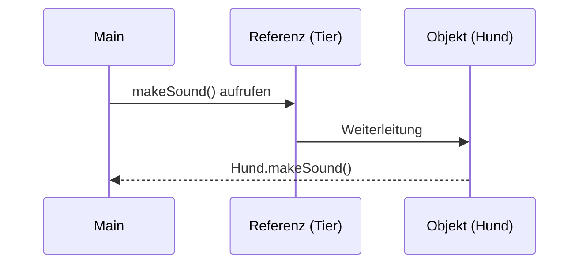

# Dynamic Dispatch in Java

**Dynamic Dispatch** (dynamische Methodenbindung) bedeutet, dass die **auszuführende Methode erst zur Laufzeit bestimmt wird** – basierend auf dem **tatsächlichen Objekttyp im Heap**, nicht auf dem Referenztyp.

-> Es ist eine zentrale Grundlage für **Polymorphismus in Java**.

---

## Core Explanation

### 1. Grundprinzip

In Java gibt es zwei relevante Typen:

- **Referenztyp** → bestimmt, *welche Methoden sichtbar sind*
- **Objekttyp (Laufzeittyp)** → bestimmt, *welche Methode tatsächlich ausgeführt wird*

-> Dynamic Dispatch entscheidet sich immer nach dem **Objekttyp zur Laufzeit**.

---

### 2. Beispiel

```java
class Tier {
    void makeSound() {
        System.out.println("Ein Tier macht ein Geräusch");
    }
}

class Hund extends Tier {
    @Override
    void makeSound() {
        System.out.println("Der Hund bellt");
    }
}

public class Main {
    public static void main(String[] args) {
        Tier meinTier = new Hund();
        meinTier.makeSound();
    }
}
```

---

### 3. Ablauf (Schritt für Schritt)



#### Erklärung

1. Referenztyp: `Tier`
2. Objekttyp: `Hund`
3. JVM prüft zur Laufzeit:
   → „Welches Objekt steckt wirklich dahinter?“
4. Ergebnis:
   → Methode aus **Hund** wird ausgeführt

---

### 4. Voraussetzungen für Dynamic Dispatch

Dynamic Dispatch funktioniert nur, wenn:

- **Vererbung** vorliegt (`extends`)
- Methode **überschrieben (override)** wurde
- Aufruf über eine **Referenz der Oberklasse** erfolgt

---

### 5. Was wird *nicht* dynamisch gebunden?

Nicht alle Methoden nutzen Dynamic Dispatch:

| Fall | Verhalten |
|-----|----------|
| `static` Methoden | statisch gebunden |
| `final` Methoden | nicht überschreibbar |
| `private` Methoden | nicht sichtbar → keine Überschreibung |

-> Nur **überschreibbare Instanzmethoden** sind relevant

---

## Practical Example

### Beispiel: Polymorphes Verhalten

```java
class Fahrzeug {
    void fahren() {
        System.out.println("Fahrzeug fährt");
    }
}

class Auto extends Fahrzeug {
    @Override
    void fahren() {
        System.out.println("Auto fährt");
    }
}

class Fahrrad extends Fahrzeug {
    @Override
    void fahren() {
        System.out.println("Fahrrad fährt");
    }
}

public class Main {
    public static void main(String[] args) {
        Fahrzeug f1 = new Auto();
        Fahrzeug f2 = new Fahrrad();

        f1.fahren(); // Auto fährt
        f2.fahren(); // Fahrrad fährt
    }
}
```

-> Gleicher Referenztyp, unterschiedliches Verhalten → **Polymorphismus**

---

## Exam Relevance

Wichtige Punkte für die Prüfung:

- Unterschied:
  - **Compile-Time (statisch)** vs. **Runtime (dynamisch)**
- Rolle von:
  - **Referenztyp**
  - **Objekttyp**
- Zusammenhang mit:
  - **Method Overriding**
  - **Polymorphismus**
- Einschränkungen:
  - `static`, `final`, `private` → kein Dynamic Dispatch

Typische Prüfungsfrage:

> Welche Methode wird bei `Tier t = new Hund(); t.makeSound();` aufgerufen und warum?

**Antwort:**

Die Methode der Klasse `Hund`, da Dynamic Dispatch zur Laufzeit den tatsächlichen Objekttyp berücksichtigt.

---

## Common Mistakes & Clarifications

### 1. Referenztyp bestimmt NICHT die Methode

```java
Tier t = new Hund();
t.makeSound();
```

❌ falsch gedacht: Tier-Methode wird aufgerufen  
✔ richtig: Hund-Methode wird ausgeführt

---

### 2. Verwechslung mit Overloading

```java
void test(int x)
void test(double x)
```

❌ kein Dynamic Dispatch  
✔ wird **zur Compile-Zeit** entschieden

---

### 3. Zugriff vs. Ausführung

```java
Tier t = new Hund();
t.spezielleHundMethode(); // Fehler
```

✔ Methode existiert im Objekt  
❌ aber nicht im Referenztyp sichtbar

---

### 4. Static Methoden

```java
class A {
    static void test() {}
}
```

❌ kein Dynamic Dispatch  
✔ wird **statisch gebunden**

---

## Merksätze

- **„Referenz bestimmt Zugriff, Objekt bestimmt Verhalten“**
- Dynamic Dispatch passiert **zur Laufzeit**
- Grundlage für **Polymorphismus**
- Nur bei **überschriebenen Instanzmethoden**

---

## Zusammenfassung

Dynamic Dispatch sorgt dafür, dass in Java die korrekte Methode erst zur Laufzeit basierend auf dem tatsächlichen Objekttyp ausgewählt wird. Dieses Verhalten ist essenziell für Polymorphismus und ermöglicht flexible, erweiterbare Programme. Entscheidend ist die Trennung zwischen Referenztyp (sichtbar) und Objekttyp (ausgeführt).