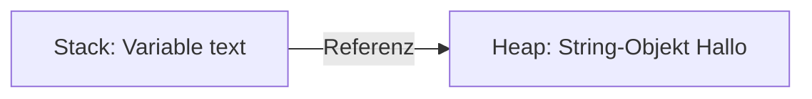
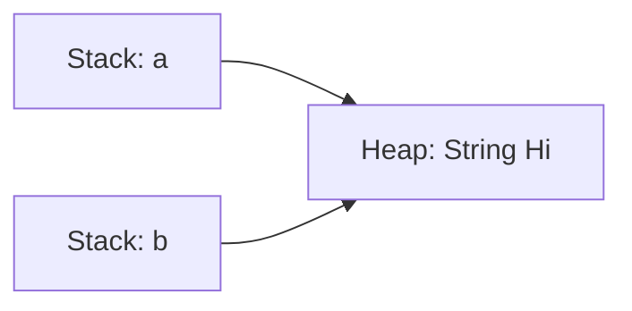

# Heap in Java

Der **Heap** ist ein Speicherbereich der **Java Virtual Machine (JVM)**, der für die **dynamische Speicherung von Objekten und Arrays** zuständig ist.  
Alle Objekte werden im Heap abgelegt, während Variablen meist nur **Referenzen (Verweise)** auf diese Objekte enthalten.

---

## Core Explanation

### 1. Grundprinzip: Heap vs. Stack

Java verwendet zwei zentrale Speicherbereiche:

| Bereich | Inhalt | Eigenschaften |
|--------|--------|--------------|
| **Stack** | Methoden, lokale Variablen | schnell, strukturiert, kurzlebig |
| **Heap** | Objekte, Arrays | flexibel, größer, langlebiger |

 **Wichtig:**  
Variablen speichern **nicht das Objekt selbst**, sondern eine **Referenz auf das Objekt im Heap**.

---

### 2. Objekterzeugung im Heap

```java
String text = new String("Hallo");
```

Ablauf:

1. `new String("Hallo")` → Objekt wird im **Heap** erzeugt  
2. `text` → Referenzvariable im **Stack**  
3. `text` zeigt auf die Speicheradresse im Heap  

---

### 3. Visualisierung



-> Das Objekt existiert **nur im Heap**, nicht in der Variable!

---

### 4. Referenzen statt Werte

Mehrere Variablen können auf dasselbe Objekt zeigen:

```java
String a = new String("Hi");
String b = a;
```



✔ Beide Variablen referenzieren **dasselbe Objekt**

---

### 5. Garbage Collection

Die Speicherfreigabe erfolgt automatisch durch den **Garbage Collector**.

#### Prinzip:

- Objekt hat **keine Referenzen mehr** → wird entfernt

```java
String a = new String("Test");
a = null;
```

-> Das Objekt ist jetzt **nicht mehr erreichbar** → kann gelöscht werden

---

### 6. Eigenschaften des Heaps

#### Vorteile

- Dynamische Speichervergabe zur Laufzeit
- Große Datenstrukturen möglich
- Automatische Speicherbereinigung (GC)

#### Nachteile

- Langsamer als Stack-Zugriff
- Höherer Verwaltungsaufwand
- Möglichkeit von **Fragmentierung**

---

## Practical Example

### Beispiel: Objekt und Referenz verstehen

```java
class Person {
    String name;
}

Person p1 = new Person();
p1.name = "Anna";

Person p2 = p1;
p2.name = "Max";

System.out.println(p1.name); // Ausgabe: Max
```

### Erklärung

- Nur **ein Objekt im Heap**
- `p1` und `p2` zeigen beide darauf
- Änderung über `p2` betrifft auch `p1`

---

## Exam Relevance

Wichtige Punkte für die Prüfung:

- Unterschied **Heap vs. Stack**
- Objekte liegen **immer im Heap**
- Variablen enthalten **Referenzen**
- Funktionsweise des **Garbage Collectors**
- Bedeutung von `new`
- Unterschied:
  - **Primitive Datentypen → Wert**
  - **Objekte → Referenz**

Typische Prüfungsfrage:

> Warum beeinflusst eine Änderung über eine zweite Variable das ursprüngliche Objekt?

**Antwort:**

Weil beide Variablen auf **dieselbe Speicheradresse im Heap** zeigen (Referenzprinzip).

---

## Common Mistakes & Clarifications

### 1. Objekt liegt nicht in der Variable

❌ Falsch:
```text
Variable enthält Objekt
```

✔ Richtig:
```text
Variable enthält Referenz auf Objekt im Heap
```

---

### 2. Verwechslung mit primitiven Datentypen

```java
int a = 5;
int b = a;
b = 10;
```

✔ Hier wird der **Wert kopiert**, nicht die Referenz

---

### 3. "Löschen" von Objekten

```java
obj = null;
```

❌ löscht das Objekt nicht direkt  
✔ entfernt nur die Referenz → GC entscheidet später

---

### 4. Mehrere Referenzen übersehen

```java
Person p1 = new Person();
Person p2 = p1;
```

❗ Objekt bleibt bestehen, solange **mindestens eine Referenz existiert**

---

## Merksätze

- Objekte liegen **immer im Heap**
- Variablen speichern **Referenzen, keine Objekte**
- Mehrere Referenzen können auf **ein Objekt** zeigen
- Garbage Collector entfernt **nicht erreichbare Objekte**
- Heap = **flexibel, aber langsamer als Stack**

---

## Zusammenfassung

Der Heap ist der zentrale Speicherbereich für alle Objekte in Java und ermöglicht die dynamische Speicherverwaltung zur Laufzeit. Entscheidend ist das Verständnis, dass Variablen lediglich Referenzen auf Objekte enthalten. Dieses Referenzprinzip erklärt viele typische Effekte im Java-Programmverhalten und ist essenziell für das Verständnis von Speicher, Performance und Fehlerquellen.