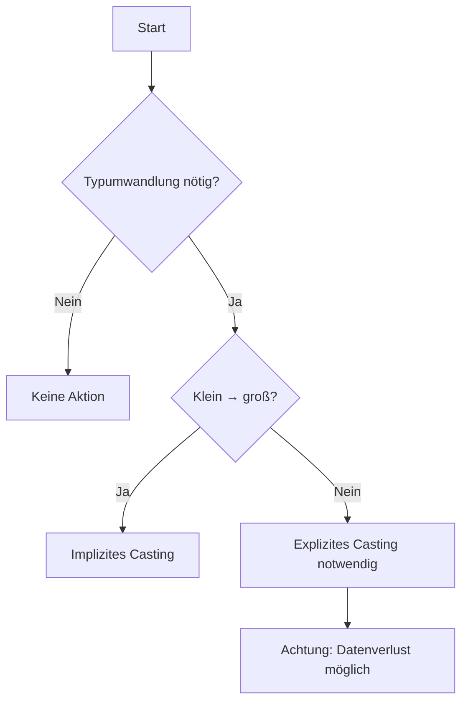

# Type Casting in Java

**Type Casting** bezeichnet die gezielte **Umwandlung eines Datentyps in einen anderen**.  
Da Java **stark typisiert (strongly typed)** ist, müssen Datentypen stets kompatibel sein.

Es gibt zwei Hauptarten:

- **Implizites Casting (Widening)** → automatisch, verlustfrei  
- **Explizites Casting (Narrowing)** → manuell, potenziell verlustbehaftet  

---

## Core Explanation

### 1. Grundprinzip

Jeder Wert besitzt in Java einen festen Datentyp. Sobald unterschiedliche Typen kombiniert werden, entscheidet Java anhand klarer Regeln, ob und wie eine Umwandlung erfolgt.

**Regel:**

- **Kleiner → größer** → automatisch möglich  
- **Größer → kleiner** → explizite Angabe notwendig  

---

### 2. Implizites Casting (Widening Conversion)

#### Definition

Automatische Umwandlung eines **kleineren Datentyps in einen größeren**, ohne Informationsverlust.

#### Typ-Hierarchie

```text
byte → short → int → long → float → double
```

#### Beispiel

```java
int myInt = 9;
double myDouble = myInt;
```

#### Erklärung

- `int` wird zu `double`
- keine Daten gehen verloren
- automatische Durchführung durch die JVM

---

### 3. Explizites Casting (Narrowing Conversion)

#### Definition

Manuelle Umwandlung eines **größeren Datentyps in einen kleineren**.

#### Syntax

```java
(Zieltyp) wert
```

#### Beispiel

```java
double myDouble = 9.78;
int myInt = (int) myDouble;
```

#### Erklärung

- Nachkommastellen werden **abgeschnitten (trunkiert)**
- mögliche Informationsverluste
- Entwickler übernimmt Verantwortung

---

### 4. Entscheidungslogik



---

### 5. Einfluss der Auswertungsreihenfolge

Ein zentraler Punkt ist die **Reihenfolge der Operationen**.

```java
int a = 10;
int b = 3;

double result = (double) (a / b);
```

➡ Ergebnis: `3.0`

**Warum?**

1. `a / b` → Ganzzahldivision → `3`
2. danach Casting → `3.0`

---

**Korrekte Variante:**

```java
double result = (double) a / b;
```

➡ Ergebnis: `3.333...`

✔ Erst Casting → dann Gleitkommadivision

---

### 6. Type Casting bei Referenztypen

#### Upcasting

```java
Animal a = new Dog();
```

- automatisch
- sicher
- Kindklasse → Elternklasse

#### Downcasting

```java
Dog d = (Dog) a;
```

- explizit notwendig
- potenziell unsicher

#### Laufzeitfehler

```java
Animal a = new Animal();
Dog d = (Dog) a; // ClassCastException
```

✔ Fehler tritt **zur Laufzeit** auf

---

## Practical Examples

### Beispiel 1: Automatische Typanpassung

```java
int a = 5;
double b = 2.5;

double result = a + b;
```

✔ `int` wird automatisch zu `double`

---

### Beispiel 2: Durchschnitt berechnen

```java
int total = 5;
int count = 2;

double average = (double) total / count;
```

✔ korrektes Ergebnis durch vorheriges Casting

---

### Beispiel 3: Abschneiden von Nachkommastellen

```java
double price = 19.99;
int roundedPrice = (int) price;
```

➡ Ergebnis: `19`

---

## Exam Relevance

Wichtige Prüfungsaspekte:

- Unterschied **Widening vs. Narrowing**
- Reihenfolge der primitiven Datentypen
- Verhalten bei **int-Division**
- Bedeutung von `(Typ)` vor Ausdrücken
- Unterschied:
  - **Primitive Casting**
  - **Referenz-Casting**
- Risiken:
  - **Datenverlust**
  - **ClassCastException**

**Typische Prüfungsfrage:**

> Warum ergibt `(double)(a / b)` ein anderes Ergebnis als `(double)a / b`?

**Antwort:**

Weil im ersten Fall zuerst eine Ganzzahldivision erfolgt und erst danach gecastet wird. Im zweiten Fall wird vor der Division konvertiert, wodurch eine Gleitkommadivision stattfindet.

---

## Common Mistakes & Clarifications

### 1. Casting rundet nicht

```java
(int) 9.99 → 9
```

❌ kein Runden  
✔ Abschneiden (Trunkierung)

---

### 2. Falsche Reihenfolge

```java
(double)(a / b)
```

❌ häufige Fehlerquelle

---

### 3. Unnötiges Casting

```java
double x = 5.0;
double y = (double) x;
```

❌ redundant

---

### 4. Unsicheres Downcasting

```java
Dog d = (Dog) new Animal();
```

❌ führt zu Laufzeitfehler

---

## Merksätze

- **Implizit = sicher + automatisch**
- **Explizit = bewusst + potenziell gefährlich**
- Casting verändert **nicht den ursprünglichen Wert**
- Reihenfolge entscheidet über das Ergebnis
- Downcasting kann zur **ClassCastException** führen

---

## Zusammenfassung

Type Casting ist essenziell, um in Java mit unterschiedlichen Datentypen korrekt zu arbeiten. Während implizites Casting automatisch und verlustfrei erfolgt, erfordert explizites Casting ein bewusstes Eingreifen des Entwicklers. Besonders wichtig sind das Verständnis der Typ-Hierarchie, die Reihenfolge von Operationen sowie der sichere Umgang mit Referenztypen, um typische Fehler und Laufzeitprobleme zu vermeiden.