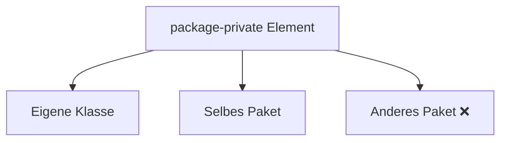

# package-private – Zugriff innerhalb desselben Pakets

## Kurzüberblick

- **package-private** (auch: *default*) ist der **Standard-Zugriff in Java**
- Wird aktiv, wenn **kein Zugriffsmodifikator angegeben ist**
- Zugriff erlaubt für:
  - die **eigene Klasse**
  - **alle Klassen im selben Paket**
- Kein Zugriff für:
  - Klassen in **anderen Paketen**
- Gilt für:
  - Klassen
  - Methoden
  - Attribute
  - innere Klassen

---

## Core-Erklärung

### Grundprinzip

👉 Wenn kein Modifikator angegeben ist:

```java
class MyClass {
}
```

→ automatisch **package-private**

---

### Sichtbarkeit



---

### Zugriff im Detail

| Zugriff von...                 | erlaubt? |
|------------------------------|----------|
| Eigene Klasse                 | ✅       |
| Gleiche Paketklasse           | ✅       |
| Unterklasse (gleiches Paket)  | ✅       |
| Unterklasse (anderes Paket)   | ❌       |
| Fremde Klasse (anderes Paket) | ❌       |

👉 Wichtig:
- Vererbung hilft **nicht**, wenn das Paket unterschiedlich ist

---

### Beispiel

#### Klasse ohne Modifikator

```java
class Helper {
    void doSomething() {
        System.out.println("Hello");
    }
}
```

#### Zugriff im selben Paket

```java
public class Main {
    public static void main(String[] args) {
        Helper h = new Helper();
        h.doSomething(); // ✅ erlaubt
    }
}
```

---

#### Zugriff aus anderem Paket

```java
// anderes Paket
public class Test {
    public static void main(String[] args) {
        Helper h = new Helper(); // ❌ nicht sichtbar
    }
}
```

---

### Einordnung in die Zugriffsebenen

| Modifikator       | Klasse | Paket | Unterklasse | Weltweit |
|------------------|--------|--------|-------------|----------|
| `private`        | ✅     | ❌     | ❌          | ❌       |
| package-private  | ✅     | ✅     | ❌*         | ❌       |
| `protected`      | ✅     | ✅     | ✅          | ❌       |
| `public`         | ✅     | ✅     | ✅          | ✅       |

\* nur wenn im selben Paket

---

### Typischer Einsatzzweck

`package-private` wird verwendet, wenn:

- Klassen **nur intern genutzt** werden sollen
- Implementierungsdetails **versteckt bleiben sollen**
- mehrere Klassen **eng zusammenarbeiten**

👉 Häufig in:
- Helper-/Utility-Klassen
- internen Modulen
- Framework-internen Komponenten

---

## Praktisches Beispiel

```java
class CalculatorHelper {
    static int add(int a, int b) {
        return a + b;
    }
}
```

```java
public class Calculator {
    public int sum(int a, int b) {
        return CalculatorHelper.add(a, b);
    }
}
```

👉 `CalculatorHelper` ist **nicht öffentlich sichtbar**, aber intern nutzbar

---

## Exam-Relevanz

Typische Prüfungsfragen:

- Was passiert, wenn kein Zugriffsmodifikator angegeben ist?
- Unterschied zwischen `protected` und package-private
- Zugriff bei unterschiedlichen Paketen
- Warum ist package-private wichtig?

 Merksatz:
> Kein Modifikator = **nur innerhalb des Pakets sichtbar**

---

## Häufige Fehler & Klarstellungen

### 1. „Default = public“
❌ Falsch  
→ Default = **package-private**

---

### 2. Vererbung erlaubt Zugriff

❌ Falsch (paketübergreifend)  
→ Ohne gleiches Paket kein Zugriff

---

### 3. Wird selten verwendet

❌ Falsch  
→ Sehr wichtig für:
- saubere Architektur
- interne Kapselung

---

### 4. Zu viele public-Klassen

⚠️ Problem:
- alles ist sichtbar
- keine klare Struktur

👉 Lösung:
- gezielt `package-private` einsetzen

---

## Fazit

- `package-private` ist der **unsichtbare Standard in Java**
- Ideal für:
  - interne Logik
  - gekapselte Module
- Wichtig für:
  - saubere Paketstruktur
  - reduzierte Abhängigkeiten

👉 Gute Praxis:
- Klassen standardmäßig **nicht public machen**
- Sichtbarkeit bewusst erhöhen, wenn nötig