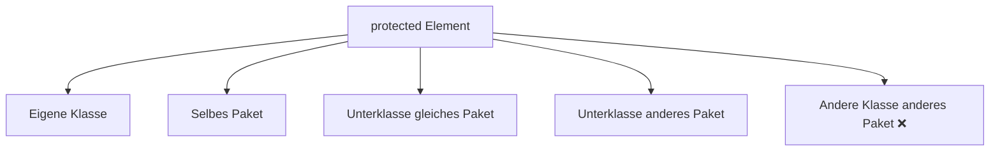

# protected – Zugriff für Unterklassen und Paket

## Kurzüberblick

- `protected` ist ein **Zugriffsmodifikator mit mittlerer Sichtbarkeit**
- Zugriff erlaubt für:
  - die **eigene Klasse**
  - **Klassen im selben Paket**
  - **Unterklassen (auch paketübergreifend)**
- Kein Zugriff für:
  - **fremde Klassen in anderen Paketen ohne Vererbung**
- Gilt für:
  - Attribute
  - Methoden
  - innere Klassen (keine Top-Level-Klassen)

---

## Core-Erklärung

### Grundprinzip

👉 `protected` kombiniert zwei Zugriffskonzepte:

1. **Paket-Sichtbarkeit**
2. **Vererbungs-Sichtbarkeit**



---

### Zugriff im Detail

| Zugriff von...                         | erlaubt? |
|--------------------------------------|----------|
| Eigene Klasse                         | ✅       |
| Gleiche Paketklasse                   | ✅       |
| Unterklasse (gleiches Paket)          | ✅       |
| Unterklasse (anderes Paket)           | ✅       |
| Fremde Klasse (anderes Paket)         | ❌       |

---

### Wichtige Besonderheit (Prüfungsfalle!)

Bei **Unterklassen in anderen Paketen** gilt:

👉 Zugriff nur über **Vererbung**, nicht über Objektreferenzen

---

### Beispiel: Paketübergreifende Vererbung

```java
// Paket A
public class Parent {
    protected int value = 10;
}
```

```java
// Paket B
public class Child extends Parent {
    public void test() {
        System.out.println(value); // ✅ erlaubt
    }
}
```

---

### ⚠️ Typischer Fehler

```java
// Paket B
public class Other {
    public void test() {
        Parent p = new Parent();
        // System.out.println(p.value); ❌ NICHT erlaubt
    }
}
```

👉 Warum?
- Keine Vererbung → kein Zugriff trotz `protected`

---

### Vergleich zu anderen Modifikatoren

| Modifikator   | Klasse | Paket | Unterklasse | Weltweit |
|---------------|--------|--------|-------------|----------|
| `private`     | ✅     | ❌     | ❌          | ❌       |
| *(default)*   | ✅     | ✅     | ❌          | ❌       |
| `protected`   | ✅     | ✅     | ✅          | ❌       |
| `public`      | ✅     | ✅     | ✅          | ✅       |

---

### Einsatz von protected

`protected` wird verwendet, wenn:

- eine Klasse **vererbbar sein soll**
- bestimmte Details **für Unterklassen sichtbar** sein müssen
- aber **nicht öffentlich** sein sollen

👉 Typischer Einsatz:
- Framework-Design
- Basisklassen (Superclasses)

---

## Praktisches Beispiel

```java
public class Animal {
    protected String name;

    protected void makeSound() {
        System.out.println("Some sound");
    }
}
```

```java
public class Dog extends Animal {
    public void speak() {
        System.out.println(name);     // Zugriff erlaubt
        makeSound();                  // Zugriff erlaubt
    }
}
```

---

## Exam-Relevanz

Typische Prüfungsfragen:

- Unterschied zwischen `protected` und `default`
- Zugriff in **anderen Paketen**
- Verhalten bei **Vererbung**
- Warum ist `protected` wichtig für OOP?

 Merksatz:
> `protected` = **Paket + Vererbung**, aber nicht öffentlich

---

## Häufige Fehler & Klarstellungen

### 1. „Protected = nur Unterklassen“
❌ Falsch  
→ Auch **alle Klassen im selben Paket** haben Zugriff

---

### 2. Zugriff über Objekte in anderen Paketen

❌ Falsch:

```java
Parent p = new Parent();
p.value; // nicht erlaubt
```

👉 Nur über Vererbung erlaubt

---

### 3. „Protected ist sicher“
⚠️ Eingeschränkt

- Innerhalb des Pakets → vollständig sichtbar
- Schutz nur gegenüber externen Klassen

---

### 4. Falsche Verwendung statt private

❌ Problem:
- unnötig große Sichtbarkeit

👉 Besser:
- `private` + gezielte Methoden

---

## Fazit

- `protected` ist ein **Kompromiss zwischen Kapselung und Erweiterbarkeit**
- Besonders wichtig für:
  - **Vererbung**
  - **Frameworks**
- Sollte verwendet werden, wenn:
  - Unterklassen Zugriff brauchen
  - aber die Daten nicht öffentlich sein sollen

👉 Gute Praxis:
- Erst `private` überlegen
- dann bewusst erweitern (`protected` / `public`)