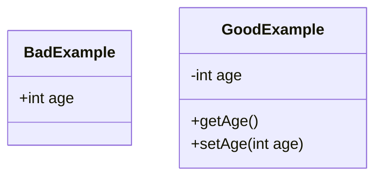

# public – Zugriff auf Klassen, Methoden und Attribute

## Kurzüberblick

- **public** ist ein Zugriffsmodifikator mit **maximaler Sichtbarkeit**
- Elemente sind **von überall im Programm zugreifbar**
- Gilt für:
  - Klassen
  - Methoden
  - Attribute (Variablen)
- **Risiko**: Verletzung der Kapselung (Encapsulation)
- **Faustregel**: So wenig `public` wie nötig, so viel wie sinnvoll

---

## Core-Erklärung

### Grundprinzip

Der Zugriffsmodifikator `public` erlaubt den Zugriff **ohne Einschränkung**:

- aus anderen Klassen
- aus anderen Paketen
- aus beliebigem Code

👉 `public` = **keine Zugriffsbeschränkung**

---

### 1. Public-Klassen

```java
public class MyClass {
}
```

- Kann **überall verwendet und instanziiert** werden
- Voraussetzung: Die Klasse ist im Klassenpfad verfügbar

 Wichtig:
- In Java darf pro Datei nur **eine public-Klasse** existieren
- Der Dateiname muss **identisch mit dem Klassennamen** sein

---

### 2. Public-Methoden

```java
public void myMethod() {
    // Logik
}
```

- Kann von **jedem Objekt / jeder Klasse** aufgerufen werden
- Typischer Einsatz:
  - API-Methoden
  - öffentliche Schnittstellen

👉 Public-Methoden definieren oft das **"sichtbare Verhalten"** einer Klasse

---

### 3. Public-Attribute

```java
public String myAttribute;
```

- Kann **direkt gelesen und verändert** werden
- Zugriff ohne Kontrolle (kein Schutzmechanismus)

⚠️ Problem:
- Keine Validierung möglich
- Keine Kontrolle über Änderungen
- Verletzung der Kapselung

---

### Zusammenhang: Kapselung (Encapsulation)



- **Schlechtes Design**: Public-Attribute → direkter Zugriff
- **Gutes Design**: Private + Getter/Setter → kontrollierter Zugriff

---

## Praktisches Beispiel

### ❌ Schlechte Praxis (alles public)

```java
public class Person {
    public String name;
    public int age;
}
```

Probleme:
- Jeder Code kann `age = -100` setzen
- Keine Validierung möglich

---

### ✅ Gute Praxis (Kapselung)

```java
public class Person {
    private String name;
    private int age;

    public int getAge() {
        return age;
    }

    public void setAge(int age) {
        if (age >= 0) {
            this.age = age;
        }
    }
}
```

Vorteile:
- Kontrolle über Daten
- Validierung möglich
- bessere Wartbarkeit

---

## Exam-Relevanz

Typische Prüfungsfragen:

- Unterschied zwischen `public`, `private`, `protected`
- Warum sind public-Attribute problematisch?
- Was bedeutet **Kapselung**?
- Welche Elemente sollten public sein?

 Merksatz:
> `public` definiert die **Schnittstelle** einer Klasse – nicht deren interne Struktur.

---

## Häufige Fehler & Klarstellungen

### 1. „Public ist einfacher, also besser“
❌ Falsch  
→ Führt zu schwer wartbarem Code

---

### 2. „Attribute dürfen ruhig public sein“
❌ Falsch  
→ Verstößt gegen OOP-Grundprinzipien

---

### 3. „Alles private machen“
❌ Auch falsch  
→ Dann ist die Klasse **nicht nutzbar**

👉 Balance ist entscheidend

---

### 4. Richtige Nutzung von public

✔ Sinnvoll für:
- Methoden einer API
- Einstiegspunkte (z. B. `main`)
- bewusst freigegebene Funktionalität

❌ Nicht sinnvoll für:
- interne Daten (Attribute)
- Implementierungsdetails

---

## Fazit

- `public` bietet maximale Zugänglichkeit, aber **minimale Kontrolle**
- Es sollte gezielt eingesetzt werden, um eine **klare und stabile Schnittstelle** zu definieren
- Gute Software entsteht durch:
  - **Kapselung**
  - **kontrollierten Zugriff**
  - **bewusste Sichtbarkeit**